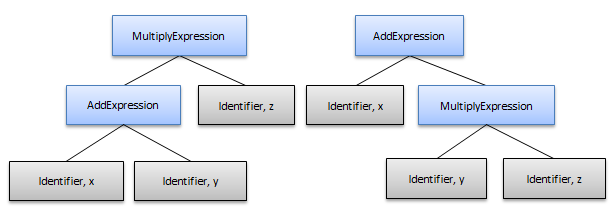

////
|metadata|
{
    "name": "ig-spe-writing-operator-precedence-rules",
    "controlName": ["IG Syntax Parsing Engine"],
    "tags": [],
    "guid": "6d280230-88d7-4576-bb4e-ec4c0f458126","buildFlags": [],
    "createdOn": "2016-05-25T18:21:54.1800643Z"
}
|metadata|
////

= Writing Operator Precedence Rules (Syntax Parsing Engine)

== Topic Overview

=== Purpose

This topic explains how to write operator precedence rules correctly.

=== Required background

The following topics are prerequisites to understanding this topic:

[options="header", cols="a,a"]
|====
|Topic|Purpose

| link:ig-spe-overview.html[Syntax Parsing Engine Overview]
|This topic provides an overview of the Syntax Parsing Engine.

| link:ig-spe-non-terminal-symbols.html[Non-Terminal Symbols]
|This topic explains a grammar’s non-terminal symbols.

| link:ig-spe-defining-productions.html[Defining Productions]
|This topic explains how to create productions for a non-terminal symbol.

|====

=== In this topic

This topic contains the following sections:

*  *<<_Ref352319649,Operator Precedence Rules>>*
*  *<<_Ref352319655,Overview>>* 
*  *<<_Ref352319658,Example>>* 
*  *<<_Ref352319662,Solution>>* 
*  *<<_Ref352319665,Full Example>>* 
*  *<<_Ref352319668,Related Content>>* 

[[_Ref352319649]]
== Operator Precedence Rules

[[_Ref352319655]]

=== Overview

When defining binary operator rules, you can easily create a global ambiguity (see link:ig-spe-ambiguities.html[Ambiguities] topic for more information).

These kinds of ambiguities may result even when writing basic rules like definitions of addition or multiplication operations.

[[_Ref352319658]]

=== Example

This is an example of a simple grammar for dealing with addition and multiplication of variables:

----
Expression =
    Identifier
    | AddExpression
    | MultiplyExpression;
AddExpression = Expression, PlusToken, Expression;
MultiplyExpression = Expression, AsteriskToken, Expression;
----

The problem here occurs when the document contains text such as "x + y $$*$$ z". In this case, the lexer will produce these significant tokens:

<Identifier, x> <PlusToken> <Identifier, y> <AsteriskToken> <Identifier, z>

This results in a global ambiguity generating the following sub-trees (the operator tokens and "Expression" nodes have been removed from the trees for simplicity):

Obviously, the tree on the right is the correct one because multiplication has a higher precedence than addition and the expression should be interpreted as x+(y$$*$$z). Supporting this interpretation requires that the lower precedence operations must be the parent nodes for higher precedence operations.

[[_Ref352319662]]

=== Solution

To fix this, write the rules in such a way so that the operands for each of the precedence level operation can only be other operations at that precedence level or higher. A higher precedence operation should never have a lower precedence operation as an operand. In addition, the rules must consider the associativity of operators. For example, ‘+’ in C# is considered left-associative and an expression like "x + y + z" should generate the following syntax tree:

With the precedence and associativity of operators in mind, rules can be created for each precedence level like this for left-associative operations:

----
LowerPrecedenceExpression =
    HigherPrecedenceExpression
    | LowerPrecedenceExpression , OperatorToken, HigherPrecedenceExpression;
----

And like this one for right-associative operations:

----
LowerPrecedenceExpression =
    HigherPrecedenceExpression
    | HigherPrecedenceExpression, OperatorToken, LowerPrecedenceExpression ;
----

Once all level have been defined, the root “Expression” rule needs to refer to the lowest precedence rule, since the lowest precedence rule can represent the lowest precedence operations as well as anything of higher precedence. It is necessary to note that this concept could be extended to work for unary, ternary, or other arity operations.

[[_Ref352319665]]
=== Full Example

The following is an example of several operators and how to define them so you can define a correct precedence:

Operators, precedence and associativity:

[start=1]
. Identifier, Constant – Actual data
[start=2]
. (…) – Parentheses
[start=3]
. +, - – Unary plus, minus (right-associative)
[start=4]
. ^ – Exponent (right-associative)
[start=5]
. $$*$$, / – Multiply, divide (left-associative)
[start=6]
. +, - – Binary plus, minus (left-associative)

Operator precedence rules definition:

----
AssignmentExpression =
    Identifier, Equals, Expression ;
(* The main expression symbol uses only the lowest precedence symbol * )
Expression =
    AddSubtractExpression;
(* Precedecene Level 6 * )
AddSubtractExpression =
    MultiplyDivideExpression
    | AddExpression
    | SubtractExpression;
AddExpression =
    AddSubtractExpression, PlusToken, MultiplyDivideExpression;
SubtractExpression =
    AddSubtractExpression, MinusToken, MultiplyDivideExpression;
(* Precedecene Level 5 * )
MultiplyDivideExpression =
    ExponentExpression
    | MultiplyExpression
    | DivideExpression;
MultiplyExpression =
    MultiplyDivideExpression, AsteriskToken, ExponentExpression;
DivideExpression =
    MultiplyDivideExpression, SlashToken, ExponentExpression;
(* Precedecene Level 4 * )
ExponentExpression =
    UnaryExpression
    | UnaryExpression, CaretToken, ExponentExpression;
(* Precedecene Level 3 * )
UnaryExpression =
    ParenthesizedExpression
    | UnaryPlusExpression
    | UnaryMinusExpression;
UnaryPlusExpression =
    PlusToken, UnaryExpression;
UnaryMinusExpression =
    MinusToken, UnaryExpression;
(* Precedecene Level 2 * )
ParenthesizedExpression =
    PrimaryExpression
    | OpenParen, Expression , CloseParen;
(* Precedecene Level 1 * )
PrimaryExpression =
    Identifier
    | Constant;
----

The only downside of this approach is that it produces very dense syntax tree for simple expressions such as “x = y”:

.Note
[NOTE]
====
See the link:ig-spe-pruning-the-syntax-tree.html[Pruning the Syntax Tree] topic for more information about how to remove some of syntax tree's density.
====

[[_Ref352319668]]
== Related Content

=== Topics

The following topics provide additional information related to this topic.

[options="header", cols="a,a"]
|====
|Topic|Purpose

| link:ig-spe-improve-ebnf-files-readability.html[Improve EBNF Files Readability]
|This topic describes how to improve EBNF file readability.

| link:ig-spe-optimize-non-terminal-symbol-definitions.html[Optimize Non-Terminal Symbol Definitions]
|This topic explains how to optimize your non-terminal symbol definitions in order to minimize the number of productions.

| link:ig-spe-use-symbolnames-constants-instead-of-strings.html[Use SymbolNames Constants Instead of Strings]
|This topic explains the benefits of using the SymbolNames constants.

|====