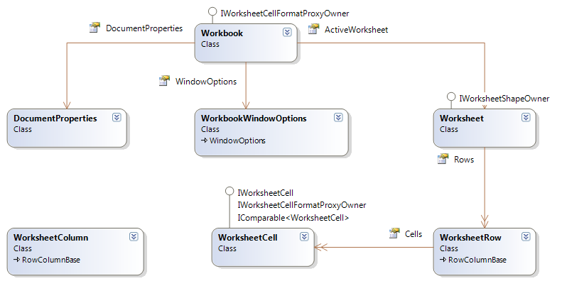

////
|metadata|
{
    "name": "igexcelengine-about-infragistics-excel-engine",
    "controlName": ["IG Excel Engine"],
    "tags": ["Application Blocks","Calculations","Getting Started","How Do I"],
    "guid": "{2E8B808D-72DE-406A-A41D-64334D3653DB}",
    "buildFlags": [],
    "createdOn": "2012-01-30T19:39:51.7457023Z"
}
|metadata|
////

= About Infragistics Excel Engine

Using the Infragistics Excel Engine allows you to work with spreadsheet data using familiar Microsoft® Excel® spreadsheet objects like link:{ApiPlatform}documents.excel.v{ProductVersion}~infragistics.documents.excel.workbook.html[Workbooks], link:{ApiPlatform}documents.excel.v{ProductVersion}~infragistics.documents.excel.worksheet.html[Worksheets], link:{ApiPlatform}documents.excel.v{ProductVersion}~infragistics.documents.excel.worksheetcell.html[Cells], link:{ApiPlatform}documents.excel.v{ProductVersion}~infragistics.documents.excel.formula.html[Formulas] and many more. The Infragistics Excel Library makes it easy for you to represent the data of your application in an Excel spreadsheet as well as transfer data from Excel into your application.

== Supported Versions of Microsoft Excel

The following is a list of the supported versions of Excel.

* Microsoft Excel 97
* Microsoft Excel 2000
* Microsoft Excel 2002
* Microsoft Excel 2003
* Microsoft Excel 2007
* Microsoft Excel 2010
* Microsoft Excel 2013

== Features

The following is a list of key features of the Infragistics Excel Engine:

* *No Excel Dependency* - The Infragistics Excel Engine is a class library that runs completely independently of Microsoft Excel, so you do not require it to be installed.
* *Workbook Object Model* - This represents all the Excel objects available to you, such as Workbooks, Worksheets, Cells, Formulas and many more.

== Infragistics Excel Engine™ Object Model

== Workbook

The most important object found within Infragistics' Excel assembly is the link:{ApiPlatform}documents.excel.v{ProductVersion}~infragistics.documents.excel.workbook.html[Workbook] object. Without a Workbook instance, you simply cannot create a Microsoft® Excel® file. A workbook contains a collection of worksheets, and each worksheet holds a grid of data in cells. In addition, the Workbook object contains global settings and collections of custom views, named references, and styles. The global settings on the Workbook are options that affect a workbook as a whole, such as the author of the document, or whether the workbook's child MDI window is minimized when the workbook is opened in Excel. These options include the primitive properties defined directly on the Workbook object and the link:{ApiPlatform}documents.excel.v{ProductVersion}~infragistics.documents.excel.workbook~documentproperties.html[DocumentProperties] and link:{ApiPlatform}documents.excel.v{ProductVersion}~infragistics.documents.excel.workbook~windowoptions.html[WindowOptions] properties of the Workbook object. Most of the primitive properties exposed off the Workbook object control various formula calculation options.

== Worksheet

Worksheets fill workbooks. A workbook must have at least one link:{ApiPlatform}documents.excel.v{ProductVersion}~infragistics.documents.excel.worksheet.html[Worksheet] visible at all times. The worksheet contains the actual data in a workbook, as each worksheet holds a grid of cells and each cell can hold a form of data. Aside from the collections and complex properties on the worksheet, the Worksheet object includes properties to change its default row and column sizes, its image background (tiled across the worksheet), and its name.

== WorksheetRow

One of the most important objects exposed by the Worksheet object is the link:{ApiPlatform}documents.excel.v{ProductVersion}~infragistics.documents.excel.worksheetrow.html[WorksheetRow] object, which represents each row in a worksheet. Through a WorksheetRow instance, its corresponding row in the worksheet can be manipulated. In addition, each cell in a row is represented by a WorksheetCell instance, which is contained in a collection owned by the WorksheetRow object. To access any WorksheetCell object, you must go through its parent WorksheetRow object. In addition to each cell and their default cell format, the row's height, visibility, and outline level can also be customized with the WorksheetRow instance.

== WorksheetColumn

Unlike the WorksheetRow object, the link:{ApiPlatform}documents.excel.v{ProductVersion}~infragistics.documents.excel.worksheetcolumn.html[WorksheetColumn] object does not contain a collection of cells, even though a column in a worksheet "contains" the cells under it. This is because the cells can be accessed from the WorksheetRow instance to which the cell belongs. It is redundant to also make the cells accessible from the WorksheetColumn object. Through a WorksheetColumn instance, you can customize the column's default cell format, width, visibility, and outline level.

== WorksheetCell

A worksheet is a grid of cells. Each cell is represented by a link:{ApiPlatform}documents.excel.v{ProductVersion}~infragistics.documents.excel.worksheetcell.html[WorksheetCell] instance. You can set a cell's value and format using the WorksheetCell object. The value of the cell is what displays in the cell when the workbook is opened in Excel. A cell's value can also be used by formulas to calculate other cells' values.

== DocumentProperties

The Workbook object’s link:{ApiPlatform}documents.excel.v{ProductVersion}~infragistics.documents.excel.documentproperties.html[DocumentProperties] object represent the properties that can be viewed by right-clicking the workbook's XLS file through your operating system’s file browser and viewing the properties. These include various tags that describe and help better organize the content of the workbook such as the author, title, and subject. This information can also be edited in certain versions of Excel.

== WorkbookWindowOptions

The link:{ApiPlatform}documents.excel.v{ProductVersion}~infragistics.documents.excel.workbookwindowoptions.html[WorkbookWindowOptions] class controls various display options that are not specific to any particular worksheets. Instead, the display options control the visual elements that will not change when switching between worksheets such as the visibility of scroll bars and the bounds of a child window.

The options that control the child window include the bounds of the child window with respect to the MDI parent and whether the window is minimized when it is opened. Certain window options, such as whether the formula bar or status bar is visible or whether the workbook's child window is maximized, cannot be controlled with the WorkbookWindowOptions class because these properties are system-wide and saved by Excel in the registry. However, these options can be controlled by the WindowOptions property of a CustomView object, which is similar to WorkbookWindowOptions. In addition to the other options, the WorkbookWindowOptions class has a property, which indicates the selected worksheet in the workbook.

== Related Topics

link:igexcelengine-excel-format-support.html[Excel Format Support (Infragistics Excel Engine)]

link:igexcelengine-excel-2007-color-model.html[Excel 2007 Color Model (Infragistics Excel Engine)]

link:igexcelengine-list-of-supported-built-in-functions.html[List of Supported Built-in Functions (Infragistics Excel Engine)]

link:igexcelengine-glossary-of-infragistics-excel-engine-terms.html[Glossary of Terms (Infragistics Excel Engine)]

link:igexcelengine-creating-a-workbook.html[Creating a Workbook (Infragistics Excel Engine)]

link:igexcelengine-using-the-infragistics-excel-engine.html[Using the Infragistics Excel Engine]