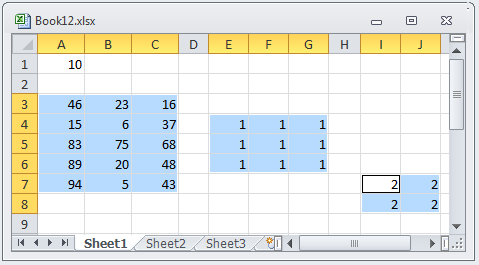

////
|metadata|
{
    "name": "igexcelengine-accessing-cells-and-cell-regions-by-name",
    "controlName": ["IG Excel Engine"],
    "tags": ["How Do I"],
    "guid": "be962b2d-b255-40ac-ac0d-a8e1a92c9700",
    "buildFlags": [],
    "createdOn": "2012-03-28T07:50:51.7068768Z"
}
|metadata|
////

= Accessing Cells and Cell Regions by Name (Infragistics Excel Engine)

== Topic Overview

=== Purpose

This topic explains, with code examples, how to access link:igexcelengine-glossary-of-infragistics-excel-engine-terms.html[cells] and link:igexcelengine-glossary-of-infragistics-excel-engine-terms.html[regions] within a worksheet in a Microsoft® Excel® workbook by their names or by their named references. For information about how to access cells and regions by their reference strings, refer to the Reference Cells and Regions topic.

=== In this topic

This topic contains the following sections:

* <<_Accessing_Cells_And_Regions_by_Name_Conceptual_Overview,Accessing Cells and Regions by Name – Conceptual Overview>>
* <<_Accessing_Cells_and_Regions_by_Name_Code_Examples,Accessing Cells and Regions by Name – Code Examples>>
* <<_Code_Example_Getting_a_Cell_and_Region_by_Name,Code Example: Getting a Cell and Region by Name>>
* <<_Code_Example_Getting_an_Array_of_Regions_by_Name,Code Example: Getting an Array of Regions by Name>>
* <<_Code_Example_Getting_a_Reference_Cell_Region_and_Array_of_Regions_from_a_Named_Reference,Code Example: Getting a Referenced Cell, Region, and Array of Regions from a Named Reference>>
* <<_Related_Content,Related Content>>

[[_Accessing_Cells_And_Regions_by_Name_Conceptual_Overview]]
== Accessing Cells and Regions by Name – Conceptual Overview

=== Introduction

In Microsoft Excel, individual cells, as well as cell regions can have Names assigned to them, (The Names are assigned and displayed in the Name Box of the spreadsheet.) The Name of a cell or region can be used to reference that cell or region instead of their cell references. The Names of cells and regions can be defined either in Excel or programmatically in code.

The {ProductName} product supports the referencing of cells and regions by Name through the link:{ApiPlatform}documents.excel.v{ProductVersion}~infragistics.documents.excel.worksheet~getcell.html[GetCell] and link:{ApiPlatform}documents.excel.v{ProductVersion}~infragistics.documents.excel.worksheet~getregion.html[GetRegion] methods of the link:{ApiPlatform}documents.excel.v{ProductVersion}~infragistics.documents.excel.worksheet_members.html[Worksheet] object. You refer to the cell or region using the  _NamedReference_   instance that refers to that cell or region.

=== Requirements

To be able to access an individual cell or a region of cells, they must be Named, either in MS Excel or programmatically in code.

=== Naming cells and regions in Excel

To define a Name for a cell or region in an Excel spreadsheet, with the cell or region selected,  *click the*   *Name Box*  *, type the desired name, and then press Enter* .

=== Naming cells and regions in code

Cell or region Names defined in code are sometimes referred to as “named references”. To Name a cell or a region in code, use the syntax that follows. In your actual code, replace the variables (cell_Name, range_Name, sheet_name, cell_reference, range_cell_reference, instance_for_cell_NamedReference,and instance_for_range_NamedReference) with specific names.

*In Visual Basic:*

[source,vb]
----
' Define a Name for a cell.
Dim instance_for_cell_NamedReference As NamedReference = wrkBook.NamedReferences.Add("cell_Name", "=sheet_name!cell reference ", sheet_name)
' Define a Name for a region.
Dim instance_for_range_NamedReference As NamedReference = wrkBook.NamedReferences.Add("range_Name ", "= sheet_name!range cell reference ", sheet_name )
----

*In C#:*

[source,vb]
----
// Define a Name for a cell.
NamedReference instance_for_cell_NamedReference = wrkBook.NamedReferences.Add("cell_Name", "=sheet_name!cell reference", sheet_name);
// Define a Name for a region.
NamedReference instance_for_range_NamedReference = wrkBook.NamedReferences.Add("range_Name", "=sheet_name!range cell reference", sheet_name);
----

=== Referencing cells and regions by Name

To reference a cell or a region by Name in code, use the following syntax. In your actual code replace the variables (cell_Name, range_Name) with specific names.

*In Visual Basic:*
[source,vb]
----
' Access a cell by its name.
sampleSheet.GetCell("cell_Name")
' Access a region by its name
sampleSheet.GetRegion("range_Name")
----

*In C#:*
[source,csharp]
----
// Access a cell by its Name.
sampleSheet.GetCell("cell_Name");
// Access a region by its Name.
sampleSheet.GetRegion("range_Name");
----

[[_Accessing_Cells_and_Regions_by_Name_Code_Examples]]
== Accessing Cells and Regions by Name – Code Examples

=== Code examples overview

The following table lists the code examples included in this topic.

[options="header", cols="a,a"]
|====
|Example|Description

|Getting a Cell and Region by Name
|The `Worksheet` object’s methods `GetCell` and `GetRegion` allow a named reference to be specified to access a cell or region.

|Getting an link:igexcelengine-glossary-of-infragistics-excel-engine-terms.html[Array of Regions] by Name
|The `Worksheet` object’s method link:{ApiPlatform}documents.excel.v{ProductVersion}~infragistics.documents.excel.worksheet~getregions.html[GetRegions] allows a named reference to be specified to access an array of regions.

|Getting a Referenced Cell, Region, and Array of Regions from a Named Reference
|A reference to a cell or region can be obtained using the link:{ApiPlatform}documents.excel.v{ProductVersion}~infragistics.documents.excel.namedreference_members.html[NamedReference] instance that refers to a cell or region.

|====

[[_Code_Example_Getting_a_Cell_and_Region_by_Name]]
== Code Example: Getting a Cell and Region by Name

=== Description

The `Worksheet` object’s methods `GetCell` and `GetRegion` allow a named reference to be specified to access a cell or region.

=== Prerequisites

* An Excel file named Book1.xls with a worksheet saved at location C drive.
* Random numbers in Regions A1:A10 and B1:B10 of the Worksheet.
* Reference name added for cell B3 - `refNameB3`. This can be done by right clicking on Cell B3 and from the context menu choose ‘Define Name’, which pops up the ‘New Name’ window where the reference name can be specified.
* Reference name added for region C1:C10 – `refNameRegionC1C10`. This can be done by selecting the range C1:C10 and from the context menu selecting the ‘Define Name’ option which pops up the ‘New Name’ window where the range reference name can be specified.

=== Code

The following code loads a Workbook and creates an instance of the Worksheet. Cell B3 of the Worksheet is accessed using the `GetCell` method by passing in the named reference of the cell. A comment is added to cell B3.

Similarly RegionC1:C10 is accessed using the `GetRegion` method by passing in the named reference of the region. A formula is applied to the region C1:C10.

*In Visual Basic:*
[source,vb]
----
' Load a Workbook
Dim workBook As Infragistics.Documents.Excel.Workbook = Infragistics.Documents.Excel.Workbook.Load("C:\Book1.xls")
Dim sampleSheet As Infragistics.Documents.Excel.Worksheet = workBook.Worksheets(0)
' Create a comment
Dim testComment As New Infragistics.Documents.Excel.WorksheetCellComment()
Dim formatted As New Infragistics.Documents.Excel.FormattedString("This cell has a reference name.")
testComment.Text = formatted
' Access a cell by its reference name
sampleSheet.GetCell("refNameB3").Comment = testComment
' Access a Region by its reference name
sampleSheet.GetRegion("refNameRegionC1C10").ApplyFormula("=A1*B1")
' Save the Workbook with the applied changes
workBook.Save("C:\Book1.xls")
----

*In C#:*
[source,csharp]
----
// Load a Workbook
Infragistics.Documents.Excel.Workbook workBook = Infragistics.Documents.Excel.Workbook.Load("C:\\Book1.xls");
Infragistics.Documents.Excel.Worksheet sampleSheet = workBook.Worksheets[0];
// Create a comment
Infragistics.Documents.Excel.WorksheetCellComment testComment = new Infragistics.Documents.Excel.WorksheetCellComment();
Infragistics.Documents.Excel.FormattedString formatted = new Infragistics.Documents.Excel.FormattedString("This cell has a reference name.");
testComment.Text = formatted;
// Access a cell by its reference name
sampleSheet.GetCell("refNameB3").Comment = testComment;
// Access a Region by its reference name
sampleSheet.GetRegion("refNameRegionC1C10").ApplyFormula("=A1*B1");
// Save the Workbook with the applied changes
workBook.Save("C:\\Book1.xls");
----

[[_Code_Example_Getting_an_Array_of_Regions_by_Name]]
== Code Example: Getting an Array of Regions by Name

=== Description

The `Worksheet` object’s method `GetRegions` allows a named reference to be specified to access an array of regions.

=== Prerequisites

* An Excel file named Book12.xls with a worksheet saved at location C drive.
* Random numbers in Regions A3:C7, E4:G6, and I2:L5 of the Worksheet.
* Reference name added for multiple regions A1:C5, E2:G4, and I7:G8 – `MultipleRegions`. Naming of reference is done by selecting the reference in Excel and going to Formulas $$->$$ Name Manager. Name manager window appears. Click on New… button and New Name window appears, where you can specify name of your selected range.

.Note
[NOTE]
====
Multiple regions are selected by selecting the first cell in the region and then hold down CTRL while you are selecting the other cells or regions.

Your final selection should look similar to the screen-shot below:
====

=== Code

The following code loads a Workbook and creates an instance of the Worksheet. Region E4:G6 is accessed by using `GetRegions` method, which returns array of regions, and specifying second element of this array. A formula is applied on E4:G6 region.

*In Visual Basic:*

[source,vb]
----
' Load a Workbook
Dim workBook As Infragistics.Documents.Excel.Workbook = Infragistics.Documents.Excel.Workbook.Load("C:\Book12.xlsx")
Dim sampleSheet As Infragistics.Documents.Excel.Worksheet = workBook.Worksheets(0)
' Access a Region by its reference name by its index in a array of regions and apply a formula on the region
sampleSheet.GetRegions("MultipleRegions")(1).ApplyFormula("=$A$1*A3")
workBook.Save("C:\Book12.xlsx")
----

*In C#:*

[source,csharp]
----
// Load a Workbook
Infragistics.Documents.Excel.Workbook workBook = Infragistics.Documents.Excel.Workbook.Load("C:\\Book12.xlsx");
Infragistics.Documents.Excel.Worksheet sampleSheet = workBook.Worksheets[0];
// Access a Region by its reference name by its index in a array of regions and apply a formula on the region
sampleSheet.GetRegions("MultipleRegions")[1].ApplyFormula("=$A$1*A3");
workBook.Save("C:\\Book12.xlsx");
----

[[_Code_Example_Getting_a_Reference_Cell_Region_and_Array_of_Regions_from_a_Named_Reference]]
== Code Example: Getting a Referenced Cell, Region, and Array of Regions from a Named Reference

=== Description

A reference to a cell or region can be obtained using the `NamedReference` instance that refers to a cell or region.

=== Prerequisites

An Excel file named Book2.xls with a worksheet saved at location C drive.

=== Code

The following code defines a `NamedReference` for a cell, region and array of regions and gets access to the cell, region and array of regions from the `NamedReference` instance.

*In Visual Basic:*

[source,vb]
----
' Load a Workbook
Dim workBook As Infragistics.Documents.Excel.Workbook = Infragistics.Documents.Excel.Workbook.Load("C:\Book2.xls")
Dim sampleSheet As Infragistics.Documents.Excel.Worksheet = workBook.Worksheets(0)
' Define a Named Reference for a Cell
Dim namedRefCell As Infragistics.Documents.Excel.NamedReference = workBook.NamedReferences.Add("NamedReferenceCell", "=Sheet1!$B$5", sampleSheet)
MessageBox.Show(namedRefCell.ReferencedCell.ToString())
' Define a Named Reference for a Region
Dim namedRefRegion As Infragistics.Documents.Excel.NamedReference = workBook.NamedReferences.Add("NamedRefRegion", "=Sheet1!$A$5:$A$10", sampleSheet)
MessageBox.Show(namedRefRegion.ReferencedRegion.ToString())
' Define a Named Referene for Multiple Regions
Dim namedMultiRef As Infragistics.Documents.Excel.NamedReference = workBook.NamedReferences.Add("NamedMultiRegion", "=Sheet1!$A$1:$B$5,Sheet1!$D$5:$G$10", sampleSheet)
MessageBox.Show(namedMultiRef.ReferencedRegions(1).ToString())
----

*In C#:*

[source,csharp]
----
// Load a Workbook
Infragistics.Documents.Excel.Workbook workBook = Infragistics.Documents.Excel.Workbook.Load("C:\\Book2.xls");
Infragistics.Documents.Excel.Worksheet sampleSheet = workBook.Worksheets[0];
// Define a Named Reference for a Cell
Infragistics.Documents.Excel.NamedReference namedRefCell = workBook.NamedReferences.Add("NamedReferenceCell", "=Sheet1!$B$5", sampleSheet);
MessageBox.Show(namedRefCell.ReferencedCell.ToString());
// Define a Named Reference for a Region
Infragistics.Documents.Excel.NamedReference namedRefRegion = workBook.NamedReferences.Add("NamedRefRegion", "=Sheet1!$A$5:$A$10", sampleSheet);
MessageBox.Show(namedRefRegion.ReferencedRegion.ToString());
// Define a Named Referene for Multiple Regions
Infragistics.Documents.Excel.NamedReference namedMultiRef = workBook.NamedReferences.Add("NamedMultiRegion",
"=Sheet1!$A$1:$B$5,Sheet1!$D$5:$G$10", sampleSheet);
MessageBox.Show(namedMultiRef.ReferencedRegions[1].ToString());
----

[[_Related_Content]]
== Related Content

=== Topics

The following topics provide additional information related to this topic.

[options="header", cols="a,a"]
|====
|Topic|Purpose

| link:igexcelengine-reference-cells-and-regions.html[Referencing Cells and Regions (Infragistics Excel Engine)]
|Demonstrates how to access a cell and a region by a string reference

| link:igexcelengine-add-a-formula-to-a-cell.html[Adding a Formula to a Cell (Infragistics Excel Engine)]
|The Infragistics Excel Engine allows you to add Microsoft® Excel® formulas to a cell or group of cells in a worksheet.

| link:igexcelengine-add-a-comment-to-a-cell.html[Adding a Comment to a Cell (Infragistics Excel Engine)]
|A comment allows you to display hints or notes for a cell when the end user's mouse hovers over a cell. The comments display as a tooltip-like callout that contains text.

| link:igexcelengine-using-the-infragistics-excel-engine.html[Using the Infragistics Excel Engine]
|This section is your gateway to important task-based information that will help you to effectively use the various features and functionalities provided by the Infragistics Excel Engine.

|====

=== Resources

The following material (available outside the Infragistics family of content) provides additional information related to this topic.

[options="header", cols="a,a"]
|====
|Title|Purpose

| link:http://office.microsoft.com/en-us/excel-help/define-and-use-names-in-formulas-HA010342417.aspx?CTT=1[Define and use names in formulas]
|By using names, you can make your formulas much easier to understand and maintain. You can define a name for a cell range, function, constant, or table. Once you adopt the practice of using names in your workbook, you can easily update, audit, and manage these names.

|====