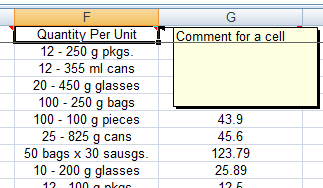

////
|metadata|
{
    "name": "igexcelengine-add-a-comment-to-a-cell",
    "controlName": ["IG Excel Engine"],
    "tags": ["Calculations","Exporting","Getting Started","How Do I","Styling"],
    "guid": "{718474D5-8C00-4874-813F-4B14102ACC70}",
    "buildFlags": [],
    "createdOn": "2012-01-30T19:39:51.7477027Z"
}
|metadata|
////

= Adding a Comment to a Cell (Infragistics Excel Engine)

A comment allows you to display hints or notes for a cell when the end user's mouse hovers over a cell. The comments display as a tooltip-like callout that contains text. The Infragistics Excel Engine allows you to add comments to a cell by setting a link:{ApiPlatform}documents.excel{ApiVersion}~infragistics.documents.excel.worksheetcell.html[WorksheetCell] object’s link:{ApiPlatform}documents.excel{ApiVersion}~infragistics.documents.excel.worksheetcell~comment.html[Comment] property.

The following example code demonstrates how to add a comment to a cell. The example code assumes you have a reference to a Worksheet object named worksheet1.

*In Visual Basic:*
[source,vb]
----
Dim row As WorksheetRow = worksheet1.Rows(6)
row.Cells(0).Comment = New WorksheetCellComment() With { _
    .Text = New FormattedString("Comment for a cell")
}
----

*In C#:*
[source,csharp]
----
WorksheetRow row = worksheet1.Rows[6];
row.Cells[0].Comment = new WorksheetCellComment
{
    Text = new FormattedString("Comment for a cell")
};
----

== Related Topics

link:igexcelengine-creating-a-workbook.html[Creating a Workbook (Infragistics Excel Engine)]

link:igexcelengine-load-an-excel-file.html[Loading an Excel File (Infragistics Excel Engine)]

link:igexcelengine-save-a-workbook.html[Saving a Workbook (Infragistics Excel Engine)]

link:igexcelengine-format-a-cell.html[Formatting a Cell (Infragistics Excel Engine)]

link:igexcelengine-copy-a-cells-format.html[Copying a Cell's Format (Infragistics Excel Engine)]

link:igexcelengine-reference-cells-and-regions.html[Referencing Cells and Regions (Infragistics Excel Engine)]

link:igexcelengine-merge-cells.html[Merging Cells (Infragistics Excel Engine)]

link:igexcelengine-add-a-formula-to-a-cell.html[Adding a Formula to a Cell (Infragistics Excel Engine)]

link:igexcelengine-disable-editing-of-a-worksheet.html[Disabling Editing of a Worksheet (Infragistics Excel Engine)]

link:igexcelengine-freeze-rows-and-columns.html[Freezing and Splitting Panes (Infragistics Excel Engine)]

link:igexcelengine-set-excel-document-properties.html[Setting Workbook Properties (Infragistics Excel Engine)]