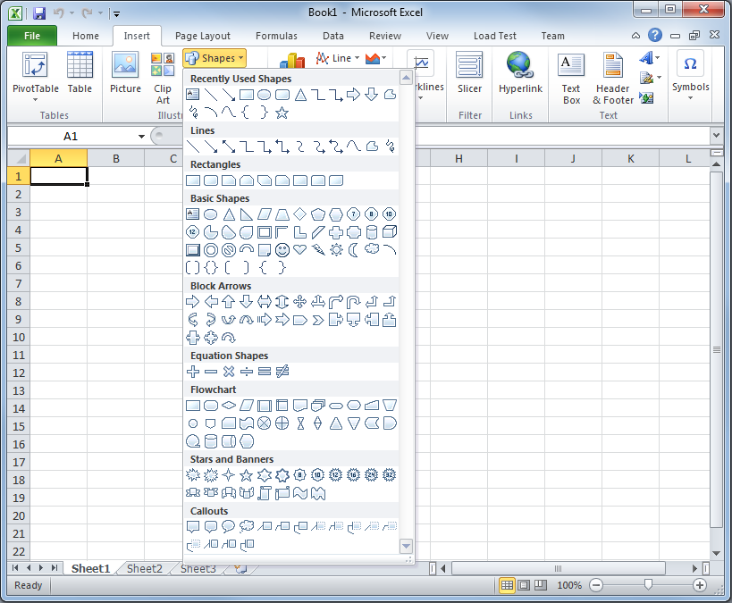
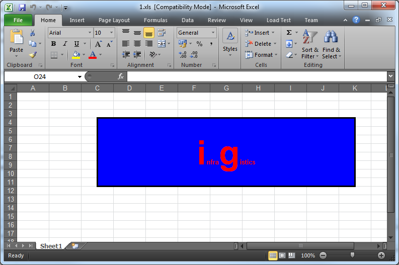

////
|metadata|
{
    "name": "igexcelengine-adding-a-shape-to-an-excel-worksheet",
    "controlName": ["IG Excel Engine"],
    "tags": ["Exporting"],
    "guid": "6621af60-43b5-4ba1-94d0-85367c0064b9",
    "buildFlags": [],
    "createdOn": "2012-01-30T19:39:51.7787089Z"
}
|metadata|
////

= Adding a Shape to a Worksheet (Infragistics Excel Engine)

[[topic_overview]]
== Topic Overview

[[purpose]]
== Purpose

This topic demonstrates how to add a predefined shape to an Excel® Worksheet using the Infragistics Excel Engine®.

[[in_this_topic]]
== In this topic

This topic contains the following sections:

[start=1]
. <<topic_overview,Topic Overview>>

.. <<purpose,Purpose>>
.. <<in_this_topic,In this topic>>
.. <<required_background,Required background>>

[start=2]
. <<adding_shape,Adding a Shape to an Excel Worksheet>>

.. <<introduction,Introduction>>
.. <<preview,Preview>>
.. <<requirments2,Requirements>>
.. <<overview,Overview>>
.. <<steps,Steps>>

[start=3]
. <<related_topics,Related Topics>>

[[required_background]]
== Required background

You need to first read the following topics:

* link:igexcelengine-creating-a-workbook.html[Creating a Workbook (Infragistics Excel Engine)]
* link:igexcelengine-save-a-workbook.html[Saving a Workbook (Infragistics Excel Engine)]

[[introduction]]
== Introduction

With the Infragistics Excel Engine, you can manipulate a subset of predefined shapes in a link:{ApiPlatform}documents.excel.v{ProductVersion}~infragistics.documents.excel.worksheet.html[Worksheet] object.

[[supported_shapes]]
== Supported Shapes

From a Excel's user perspective, shapes are accessible from the *Insert* $$->$$ *Shapes* drop-down menu.

Unfortunatelly not all of these shapes are available through the Infragistics Excel Engine API.

All predefined shapes that are supported have a corresponding class defined for them in the link:{ApiPlatform}documents.excel.v{ProductVersion}~infragistics.documents.excel.predefinedshapes_namespace.html[Infragistics.Documents.Excel.PredefinedShapes Namespace]. Each class derives (not necessary directly) from link:{ApiPlatform}documents.excel.v{ProductVersion}~infragistics.documents.excel.worksheetshape.html[WorksheetShape Class]. Those that are not directly derived from link:{ApiPlatform}documents.excel.v{ProductVersion}~infragistics.documents.excel.worksheetshape.html[WorksheetShape Class] are derived from link:{ApiPlatform}documents.excel.v{ProductVersion}~infragistics.documents.excel.worksheetshapewithtext.html[WorksheetShapeWithText Class] and have the ability to store formatted text in them.

Following is a list of the supported predefined shapes and the classes through which they are implemented.

[options="header", cols="a,a,a,a"]
|====
|Shape|Looks like...|Class|Class of origin

|Line
|image::images/ExcelShaped_Line.png[]
| link:{ApiPlatform}documents.excel.v{ProductVersion}~infragistics.documents.excel.predefinedshapes.lineshape.html[LineShape Class]
| link:{ApiPlatform}documents.excel.v{ProductVersion}~infragistics.documents.excel.worksheetshape.html[WorksheetShape Class]

|Straight Connector
|image::images/ExcelShaped_StraightConnector.png[]
| link:{ApiPlatform}documents.excel.v{ProductVersion}~infragistics.documents.excel.predefinedshapes.straightconnector1shape.html[StraightConnector1Shape Class]
| link:{ApiPlatform}documents.excel.v{ProductVersion}~infragistics.documents.excel.worksheetshape.html[WorksheetShape Class]

|Unknown Shape
|No visual representantion. Used to deserialize all not defined shapes. Read more at link:igexcelengine-importing-shapes-from-excel.html[Importing Shapes from Excel (Infragistics Excel Engine)]
| link:{ApiPlatform}documents.excel.v{ProductVersion}~infragistics.documents.excel.unknownshape.html[UnknownShape Class]
| link:{ApiPlatform}documents.excel.v{ProductVersion}~infragistics.documents.excel.worksheetshapewithtext.html[WorksheetShapeWithText Class]

|Diamond
|image::images/ExcelShaped_Diamod.png[]
| link:{ApiPlatform}documents.excel.v{ProductVersion}~infragistics.documents.excel.predefinedshapes.diamondshape.html[DiamondShape Class]
| link:{ApiPlatform}documents.excel.v{ProductVersion}~infragistics.documents.excel.worksheetshapewithtext.html[WorksheetShapeWithText Class]

|Ellipse (Oval)
|image::images/ExcelShaped_Ellipse.png[]
| link:{ApiPlatform}documents.excel.v{ProductVersion}~infragistics.documents.excel.predefinedshapes.ellipseshape.html[EllipseShape Class]
| link:{ApiPlatform}documents.excel.v{ProductVersion}~infragistics.documents.excel.worksheetshapewithtext.html[WorksheetShapeWithText Class]

|Heart
|image::images/ExcelShaped_Hearth.png[]
| link:{ApiPlatform}documents.excel.v{ProductVersion}~infragistics.documents.excel.predefinedshapes.heartshape.html[HeartShape Class]
| link:{ApiPlatform}documents.excel.v{ProductVersion}~infragistics.documents.excel.worksheetshapewithtext.html[WorksheetShapeWithText Class]

|Explosion 1
|image::images/ExcelShaped_IrregularStar1.png[]
| link:{ApiPlatform}documents.excel.v{ProductVersion}~infragistics.documents.excel.predefinedshapes.irregularseal1shape.html[IrregularSeal1Shape Class]
| link:{ApiPlatform}documents.excel.v{ProductVersion}~infragistics.documents.excel.worksheetshapewithtext.html[WorksheetShapeWithText Class]

|Explosion 2
|image::images/ExcelShaped_IrregularStar2.png[]
| link:{ApiPlatform}documents.excel.v{ProductVersion}~infragistics.documents.excel.predefinedshapes.irregularseal2shape.html[IrregularSeal2Shape Class]
| link:{ApiPlatform}documents.excel.v{ProductVersion}~infragistics.documents.excel.worksheetshapewithtext.html[WorksheetShapeWithText Class]

|Lightning Bolt
|image::images/ExcelShaped_LightningBolt.png[]
| link:{ApiPlatform}documents.excel.v{ProductVersion}~infragistics.documents.excel.predefinedshapes.lightningboltshape.html[LightningBoltShape Class]
| link:{ApiPlatform}documents.excel.v{ProductVersion}~infragistics.documents.excel.worksheetshapewithtext.html[WorksheetShapeWithText Class]

|Pentagon
|image::images/ExcelShaped_Pentagon.png[]
| link:{ApiPlatform}documents.excel.v{ProductVersion}~infragistics.documents.excel.predefinedshapes.pentagonshape.html[PentagonShape Class]
| link:{ApiPlatform}documents.excel.v{ProductVersion}~infragistics.documents.excel.worksheetshapewithtext.html[WorksheetShapeWithText Class]

|Rectangle
|image::images/ExcelShaped_Rectangle.png[]
| link:{ApiPlatform}documents.excel.v{ProductVersion}~infragistics.documents.excel.predefinedshapes.rectangleshape.html[RectangleShape Class]
| link:{ApiPlatform}documents.excel.v{ProductVersion}~infragistics.documents.excel.worksheetshapewithtext.html[WorksheetShapeWithText Class]

|Right Triangle
|image::images/ExcelShaped_RightTriangle.png[]
| link:{ApiPlatform}documents.excel.v{ProductVersion}~infragistics.documents.excel.predefinedshapes.righttriangleshape.html[RightTriangleShape Class]
| link:{ApiPlatform}documents.excel.v{ProductVersion}~infragistics.documents.excel.worksheetshapewithtext.html[WorksheetShapeWithText Class]

|====

[[adding_shape]]
== Adding a Shape to an Excel Worsheet

[[inproduction2]]
== Introduction

To add a shape to a worksheet initialize one of the predefined shapes, set its position, apply some customizations and add it to the worksheet. Detailed steps are provided below. In the procedure below, a blue-colored rectangle with a sample text in it is placed between C3 and K11 cells of an Excel grid. The rectangle’s side edges are positioned exactly on the middle of columns C and K, respectively.

[[preview]]
== Preview

Following is a preview of the final result displayed in Microsoft Excel 2010.

[[requirments2]]
== Requirements

To complete the procedure, you need the following:

* An initialized Excel workbook with access to one of its worksheet items.

[[overview]]
== Overview

Following is a conceptual overview of the process:

[start=1]
. *Creating a shape instance*
[start=2]
. *Configuring the position and size*
[start=3]
. *Customizing the shape*
[start=4]
. _(Optional)_  *Verifying the result*

[[steps]]
== Steps

[start=1]
. *Create a shape instance.* There are two ways to do this:
+
--
** Using the shape's constructor
** Using the CreatePredefinedShape method
--
+
Each of them is demonstrated in the code below

.. *Using the shape's constructor.*
+
*In Visual Basic:*
+
[source,vb]
----
Dim shape As New RectangleShape()
----
+
*In C#:*
+
[source,csharp]
----
RectangleShape shape = new RectangleShape();
----

.. *Using the CreatePredefinedShape method.*
+
*In Visual Basic:*
+
[source,vb]
----
Dim shape As RectangleShape =
    WorksheetShape.CreatePredefinedShape(PredefinedShapeType.Rectangle)
----
+
*In C#:*
+
[source,csharp]
----
RectangleShape shape =
    (RectangleShape)WorksheetShape.CreatePredefinedShape(PredefinedShapeType.Rectangle);
----

[start=2]
. *Configure the position and size.* There are two positioning methods to do this.
+
--
** Using cells (preffered)
** Using twips
--
+
Using twips method is created to provide an easier way to specify shape’s coordinates. Both alignment methods end with the same result – aligning the shape using anchor cells (as “Using cells” works).
+
Each of them is demonstrated in code below. In both alignment methods you use the link:{ApiPlatform}documents.excel.v{ProductVersion}~infragistics.documents.excel.worksheetshape~positioningmode.html[PositioningMode Property] to specify the behavior of auto resizing the shape with the cells.

.. *Using cells.*
+
To position a shape in the Excel’s grid you need to specify top-left and bottom-right anchors (An anchor is a point, defined within a single cell. For example: The center of cell K9 or the top-right corner of the cell A0).
+
The link:{ApiPlatform}documents.excel.v{ProductVersion}~infragistics.documents.excel.worksheetshape~topleftcornercell.html[TopLeftCornerCell] and link:{ApiPlatform}documents.excel.v{ProductVersion}~infragistics.documents.excel.worksheetshape~topleftcornerposition.html[TopLeftCornerPosition] properties define the top-left corner anchor and the link:{ApiPlatform}documents.excel.v{ProductVersion}~infragistics.documents.excel.worksheetshape~bottomrightcornercell.html[BottomRightCornerCell] and link:{ApiPlatform}documents.excel.v{ProductVersion}~infragistics.documents.excel.worksheetshape~bottomrightcornerposition.html[BottomRightCornerPosition] properties define the bottom-right corner anchor.
+
The link:{ApiPlatform}documents.excel.v{ProductVersion}~infragistics.documents.excel.worksheetshape~topleftcornerposition.html[TopLeftCornerPosition property] and link:{ApiPlatform}documents.excel.v{ProductVersion}~infragistics.documents.excel.worksheetshape~bottomrightcornerposition.html[BottomRightCornerPosition property] contain a link:https://msdn.microsoft.com/en-us/library/system.windows.point.aspx[Point structure]. The *X* and *Y* coordinates use relative (percentages) and not absolute values (pixels). For instance, Point(50,50) will place the control's corner on the center of the selected cell. You should select an anchor cell by setting the link:{ApiPlatform}documents.excel.v{ProductVersion}~infragistics.documents.excel.worksheetshape~topleftcornercell.html[TopLeftCornerCell] and link:{ApiPlatform}documents.excel.v{ProductVersion}~infragistics.documents.excel.worksheetshape~bottomrightcornercell.html[BottomRightCornerCell] before setting the corresponding position.
+
*In Visual Basic:*
+
[source,vb]
----
shape.TopLeftCornerCell = sheet.Rows(2).Cells(2)
shape.TopLeftCornerPosition = New System.Windows.Point(50, 100)
shape.BottomRightCornerCell = sheet.Rows(10).Cells(10)
shape.BottomRightCornerPosition = New System.Windows.Point(50, 100)
----
+
*In C#:*
+
[source,csharp]
----
shape.TopLeftCornerCell = sheet.Rows[2].Cells[2];
shape.TopLeftCornerPosition = new System.Windows.Point(50, 100);
shape.BottomRightCornerCell = sheet.Rows[10].Cells[10];
shape.BottomRightCornerPosition = new System.Windows.Point(50, 100);
----

.. *Using twips*
+
A twip is 1/20th of a point or 1/1440th of an inch. For example, in the 96 DPI resolution, one pixel has 15 twips in both width and height. Here, we use them to specify the top-left and right-bottom corner positions of the shape.
+
In this method the top-left corner and the size of the shape is set by the SetBoundsInTwips method which accepts a Worksheet object and a Rectangle object containing the coordinates of the shapes in twips.
+
The GetBoundsInTwips method can be used to retrieve the current position and size of a shape.
+
By using SetBoundsInTwips method you are setting the anchor cells based on the current configuration of the worksheet.
+
*In Visual Basic:*
+
[source,vb]
----
shape.SetBoundsInTwips(sheet, New Rectangle(150, 150, 3000, 3000))
----
+
*In C#:*
+
[source,csharp]
----
shape.SetBoundsInTwips(sheet, new Rectangle(150, 150, 3000, 3000));
----
+
In this code above the shape is placed at 10, 10 at the top-left corner and 200, 200 at the bottom-right corner (in 96 DPI). This automatically sets the right cells and positions.

[start=3]
. *Customize the shape*
+
Customize the shape as follows:
+
--
** fill color - steel blue
** outline color - royal blue
** shape text -  _Infragistics._ 
--
+
*In Visual Basic:*
+
[source,vb]
----
shape.Fill = ShapeFill.FromColor(System.Windows.Media.Colors.SteelBlue)
shape.Outline = ShapeOutline.FromColor(System.Windows.Media.Colors.RoyalBlue)
sheet.Shapes.Add(shape)
Dim ft As New Infragistics.Documents.Excel.FormattedText("infragistics")
shape.Text = ft
ft.GetFont(0, 12).Bold = ExcelDefaultableBoolean.[True]
ft.GetFont(0, 12).ColorInfo = New WorkbookColorInfo(Colors.Red)
ft.GetFont(0, 1).Height = 1000
ft.GetFont(5, 1).Height = 1000
----
+
*In C#:*
+
[source,csharp]
----
shape.Fill = ShapeFill.FromColor(System.Windows.Media.Colors.SteelBlue);
shape.Outline = ShapeOutline.FromColor(System.Windows.Media.Colors.RoyalBlue);
sheet.Shapes.Add(shape);
Infragistics.Documents.Excel.FormattedText ft =
    new Infragistics.Documents.Excel.FormattedText("infragistics");
shape.Text = ft;
ft.GetFont(0, 12).Bold = ExcelDefaultableBoolean.True;
ft.GetFont(0, 12).ColorInfo = new WorkbookColorInfo(Colors.Red);
ft.GetFont(0, 1).Height = 1000;
ft.GetFont(5, 1).Height = 1000;
----
+
For details, refer to the link:igexcelengine-customizing-excel-shapes.html[Customizing Shapes (Infragistics Excel Engine)] topic.
+
Note that the shape was added to the Worksheet before setting the Text property. You can apply formatted strings on a shape only if the shape is added to a worksheet.

[start=4]
. _(Optional)_ *Verify the result.*
+
To verify the result, compile and run your application and then export the output of the procedure to an Excel file (for preview in Excel).

[[related_topics]]

== Related Topics

* link:igexcelengine-customizing-excel-shapes.html[Customizing Shapes (Infragistics Excel Engine)]
* link:igexcelengine-grouping-excel-shapes.html[Grouping Shapes (Infragistics Excel Engine)]
* link:igexcelengine-importing-shapes-from-excel.html[Importing Shapes from Excel (Infragistics Excel Engine)]