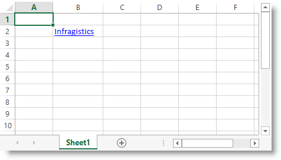

////
|metadata|
{
    "name": "igexcelengine-addinghyperlinktoworksheet",
    "tags": ["How Do I"],
    "controlName": ["IG Excel Engine"],
    "guid": "3bbc3e5b-4e2d-4f42-889f-f5c80a737963",
    "buildFlags": [],
    "createdOn": "2014-10-30T07:49:17.9363554Z"
}
|metadata|
////

= Adding a Hyperlink to a Worksheet (Infragistics Excel Engine)

== Topic Overview

=== Purpose

This topic provides procedural instructions on how to add a hyperlink to a worksheet using the _Infragistics Excel Engine_.

=== Required background

The following topics are prerequisites to understanding this topic:

[options="header", cols="a,a"]
|====
|Topic|Purpose

| link:igexcelengine-about-infragistics-excel-engine.html[About Infragistics Excel Engine]
|In this section you will find information that will help you to better understand the object model and the functionalities of the _Infragistics Excel Engine_ .

| link:igexcelengine-creating-a-workbook.html[Creating a Workbook (Infragistics Excel Engine)]
|In order to get you up and running as quickly as possible with the _Infragistics Excel Engine_, this topic provides procedural instructions on how to create a workbook.

|====

=== In this topic

This topic contains the following sections:

* <<_Ref389575564, Adding a Hyperlink to a Worksheet >>
* <<_Ref389575572, Related Content >>

[[_Ref389575564]]
== Adding a Hyperlink to a Worksheet

=== Introduction

This procedure demonstrates how to add a hyperlink to a worksheet. Hyperlinks are represented by the link:{ApiPlatform}documents.excel.v{ProductVersion}~infragistics.documents.excel.worksheethyperlink_members.html[WorksheetHyperlink] class and are added in the worksheet's link:{ApiPlatform}documents.excel.v{ProductVersion}~infragistics.documents.excel.worksheet~hyperlinks.html[Hyperlinks] collection.

=== Preview

The following screenshot is a preview of the result:

=== Prerequisites

To complete the procedure, you need the following:

An initialized workbook with at least one worksheet named "ws".

=== Overview

Following is a conceptual overview of the process:

[start=1]
. Create a WorksheetHyperlink
[start=2]
. Configure hyperlink's source
[start=3]
. Configure hyperlink's target
[start=4]
. Configure hyperlink's display text (optional)
[start=5]
. Configure hyperlink's tooltip (optional)
[start=6]
. Add the WorksheetHyperlink object to the worksheet's Hyperlink collection

=== Steps

The following steps demonstrate how to add a hyperlink to a worksheet.

=== 1. Create a WorksheetHyperlink object

Create a `WorksheetHyperlink` object and provide the required arguments. The next steps provide more information about the arguments.

=== 2. Configure hyperlink's source

The `WorksheetHyperlink` 's source is the location occupied by the hyperlink. It can be a single cell or multiple cells. You can provide the source as string: "B2", "B2:C5" or by providing a link:{ApiPlatform}documents.excel.v{ProductVersion}~infragistics.documents.excel.worksheetcell_members.html[WorksheetCell] or link:{ApiPlatform}documents.excel.v{ProductVersion}~infragistics.documents.excel.worksheetregion_members.html[WorksheetRegion].

=== 3. Configure hyperlink's target

The `WorksheetHyperlink` 's target can be one of the following: `WorksheetCell`, `WorksheetRegion`, link:{ApiPlatform}documents.excel.v{ProductVersion}~infragistics.documents.excel.namedreference_members.html[NamedReference] or a string value. The string type value allows you to specify targets like e-mail addresses, internet addresses and worksheet's cells and named references. See the link:{ApiPlatform}documents.excel.v{ProductVersion}~infragistics.documents.excel.worksheethyperlink~target.html[Target] property description for more information.

=== 4. Configure hyperlink's display text (optional)

The `WorksheetHyperlink` 's display text is the text that will be displayed in the worksheet cell. If you do not specify this optional argument the target text will be shown.

=== 5. Configure hyperlink's tooltip (optional)

The `WorksheetHyperlink` 's tooltip will be shown when hovering over the source cell or region. This is an optional argument.

=== 6. Add the WorksheetHyperlink object to the worksheet's Hyperlink collection

To make the hyperlink visible add it to the Hyperlinks collection of the respective `Worksheet`.

Following is the code that implements this example:

*In C#:*
[source,csharp]
----
WorksheetHyperlink link = new WorksheetHyperlink(
  "B2",
  "http://www.infragistics.com",
  "Infragistics",
  "Visit the Infragistics website");
this.ws.Hyperlinks.Add(link);
----

*In Visual Basic:*
[source,vb]
----
Dim link As New WorksheetHyperlink( _
  "B2", _
  "http://www.infragistics.com", _
  "Infragistics", _
  "Visit the Infragistics website")
Me.ws.Hyperlinks.Add(link)
----

[[_Ref389575572]]
== Related Content

=== Topics

The following topics provide additional information related to this topic.

[options="header", cols="a,a"]
|====
|Topic|Purpose

| link:igexcelengine-adding-a-shape-to-an-excel-worksheet.html[Adding a Shape to a Worksheet (Infragistics Excel Engine)]
|This topic explains how to add a predefined shape to a worksheet.

| link:igexcelengine-addingimagetoworksheet.html[Adding an Image to a Worksheet (Infragistics Excel Engine)]
|This topic provides procedural instructions on how to add an image to a worksheet using the _Infragistics Excel Engine_ .

|====