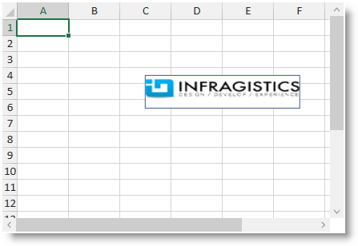

////

|metadata|
{
    "name": "igexcelengine-addingimagetoworksheet",
    "tags": ["How Do I"],
    "controlName": ["IG Excel Engine"],
    "guid": "5bece3c8-c5e3-4b86-bd4c-05e5e4d81f93",  
    "buildFlags": [],
    "createdOn": "2014-05-29T13:16:37.2749133Z"
}
|metadata|
////

= Adding an Image to a Worksheet (Infragistics Excel Engine)

== Topic Overview

=== Purpose

This topic provides procedural instructions on how to add an image to a worksheet using the  _Infragistics Excel Engine_  .

=== Required background

The following topics are prerequisites to understanding this topic:

[options="header", cols="a,a"]
|====
|Topic|Purpose

| link:igexcelengine-about-infragistics-excel-engine.html[About Infragistics Excel Engine]
|In this section you will find information that will help you to better understand the object model and the functionalities of the _Infragistics Excel Engine_ .

| link:igexcelengine-creating-a-workbook.html[Creating a Workbook (Infragistics Excel Engine)]
|In order to get you up and running as quickly as possible with the _Infragistics Excel Engine_, this topic provides procedural instructions on how to create a workbook.

|====

=== In this topic

This topic contains the following sections:

* <<_Ref389575564, Adding an Image to a Worksheet >>
* <<_Ref389575572, Related Content >>

[[_Ref389575564]]
== Adding an Image to a Worksheet

=== Introduction

This procedure demonstrates how to add an image to a worksheet. Images are represented by the link:{ApiPlatform}documents.excel{ApiVersion}~infragistics.documents.excel.worksheetimage_members.html[WorksheetImage] class and are added in the link:{ApiPlatform}documents.excel{ApiVersion}~infragistics.documents.excel.worksheet~shapes.html[Shapes] collection of the worksheet.

=== Preview

The following screenshot is a preview of the final result including all optional steps:

=== Prerequisites

To complete the procedure, you need the following:

*An initialized workbook with at least one worksheet.*

=== Overview

Following is a conceptual overview of the process:

[start=1]
. *Create an Image from a Stream* 
[start=2]
. *Create a WorksheetImage from an Image* 
[start=3]
. *Configure WorksheetImage’s position in twips (alternative)* 
[start=4]
. *Configure WorksheetImage’s cell position (alternative)* 
[start=5]
. *Configure WorksheetImage’s positions within the cells (alternative and optional)* 
[start=6]
. *Configure WorksheetImage’s properties (optional)* 
[start=7]
. *Add the WorksheetImage to the Shapes collection of the worksheet.* 

=== Steps

The following steps demonstrate how to add an image to a worksheet.

=== 1. Create an Image from a Stream

Create an `Image` object. You can do this using the static method of the `Image` class by providing a stream or filename.

*In C#:*

[source,csharp]
----
string imgResource = "Assembly.Folder.File.png";
using (Stream stream = this.GetType().Assembly.GetManifestResourceStream(imgResource))
{
    System.Drawing.Image img = System.Drawing.Image.FromStream(stream);
}
----

=== 2. Create a WorksheetImage from an Image

Create a `WorksheetImage` object by providing the `Image` instance from the previous step.

*In C#:*

[source,csharp]
----
WorksheetImage wsi = new WorksheetImage(img);
----

=== 3. Configure WorksheetImage’s position in twips (alternative)

You need to specify the bounds of the image in twips using the link:{ApiPlatform}documents.excel{ApiVersion}~infragistics.documents.excel.worksheetimage~setboundsintwips.html[SetBoundsInTwips] method.

*In C#:*

[source,csharp]
----
Graphics gfx = Graphics.FromImage(img);
wsi.SetBoundsInTwips(
this.xamSpreadsheet1.Workbook.Worksheets[0],
new Rect(
 PixelsToTwips(50, gfx), // left = 50
 PixelsToTwips(50, gfx), // top = 50
 PixelsToTwips(img.Width, gfx),
 PixelsToTwips(img.Height, gfx)));
----

*In C#:*

[source,csharp]
----
public double PixelsToTwips(int pixels, Graphics gfx)
{
    // convert pixels to points
    double p = pixels * 72 / gfx.DpiX;
    // convert points to twips
    return p * 20;
}
----

.Note
[NOTE]
====
Use this step as an alternative of steps 4 and 5.
====

=== 4. Configure WorksheetImage’s cell position (alternative)

You need to specify the cells which will occupy the image using the link:{ApiPlatform}documents.excel{ApiVersion}~infragistics.documents.excel.worksheetshape~topleftcornercell.html[TopLeftCornerCell] and link:{ApiPlatform}documents.excel{ApiVersion}~infragistics.documents.excel.worksheetshape~bottomrightcornercell.html[BottomRightCornerCell] properties.

*In C#:*

[source,csharp]
----
wsi.TopLeftCornerCell = this.xamSpreadsheet1.Workbook.Worksheets[0].Rows[3].Cells[2];
wsi.BottomRightCornerCell = this.xamSpreadsheet1.Workbook.Worksheets[0].Rows[5].Cells[5];
----

.Note
[NOTE]
====
Use this step as an alternative of step 3.
====

=== 5. Configure WorksheetImage’s positions within the cells (alternative and optional)

Also you can specify the exact location of the top left and bottom right corner using the link:{ApiPlatform}documents.excel{ApiVersion}~infragistics.documents.excel.worksheetshape~topleftcornerposition.html[TopLeftCornerPosition] and link:{ApiPlatform}documents.excel{ApiVersion}~infragistics.documents.excel.worksheetshape~bottomrightcornerposition.html[BottomRightCornerPosition] properties. These positions are specified in percentages, so if you want to position any of the corners in the middle of a cell use a `Point(50, 50)` for both position properties.

Following is the code that implements this example.

*In C#:*

[source,csharp]
----
wsi.TopLeftCornerPosition = new System.Windows.Point(50, 50);
wsi.BottomRightCornerPosition = new System.Windows.Point(50, 50);
----

.Note
[NOTE]
====
Use this optional step as an alternative of step 3.
====

=== 6. Configure WorksheetImage’s properties (optional)

You can set a background color for your image, so the worksheet’s gridlines are not visible if your image has transparent background.

You can also set any outline (or remove the default one) to the `WorksheetImage` instance.

The following code snippet shows how to add a white background and remove the default outline on your `WorksheetImage`.

*In C#:*

[source,csharp]
----
wsi.Fill = new ShapeFillSolid(Colors.White);
wsi.Outline = null;
----

=== 7. Add the WorksheetImage to the Shapes collection of the worksheet

Add the `WorksheetImage` instance to the `Shapes` collection.

Following is the code that implements this example.

*In C#:*

[source,csharp]
----
this.xamSpreadsheet1.Workbook.Worksheets[0].Shapes.Add(wsi);
----

[[_Ref389575572]]
== Related Content

=== Topics

The following topics provide additional information related to this topic.

[options="header", cols="a,a"]
|====
|Topic|Purpose

| link:igexcelengine-addinghyperlinktoworksheet.html[Adding a Hyperlink to a Worksheet (Infragistics Excel Engine)]
|This topic provides procedural instructions on how to add a hyperlink to a worksheet using the Infragistics Excel Engine.

| link:igexcelengine-adding-a-shape-to-an-excel-worksheet.html[Adding a Shape to a Worksheet (Infragistics Excel Engine)]
|This topic explains how to add a predefined shape to a worksheet.

|====