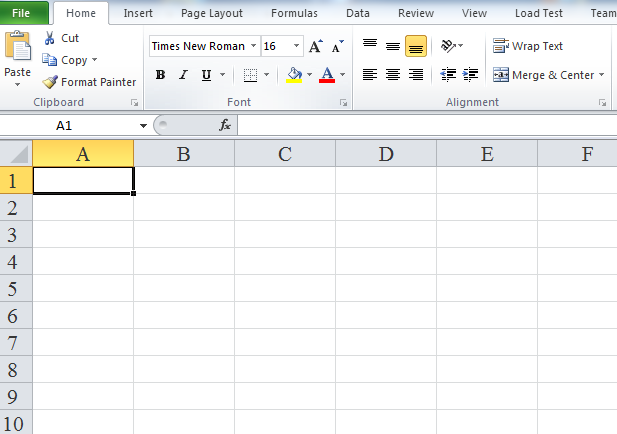

////
|metadata|
{
    "name": "igexcelengine-changing-the-default-font",
    "controlName": ["IG Excel Engine"],
    "tags": ["How Do I"],
    "guid": "75c5d4b3-ff15-4476-b997-8682049628d4",
    "buildFlags": [],
    "createdOn": "2012-03-28T14:10:58.6014333Z"
}
|metadata|
////

= Changing the Default Font (Infragistics Excel Engine)

== Topic Overview

=== Purpose

This topic describes how to change the Default font of a worksheet when exporting to Microsoft Excel®.

=== In this topic

This topic contains the following sections:

* <<_Introduction,Introduction>>
* <<_Code_Example_Changed_Default_Font,Code example: Changed Default Font>>
* <<_Related_Content,Related Content>>

[[_Introduction]]
== Introduction

There is a special type of style in Infragistics Excel workbook named Normal style, which can be accessed by `Workbook.Styles` 's link:{ApiPlatform}documents.excel{ApiVersion}~infragistics.documents.excel.workbookstylecollection~normalstyle.html[NormalStyle] property. This style contains the default properties for all cells in the workbook, unless otherwise specified on a row, column, or cell. Changing properties of the Normal style will change the default cell format properties in the workbook.

[[_Code_Example_Changed_Default_Font]]
== Code Example: Change Default Font

=== Description

You can change the default font by setting the `Workbook.Styles.NormalStyles.StyleFormat` 's link:{ApiPlatform}documents.excel{ApiVersion}~infragistics.documents.excel.iworksheetcellformat~font.html[Font] property or some of its properties to the desired values.

The code example below creates a new Workbook and adds one sheet to the workbook. It creates a new `Font`, which will be the default style for the workbook. Font family is changed to Times New Roman and font size is changed to 16 pt. Finally, the workbook is saved.

=== Preview

The following screenshot is a preview of the final result.

As you can see, the default Font family is  *Times New Roman*  and the default Font size is 16 pt.

=== Code

*In Visual Basic:*

[source,vb]
----
' Create new workbook and add worksheet
Dim workbook As New Infragistics.Documents.Excel.Workbook(Infragistics.Documents.Excel.WorkbookFormat.Excel2007)
Dim worksheet As Infragistics.Documents.Excel.Worksheet = workbook.Worksheets.Add("Sheet1")
Dim normalFont As Infragistics.Documents.Excel.IWorkbookFont = workbook.Styles.NormalStyle.StyleFormat.Font
' Specifying the name of default font
normalFont.Name = "Times New Roman"
' Specifying the font size. Font size height is measured in twips. One twips is 1/20th of a point
normalFont.Height = 16 * 20
Dim saveFileDialog As New SaveFileDialog() With { _
      Key .Filter = "Excel 2007 files|*.xlsx", _
      Key .DefaultExt = "xlsx" _
}
If saveFileDialog.ShowDialog() = True Then
      Dim stream As Stream = saveFileDialog.OpenFile()
      workbook.Save(stream)
      stream.Close()
End If
----

*In C#:*

[source,csharp]
----
// Create new workbook and add worksheet
Infragistics.Documents.Excel.Workbook workbook = new Infragistics.Documents.Excel.Workbook(Infragistics.Documents.Excel.WorkbookFormat.Excel2007);
Infragistics.Documents.Excel.Worksheet worksheet = workbook.Worksheets.Add("Sheet1");
Infragistics.Documents.Excel.IWorkbookFont normalFont = workbook.Styles.NormalStyle.StyleFormat.Font;
// Specifying the name of default font
normalFont.Name = "Times New Roman";
// Specifying the font size. Font size height is measured in twips. One twips is 1/20th of a point
normalFont.Height = 16 * 20;
SaveFileDialog saveFileDialog = new SaveFileDialog { Filter = "Excel 2007 files|*.xlsx", DefaultExt = "xlsx" };
if (saveFileDialog.ShowDialog() == true)
{
    Stream stream = saveFileDialog.OpenFile();
    workbook.Save(stream);
    stream.Close();
}
----

[[_Related_Content]]
== Related Content

=== Topics

The following topics provide additional information related to this topic.

[options="header", cols="a,a"]
|====
|Topic|Purpose

| link:igexcelengine-format-a-cell.html[Formatting a Cell (Infragistics Excel Engine)]
|The Infragistics Excel Engine allows you to customize the look and behavior of a cell.

| link:igexcelengine-using-the-infragistics-excel-engine.html[Using the Infragistics Excel Engine]
|This section is your gateway to important task-based information that will help you to effectively use the various features and functionalities provided by the Infragistics Excel Engine.

|====