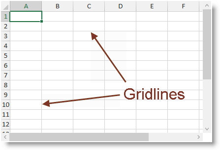

////
|metadata|
{
    "name": "igexcelengine-configuringgridlines",
    "tags": ["How Do I","Layouts"],
    "controlName": ["IG Excel Engine"],
    "guid": "1dace905-703f-4ea8-9104-e93bb2ff8793",
    "buildFlags": [],
    "createdOn": "2014-05-29T07:53:34.7662162Z"
}
|metadata|
////

= Configuring the Gridlines (Infragistics Excel Engine)

== Topic Overview

=== Purpose

This topic explains how to show or hide the gridlines and set their color.

=== Required background

The following topics are prerequisites to understanding this topic:

[options="header", cols="a,a"]
|====
|Topic|Purpose

| link:igexcelengine-about-infragistics-excel-engine.html[About Infragistics Excel Engine]
|In this section you will find information that will help you to better understand the object model and the functionalities of the _Infragistics Excel Engine_.

|====

=== In this topic

This topic contains the following sections:

* <<_Ref389485398, Introduction >>
* <<_Ref389485403, Gridlines Configuration Summary >>
* <<_Ref389484783, Showing/Hiding >>
* <<_Ref389484799, Setting the Color >>
* <<_Ref389485431, Related Content >>

[[_Ref389485398]]
== Introduction

=== Gridlines summary

The gridlines are used to visually separate the cells in the worksheet. You may show or hide the gridlines and also change their color.

The following screenshot shows the link:{ApiPlatform}controls.grids.xamspreadsheet.v{ProductVersion}~infragistics.controls.grids.xamspreadsheet.html[_xamSpreadsheet_] control displaying an empty worksheet with visible gridlines using their default gray color.

[[_Ref389485403]]
== Gridlines Configuration Summary

=== Gridlines configuration summary chart

The following table explains briefly the configurable aspects of the gridlines and maps them to the properties that configure them.

[options="header", cols="a,a,a"]
|====
|Configurable aspect|Details|Properties

|<<_Ref389484783,Showing/Hiding>>
|Shows or hides the gridlines.
| link:{ApiPlatform}documents.excel.v{ProductVersion}~infragistics.documents.excel.displayoptions~showgridlines.html[ShowGridlines]

|<<_Ref389484799,Setting the Color>>
|Sets the gridlines’ color.
| link:{ApiPlatform}documents.excel.v{ProductVersion}~infragistics.documents.excel.displayoptions~gridlinecolor.html[GridlineColor]

|====

[[_Ref389484783]]
== Showing/Hiding

[[_Hlk368069110]]
=== Overview

You can show or hide the gridlines using the `ShowGridlines` property.

=== Property settings

The following table maps the desired configuration to the property settings that manage it.

[options="header", cols="a,a,a"]
|====
|In order to:
|Use this property:
|And set it to:

|Show the gridlines
|`ShowGridlines`
|`True`

|Hide the gridlines
|`ShowGridlines`
|`False`

|====

[[_Hlk337817761]]
=== Example

The following code snippet demonstrates how to show the gridlines on the first worksheet of the opened workbook.

*In Visual Basic*
[source, vb]
----
Me.spreadsheet1.Workbook.Worksheets(0).DisplayOptions.ShowGridlines = True
----

*In C#:*
[source, csharp]
----
this.spreadsheet1.Workbook.Worksheets[0].DisplayOptions.ShowGridlines = true;
----

[[_Ref389484799]]
== Setting the Color

=== Overview

You can configure the gridlines’ color using the `GridlineColor` property.

=== Property settings

The following table maps the desired configuration to the property settings that manage it.

[options="header", cols="a,a,a"]
|====
|In order to:|Use this property:|And set it to:

|Set the gridlines’ color
|`GridlineColor`
|A value of type `Color`

|====

=== Example

The following code snippet demonstrates how to set the gridlines’ color to red.

*In Visual Basic*
[source, vb]
----
Me.spreadsheet1.Workbook.Worksheets(0).DisplayOptions.ShowGridlines = True
----

*In C#:*
[source, csharp]
----
this.spreadsheet1.Workbook.Worksheets[0].DisplayOptions.GridlineColor = Colors.Red;
----

[[_Ref389485431]]
== Related Content

=== Topics

The following topics provide additional information related to this topic.

[options="header", cols="a,a"]
|====
|Topic|Purpose

| link:igexcelengine-configuringheaders.html[Configuring the Headers (Infragistics Excel Engine)]
|This topic explains how to show or hide the column and row headers.

| link:igexcelengine-disable-editing-of-a-worksheet.html[Disabling Editing of a Worksheet (Infragistics Excel Engine)]
|This topic explains how to prevent the user from editing the cell values in a worksheet.

| link:igexcelengine-zoomlevel.html[Setting the Worksheet Zoom Level (Infragistics Excel Engine)]
|This topic explains how to programmatically set the zoom level in a worksheet.

|====