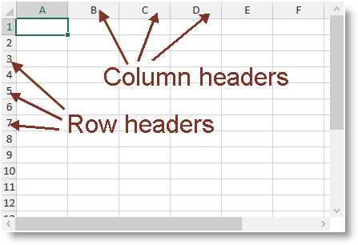

////
|metadata|
{
    "name": "igexcelengine-configuringheaders",
    "tags": ["How Do I","Layouts"],
    "controlName": ["IG Excel Engine"],
    "guid": "a1ce3622-4bdd-4e50-a5e7-cd89e31fec6a",
    "buildFlags": [],
    "createdOn": "2014-05-29T08:00:11.4570581Z"
}
|metadata|
////

= Configuring the Headers (Infragistics Excel Engine)

== Topic Overview

=== Purpose

This topic explains how to show or hide the column and row headers.

=== Required background

The following topics are prerequisites to understanding this topic:

[options="header", cols="a,a"]
|====
|Topic|Purpose

| link:igexcelengine-about-infragistics-excel-engine.html[About Infragistics Excel Engine]
|In this section you will find information that will help you to better understand the object model and the functionalities of the _Infragistics Excel Engine_ .

|====

=== In this topic

This topic contains the following sections:

* <<_Ref389548430, Introduction >>
* <<_Ref389548450, Headers Configuration Summary >>
* <<_Ref389488250, Showing/Hiding >>
* <<_Ref389548467, Related Content >>

[[_Ref389548430]]
== Introduction

=== Headers summary

The column and row headers are used to visually identify columns and rows. They are also used to visually highlight the currently selected cell or cell region.

The following screenshot shows the link:{ApiPlatform}controls.grids.xamspreadsheet.v{ProductVersion}~infragistics.controls.grids.xamspreadsheet.html[ _xamSpreadsheet_  ] control displaying an empty worksheet. Because of the currently selected cell, the first row ("1") and the first column ("A") are with highlighted headers.

[[_Ref389548450]]
== Headers Configuration Summary

=== Headers configuration summary chart

The following table explains briefly the configurable aspects of the column and row headers and maps them to the properties that configure them.

[options="header", cols="a,a,a"]
|====
|Configurable aspect|Details|Properties

|<<_Ref389488250,Showing/Hiding>>
|Shows or hides the column and row headers.
| link:{ApiPlatform}documents.excel.v{ProductVersion}~infragistics.documents.excel.displayoptions~showrowandcolumnheaders.html[ShowRowAndColumnHeaders]

|====

[[_Ref389488250]]
== Showing/Hiding

[[_Hlk368069110]]
=== Overview

You can show or hide the column and row headers using the `ShowRowAndColumnHeaders` property.

=== Property settings

The following table maps the desired configuration to the property settings that manage it.

[options="header", cols="a,a,a"]
|====
|In order to:|Use this property:|And set it to:

|Show the column and row headers
|`ShowRowAndColumnHeaders`
|`True`

|Hide the column and row headers
|`ShowRowAndColumnHeaders`
|`False`

|====

[[_Hlk337817761]]
=== Example

The following code snippet demonstrates how to show the column and row headers on the first worksheet of the opened workbook.

*In Visual Basic:*
[source, vb]
----
Me.spreadsheet1.Workbook.Worksheets(0).DisplayOptions.ShowRowAndColumnHeaders = True
----

*In C#:*
[source, csharp]
----
this.spreadsheet1.Workbook.Worksheets[0].DisplayOptions.ShowRowAndColumnHeaders = true;
----

[[_Ref389548467]]
== Related Content

=== Topics

The following topics provide additional information related to this topic.

[options="header", cols="a,a"]
|====
|Topic|Purpose

| link:igexcelengine-configuringgridlines.html[Configuring the Gridlines (Infragistics Excel Engine)]
|This topic explains how to show or hide the gridlines and set their color.

| link:igexcelengine-disable-editing-of-a-worksheet.html[Disabling Editing of a Worksheet (Infragistics Excel Engine)]
|This topic explains how to prevent the user from editing the cell values in a worksheet.

| link:igexcelengine-zoomlevel.html[Setting the Worksheet Zoom Level (Infragistics Excel Engine)]
|This topic explains how to programmatically set the zoom level in a worksheet.

|====