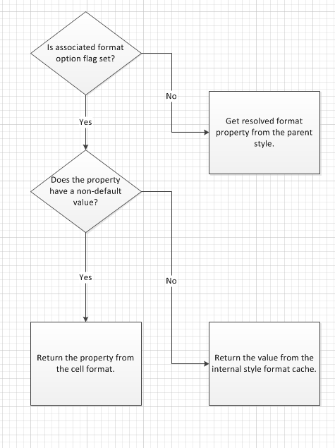

////
|metadata|
{
    "name": "igexcelengine-excel-format-support",
    "controlName": ["IG Excel Engine"],
    "tags": ["Formatting","How Do I"],
    "guid": "b5f2262d-374f-4298-aedf-8026fcdeeb0f",
    "buildFlags": [],
    "createdOn": "2012-03-28T14:18:59.4104333Z"
}
|metadata|
////

= Excel Format Support (Infragistics Excel Engine)

== Topic Overview

=== Purpose

This topic explains Infragistics Excel library support for cell formats.

=== In this topic

This topic contains the following sections:

* <<_Main_Features, Main Features >>

** <<_Features_Overview,Features Overview>>

** <<_Accessing_built_in_styles,Accessing built-in styles>>

** <<_Parent_styles,Parent styles>>

** <<_Format_options,Format options>>

** <<_Excel_Style_mimicked_behavior,Excel Style mimicked behavior>>

** <<_Determing_resolved_cell_formats,Determining resolved cell formats>>

* <<_Related_Content, Related Content >>

[[_Main_Features]]
== Main Features

[[_Features_Overview]]

=== Features Overview

The following table summarizes the main features of the format support. Additional details are available after the following summary table.

[options="header", cols="a,a"]
|====
|Feature|Description

|Accessing built-in styles
|Styles are accessible in the Excel library through the `Workbook` link:{ApiPlatform}documents.excel.v{ProductVersion}~infragistics.documents.excel.workbook~styles.html[Styles] property, which is a collection of link:{ApiPlatform}documents.excel.v{ProductVersion}~infragistics.documents.excel.workbookstyle_members.html[WorkbookStyle] instances, each one representing a cell style in the workbook.

|Parent styles
|The formats for styles, rows, columns, and cells are represented by the link:{ApiPlatform}documents.excel.v{ProductVersion}~infragistics.documents.excel.iworksheetcellformat_members.html[IWorksheetCellFormat] interface. This interface has a new property named Style which points to the style from which cell formats resolve default properties.

|Format options
|The `IWorksheetCellFormat` interface has a link:{ApiPlatform}documents.excel.v{ProductVersion}~infragistics.documents.excel.iworksheetcellformat~formatoptions.html[FormatOptions] property. This property takes a flagged enumeration values.

|Excel Style mimicked behavior
|There are numerous Microsoft Excel behaviors regarding styles which have been mimicked.

|Determining resolved cell formats
|You can determine what would really be seen in cells using the link:{ApiPlatform}documents.excel.v{ProductVersion}~infragistics.documents.excel.worksheetcell~getresolvedcellformat.html[GetResolvedCellFormat] methods on classes which represent a row, column, cell, and merged cell.

|====

[[_Accessing_built_in_styles]]

=== Accessing built-in styles

[options="header", cols="a,a"]
|====
|Styles|Purpose

|Styles collection
|The styles collection is pre-populated with all built-in styles, which can be found in the Cell Styles gallery of the Home tab of Microsoft Excel 2007.

|NormalStyle
|There is a special type of style in the workbook, known as a _Normal_ style, which can be accessed by the new `Workbook.Styles.NormalStyle` property, or by indexing into the collection with the name _Normal_ . 

The _Normal_ style contains the default properties for all cells in the workbook (unless otherwise specified on a row, column, or cell). Changing properties on the _Normal_ style will change the default cell format properties in the workbook. 

The _Normal_ style can be used when you want to change the default font for your workbook. For more information, refer to the link:igexcelengine-changing-the-default-font.html[Changing the Default Font (Excel Engine)]

|Clearing styles
|You can clear the style collection or you can reset it to its predefined state using the methods below: 

link:{ApiPlatform}documents.excel.v{ProductVersion}~infragistics.documents.excel.workbookstylecollection~clear.html[Clear] 

Clearing the styles collection on the workbook, done with the `Clear` method, will remove all user defined and built-in styles, except for the _Normal_ style, which will be reset to its preset state. 

link:{ApiPlatform}documents.excel.v{ProductVersion}~infragistics.documents.excel.workbookstylecollection~reset().html[Reset] 

The `Reset` method will restore the collection to its preset state. This means all user defined styles will be removed and the collection will be repopulated with all built-in styles in their preset states. 

|====

[[_Parent_styles]]

=== Parent styles

With this feature, a `Style` property has been added to the `IWorksheetCellFormat` interface. This is a reference to a `WorkbookStyle` instance, representing the parent style of the format. For formats of a style, this property will always be null, because styles cannot have a parent style. For row, column, and cell formats, the Style property always returns the  _Normal_   style by default.

If the `Style` property is set to null, it will revert back to the  _Normal_   style. If it is set to another style in the styles collection, that style will now hold the defaults for all unset properties on the cell format.

Unset properties resolve their values from the parent style.

[[_Format_options]]

=== Format options

The `FormatOptions` property takes a flagged enumeration value from the following values:

* None
* ApplyNumberFormatting
* ApplyAlignmentFormatting
* ApplyFontFormatting
* ApplyBorderFormatting
* ApplyFillFormatting
* ApplyProtectionFormatting
* All

Aside from None and All, every other value corresponds to a check box in the modify style dialog of Excel UI. When properties are set to non-default values on the cell or style format, the associated format option flag is added to the `FormatOptions` value. When you manually remove flagged values from the `FormatOptions` value, all properties associated with the removed values are reset to their defaults.

When using a style format, the `FormatOptions` indicate which format properties are included with the style, as in the  *Modify Style*  dialog.

When using a cell format, the `FormatOptions` indicate which groups of properties are set on the cell. All other properties therefore resolve their values from the parent style.

The property groups are as follows:

* ApplyNumberFormatting

** FormatString

* ApplyAlignmentFormatting

** Alignment

** Indent

** Rotation

** ShrinkToFit

** VerticalAlignment

** WrapText

* ApplyFontFormatting

** Font

* ApplyBorderFormatting

** BottomBorderColorInfo

** BottomBorderStyle

** DiagonalBorderColorInfo

** DiagonalBorders

** DiagonalBorderStyle

** LeftBorderColorInfo

** LeftBorderStyle

** RightBorderColorInfo

** RightBorderStyle

** TopBorderColorInfo

** TopBorderStyle

* ApplyFillFormatting

** Fill

* ApplyProtectionFormatting

** Locked

[[_Excel_Style_mimicked_behavior]]

=== Excel Style mimicked behavior

[options="header", cols="a,a"]
|====
|Behavior|Description

|When the parent style is set on a cell format, the format options included on the new parent style are removed from the cell format. All other properties are left intact.
|When a property is set to some non-default value, the associated format options flag is added to the `FormatOptions` value, indicating that the cell format now provides those options. 

When a new parent style is set on a cell, the format options included on the parent style are stripped out of the format options from the cell format. So if a cell format included border and fill formatting and the _Total_ style was set as the parent style, which includes font and border formatting, the border format option on the cell format are removed and the cell format only includes fill formatting. 

When a format option flag is removed from a format, all associated properties are reset to their unset values, so the cell format’s border properties are implicitly reset to default/unset values. That also means that cell format will pick up changes to the _Total_ style’s borders in the future.

|Format options on cell formats are added automatically, but not removed automatically.
|When a property is set to some non-default value, the associated format option flag is added to the `FormatOptions` value, indicating that the cell format now provides those values. 

If the property is subsequently set back to its default/unset value, the `FormatOptions` property will still have the associated format option flag included. It will not be removed. 

Unlike Microsoft Excel, the Infragistics Excel Library allows you to manually remove format options by modifying the `FormatOptions` property. Doing so will reset all properties associated with the removed options.

|When a format option is added to a cell format, it stops picking up changes to all associated properties on the parent style.
|Each cell format has an internal style format which initially holds no values. When the first cell format property in a group is set, the associated format option flag is added to the `FormatOptions` value and all properties in that group from the parent style are cached on this internal style format. It holds snapshots of the parent style’s property groups from the time when the associated format option flags were added into the cell format’s format options. 

When a format option flag is removed from a cell format, the associated properties on the internal style format cache are cleared as well. 

If a cell includes a format option flag and a property from the associated group has an unset value, it is resolved from the internal style format cache and not from the parent style. Only the cell format properties which do not have the associated format options flag set will resolve from the parent style.

|When a cell format is assigned a new parent style and that new style does not include all format options flags the old parent style included, the properties associated with the extra format options on the old parent style are still applied to the cell, but it stops picking up changes to the old parent style.
|When a parent style is changed, all format options flags on the old parent style which are not on the new parent style are taken and added to the format options of the cell format. 

When a format option is added to a cell format, all properties from the parent style are cached on the internal style format cache. Therefore, the cell format will implicitly cache all properties from the old parent style which are not specified on the new parent style, thereby ‘merging’ the two styles in a way.

|====

[[_Determing_resolved_cell_formats]]

=== Determining resolved cell formats

You can determine what would really be seen in cells by using the `GetResolvedCellFormat` method on classes which represent a row, column, cell, and merged cell.

This method returns an `IWorksheetCellFormat` instance which refers back to the associated `CellFormat` on which it is based. So subsequent changes to the `CellFormat` will be reflected in the instance returned from a `GetResolved``Cell``Format` call.

When format values are requested on this resolved format, it will always go back to its associated cell format to resolve the values from the format itself, the internal style format cache, or the parent style’s format, depending on the format options present on the cell format.

Here is a visual representation of how cell format values are resolved:

[[_Related_Content]]
== Related Content

=== Topics

The following topics provide additional information related to this topic.

[options="header", cols="a,a"]
|====
|Topic|Purpose

| link:igexcelengine-excel-2007-color-model.html[Excel 2007 Color Model]
|This topic explains how to set colors on various cells format properties.

| link:igexcelengine-using-the-infragistics-excel-engine.html[Using the Infragistics Excel Engine]
|This section is your gateway to important task-based information that will help you to effectively use the various features and functionalities provided by the Infragistics Excel Engine.

|====

=== Samples

The following samples provide additional information related to this topic.

[options="header", cols="a,a"]
|====
|Sample|Purpose

| link:{SamplesURL}/infragistics-excel/new-color-model[New Color Model]
|This sample demonstrates way of working with Newer color model on cell formats. You can specify the RGB color and a tint value on all color properties of a cell format. You can use linear and rectangular gradients in cells.

|====