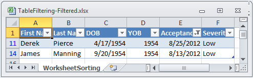
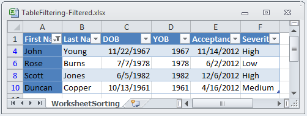

////
|metadata|
{
    "name": "igexcelengine-filtering-tables",
    "controlName": ["IG Excel Engine"],
    "tags": ["Filtering","How Do I"],
    "guid": "124d7549-791f-4da1-80cc-2f950ffd5be2",
    "buildFlags": [],
    "createdOn": "2012-03-29T07:20:39.4451762Z"
}
|metadata|
////

= Filtering Tables (Infragistics Excel Engine)

== Topic Overview

=== Purpose

This topic describes how to filter columns in exported tables.

=== In this topic

This topic contains the following sections:

* <<_Introduction,Introduction>>
* <<_Code_Examples_Overview,Code Examples Overview>>
* <<_Code_Example_Average_Filtering,Code Example: Average Filtering>>
* <<_Code_Example_Custom_Filtering,Code Example: Custom Filtering>>
* <<_Code_Example_Date_Period_Filtering,Code Example: Date Period Filtering>>
* <<_Code_Example_Fill_Filtering,Code Example: Fill Filtering>>
* <<_Code_Example_Fixed_Values_Filtering,Code Example: Fixed Values Filtering>>
* <<_Code_Example_Relative_Date_Range_Filtering,Code Example: Relative Date Range Filtering>>
* <<_Code_Example_Top_or_Bottom_Filtering,Code Example: Top or Bottom Filtering>>
* <<_Code_Example_Year_to_Date_Filtering,Code Example: Year to Date Filtering>>
* <<_Related_Content,Related Content>>

[[_Introduction]]
== Introduction

Filtering is done by applying a filter. When the filter is applied on a column, all filters in the table will be reevaluated to determine which rows should be visible. This operation will show rows where all cells meet their table columns’ filter criteria.

If the data in the table is subsequently changed or you change the Hidden property of the rows subsequently, the filter conditions will not be reevaluated. The Filter conditions in a table are only reapplied when table column filters are added, removed, modified, or when the link:{ApiPlatform}documents.excel{ApiVersion}~infragistics.documents.excel.worksheettable~reapplyfilters.html[ReapplyFilters] method is called on the table.

The following filter methods are available to apply on columns:

[options="header", cols="a,a"]
|====
|Filter methods|Description

| link:{ApiPlatform}documents.excel{ApiVersion}~infragistics.documents.excel.worksheettablecolumn~applydateperiodfilter.html[ApplyDatePeriodFilter]
|Only cells with dates in a specific month or quarter of any year will be displayed. All other cells will be hidden.

| link:{ApiPlatform}documents.excel{ApiVersion}~infragistics.documents.excel.worksheettablecolumn~applyaveragefilter.html[ApplyAverageFilter]
|Cells can be filtered based on whether they are above or below the average value of all cells in the column.

| link:{ApiPlatform}documents.excel{ApiVersion}~infragistics.documents.excel.worksheettablecolumn~applycustomfilter.html[ApplyCustomFilter]
|Cells can be filtered based on one or more custom conditions.

| link:{ApiPlatform}documents.excel{ApiVersion}~infragistics.documents.excel.worksheettablecolumn~applyfillfilter.html[ApplyFillFilter]
|Only cells with a specific fill will be displayed. All other cells will be hidden.

| link:{ApiPlatform}documents.excel{ApiVersion}~infragistics.documents.excel.worksheettablecolumn~applyfontcolorfilter.html[ApplyFontColorFilter]
|Only cells with a specific font color will be displayed. All other cells will be hidden.

| link:{ApiPlatform}documents.excel{ApiVersion}~infragistics.documents.excel.worksheettablecolumn~applyfixedvaluesfilter.html[ApplyFixedValuesFilter]
|Cells which only match specific display values or which fall within a specific group of dates/times will be displayed. All other cells will be hidden.

| link:{ApiPlatform}documents.excel{ApiVersion}~infragistics.documents.excel.worksheettablecolumn~applyrelativedaterangefilter.html[ApplyRelativeDateRangeFilter]
|Cells with date values can be filtered based on whether they occur within a relative time range of the date when the filter was applied, such as the next day or the previous quarter.

| link:{ApiPlatform}documents.excel{ApiVersion}~infragistics.documents.excel.worksheettablecolumn~applytoporbottomfilter.html[ApplyTopOrBottomFilter]
|This filter allows for the following types of filters: 

* Only the top N values are visible 

* Only the bottom N values are visible 

* Only the top N% of values are visible 

* Only the bottom N% of the values are visible 

| link:{ApiPlatform}documents.excel{ApiVersion}~infragistics.documents.excel.worksheettablecolumn~applyyeartodatefilter.html[ApplyYearToDateFilter]
|Cells with date values can be filtered if they occur between the start of the year and the date on which the filter is applied.

|====

[[_Code_Examples_Overview]]
== Code Examples Overview

=== Overview

The following table lists the code examples included in this topic.

[options="header", cols="a,a"]
|====
|Example|Description

|Average Filtering
|This code example shows how cells can be filtered based on whether they are above or below the average value of all cells in the column.

|Custom Filtering
|This code example shows how cells can be filtered according to one or more link:{ApiPlatform}documents.excel{ApiVersion}~infragistics.documents.excel.filtering.customfiltercondition_members.html[CustomFilterCondition].

|Date Period Filtering
|This code filters cells with dates in a specific month or quarter. All other cells will be hidden.

|Fill Filtering
|This code filters cells with specific fill. All other cells will be hidden.

|Fixed Values Filtering
|This code filters cells which have specific display values. All other cells will be hidden.

|Relative Date Range Filtering
|This code example shows how to filter date values based on whether they occur within a relative time range of the date on which the filter is applied.

|Top or Bottom Filtering
|This code example shows how to filter the top 10% of values in the column.

|Year To Date Filtering
|This code example shows how cells with date values can be filtered if they occur between the start of the year and the date o the filter is applied.

|====

[[_Code_Example_Average_Filtering]]
== Code Example: Average Filtering

=== Description

This code shows how to filter cells above the average value of all cells in the column. Filtering below average values is done in a similar manner.

The code in this example creates a workbook with a table. After that, a filter is applied on a column of the table. In the end, the workbook is saved so the filtered table can be seen.

=== Prerequisites

In this example code snippet for programmatically creating a workbook, a  _Patients_   named table is used. The code snippet can be found here: link:igexcelengine-creating-excel-named-table-code-example.html[Creating Excel Named Table Code Example]

=== Code

*In Visual Basic:*
[source,vb]
----
Dim workbook As Infragistics.Documents.Excel.Workbook = ExcelExampleTable.CreateExampleWorkbook()
' Get a table. Table is created in separate code snippet.
Dim table As Infragistics.Documents.Excel.WorksheetTable = workbook.GetTable("Patients")
' Apply average filter
table.Columns("YOB").ApplyAverageFilter(Infragistics.Documents.Excel.Filtering.AverageFilterType.AboveAverage)
workbook.Save("C:\TableFiltering-Filtered.xlsx")
----

*In C#:*
[source,csharp]
----
Infragistics.Documents.Excel.Workbook workbook = ExcelExampleTable.CreateExampleWorkbook();
// Get a table. Table is created in separate code snippet.
Infragistics.Documents.Excel.WorksheetTable table = workbook.GetTable("Patients");
// Apply average filter
table.Columns["YOB"].ApplyAverageFilter(Infragistics.Documents.Excel.Filtering.AverageFilterType.AboveAverage);
workbook.Save("C:\\TableFiltering-Filtered.xlsx");
----

[[_Code_Example_Custom_Filtering]]
== Code Example: Custom Filtering

=== Description

This code shows how to filter cells according to the `CustomFilterCondition` condition

The code in this example creates a workbook with a table. After that a `CustomFilterCondition` is created, with a specified link:{ApiPlatform}documents.excel{ApiVersion}~infragistics.documents.excel.filtering.excelcomparisonoperator.html[ExcelComparisonOperator] and a match string. The custom filter is applied and in the end, the workbook is saved so the filtered table can be seen.

=== Prerequisites

In this example code snippet for programmatically creating a workbook, a  _Patients_   named table is used. The code snippet can be found here: link:igexcelengine-creating-excel-named-table-code-example.html[Creating Excel Named Table Code Example]

=== Code

*In Visual Basic:*
[source,vb]
----
Dim workbook As Infragistics.Documents.Excel.Workbook = ExcelExampleTable.CreateExampleWorkbook()
' Get a table. Table is created in separate code snippet.
Dim table As Infragistics.Documents.Excel.WorksheetTable = workbook.GetTable("Patients")
' Apply average filter
table.Columns("YOB").ApplyAverageFilter(Infragistics.Documents.Excel.Filtering.AverageFilterType.AboveAverage)
workbook.Save("C:\TableFiltering-Filtered.xlsx")
----

*In C#:*
[source,csharp]
----
Infragistics.Documents.Excel.Workbook workbook = ExcelExampleTable.CreateExampleWorkbook();
// Get a table. Table is created in separate code snippet.
Infragistics.Documents.Excel.WorksheetTable table = workbook.GetTable("Patients");
// Apply average filter
table.Columns["YOB"].ApplyAverageFilter(Infragistics.Documents.Excel.Filtering.AverageFilterType.AboveAverage);
workbook.Save("C:\\TableFiltering-Filtered.xlsx");
----

[[_Code_Example_Date_Period_Filtering]]
== Code Example: Date Period Filtering

=== Description

This code filters cells with dates in a specific month or quarter.

The code in this example creates a workbook with a table. After that, a Date Period Filter is applied on a column of the table which contains dates. In the end, workbook is saved so the filtered table can be seen.

=== Prerequisites

In this example code snippet for programmatically creating a workbook, a  _Patients_   named table is used. The code snippet can be found here: link:igexcelengine-creating-excel-named-table-code-example.html[Creating Excel Named Table Code Example]

=== Preview

The following screenshot is a preview of the final result.

=== Code

*In Visual Basic:*
[source,vb]
----
Dim workbook As Infragistics.Documents.Excel.Workbook = ExcelExampleTable.CreateExampleWorkbook()
' Get a table. Table is created in separate code snippet.
Dim table As Infragistics.Documents.Excel.WorksheetTable = workbook.GetTable("Patients")
' Apply Date Period Filter
' If you choose DatePeriodFilterType.Month, second argument represents months from January, 1, to December, 12
' and can take values 1, 2, 3, 4, 5, 6, 7, 8, 9, 10, 11, 12
' If you choose DatePeriodFilterType.Quarter, second argument represents the four quaters of the year - Q1, Q2, Q3 and Q4, 
' and can take values 1, 2, 3 and 4.
' Code below accepts all dates in August.
table.Columns("Acceptance Date").ApplyDatePeriodFilter(Infragistics.Documents.Excel.Filtering.DatePeriodFilterType.Month, 8)
workbook.Save("C:\TableFiltering-Filtered.xlsx")
----

*In C#:*
[source,csharp]
----
Infragistics.Documents.Excel.Workbook workbook = ExcelExampleTable.CreateExampleWorkbook();
// Get a table. Table is created in separate code snippet.
Infragistics.Documents.Excel.WorksheetTable table = workbook.GetTable("Patients");
// Apply Date Period Filter
// If you choose DatePeriodFilterType.Month, second argument represents months from January, 1, to December, 12
// and can take values 1, 2, 3, 4, 5, 6, 7, 8, 9, 10, 11, 12
// If you choose DatePeriodFilterType.Quarter, second argument represents the four quaters of the year - Q1, Q2, Q3 and Q4, 
// and can take values 1, 2, 3 and 4.
// Code below accept all dates in August.
table.Columns["Acceptance Date"].ApplyDatePeriodFilter(Infragistics.Documents.Excel.Filtering.DatePeriodFilterType.Month, 8);
workbook.Save("C:\\TableFiltering-Filtered.xlsx");
----

[[_Code_Example_Fill_Filtering]]
== Code Example: Fill Filtering

=== Description

This code shows how to filter cells with specific background fill.

The code in this example creates a workbook with a table. After that, a link:{ApiPlatform}documents.excel{ApiVersion}~infragistics.documents.excel.cellfill_members.html[CellFill] is created which will be used for matching. A Fill Filter is applied and in the end, the workbook is saved so the filtered table can be seen.

=== Prerequisites

In this example code snippet for programmatically creating a workbook, a  _Patients_   named table is used. The code snippet can be found here: link:igexcelengine-creating-excel-named-table-code-example.html[Creating Excel Named Table Code Example]

=== Preview

The following screenshot is a preview of the final result.

=== Code

*In Visual Basic:*
[source,vb]
----
Dim workbook As Infragistics.Documents.Excel.Workbook = ExcelExampleTable.CreateExampleWorkbook()
' Get a table. Table is created in separate code snippet.
Dim table As Infragistics.Documents.Excel.WorksheetTable = workbook.GetTable("Patients")
Dim lastRow As Integer = table.DataAreaRegion.LastRow
Dim rand As New System.Random()
' Set Red background for random cells from first column
Dim i As Integer = 1
While i < lastRow
      If rand.[Next](2) = 1 Then
            workbook.Worksheets(0).Rows(i).Cells(0).CellFormat.Fill = Infragistics.Documents.Excel.CellFill.CreateSolidFill(New Infragistics.Documents.Excel.WorkbookColorInfo(Infragistics.Documents.Excel.WorkbookThemeColorType.Accent1))
      End If
      i += 1
End While
' Create cell fill argument
Dim cellFill As Infragistics.Documents.Excel.CellFill = Infragistics.Documents.Excel.CellFill.CreateSolidFill(New Infragistics.Documents.Excel.WorkbookColorInfo(Infragistics.Documents.Excel.WorkbookThemeColorType.Accent1))
' Apply FillFilter
table.Columns("First Name").ApplyFillFilter(cellFill)
workbook.Save("C:\TableFiltering-Filtered.xlsx")
----

*In C#:*
[source,csharp]
----
Infragistics.Documents.Excel.Workbook workbook = ExcelExampleTable.CreateExampleWorkbook();
// Get a table. Table is created in separate code snippet.
Infragistics.Documents.Excel.WorksheetTable table = workbook.GetTable("Patients");
int lastRow = table.DataAreaRegion.LastRow;
System.Random rand = new System.Random();
// Set Red background for random cells from first column
for (int i = 1; i < lastRow; i++)
{
    if (rand.Next(2) == 1)
    {
        workbook.Worksheets[0].Rows[i].Cells[0].CellFormat.Fill = Infragistics.Documents.Excel.CellFill.CreateSolidFill(
        new Infragistics.Documents.Excel.WorkbookColorInfo(Infragistics.Documents.Excel.WorkbookThemeColorType.Accent1));
     }
}
// Create cell fill argument
Infragistics.Documents.Excel.CellFill cellFill = Infragistics.Documents.Excel.CellFill.CreateSolidFill(
    new Infragistics.Documents.Excel.WorkbookColorInfo(Infragistics.Documents.Excel.WorkbookThemeColorType.Accent1));
// Apply FillFilter
table.Columns["First Name"].ApplyFillFilter(cellFill);
workbook.Save("C:\\TableFiltering-Filtered.xlsx");
----

[[_Code_Example_Fixed_Values_Filtering]]
== Code Example: Fixed Values Filtering

=== Description

This code filters cells which have specific display values.

The code in this example creates a workbook with a table. After that, a string array is created which holds all fixed values for filtering and the Fixed Values Filter is applied. The cells from the column on which filter is applied have different string values. In the end, the workbook is saved so the filtered table can be seen.

=== Prerequisites

In this example code snippet for programmatically creating a workbook, a  _Patients_   named table is used. The code snippet can be found here: link:igexcelengine-creating-excel-named-table-code-example.html[Creating Excel Named Table Code Example]

=== Code

*In Visual Basic:*
[source,vb]
----
Dim workbook As Infragistics.Documents.Excel.Workbook = ExcelExampleTable.CreateExampleWorkbook()
' Get a table. Table is created in separate code snippet.
Dim table As Infragistics.Documents.Excel.WorksheetTable = workbook.GetTable("Patients")
' Create a category array of values, to be used in filtering
Dim categories As String() = New String() {"High", "Medium"}
' Apply FixedValuesFilter
table.Columns("Severity").ApplyFixedValuesFilter(False, categories)
workbook.Save("C:\TableFiltering-Filtered.xlsx")
----

*In C#:*
[source,csharp]
----
Infragistics.Documents.Excel.Workbook workbook = ExcelExampleTable.CreateExampleWorkbook();
// Get a table. Table is created in separate code snippet.
Infragistics.Documents.Excel.WorksheetTable table = workbook.GetTable("Patients");
// Create a category array of values, to be used in filtering
string[] categories = new string[] {"High", "Medium"};
// Apply FixedValuesFilter
table.Columns["Severity"].ApplyFixedValuesFilter(false, categories);
workbook.Save("C:\\TableFiltering-Filtered.xlsx");
----

[[_Code_Example_Relative_Date_Range_Filtering]]
== Code Example: Relative Date Range Filtering

=== Description

This code example shows how to filter date values based on whether they occur within a relative time range of the date.

The code in this example creates a workbook with a table. After that, a Relative Date Values Filter is applied. In the end, the workbook is saved so the filtered table can be seen.

=== Prerequisites

In this example code snippet for programmatically creating a workbook, a  _Patients_   named table is used. The code snippet can be found here: link:igexcelengine-creating-excel-named-table-code-example.html[Creating Excel Named Table Code Example]

=== Code

*In Visual Basic:*
[source,vb]
----
Dim workbook As Infragistics.Documents.Excel.Workbook = ExcelExampleTable.CreateExampleWorkbook()
' Get a table. Table is created in separate code snippet.
Dim table As Infragistics.Documents.Excel.WorksheetTable = workbook.GetTable("Patients")
' Apply RelativeDateRangeFilter
table.Columns("Acceptance Date").ApplyRelativeDateRangeFilter(Infragistics.Documents.Excel.Filtering.RelativeDateRangeOffset.Current, Infragistics.Documents.Excel.Filtering.RelativeDateRangeDuration.Month)
workbook.Save("C:\TableFiltering-Filtered.xlsx")
----

*In C#:*
[source,csharp]
----
Infragistics.Documents.Excel.Workbook workbook = ExcelExampleTable.CreateExampleWorkbook();
// Get a table. Table is created in separate code snippet.
Infragistics.Documents.Excel.WorksheetTable table = workbook.GetTable("Patients");
// Apply RelativeDateRangeFilter
table.Columns["Acceptance Date"].ApplyRelativeDateRangeFilter(
    Infragistics.Documents.Excel.Filtering.RelativeDateRangeOffset.Current,
    Infragistics.Documents.Excel.Filtering.RelativeDateRangeDuration.Month);
workbook.Save("C:\\TableFiltering-Filtered.xlsx");
----

[[_Code_Example_Top_or_Bottom_Filtering]]
== Code Example: Top or Bottom Filtering

=== Description

This code example shows how to filter the top 10% of values from a column.

The code in this example creates a workbook with a table. After that, a filter is applied which filters the top 10% of values. In the end, the workbook is saved so the filtered table can be seen.

=== Prerequisites

In this example code snippet for programmatically creating a workbook, a  _Patients_   named table is used. The code snippet can be found here: link:igexcelengine-creating-excel-named-table-code-example.html[Creating Excel Named Table Code Example]

=== Code

*In Visual Basic:*
[source,vb]
----
Dim workbook As Infragistics.Documents.Excel.Workbook = ExcelExampleTable.CreateExampleWorkbook()
' Get a table. Table is created in separate code snippet.
Dim table As Infragistics.Documents.Excel.WorksheetTable = workbook.GetTable("Patients")
table.Columns("YOB").ApplyTopOrBottomFilter(Infragistics.Documents.Excel.Filtering.TopOrBottomFilterType.TopPercentage, 20)
workbook.Save("C:\TableFiltering-Filtered.xlsx")
----

*In C#:*
[source,csharp]
----
Infragistics.Documents.Excel.Workbook workbook = ExcelExampleTable.CreateExampleWorkbook();
// Get a table. Table is created in separate code snippet.
Infragistics.Documents.Excel.WorksheetTable table = workbook.GetTable("Patients");
table.Columns["YOB"].ApplyTopOrBottomFilter(Infragistics.Documents.Excel.Filtering.TopOrBottomFilterType.TopPercentage, 20);
workbook.Save("C:\\TableFiltering-Filtered.xlsx");
----

[[_Code_Example_Year_to_Date_Filtering]]
== Code Example: Year to Date Filtering

=== Description

This code example shows how cells with date values can be filtered if they occur between the start of the year and the date on which the filter is applied.

The code in this example creates a workbook with a table. After that, the Year-To-Date Filter is applied. In the end, the workbook is saved so the filtered table can be seen.

=== Prerequisites

In this example code snippet for programmatically creating a workbook, a  _Patients_   named table is used. The code snippet can be found here: link:igexcelengine-creating-excel-named-table-code-example.html[Creating Excel Named Table Code Example]

=== Code

*In Visual Basic:*
[source,vb]
----
Dim workbook As Infragistics.Documents.Excel.Workbook = ExcelExampleTable.CreateExampleWorkbook()
' Get a table. Table is created in separate code snippet.
Dim table As Infragistics.Documents.Excel.WorksheetTable = workbook.GetTable("Patients")
table.Columns("Acceptance Date").ApplyYearToDateFilter()
workbook.Save("C:\TableFiltering-Filtered.xlsx")
----

*In C#:*
[source,csharp]
----
Infragistics.Documents.Excel.Workbook workbook = ExcelExampleTable.CreateExampleWorkbook();
// Get a table. Table is created in separate code snippet.
Infragistics.Documents.Excel.WorksheetTable table = workbook.GetTable("Patients");
table.Columns["Acceptance Date"].ApplyYearToDateFilter();
workbook.Save("C:\\TableFiltering-Filtered.xlsx");
----

[[_Related_Content]]
== Related Content

=== Topics

The following topics provide additional information related to this topic.

[options="header", cols="a,a"]
|====
|Topic|Purpose

| link:igexcelengine-support-named-tables-in-an-excel-spreadsheet.html[Support Named Tables in an Excel Worksheet (Infragistics Excel Engine)]
|This topic describes table support in Infragistics Excel Engine. A table in Microsoft Excel® is a named rectangular region of cells which contain related data organized into columns.

| link:igexcelengine-sorting-tables.html[Sorting Tables (Infragistics Excel Engine)]
|This topic describes how to sort columns in exported tables. Columns in a table can be sorted by applying a sort condition to the `WorksheetTableColumn.SortCondition` property.

| link:igexcelengine-retrieving-the-cell-text-as-displayed-in-excel-get-cell-text.html[Retrieving the Cell Text as Displayed in Excel (Infragistics Excel Engine)]
|This topic describes how to determine the text that would be displayed in Microsoft Excel® cell given the cell’s value, format string, column width, and worksheet options. You can determine the cell text using the `WorksheetCell.GetText` method.

| link:igexcelengine-using-the-infragistics-excel-engine.html[Using the Infragistics Excel Engine]
|This section is your gateway to important task-based information that will help you to effectively use the various features and functionalities provided by the Infragistics Excel Engine.

|====

=== Samples

The following samples provide additional information related to this topic.

[options="header", cols="a,a"]
|====
|Sample|Purpose

| link:{SamplesURL}/infragistics-excel/named-tables[Named Tables]
|This sample demonstrates how to work with Named Tables in Excel. You can format worksheet regions as tables and specify a name for each table. Once configured you can get a table by name and specify styles to apply to a table. Further, you can get and set sort conditions and filters for each column of a table. Finally, you can specify different options - table style, column sort directions, column filters, and save the Excel file to see the applied settings

|====