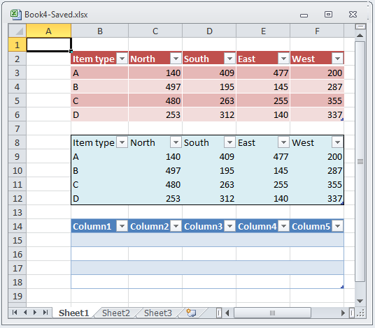

////
|metadata|
{
    "name": "igexcelengine-preserving-table-formatting-when-loading-excel-files",
    "controlName": ["IG Excel Engine"],
    "tags": ["How Do I"],
    "guid": "4cbe4d16-3306-4bda-bd0b-8c2938ba02c3",
    "buildFlags": [],
    "createdOn": "2012-03-29T07:27:33.92462Z"
}
|metadata|
////

= Preserving Table Formatting When Loading Excel Files (Infragistics Excel Engine)

== Topic Overview

=== Purpose

This topic demonstrates how you can preserve table formatting when loading Microsoft Excel files.

=== In this topic

This topic contains the following sections:

* <<_Introduction,Introduction>>
* <<_Code_Example_Preserving_Formatting_While_Loading_Excel_Tables,Code Example: Preserving Formatting While Loading Excel Tables>>
* <<_Related_Content,Related Content>>

[[_Introduction]]
== Introduction

=== Overview

Each table has an associated style which provides default format settings for cells in many different areas of the table. This style is represented by the link:{ApiPlatform}documents.excel.v{ProductVersion}~infragistics.documents.excel.worksheettablestyle~_ctor.html[WorksheetTableStyle] class and is exposed on a table through the `WorksheetTable` 's link:{ApiPlatform}documents.excel.v{ProductVersion}~infragistics.documents.excel.worksheettable~style.html[Style] property. Preserving `WorksheetTableStyle` is supported, so when you are loading Excel files, your table formatting will be preserved.

[[_Code_Example_Preserving_Formatting_While_Loading_Excel_Tables]]
== Code Example: Preserving Formatting While Loading Excel Tables

=== Description

Code snippet below shows how Microsoft Excel table formats are preserved. It loads a Microsoft Excel file with tables in it and saves it under a different name, so you are able to compare files and assure that formatting is preserved.

=== Preview

The following screenshot is a preview of the final result.

=== Prerequisites

* A Microsoft Excel file named Book4.xlsx with a worksheet saved at your C: hard drive.
* Random numbers in range C3:F6 and random names in range C2:F2 and B2:B6. Selection B2:F6 is formatted as Table with style Table Style Medium 3. This is done by selecting range and choosing Home $$->$$ Format as Table $$->$$ Table Style Medium 3.
* Random numbers in range C8:F12 and random names in range C8:F8 and B8:B12. Selection B8:F12 is formatted as table with custom style. You can create custom style by choosing Home $$->$$ Format as Table $$->$$ New Table Style…
* Empty table in region B14:F18. It is created by selecting B14:F18 and choosing Insert $$->$$ Table. Microsoft Excel chooses as default style  _Table Style Medium 2_  .

=== Code

The following code sample loads a Microsoft Excel file and saves it back under a different name.

*In Visual Basic:*

[source,vb]
----
' Load a Workbook with tables in it
Dim workbook As Infragistics.Documents.Excel.Workbook =
  Infragistics.Documents.Excel.Workbook.Load("C:\Book4.xlsx")
' Save the workbook under different name in order to compare with original source that table formats are preserved
workbook.Save("C:\Book4-TableFormatPreserved.xlsx")
----

*In C#:*

[source,csharp]
----
// Load a Workbook with tables in it
Infragistics.Documents.Excel.Workbook workbook =
  Infragistics.Documents.Excel.Workbook.Load("C:\\Book4.xlsx");
// Save the workbook under different name in order to compare with original source that table formats are preserved
workbook.Save("C:\\Book4-TableFormatPreserved.xlsx");
----

[[_Related_Content]]
== Related Content

=== Topics

The following topics provide additional information related to this topic.

[options="header", cols="a,a"]
|====
|Topic|Purpose

| link:igexcelengine-format-a-cell.html[Formatting a Cell (Infragistics Excel Engine)]
|The Infragistics Excel Engine allows you to customize the look and behavior of a cell.

| link:igexcelengine-support-named-tables-in-an-excel-spreadsheet.html[Supporting Named Tables in a Worksheet (Infragistics Excel Engine)]
|This topic describes table support in Infragistics Excel Engine. A table in Microsoft Excel is a named rectangular region of cells which contains related data organized into columns.

| link:igexcelengine-using-the-infragistics-excel-engine.html[Using the Infragistics Excel Engine]
|This section is your gateway to important task-based information that will help you to effectively use the various features and functionalities provided by the Infragistics Excel Engine.

|====

=== Resources

The following material (available outside the Infragistics family of content) provides additional information related to this topic.

[options="header", cols="a,a"]
|====
|Title|Purpose

| link:http://office.microsoft.com/en-us/excel-help/create-or-delete-an-excel-table-in-a-worksheet-HA010013764.aspx?CTT=1[Create or delete an Excel table in a worksheet]
|When you create a table (previously known as list) in a Microsoft Office Excel worksheet, you can manage and analyze the data in that table independently of data outside the table. For example, you can filter table columns, add a row for totals, apply table formatting, and publish a table to a server that is running Windows SharePoint Services 3.0.

|====