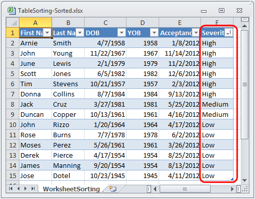
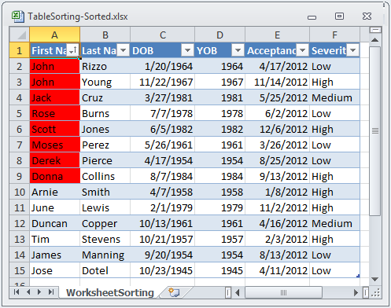

////
|metadata|
{
    "name": "igexcelengine-sorting-tables",
    "controlName": ["IG Excel Engine"],
    "tags": ["How Do I","Sorting"],
    "guid": "cd4b36fe-12a0-4d68-821b-677dd28321ae",
    "buildFlags": [],
    "createdOn": "2012-03-29T07:28:35.790806Z"
}
|metadata|
////

= Sorting Tables (Infragistics Excel Engine)

== Topic Overview

=== Purpose

This topic describes how to sort columns in exported tables. Columns in a table can be sorted by applying a sort condition to the `WorksheetTableColumn` 's link:{ApiPlatform}documents.excel.v{ProductVersion}~infragistics.documents.excel.worksheettablecolumn~sortcondition.html[SortCondition] property.

=== In this topic

This topic contains the following sections:

* <<_Introduction,Introduction>>
* <<_Code_Examples_Overview,Code Examples Overview>>
* <<_Code_Example_Ordered_Sort_Conditions,Code Example: Ordered Sort Conditions>>
* <<_Code_Example_Custom_List_Sort_Conditions,Code Example: Custom List Sort Conditions>>
* <<_Code_Example_Fill_Sort_Conditions,Code Example: Fill Sort Condition>>
* <<_Related_Content,Related Content>>

[[_Introduction]]
== Introduction

Sorting is done by setting a sorting condition on a table column. When a sorting condition is set on a column, all sort conditions in the table will be reevaluated to determine the order of the cells in the table. When cells need to be moved to meet their sort criteria, the entire row of cells in the table is moved as a unit. If the data in the table is subsequently changed, the sort condition will not be reevaluated.

The sort conditions in a table are only reapplied when sort conditions are added, removed, modified, or when the link:{ApiPlatform}documents.excel.v{ProductVersion}~infragistics.documents.excel.worksheettable~reapplysortconditions.html[ReapplySortConditions] methods is called on the table.

When sorting conditions are reevaluated, only the visible cells are sorted. All cells in hidden rows are kept in place.

In addition to accessing sort conditions from the table columns, they are also exposed off the `WorksheetTable`. link:{ApiPlatform}documents.excel.v{ProductVersion}~infragistics.documents.excel.worksheettable~sortsettings.html[SortSettings].`SortConditions` collection. This is an ordered collection of columns/sort condition pairs. The order of this collection is the precedence of the sorting. The first sort condition in the collection will be applied first, sorting all rows in the table by the values of the cells in the column sorted by that condition. If any groups of cells in that sorting have the same values, their rows are then sorted as a sub-group with the next sort condition, and so on.

The following sort condition types are available to set on columns:

[options="header", cols="a,a"]
|====
|Sort condition type|Description

| link:{ApiPlatform}documents.excel.v{ProductVersion}~infragistics.documents.excel.sorting.orderedsortcondition_members.html[OrderedSortCondition]
|Sort cells in an ascending or descending order based on their value.

| link:{ApiPlatform}documents.excel.v{ProductVersion}~infragistics.documents.excel.sorting.customlistsortcondition_members.html[CustomListSortCondition]
|Sort cells in a defined order based on their text or display value. This might be useful for sorting as they appear on the calendar or as they appear in a custom list defined by you, rather than alphabetically.

| link:{ApiPlatform}documents.excel.v{ProductVersion}~infragistics.documents.excel.sorting.fillsortcondition_members.html[FillSortCondition]
|Sort cells based on whether their fill is a specific pattern / gradient.

| link:{ApiPlatform}documents.excel.v{ProductVersion}~infragistics.documents.excel.sorting.fontcolorsortcondition_members.html[FontColorSortCondition]
|Sort cells based on whether their font is a specific color.

|====

There is also a `WorksheetTable.SortSettings` link:{ApiPlatform}documents.excel.v{ProductVersion}~infragistics.documents.excel.sorting.sortsettings%601~casesensitive.html[CaseSensitive] property which allows you to determine whether strings should be sorted case sensitively or not.

[[_Code_Examples_Overview]]
== Code Examples Overview

=== Overview

The following table lists the code examples included in this topic.

[options="header", cols="a,a"]
|====
|Example|Description

|Ordered Sort Condition
|This code example shows how to sort cells from a table in an ascending or descending order based on their value.

|Custom List Sort Condition
|This code example shows how to sort cells in a defined order based on their value.

|Fill Sort Condition
|This code example shows how to sort cells based on their background color.

|====

[[_Code_Example_Ordered_Sort_Conditions]]
== Code Example: Ordered Sort Conditions

=== Description

This code example shows how to sort cells from a table in an ascending order based on their value.

The code gets a named table using a helper class `ExcelExampleTable`. After that an ordered sort condition is created and applied to a column in a named table. Finally, the workbook with the sorted table is saved.

=== Prerequisites

This example uses a code snippet for programmatically creating a workbook. In the workbook a  _Patients_   named table is used. The code snippet can be found here: link:igexcelengine-creating-excel-named-table-code-example.html[Creating Excel Named Table Code Example]

=== Code

*In Visual Basic:*

[source,vb]
----
Dim workbook As Infragistics.Documents.Excel.Workbook = ExcelExampleTable.CreateExampleWorkbook()
' Get a table.
Dim table As Infragistics.Documents.Excel.WorksheetTable = workbook.GetTable("Patients")
' Create Sort Condition
Dim orderedSort As Infragistics.Documents.Excel.Sorting.SortCondition = New Infragistics.Documents.Excel.Sorting.OrderedSortCondition(Infragistics.Documents.Excel.Sorting.SortDirection.Ascending)
' Perform the sort
table.Columns("FirstName").SortCondition = orderedSort
' Save the workbook.
workbook.Save("C:\TableSorting-Sorted.xlsx")
----

*In C#:*

[source,csharp]
----
Infragistics.Documents.Excel.Workbook workbook = ExcelExampleTable.CreateExampleWorkbook();
// Get a table.
Infragistics.Documents.Excel.WorksheetTable table = workbook.GetTable("Patients");
// Create Sort Condition
Infragistics.Documents.Excel.Sorting.SortCondition orderedSort = new Infragistics.Documents.Excel.Sorting.OrderedSortCondition(
    Infragistics.Documents.Excel.Sorting.SortDirection.Ascending);
// Perform the sort
table.Columns["FirstName"].SortCondition = orderedSort;
// Save the workbook.
workbook.Save("C:\\TableSorting-Sorted.xlsx");
----

[[_Code_Example_Custom_List_Sort_Conditions]]
== Code Example: Custom List Sort Conditions

=== Description

This code example shows how to sort cells from a table in a defined order based on their value.

The code gets a named table using a helper class `ExcelExampleTable`. After that, a custom sort condition is created and applied to a column in the named table. Finally, the workbook with the sorted table is saved.

=== Prerequisites

This example uses a code snippet for programmatically creating a workbook. In the workbook a  _Patients_   named table is used. The code snippet can be found here: link:igexcelengine-creating-excel-named-table-code-example.html[Creating Excel Named Table Code Example]

=== Preview

The following screenshot is a preview of the final result.

=== Code

*In Visual Basic:*

[source,vb]
----
Dim workbook As Infragistics.Documents.Excel.Workbook = ExcelExampleTable.CreateExampleWorkbook()
' Get a table.
Dim table As Infragistics.Documents.Excel.WorksheetTable = workbook.GetTable("Patients")
' Create custom list sort condition
Dim customListSortCondition As New Infragistics.Documents.Excel.Sorting.CustomListSortCondition(Infragistics.Documents.Excel.Sorting.SortDirection.Ascending, New String() {"High", "Medium", "Low"})
' Perform the sort
table.Columns("Severity").SortCondition = customListSortCondition
workbook.Save("C:\TableSorting-Sorted.xlsx")
----

*In C#:*

[source,csharp]
----
Infragistics.Documents.Excel.Workbook workbook = ExcelExampleTable.CreateExampleWorkbook();
// Get a table.
Infragistics.Documents.Excel.WorksheetTable table = workbook.GetTable("Patients");
// Create custom list sort condition
Infragistics.Documents.Excel.Sorting.CustomListSortCondition customListSortCondition = new Infragistics.Documents.Excel.Sorting.CustomListSortCondition(
    Infragistics.Documents.Excel.Sorting.SortDirection.Ascending, new string[] { "High", "Medium", "Low" });
// Perform the sort
table.Columns["Severity"].SortCondition = customListSortCondition;
workbook.Save("C:\\TableSorting-Sorted.xlsx");
----

[[_Code_Example_Fill_Sort_Conditions]]
== Code Example: Fill Sort Condition

=== Description

This code example shows how to sort cells based on their background color.

The code gets a named table using a helper class `ExcelExampleTable`. After that, a fill sort condition is created and applied to a column in the named table. Finally, the workbook with the sorted table is saved.

=== Prerequisites

This example uses a code snippet for programmatically creating a workbook. In the workbook a  _Patients_   named table is used. The code snippet can be found here: link:igexcelengine-creating-excel-named-table-code-example.html[Creating Excel Named Table Code Example]

=== Preview

The following screenshot is a preview of the final result.

=== Code

*In Visual Basic:*

[source,vb]
----
Dim myWorkbook As Infragistics.Documents.Excel.Workbook = ExcelExampleTable.CreateExampleWorkbook()
' Get a table. Table is created in separate code snippet.
Dim table As Infragistics.Documents.Excel.WorksheetTable = myWorkbook.GetTable("Patients")
Dim lastRow As Integer = table.DataAreaRegion.LastRow
Dim rand As New Random()
' Set Red background for random cells from first column
Dim i As Integer = 1
While i < lastRow
 If rand.[Next](2) = 1 Then
        myWorkbook.Worksheets(0).Rows(i).Cells(0).CellFormat.Fill = _
            CellFill.CreateSolidFill(System.Windows.Media.Color.FromArgb(255, 255, 0, 0))
    End If
    i += 1
End While
' Create Background Color Sort Condition
Dim filterFill As Infragistics.Documents.Excel.CellFill = _
    CellFill.CreateSolidFill(System.Windows.Media.Color.FromArgb(255, 255, 0, 0))
Dim fillSortCondition As New _
    Infragistics.Documents.Excel.Sorting.FillSortCondition(filterFill, _
        Infragistics.Documents.Excel.Sorting.SortDirection.Ascending)
table.Columns(0).SortCondition = fillSortCondition
myWorkbook.Save("C:\TableSorting-Sorted.xlsx")
----

*In C#:*

[source,csharp]
----
Infragistics.Documents.Excel.Workbook myWorkbook = ExcelExampleTable.CreateExampleWorkbook();
// Get a table. Table is created in separate code snippet.
Infragistics.Documents.Excel.WorksheetTable table = myWorkbook.GetTable("Patients");
int lastRow = table.DataAreaRegion.LastRow;
Random rand = new Random();
// Set Red background for random cells from first column
for (int i = 1; i < lastRow; i++)
{
    if (rand.Next(2) == 1)
    {
        myWorkbook.Worksheets[0].Rows[i].Cells[0].CellFormat.Fill =
            CellFill.CreateSolidFill(System.Windows.Media.Color.FromArgb(255, 255, 0, 0));
    }
}
// Create Background Color Sort Condition
Infragistics.Documents.Excel.CellFill filterFill =
    CellFill.CreateSolidFill(System.Windows.Media.Color.FromArgb(255, 255, 0, 0));
Infragistics.Documents.Excel.Sorting.FillSortCondition fillSortCondition = new Infragistics.Documents.Excel.Sorting.FillSortCondition(
   filterFill, Infragistics.Documents.Excel.Sorting.SortDirection.Ascending);
table.Columns[0].SortCondition = fillSortCondition;
myWorkbook.Save("C:\\TableSorting-Sorted.xlsx");
----

[[_Related_Content]]
== Related Content

=== Topics

The following topics provide additional information related to this topic.

[options="header", cols="a,a"]
|====
|Topic|Purpose

| link:igexcelengine-support-named-tables-in-an-excel-spreadsheet.html[Supporting Named Tables in an Excel Worksheet (Infragistics Excel Engine)]
|This topic describes table support in Infragistics Excel Engine. A table in Microsoft Excel® is a named rectangular region of cells which contain related data organized into columns.

| link:igexcelengine-using-the-infragistics-excel-engine.html[Using the Infragistics Excel Engine]
|This section is your gateway to important task-based information that will help you to effectively use the various features and functionalities provided by the Infragistics Excel Engine.

|====

=== Samples

The following samples provide additional information related to this topic.

[options="header", cols="a,a"]
|====
|Sample|Purpose

| link:{SamplesURL}/infragistics-excel/named-tables[Named Tables]
|This sample demonstrates how to work with Named Tables in Excel. You can format worksheet regions as tables and specify a name for each table. Once configured you can get a table by name and specify styles to apply to a table. Further, you can get and set sort conditions and filters for each column of a table. Finally, you can specify different options - table style, column sort directions, column filters, and save the Excel file to see the applied settings.

|====