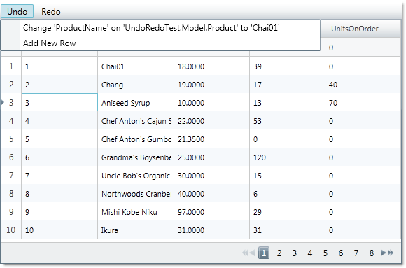

////
|metadata|
{
    "name": "implementing-undo-redo-crud-operations-in-xamgrid-control",
    "controlName": ["IG Undo Redo Framework"],
    "tags": ["Editing","Getting Started","Grids","How Do I"],
    "guid": "93099dbc-60c9-4905-bf09-ca581c0bfc97",
    "buildFlags": [],
    "createdOn": "2016-05-25T18:21:54.2091026Z"
}
|metadata|
////

= Implementing Undo/Redo CRUD Operations in xamGrid Control

== Topic Overview

=== Purpose

This topic demonstrates how the Infragistics Undo\Redo Framework™ can be used with the xamGrid™ control.

=== Required background

The following table lists the topics required as a prerequisite to understanding this topic.

[options="header", cols="a,a"]
|====
|Topic|Purpose

| link:undomanager-properties-and-methods-reference.html[UndoManager Properties and Methods Reference]
|This topic lists some of the important properties and methods of the UndoManager class.

| link:undohistoryitem-properties-and-methods-reference.html[UndoHistoryItem Properties and Methods Reference]
|This topic lists properties and methods of the UndoHistoryItem class.

| link:observablecollectionextendedwithundo-properties-reference.html[ObservableCollectionExtendedWithUndo Properties Reference]
|This topic lists some of the important properties and methods of the ObservableCollectionExtendedWithUndo class.

|====

=== In this topic

This topic contains the following sections:

* <<_implementing, Implementing Undo/Redo of End-User Operations in the xamGrid Control >>

** <<_Introduction,Introduction>>
** <<_Preview,Preview>>
** <<_Requirements,Requirements>>
** <<_Overview,Overview>>
** <<_Steps,Steps>>

* <<_Examples, Code Examples >>

** <<_Product,Code Example:  _Product_   Class>>
** <<_ProductViewModel,Code Example:  _ProductViewModel_   Class>>
** <<_ProductCollection,Code Example:  _ProductCollection_   Class>>
** <<_xamMenu,Code Example: Displaying Undo/Redo History with xamMenu Control>>
** <<_xamGrid,Code Example: Adding a xamGrid Control on Your Page>>
** <<_RowAdding,Code Example: Handling the xamGrid RowAdding Event>>

* <<_Related, Related Content >>

[[_implementing]]
== Implementing Undo/Redo of End-User Operations in the xamGrid Control

[[_Introduction]]

=== Introduction

The Infragistics Undo/Redo Framework provides support for undo/redo of end-user operations. The following example demonstrates how this functionality can be implemented along with the xamGrid control. Common operations as adding a new row, cells editing and rows deletion can be reverted.

[[_Preview]]

=== Preview

The following screenshot is a preview of the final result.

[[_Requirements]]

=== Requirements

To complete the procedure, you need the following:

* Added references to the following assemblies:

** {ApiPlatform}Undo.{DllVersion}
** {ApiPlatform}Controls.Grids.XamGrid.{DllVersion}
** {ApiPlatform}Controls.Menus.XamMenu.{DllVersion}
** {ApiPlatform}{DllVersion}

* Added link:resources-data.html[Data.xml] file (provided for you in your application)

[[_Overview]]

=== Overview

This topic takes you step-by-step toward implementing undo/redo of end-user operations in the xamGrid Control. The following is a conceptual overview of the process:

[start=1]
. <<_dataModel, Creating a data model that supports the undo/redo operations named Product >>
[start=2]
. <<_viewModel, Creating a viewmodel class that supports undo/redo operations named ProductViewModel >>
[start=3]
. <<_collection, Creating a collection class that derives from the ObservableCollectionExtendedWithUndo<T> class named ProductCollection >>
[start=4]
. <<_dataContext, Setting the DataContext property >>
[start=5]
. <<_addingMenu, Adding a xamMenu control that displays the undo/redo history items and performs undo/redo commands >>
[start=6]
. <<_addingGrid, Adding a xamGrid control that allows adding and deleting of rows and editing of cells >>
[start=7]
. <<_event, Handling the RowAdding event of the xamGrid control >>

[[_Steps]]

=== Steps

The following steps demonstrate how to implement undo/redo of end-user operations in the xamGrid Control.

. Create a data model that supports the undo/redo operations named Product.
+
The `Product` data model class inherits `ObservableModel` class that implements `INotifyPropertyChanged`.
+
For each property change, an `UndoUnit` instance is created.
+
See the <<_Product,Code Example:  _Product_   Class>> for more details.

. Create a viewmodel class that supports undo/redo operations named ProductViewModel.
+
In this class XML data is loaded and stored in `ProductCollection` that derives from `ObservableCollectionExtendedWithUndo` class.
+
See the <<_ProductViewModel,Code Example: _ProductViewModel_ Class>> for more details.

. Create a collection class that derives from the ObservableCollectionExtendedWithUndo class named ProductCollection.
+
In this class, `InsertItem` and `RemoveItem` methods are overridden and the collection is associated with the `UndoManager` instance.
+
See the <<_ProductCollection,Code Example: _ProductCollection_ Class>> for more details.

. Set the DataContext property
+
Instantiate the `ProductViewModel` and set it to the `DataContext` property.
+
*In C#:*
+
[source,csharp]
----
this.DataContext = new ProductViewModel();
----
+
*In Visual Basic:*
+
[source,vb]
----
Me.DataContext = New ProductViewModel()
----

. Add a xamMenu control that displays the undo/redo history items and performs undo/redo commands
+
Add a xamMenu control that displays the history items and use undo/redo commands.
+
See the <<_xamMenu,Code Example: Displaying Undo/Redo History with xamMenu Control>> for more details.

. Add a xamGrid control that allows adding and deleting of rows and editing of cells
+
Add a xamGrid control with adding a new row, editing and deleting features enabled.
+
See the <<_xamGrid,Code Example: Adding a xamGrid Control on Your Page>> for more details.

. Handle the RowAdding event of the xamGrid control
+
In the RowAdding event handler several operations are united into one using a transaction. This way the users can undo/redo adding a new row as one operation.
+
See the <<_RowAdding,Code Example: Handling the xamGrid RowAdding Event>> for more details.

[[_Examples]]
== Code Examples

=== Overview

The following table lists the code examples included in this topic.

[options="header", cols="a,a"]
|====
|Example|Description

|<<_Product,Code Example: _Product_ Class>>
|Data model class that supports undo/redo of property changes.

|<<_ProductViewModel,Code Example: _ProductViewModel_ Class>>
|`Viewmodel` class that supports recording of the changes in the collection.

|<<_ProductCollection,Code Example: _ProductCollection_ Class>>
|Derived class from `ObservableCollectionExtendedWithUndo` class.

|<<_xamMenu,Code Example: Displaying Undo/Redo History with xamMenu Control>>
|XAML code for adding a xamMenu control with undo/redo functionality implemented.

|<<_xamGrid,Code Example: Adding a xamGrid Control on Your Page>>
|XAML code for adding a xamGrid control.

|<<_RowAdding,Code Example: Handling the xamGrid RowAdding Event>>
|Handling the `RowAdding` event.

|====

[[_Product]]
== Code Example:  _Product_   Class

=== Description

A data model class that supports undo/redo of property changes.

=== Code

*In C#:*

[source,csharp]
----
public class Product : ObservableModel
{
    private object _owner;
    internal object Owner
    {
        get { return _owner; }
        set { _owner = value; }
    }
    private int _productID;
    public int ProductID
    {
        get { return _productID; }
        set { this.SetField(ref _productID, value, "ProductID"); }
    }
    private string _productName;
    public string ProductName
    {
        get { return _productName; }
        set { this.SetField(ref _productName, value, "ProductName"); }     
    }
    private decimal _unitPrice;
    public decimal UnitPrice
    {
        get { return _unitPrice; }
        set { this.SetField(ref _unitPrice, value, "UnitPrice"); }
    }
    private int _unitsInStock;
    public int UnitsInStock
    {
        get { return _unitsInStock; }
        set { this.SetField(ref _unitsInStock, value, "UnitsInStock"); }
    }
    private int _unitsOnOrder;
    public int UnitsOnOrder
    {
        get { return _unitsOnOrder; }
        set { this.SetField(ref _unitsOnOrder, value, "UnitsOnOrder"); }
    }
    protected bool SetField<T>(ref T member, T newValue, string propertyName)
    {
        if (EqualityComparer<T>.Default.Equals(member, newValue))
            return false;
        if (_owner != null)
            UndoManager.FromReference(_owner).AddPropertyChange(this, propertyName, member, newValue);
        member = newValue;
        this.NotifyPropertyChanged(propertyName);
        return true;
    }
} 
public class ObservableModel : INotifyPropertyChanged
{
    public event PropertyChangedEventHandler PropertyChanged;
    protected void NotifyPropertyChanged(String info)
    {
        if (PropertyChanged != null)
        {
            PropertyChanged(this, new PropertyChangedEventArgs(info));
        }
    }
}
----

*In Visual Basic:*

[source,vb]
----
Public Class Product
    Inherits ObservableModel
    Private _owner As Object
    Friend Property Owner() As Object
        Get
            Return _owner
        End Get
        Set(value As Object)
            _owner = value
        End Set
    End Property
    Private _productID As Integer
    Public Property ProductID() As Integer
        Get
            Return _productID
        End Get
        Set(value As Integer)
            Me.SetField(_productID, value, "ProductID")
        End Set
    End Property
    Private _productName As String
    Public Property ProductName() As String
        Get
            Return _productName
        End Get
        Set(value As String)
            Me.SetField(_productName, value, "ProductName")
        End Set
    End Property
    Private _unitPrice As Decimal
    Public Property UnitPrice() As Decimal
        Get
            Return _unitPrice
        End Get
        Set(value As Decimal)
            Me.SetField(_unitPrice, value, "UnitPrice")
        End Set
    End Property
    Private _unitsInStock As Integer
    Public Property UnitsInStock() As Integer
        Get
            Return _unitsInStock
        End Get
        Set(value As Integer)
            Me.SetField(_unitsInStock, value, "UnitsInStock")
        End Set
    End Property
    Private _unitsOnOrder As Integer
    Public Property UnitsOnOrder() As Integer
        Get
            Return _unitsOnOrder
        End Get
        Set(value As Integer)
            Me.SetField(_unitsOnOrder, value, "UnitsOnOrder")
        End Set
    End Property
    Protected Function SetField(Of T)(ByRef member As T, newValue As T, propertyName As String) As Boolean
        If EqualityComparer(Of T).[Default].Equals(member, newValue) Then
            Return False
        End If
        If _owner IsNot Nothing Then
            UndoManager.FromReference(_owner).AddPropertyChange(Me, propertyName, member, newValue)
        End If
        member = newValue
        Me.NotifyPropertyChanged(propertyName)
        Return True
    End Function
End Class
Public Class ObservableModel
    Implements INotifyPropertyChanged
    Public Event PropertyChanged(ByVal sender As Object, ByVal e As PropertyChangedEventArgs) Implements INotifyPropertyChanged.PropertyChanged
    Protected Overridable Sub NotifyPropertyChanged(ByVal propertyName As String)
        RaiseEvent PropertyChanged(Me, New PropertyChangedEventArgs(propertyName))
    End Sub
End Class
----

[[_ProductViewModel]]
== Code Example:  _ProductViewModel_   Class

=== Description

A viewmodel class that supports recording of the changes in the collection.

=== Code

*In C#:*

[source,csharp]
----
public class ProductViewModel : ObservableModel
{
    private ProductCollection _products;
    private UndoManager _undoManager;
    public UndoManager UndoManager
    {
        get { return _undoManager; }
    }
    private CollectionViewSource _viewSource;
    public ICollectionView Products
    {
        get { return _viewSource.View; }
    }
    public ProductViewModel()
    {
        _undoManager = new UndoManager();
        _undoManager.RegisterReference(this);
        _products = new ProductCollection(_undoManager);      
        // Suspend recording of UndoUnits in the history while data is loading
        UndoManager.Suspend();
        try
        {
            this.LoadXMLData();
        }
        finally
        {
            // Resume recording in history
            UndoManager.Resume();
        }
        _viewSource = new CollectionViewSource();
        _viewSource.Source = _products;
        this.Products.MoveCurrentToFirst();
    }
    private void LoadXMLData()
    {
        XDocument doc = XDocument.Load("Data.xml");
        var data = (from d in doc.Descendants("Product")
                    select new Product
                    {
                        ProductID = this.GetInt(d.Element("ProductID").Value),
                        ProductName = d.Element("ProductName").Value,
                        UnitPrice = this.GetDecimal(d.Element("UnitPrice").Value),
                        UnitsInStock = this.GetInt(d.Element("UnitsInStock").Value),
                        UnitsOnOrder = this.GetInt(d.Element("UnitsOnOrder").Value)
                    });
        foreach (var productItem in data)
        {
            _products.Add(productItem);
        }
    }    
    private int GetInt(string element)
    {
        int value = 0;
        if (element != null)
            int.TryParse(element, out value);
        return value;
    }
    private decimal GetDecimal(string element)
    {
        decimal value = 0m;
        if (element != null)
            decimal.TryParse(element, out value);
        return value;
    }
}
----

*In Visual Basic:*

[source,vb]
----
Public Class ProductViewModel
    Inherits ObservableModel
    Private _products As ProductCollection
    Private _undoManager As UndoManager
    Public ReadOnly Property UndoManager() As UndoManager
        Get
            Return _undoManager
        End Get
    End Property
    Private _viewSource As CollectionViewSource
    Public ReadOnly Property Products() As ICollectionView
        Get
            Return _viewSource.View
        End Get
    End Property
    Public Sub New()
        _undoManager = New UndoManager()
        _undoManager.RegisterReference(Me)
        _products = New ProductCollection(_undoManager)
        UndoManager.Suspend()
        Try
            Me.LoadXMLData()
        Finally
            UndoManager.[Resume]()
        End Try
        _viewSource = New CollectionViewSource()
        _viewSource.Source = _products
        Me.Products.MoveCurrentToFirst()
    End Sub
    Private Sub LoadXMLData()
        Dim doc As XDocument = XDocument.Load("Data.xml")
        Dim data = (From d In doc.Descendants("Product")
                    Select New Product With
                    {
                        .ProductID = Me.GetInt(d.Element("ProductID").Value),
                        .ProductName = d.Element("ProductName").Value,
                        .UnitPrice = Me.GetDecimal(d.Element("UnitPrice").Value),
                        .UnitsInStock = Me.GetInt(d.Element("UnitsInStock").Value),
                        .UnitsOnOrder = Me.GetInt(d.Element("UnitsOnOrder").Value)
                    })
        For Each productItem In data
            _products.Add(productItem)
        Next
    End Sub
    Private Function GetInt(element As String) As Integer
        Dim value As Integer = 0
        If element IsNot Nothing Then
            Integer.TryParse(element, value)
        End If
        Return value
    End Function
    Private Function GetDecimal(element As String) As Decimal
        Dim value As Decimal = 0D
        If element IsNot Nothing Then
            Decimal.TryParse(element, value)
        End If
        Return value
    End Function
End Class
----

[[_ProductCollection]]
== Example:  _ProductCollection_   Class

=== Description

A derived class from the Undo\Redo framework ObservableCollectionExtendedWithUndo class

=== Code

*In C#:*

[source,csharp]
----
public class ProductCollection : ObservableCollectionExtendedWithUndo<Product>
{
    public ProductCollection(UndoManager undoManager)
        : base(undoManager)
    {
        undoManager.RegisterReference(this);
    }
    protected override void InsertItem(int index, Product item)
    {
        item.Owner = this;
        base.InsertItem(index, item);
    }
    protected override void RemoveItem(int index)
    {
        Product item = this[index];
        item.Owner = null;
        base.RemoveItem(index);
    }
}
----

*In Visual Basic:*

[source,vb]
----
Public Class ProductCollection
    Inherits ObservableCollectionExtendedWithUndo(Of Product)
    Public Sub New(undoManager As UndoManager)
        MyBase.New(undoManager)
        undoManager.RegisterReference(Me)
    End Sub
    Protected Overrides Sub InsertItem(index As Integer, item As Product)
        item.Owner = Me
        MyBase.InsertItem(index, item)
    End Sub
    Protected Overrides Sub RemoveItem(index As Integer)
        Dim item As Product = Me(index)
        item.Owner = Nothing
        MyBase.RemoveItem(index)
    End Sub
End Class
----

[[_xamMenu]]
== Code Example: Displaying Undo/Redo History with xamMenu Control

=== Description

The XAML code for adding a xamMenu control with undo/redo functionality implemented.

The xamMenu items represents history items that can be reverted.

=== Code

*In XAML:*

[source,xaml]
----
Code
<ig:XamMenu Grid.Row="0">
  <ig:XamMenu.Resources>
    <DataTemplate x:Key="historyItemTemplate">
      <TextBlock Text="{Binding LongDescription}" />
    </DataTemplate>
    <DataTemplate x:Key="undoRedoMenuItem">
      <ig:XamMenuItem>
        <ig:Commanding.Command>
          <ig:UndoManagerCommandSource CommandType="UndoRedoHistoryItem" 
                                       ParameterBinding="{Binding}" 
                                       EventName="Click" />
        </ig:Commanding.Command>
      </ig:XamMenuItem>
    </DataTemplate>
  </ig:XamMenu.Resources>
  <ig:XamMenuItem Header="Undo"
                  IsEnabled="{Binding UndoManager.CanUndo}"
                  ItemsSource="{Binding UndoManager.UndoHistory}"
                  DefaultItemsContainer="{StaticResource undoRedoMenuItem}"
                  ItemTemplate="{StaticResource historyItemTemplate}">
    <ig:Commanding.Command>
      <ig:UndoManagerCommandSource EventName="SubmenuOpened" 
                                   CommandType="PreventMerge" 
                                   ParameterBinding="{Binding UndoManager}" />
    </ig:Commanding.Command>
  </ig:XamMenuItem>
  <ig:XamMenuItem Header="Redo" 
                  IsEnabled="{Binding UndoManager.CanRedo}"
                  ItemsSource="{Binding UndoManager.RedoHistory}"
                  DefaultItemsContainer="{StaticResource undoRedoMenuItem}"
                  ItemTemplate="{StaticResource historyItemTemplate}" />
</ig:XamMenu>
----

[[_xamGrid]]
== Code Example: Adding a xamGrid Control on Your Page

=== Description

The following code demonstrates adding a xamGrid control that allows CRUD operations – adding a new row, cells editing and deletion of a row.

The xamGrid control `Item``s``Source` property is binded to the `ProductViewModel Products` member containing an `ICollectionView` data collection enabled for undo/redo.

The xamGrid `DeleteKeyAction` property is set to `DeleteSelectedRows` to delete all selected rows when the Delete key is pressed.

All key functionality that is needed to interact with data is enabled – adding a new row, cells editing, multiple rows selection, deletion of rows and paging.

The operations on data – creation, editing and deleting can be reverted with the Undo/Redo framework.

=== Code

*In XAML:*

[source,xaml]
----
<ig:XamGrid x:Name="dataGrid" Grid.Row="1"
            AutoGenerateColumns="True"
            ItemsSource="{Binding Products}"
            DeleteKeyAction="DeleteSelectedRows"
            RowAdding="dataGrid_RowAdding"
            ColumnWidth="*">
  <!-- Enabling the adding of a new row -->
  <ig:XamGrid.AddNewRowSettings>
    <ig:AddNewRowSettings AllowAddNewRow="Top" />
  </ig:XamGrid.AddNewRowSettings>
  <!-- Enabling the cell editing on double mouse click -->
  <ig:XamGrid.EditingSettings>
    <ig:EditingSettings AllowEditing="Cell" 
                        IsMouseActionEditingEnabled="DoubleClick" />
  </ig:XamGrid.EditingSettings>
  <!-- Adding row selector -->
  <ig:XamGrid.RowSelectorSettings>
    <ig:RowSelectorSettings Visibility="Visible" />
  </ig:XamGrid.RowSelectorSettings>
  <!-- Enabling a multiple rows selection -->
  <ig:XamGrid.SelectionSettings>
    <ig:SelectionSettings RowSelection="Multiple" />
  </ig:XamGrid.SelectionSettings>
  <!-- Adding a pager -->
  <ig:XamGrid.PagerSettings>
    <ig:PagerSettings AllowPaging="Bottom" PageSize="10" /> 
  </ig:XamGrid.PagerSettings>
</ig:XamGrid>
----

[[_RowAdding]]
== Code Example: Handling the xamGrid RowAdding Event

=== Description

Adding a row into the xamGrid contains of several end-user actions (for example – typing values in the  _Add new_   row’s cells). These actions has to be united with a transaction in order to have one action that can be reverted.

=== Code

*In C#:*

[source,csharp]
----
private void dataGrid_RowAdding(object sender, Infragistics.Controls.Grids.CancellableRowAddingEventArgs e)
{
    string description = "";
    string detailedDescription = "Add New Row";
    // Group several undo units into one item
    UndoTransaction transaction = this._undoManager.StartTransaction(description, detailedDescription);
    new DispatcherSynchronizationContext().Post(new SendOrPostCallback(CommitTransaction), transaction);
}
private void CommitTransaction(object obj)
{
    if (obj != null)
    { 
        UndoTransaction transaction = obj as UndoTransaction;
        if (!transaction.IsClosed)
        { 
            transaction.Commit();
        }
    }
}
private UndoManager _undoManager
{
    get { return ((ProductViewModel)this.DataContext).UndoManager; }
}
----

*In Visual Basic:*

[source,vb]
----
Private Sub dataGrid_RowAdding(sender As Object, e As Infragistics.Controls.Grids.CancellableRowAddingEventArgs)
    Dim description As String = ""
    Dim detailedDescription As String = "Add New Row"
    ' Group several undo units into one item
    Dim transaction As UndoTransaction = Me._undoManager.StartTransaction(description, detailedDescription)
    Dim sendOrPostCallback As New SendOrPostCallback(AddressOf CommitTransaction)
    Dim dispatcher As New DispatcherSynchronizationContext()
    dispatcher.Post(sendOrPostCallback, transaction)
End Sub
Private Sub CommitTransaction(obj As Object)
    If obj IsNot Nothing Then
        Dim transaction As UndoTransaction = TryCast(obj, UndoTransaction)
        If Not transaction.IsClosed Then
            transaction.Commit()
        End If
    End If
End Sub
Private ReadOnly Property _undoManager() As UndoManager
    Get
        Return DirectCast(Me.DataContext, ProductViewModel).UndoManager
    End Get
End Property
----

[[_Related]]
== Related Content

=== Topics

The following topics provide additional information related to this topic.

[options="header", cols="a,a"]
|====
|Topic|Purpose

| link:methods-and-properties-reference.html[Undo/Redo Framework Methods and Properties Reference]
|This topic provides an overview of the major classes, their properties and methods available in the Infragistics Undo/Redo Framework™.

|====

ifdef::sl[]

=== Samples

ifdef::sl[]

The following samples provide additional information related to this topic.

[options="header", cols="a,a"]
|====
|pick:[sl="Sample"] |pick:[sl="Purpose"] 

|pick:[sl=" link:{SamplesURL}/undo/#/undo-redo-crud-operations-in-xamgrid[Undo/Redo CRUD Operations in xamGrid]"]
|
ifdef::sl[] 

This sample demonstrates how the Undo Redo Framework is used with the xamGrid control. 

endif::sl[]

|pick:[sl=" link:{SamplesURL}/undo/#/undo-redo-operations-history-in-xamgrid[Undo/Redo Operations History in xamGrid]"]
|
ifdef::sl[] 

This sample demonstrates how a history of undo and redo operations can be preserved. 

endif::sl[]

|====

endif::sl[]

endif::sl[]