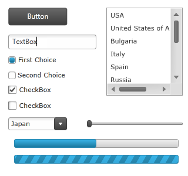
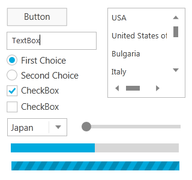
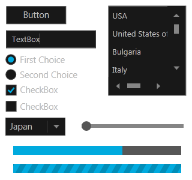
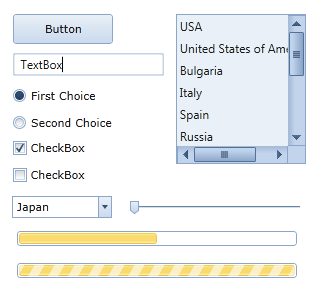
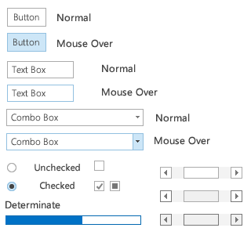
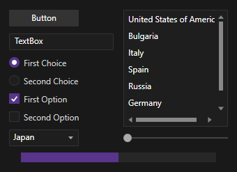

////
|metadata|
{
    "name": "ms-controls-implicit-themes",
    "controlName": [],
    "tags": ["How Do I","Styling","Summaries","Templating","Theming"],
    "guid": "1edce14d-b754-4890-b6c7-033a0c96b177","buildFlags": ["sl","wpf"],
    "createdOn": "2013-09-20T08:45:29.7971324Z"
}
|metadata|
////

= MS Controls Implicit Themes

== Topic Overview

=== Purpose

This topic explains the implicit themes for Microsoft controls.

=== Required background

The following topic is a prerequisite to understanding this topic:

[options="header", cols="a,a"]
|====
|Topic|Purpose

| link:designers-guide-what-is-a-theme.html[What is a Theme]
|This topic explains the themes in general.

|====

=== In this topic

This topic contains the following sections:

* <<_Ref357524354,Introduction>>
* <<_Ref357524361,IG Theme>>
* <<_Ref357524367,Metro Theme>>
* <<_Ref357524373,Metro Dark Theme>>
* <<_Ref357524378,Office 2010 Blue Theme>>
* <<_Ref357524379,Office 2013 Theme>>
* <<_Ref357524380,Royal Dark Theme>>
* <<_Ref357524381,Related Content>>

[[_Ref357524354]]
== Introduction

=== Summary

In addition to the themes provided for all {ProductName} controls, Infragistics provides implicit themes for all Microsoft controls allowing you to use these themes for the convenience of keeping your application styling consistency when using both Infragistics and Microsoft controls in the same application. The themes definitions spread across several files that must be included in your project in order to implement a theme. The files you will have to include depend of the Microsoft controls you want to use, for example, the core Microsoft controls and the toolkit controls have their Infragistics themes defined in separate files.

[[_Ref357524361]]
== IG Theme

=== Overview

The following screenshot demonstrates several Microsoft controls using the IG theme:

=== Resource dictionaries

To use this theme you have to include the following resource dictionaries in your project:

* *IG.MSControls.Core.Implicit.xaml* for the controls from the following XML namespace:
+
----
http://schemas.microsoft.com/winfx/2006/xaml/presentation
----
* *IG.MSControls.Toolkit.Implicit.xaml* for the controls from the following XML namespace:
+
----
http://schemas.microsoft.com/winfx/2006/xaml/presentation/toolkit
----
* *Styles.Shared.xaml* 
* *Styles.WPF.xaml* 
* *Theme.Colors.xaml* 

=== Code Example

The following code snippet shows how to include the resource dictionaries in order to use the theme:

*In XAML:*

[source,xaml]
----
<Grid x:Name="LayoutRoot">
  <Grid.Resources>
    <ResourceDictionary>
      <ResourceDictionary.MergedDictionaries>
        <ResourceDictionary Source="IG.MSControls.Core.Implicit.xaml" />
        <ResourceDictionary Source="IG.MSControls.Toolkit.Implicit.xaml" />
      </ResourceDictionary.MergedDictionaries>
    </ResourceDictionary>
  </Grid.Resources>
  <!-- Put controls here -->
</Grid>
----

[[_Ref357524367]]
== Metro Theme

=== Overview

The following screenshot demonstrates several Microsoft controls using the Metro theme:

=== Property settings

To use this theme you have to include the following resource dictionaries in your project:

* *Metro.MSControls.Core.Implicit.xaml* for the controls from the following XML namespace:
+
----
http://schemas.microsoft.com/winfx/2006/xaml/presentation
----
* *Metro.MSControls.Toolkit.Implicit.xaml* for the controls from the following XML namespace:
+
----
http://schemas.microsoft.com/winfx/2006/xaml/presentation/toolkit
----
* *Styles.Shared.xaml* 
* *Styles.WPF.xaml* 
* *Theme.Colors.xaml* 

=== Code example

The following code snippet shows how to include the resource dictionaries in order to use the theme:

*In XAML:*

[source,xaml]
----
<Grid x:Name="LayoutRoot">
  <Grid.Resources>
    <ResourceDictionary>
      <ResourceDictionary.MergedDictionaries>
        <ResourceDictionary Source="Metro.MSControls.Core.Implicit.xaml" />
        <ResourceDictionary Source="Metro.MSControls.Toolkit.Implicit.xaml" />
      </ResourceDictionary.MergedDictionaries>
    </ResourceDictionary>
  </Grid.Resources>
  <!-- Put controls here -->
</Grid>
----

[[_Ref357524373]]
== Metro Dark Theme

=== Overview

The following screenshot demonstrates several Microsoft controls using the Metro Dark theme:

=== Property settings

To use this theme you have to include the following resource dictionaries in your project:

* *MetroDark.MSControls.Core.Implicit.xaml* for the controls from the following XML namespace:
+
----
http://schemas.microsoft.com/winfx/2006/xaml/presentation
----
* *MetroDark.MSControls.Toolkit.Implicit.xaml* for the controls from the following XML namespace:
+
----
http://schemas.microsoft.com/winfx/2006/xaml/presentation/toolkit
----
* *Styles.Shared.xaml* 
* *Styles.WPF.xaml* 
* *Theme.Colors.xaml* 

=== Code example

The following code snippet shows how to include the resource dictionaries in order to use the theme:

*In XAML:*

[source,xaml]
----
<Grid x:Name="LayoutRoot">
  <Grid.Resources>
    <ResourceDictionary>
      <ResourceDictionary.MergedDictionaries>
        <ResourceDictionary Source="MetroDark.MSControls.Core.Implicit.xaml" />
        <ResourceDictionary Source="MetroDark.MSControls.Toolkit.Implicit.xaml" />
      </ResourceDictionary.MergedDictionaries>
    </ResourceDictionary>
  </Grid.Resources>
  <!-- Put controls here -->
</Grid>
----

[[_Ref357524378]]
== Office 2010 Blue Theme

=== Overview

The following screenshot demonstrates several Microsoft controls using the Office 2010 Blue theme:

=== Resource dictionaries

To use this theme you have to include the following resource dictionaries in your project:

* *Office2010Blue.MSControls.Core.Implicit.xaml* for the controls from the following XML namespace:
+
----
http://schemas.microsoft.com/winfx/2006/xaml/presentation
----
* *Office2010Blue.MSControls.Toolkit.Implicit.xaml* for the controls from the following XML namespace:
+
----
http://schemas.microsoft.com/winfx/2006/xaml/presentation/toolkit
----
* *Styles.Shared.xaml* 
* *Styles.WPF.xaml* 
* *Theme.Colors.xaml* 

=== Code example

The following code snippet shows how to include the resource dictionaries in order to use the theme:

*In XAML:*

[source,xaml]
----
<Grid x:Name="LayoutRoot">
  <Grid.Resources>
    <ResourceDictionary>
      <ResourceDictionary.MergedDictionaries>
        <ResourceDictionary Source="Office2010Blue.MSControls.Core.Implicit.xaml" />
        <ResourceDictionary Source="Office2010Blue.MSControls.Toolkit.Implicit.xaml" />
      </ResourceDictionary.MergedDictionaries>
    </ResourceDictionary>
  </Grid.Resources>
  <!-- Put controls here -->
</Grid>
----

[[_Ref357524379]]
== Office 2013 Theme

=== Overview

The following screenshot demonstrates several Microsoft controls using the Office 2013 theme:

=== Resource dictionaries

To use this theme you have to include the following resource dictionaries in your project:

* *Office2013.MSControls.Core.Implicit.xaml* for the controls from the following XML namespace:
+
----
http://schemas.microsoft.com/winfx/2006/xaml/presentation
----
* *Office2013.MSControls.Toolkit.Implicit.xaml* for the controls from the following XML namespace:
+
----
http://schemas.microsoft.com/winfx/2006/xaml/presentation/toolkit
----
* *Styles.Shared.xaml* 
* *Styles.WPF.xaml* 
* *Theme.Colors.xaml* 

=== Code example

The following code snippet shows how to include the resource dictionaries in order to use the theme:

*In XAML:*

[source,xaml]
----
<Grid x:Name="LayoutRoot">
  <Grid.Resources>
    <ResourceDictionary>
      <ResourceDictionary.MergedDictionaries>
        <ResourceDictionary Source="Office2013.MSControls.Core.Implicit.xaml" />
        <ResourceDictionary Source="Office2013.MSControls.Toolkit.Implicit.xaml" />
	  </ResourceDictionary.MergedDictionaries>
    </ResourceDictionary>
  </Grid.Resources>
  <!-- Put controls here -->
</Grid>
----

[[_Ref357524380]]
== Royal Dark Theme

=== Overview

The following screenshot demonstrates several Microsoft controls using the Royal Dark theme:

=== Resource dictionaries

To use this theme you have to include the following resource dictionaries in your project:

* *RoyalDark.MSControls.Core.Implicit.xaml* for the controls from the following XML namespace:
+
----
http://schemas.microsoft.com/winfx/2006/xaml/presentation
----
* *RoyalDark.MSControls.Toolkit.Implicit.xaml* for the controls from the following XML namespace:
+
----
http://schemas.microsoft.com/winfx/2006/xaml/presentation/toolkit
----
* *Styles.Shared.xaml* 
* *Styles.WPF.xaml* 
* *Theme.Colors.xaml* 

=== Code example

The following code snippet shows how to include the resource dictionaries in order to use the theme:

*In XAML:*

[source,xaml]
----
<Grid x:Name="LayoutRoot">
  <Grid.Resources>
    <ResourceDictionary>
      <ResourceDictionary.MergedDictionaries>
        <ResourceDictionary Source="RoyalDark.MSControls.Core.Implicit.xaml" />
        <ResourceDictionary Source="RoyalDark.MSControls.Toolkit.Implicit.xaml" />
      </ResourceDictionary.MergedDictionaries>
    </ResourceDictionary>
  </Grid.Resources>
  <!-- Put controls here -->
</Grid>
----

[[_Ref357524381]]
== Related Content

=== Topics

The following topics provide additional information related to this topic.

[options="header", cols="a,a"]
|====
|Topic|Purpose

| link:designers-guide-using-themes.html[Using Themes]
|This topic explains how to apply a theme.

| link:designersguide-location-of-generic-xaml-file.html[Location of Generic.xaml File]
|This topic lists the current location of the default theme.

|====

=== Resources

The following material provides additional information related to this topic.

[options="header", cols="a,a"]
|====
|Title|Purpose

| link:http://www.infragistics.com/community/blogs/blagunas/archive/2013/05/25/free-metro-light-and-dark-themes-for-wpf-and-silverlight-microsoft-controls.aspx[FREE Metro Light and Dark Themes for WPF and Silverlight Microsoft Controls]
|A blog post describing the Metro Light and Metro Dark themes.

|====