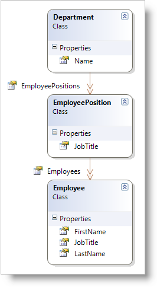

////

|metadata|
{
    "name": "resources-departmentviewmodel",
    "controlName": [],
    "tags": ["Sample Data Source"],
    "guid": "51c4df24-5ebb-486d-9021-94ed16cc97c7",  
    "buildFlags": [],
    "createdOn": "2016-05-25T18:21:53.3250529Z"
}
|metadata|
////

= Department View Model

*In Visual Basic:*

----
Imports System.Collections.ObjectModel
Namespace UsingXamOrgChart
    Public Class Department
        Public Sub New(name As String)
            Me.Name = name
            Me.EmployeePositions = New ObservableCollection(Of EmployeePosition)()
        End Sub
        Public Property Name() As String
            Get
                Return m_Name
            End Get
            Set
                m_Name = Value
            End Set
        End Property
        Private m_Name As String
        Public Property EmployeePositions() As ObservableCollection(Of EmployeePosition)
            Get
                Return m_EmployeePositions
            End Get
            Set
                m_EmployeePositions = Value
            End Set
        End Property
        Private m_EmployeePositions As ObservableCollection(Of EmployeePosition)
    End Class
    Public Class EmployeePosition
        Public Sub New(jobTitle As String)
            Me.JobTitle = jobTitle
            Me.Employees = New ObservableCollection(Of Employee)()
        End Sub
        Public Property JobTitle() As String
            Get
                Return m_JobTitle
            End Get
            Set
                m_JobTitle = Value
            End Set
        End Property
        Private m_JobTitle As String
        Public Property Employees() As ObservableCollection(Of Employee)
            Get
                Return m_Employees
            End Get
            Set
                m_Employees = Value
            End Set
        End Property
        Private m_Employees As ObservableCollection(Of Employee)
    End Class
    Public Class Employee
        Public Sub New(firstName As String, lastName As String, jobTitle As String)
            Me.FirstName = firstName
            Me.LastName = lastName
            Me.JobTitle = jobTitle
        End Sub
        Public Property FirstName() As String
            Get
                Return m_FirstName
            End Get
            Set
                m_FirstName = Value
            End Set
        End Property
        Private m_FirstName As String
        Public Property LastName() As String
            Get
                Return m_LastName
            End Get
            Set
                m_LastName = Value
            End Set
        End Property
        Private m_LastName As String
        Public Property JobTitle() As String
            Get
                Return m_JobTitle
            End Get
            Set
                m_JobTitle = Value
            End Set
        End Property
        Private m_JobTitle As String
    End Class
    Public Class DepartmentViewModel
        Public Property Departments() As ObservableCollection(Of Department)
            Get
                Return m_Departments
            End Get
            Set
                m_Departments = Value
            End Set
        End Property
        Private m_Departments As ObservableCollection(Of Department)
        Public Sub New()
            Dim employee1 As New Employee("Rob", "Walters", "Senior Tool Designer")
            Dim employee2 As New Employee("Ovidiu", "Cracium", "Senior Tool Designer")
            Dim employee3 As New Employee("Thierry", "D'Hers", "Tool Designer")
            Dim employee4 As New Employee("Janice", "Galvin", "Tool Designer")
            Dim position1 As New EmployeePosition("Senior Tool Designer")
            position1.Employees.Add(employee1)
            position1.Employees.Add(employee2)
            Dim position2 As New EmployeePosition("Tool Designer")
            position2.Employees.Add(employee3)
            position2.Employees.Add(employee4)
            Dim department1 As New Department("Tool Design")
            department1.EmployeePositions.Add(position1)
            department1.EmployeePositions.Add(position2)
            Me.Departments = New ObservableCollection(Of Department)()
            Me.Departments.Add(department1)
        End Sub
    End Class
End Namespace
----

*In C#:*

----
using System.Collections.ObjectModel;
namespace UsingXamOrgChart
{
    public class Department
    {
        public Department(string name)
        {
            this.Name = name;
            this.EmployeePositions = new ObservableCollection<EmployeePosition>();
        }
        public string Name { get; set; }
        public ObservableCollection<EmployeePosition> EmployeePositions { get; set; }
    }
    public class EmployeePosition
    {
        public EmployeePosition(string jobTitle)
        {
            this.JobTitle = jobTitle;
            this.Employees = new ObservableCollection<Employee>();
        }
        public string JobTitle { get; set; }
        public ObservableCollection<Employee> Employees { get; set; }
    }
    public class Employee
    {
        public Employee(string firstName, string lastName, string jobTitle)
        {
            this.FirstName = firstName;
            this.LastName = lastName;
            this.JobTitle = jobTitle;
        }
        public string FirstName { get; set; }
        public string LastName { get; set; }
        public string JobTitle { get; set; }
    }
    public class DepartmentViewModel
    {
        public ObservableCollection<Department> Departments { get; set; }
        public DepartmentViewModel()
        {
            Employee employee1 = new Employee("Rob", "Walters", "Senior Tool Designer");
            Employee employee2 = new Employee("Ovidiu", "Cracium", "Senior Tool Designer");
            Employee employee3 = new Employee("Thierry", "D'Hers", "Tool Designer");
            Employee employee4 = new Employee("Janice", "Galvin", "Tool Designer");
            EmployeePosition position1 = new EmployeePosition("Senior Tool Designer");
            position1.Employees.Add(employee1);
            position1.Employees.Add(employee2);
            EmployeePosition position2 = new EmployeePosition("Tool Designer");
            position2.Employees.Add(employee3);
            position2.Employees.Add(employee4);
            Department department1 = new Department("Tool Design");
            department1.EmployeePositions.Add(position1);
            department1.EmployeePositions.Add(position2);
            this.Departments = new ObservableCollection<Department>();
            this.Departments.Add(department1);
        }
    }
}
----