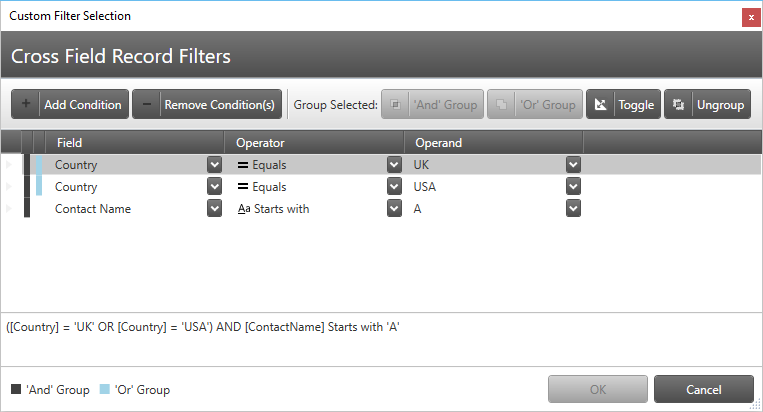

////
|metadata|
{
    "tags": [],
    "controlName": [""]
}
|metadata|
////

== In This Topic

This topic contains the following sections:

* <<_RefLink01, Introduction >>
* <<_RefLink02, Configuring Cross-Field Record Filtering >>
* <<_RefLink03, Specifying Filters Using the Dedicated Dialog >>
* <<_RefLink04, Specifying Filters Programmatically >>
* <<_RefLink05, Related Content >>

[[_RefLink01]]
== Introduction

You can use the Cross-Field Record Filtering Feature to create advanced filtering rules which can be grouped in filter groups and connected with logical operators. For example you may want to have shown only records which have specific values in two fields at the same time or some other specific value in a third field. You can have the cross-field record filtering feature specified both in XAML and in code. You can also configure the cross-field record filters using a dedicated dialog which is discussed later in this topic.

The Cross-Field Record Filtering is combined with the field specific record filtering which means that if a record match the cross field record filtering criteria it still have to match the field specific record filtering criteria too for it to be considered "filtered-in".

The Cross-Field Record Filtering impact on a hierarchical data source’s records depends on the value of the link:{ApiPlatform}datapresenter{ApiVersion}~infragistics.windows.datapresenter.fieldlayoutsettings~recordfilterscope.html[FieldLayoutSettings.RecordFilterScope] property. The link:{ApiPlatform}datapresenter{ApiVersion}~infragistics.windows.datapresenter.recordfilterscope.html[SiblingDataRecords] value will instruct the filtering to honor each field layout's cross-field records filtering rules and the link:{ApiPlatform}datapresenter{ApiVersion}~infragistics.windows.datapresenter.recordfilterscope.html[AllRecords] value will cause the root layout's filtering rules to be applied on all levels.

[[_RefLink02]]
== Configuring Cross-Field Record Filtering

[options="header", cols="a,a,a"]
|====
|Aspect|Details|Property

|Enable the user to select all fields in the Cross-Field Record Filtering Dialog
|Use this property to allow/disallow the user to select all fields in the Cross-Field Record Filtering Dialog. 

.Note 

[NOTE] 

==== 

If there are fields already programmatically added in the Cross-Field Record Filtering groups they will still be visible in the filtering dialog. 

====
| link:{ApiPlatform}datapresenter{ApiVersion}~infragistics.windows.datapresenter.fieldsettings~allowcrossfieldrecordfiltering.html[AllowCrossFieldRecordFiltering]

|Enable the user to select certain field in the Cross-Field Record Filtering Dialog
|Use this property to allow/disallow the user to select certain field in the Cross-Field Record Filtering Dialog. 

.Note 

[NOTE] 

==== 

If there are fields already programmatically added in the Cross-Field Record Filtering groups they will still be visible in the filtering dialog. 

====
| link:{ApiPlatform}datapresenter{ApiVersion}~infragistics.windows.datapresenter.field~allowcrossfieldrecordfiltering.html[AllowCrossFieldRecordFiltering]

|Enable the user to open the Cross-Field Record Filtering Dialog
|Configure whether to display a menu containing the items for opening the Cross-Field Record Filtering Dialog and clearing all Cross-Field Record Filters.
| link:{ApiPlatform}datapresenter{ApiVersion}~infragistics.windows.datapresenter.fieldlayoutsettings~headerprefixareadisplaymode.html[HeaderPrefixAreaDisplayMode]

|Configure the menu items in the header menu
|Configure which items are present in the header prefix area menu. Set a value which is a combination of the value of type link:{ApiPlatform}datapresenter{ApiVersion}~infragistics.windows.datapresenter.headerprefixareamenuoptions.html[HeaderPrefixAreaMenuOptions].
| link:{ApiPlatform}datapresenter{ApiVersion}~infragistics.windows.datapresenter.fieldlayoutsettings~headerprefixareamenuoptions.html[HeaderPrefixAreaMenuOptions]

|====

[[_RefLink03]]
== Specifying Filters Using the Dedicated Dialog

If allowed, the cross-field record filtering can be edited by the user using the dedicated dialog which is opened by selecting the relevant menu item from the header prefix area menu as shown in the following screenshot:

image::images/xamDataPresenter_CrossFieldRecordFiltering_02.png[]

The following screenshot shows the cross-field record filtering dialog with some filtering rules already defined:

Using the dialog the user has the following abilities:

* Adding of new filtering condition.
* Removing the selected filtering condition.
* Grouping two or more filtering conditions using the AND logical operator.
* Grouping two or more filtering conditions using the OR logical operator.
* Toggle the currently selected group's logical operator (AND <> OR).
* Ungroup the selected item(s) if they are grouped but not in the root level group (defined directly in the field layout's link:{ApiPlatform}datapresenter{ApiVersion}~infragistics.windows.datapresenter.fieldlayout~crossfieldrecordfilters.html[CrossFieldRecordFilters] property).

All defined filters are descriptively summarized at the bottom of the dialog.

[[_RefLink04]]
== Specifying Filters Programmatically

The Cross-Field Record Filters, represented by the link:{ApiPlatform}datapresenter{ApiVersion}~infragistics.windows.datapresenter.crossfieldrecordfilter.html[CrossFieldRecordFilter] class, are defined separately for each field layout via the `FieldLayout.CrossFieldRecordFilters` property. For a filter to be valid you have to specify:

* The link:{ApiPlatform}datapresenter{ApiVersion}~infragistics.windows.datapresenter.crossfieldrecordfilter~field.html[Field] ( link:{ApiPlatform}datapresenter{ApiVersion}~infragistics.windows.datapresenter.crossfieldrecordfilter~fieldname.html[FieldName]) whose cell data will be matched using the operator and operand
* The link:{ApiPlatform}datapresenter{ApiVersion}~infragistics.windows.datapresenter.crossfieldrecordfilter~operator.html[Operator] which will be used for the comparison
* The link:{ApiPlatform}datapresenter{ApiVersion}~infragistics.windows.datapresenter.crossfieldrecordfilter~operand.html[Operand] which will be compared to the cell data

Cross-Field Record Filters can be grouped logical in groups represented by the link:{ApiPlatform}datapresenter{ApiVersion}~infragistics.windows.datapresenter.crossfieldrecordfiltergroup.html[CrossFieldRecordFilterGroup] type. You can set the logical operator of such group using the link:{ApiPlatform}datapresenter{ApiVersion}~infragistics.windows.datapresenter.crossfieldrecordfiltergroup~logicaloperator.html[LogicalOperator] property.

The following code snippet demonstrates how to define a Cross-Field Record Filters to satisfy the following matching criteria:

Include all records which field "ContactName" starts with the letter "A" and which field "Country" is equal to either "UK" or "USA".

*In XAML:*

[source,xaml]
----
<igDP:XamDataGrid x:Name="xamDataGrid1">
  <igDP:XamDataGrid.FieldSettings>
    <igDP:FieldSettings AllowCrossFieldRecordFiltering="True" />
  </igDP:XamDataGrid.FieldSettings>
  <igDP:XamDataGrid.FieldLayouts>
    <igDP:FieldLayout>
      <igDP:FieldLayout.CrossFieldRecordFilters>
        <igDP:CrossFieldRecordFilterGroup LogicalOperator="And">
          <igDP:CrossFieldRecordFilterGroup LogicalOperator="Or">
            <igDP:CrossFieldRecordFilter FieldName="Country" Operator="Equals" Operand="UK" />
            <igDP:CrossFieldRecordFilter FieldName="Country" Operator="Equals" Operand="USA" />
          </igDP:CrossFieldRecordFilterGroup>
          <igDP:CrossFieldRecordFilter FieldName="ContactName" Operator="StartsWith" Operand="A" />
        </igDP:CrossFieldRecordFilterGroup>
      </igDP:FieldLayout.CrossFieldRecordFilters>
      <igDP:TextField Name="CustomerID" Label="ID" />
      <igDP:TextField Name="ContactName" Label="Contact Name" />
      <igDP:TextField Name="Country" Label="Country" />
      <igDP:TextField Name="City" Label="City" />
      <igDP:TextField Name="CompanyName" Label="Company Name" />
      <igDP:TextField Name="Phone" Label="Phone" />
    </igDP:FieldLayout>
  </igDP:XamDataGrid.FieldLayouts>
</igDP:XamDataGrid>
----

*In Visual Basic:*

[source,vb]
----
Me.xamDataGrid1.FieldSettings.AllowCrossFieldRecordFiltering = True
Dim fGroup1 As New CrossFieldRecordFilterGroup()
fGroup1.LogicalOperator = LogicalOperator.[Or]
fGroup1.Filters.Add(New CrossFieldRecordFilter() With { _
 .FieldName = "Country", _
 .[Operator] = ComparisonOperator.Equals, _
 .Operand = "UK" _
})
fGroup1.Filters.Add(New CrossFieldRecordFilter() With { _
 .FieldName = "Country", _
 .[Operator] = ComparisonOperator.Equals, _
 .Operand = "USA" _
})
Dim fGroup2 As New CrossFieldRecordFilterGroup()
fGroup2.LogicalOperator = LogicalOperator.[And]
fGroup2.Filters.Add(fGroup1)
fGroup2.Filters.Add(New CrossFieldRecordFilter() With { _
 .FieldName = "ContactName", _
 .[Operator] = ComparisonOperator.StartsWith, _
 .Operand = "A" _
})
Dim fl As New FieldLayout()
fl.Fields.Add(New TextField() With { _
 .Name = "CustomerID", _
 .Label = "ID" _
})
fl.Fields.Add(New TextField() With { _
 .Name = "ContactName", _
 .Label = "Contact Name" _
})
fl.Fields.Add(New TextField() With { _
 .Name = "Country", _
 .Label = "Country" _
})
fl.Fields.Add(New TextField() With { _
 .Name = "City", _
 .Label = "City" _
})
fl.Fields.Add(New TextField() With { _
 .Name = "CompanyName", _
 .Label = "Company Name" _
})
fl.Fields.Add(New TextField() With { _
 .Name = "Phone", _
 .Label = "Phone" _
})
fl.CrossFieldRecordFilters = fGroup2
Me.xamDataGrid1.FieldLayouts.Add(fl)
----

*In C#:*

[source,csharp]
----
this.xamDataGrid1.FieldSettings.AllowCrossFieldRecordFiltering = true;
CrossFieldRecordFilterGroup fGroup1 = new CrossFieldRecordFilterGroup();
fGroup1.LogicalOperator = LogicalOperator.Or;
fGroup1.Filters.Add(
 new CrossFieldRecordFilter()
  {
    FieldName = "Country",
    Operator = ComparisonOperator.Equals,
    Operand = "UK"
  });
fGroup1.Filters.Add(
  new CrossFieldRecordFilter()
  {
    FieldName = "Country",
    Operator = ComparisonOperator.Equals,
    Operand = "USA"
  });
CrossFieldRecordFilterGroup fGroup2 = new CrossFieldRecordFilterGroup();
fGroup2.LogicalOperator = LogicalOperator.And;
fGroup2.Filters.Add(fGroup1);
fGroup2.Filters.Add(
  new CrossFieldRecordFilter()
  {
    FieldName = "ContactName",
    Operator = ComparisonOperator.StartsWith,
    Operand = "A"
  });
FieldLayout fl = new FieldLayout();
fl.Fields.Add(new TextField() { Name = "CustomerID", Label = "ID" });
fl.Fields.Add(new TextField() { Name = "ContactName", Label = "Contact Name" });
fl.Fields.Add(new TextField() { Name = "Country", Label = "Country" });
fl.Fields.Add(new TextField() { Name = "City", Label = "City" });
fl.Fields.Add(new TextField() { Name = "CompanyName", Label = "Company Name" });
fl.Fields.Add(new TextField() { Name = "Phone", Label = "Phone" });
fl.CrossFieldRecordFilters = fGroup2;
this.xamDataGrid1.FieldLayouts.Add(fl);
----

[[_RefLink05]]
== Related Content

[options="header", cols="a,a"]
|====
|Topic|Purpose

| link:xamdatagrid-external-filtering.html[External Filtering]
|This topic demonstrates through code example, how to use the xamDataGrid™ control to externalize the record filtering process.

|====

[options="header", cols="a,a"]
|====
|Sample|Purpose

| link:{SamplesURL}/data-grid/cross-field-filtering[Cross Field Filtering]
|This sample demonstrates how to narrow down a large list of records using cross field record filtering.

|====