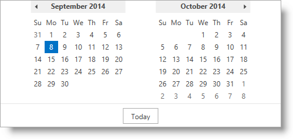

////
|metadata|
{
    "name": "thememanager-applying-theme-to-control",
    "tags": ["Getting Started","How Do I","Theming"],
    "controlName": ["IG Theme Manager"],
    "guid": "a9a0642d-8bd3-456b-97c7-fdfaaf0cc29f",
    "buildFlags": [],
    "createdOn": "2014-09-03T11:24:34.5470117Z"
}
|metadata|
////

= Applying a Theme on a FrameworkElement Level (ThemeManager)

== Topic Overview

=== Purpose

This topic describes how to apply a theme to a FrameworkElement using _Infragistics ThemeManager_™.

=== Required background

The following topics are prerequisites to understanding this topic:

[options="header", cols="a,a"]
|====
|Topic|Purpose

| link:xamcalendar-using.html[Using xamCalendar]
|This topic explains the _xamCalendar_ control and its modes and properties.

| link:thememanager-overview.html[Features Overview (ThemeManager)]
|This topic provides a detailed overview of _Infragistics ThemeManager_ and its main features.

|====

=== In this topic

This topic contains the following sections:

* <<_Ref398018602, Applying a Theme to xamCalendar - Example>>
* <<_Ref398018608, Related Content>>

** <<_Ref398018613, Topics>>
** <<_Ref398018617, Samples>>

[[_Ref398018602]]
== Applying a Theme to xamCalendar - Example

=== Introduction

The following procedure walks you through the applying the _Office2013 theme_ to the _xamCalendar_ control using _ThemeManager_.

The procedure for applying a theme to a `Window`, `Page`, `Grid` or another `FrameworkElement` in the application is similar to the procedure below.

=== Preview

The following screenshot is a preview of the final result.

[[_Ref397962631]]
=== Requirements

Following are the general requirements for applying the _Office2013 theme_ to the  _xamCalendar_ control.

* Assembly references:

** {ApiPlatform}Controls.Editors.XamCalendar.{ApiVersion}
** {ApiPlatform}Themes.Office2013.{ApiVersion}
** {ApiPlatform}{ApiVersion}

* Namespaces:

** A reference to the Infragistics® namespace: (xmlns:ig="http://schemas.infragistics.com/xaml")

=== Prerequisites

To complete the procedure, you need the following:

* A Microsoft® Visual Studio® WPF project with a page
* The required assembly references and namespaces added to the project (See the <<_Ref397962631, Requirements>> section above.)

=== Overview

Following is a conceptual overview of the process:

[start=1]
. <<_Ref398019441, Adding the _xamCalendar_ control>>

[start=2]
. <<_Ref398019447, Applying the Office2013 theme>>

=== Steps

The following steps demonstrate how to apply the _Office2013 theme_ to a _xamCalendar_ control using _ThemeManager_.

[[_Ref398019441]]
=== Adding the xamCalendar control

Add the _xamCalendar_ control to the root `Grid` container named `GridContainer`:

*In XAML:*
[source,xaml]
----
<ig:XamCalendar>                
    <!-- Apply the Office2013 theme here ... -->
</ig:XamCalendar>
----

*In C#:*
[source,csharp]
----
var calendar = new XamCalendar();
GridContainer.Children.Add(calendar);
----

*In Visual Basic:*
[source,vb]
----
Dim calendar = New XamCalendar()
GridContainer.Children.Add(calendar)
----

[[_Ref398019447]]
=== Applying the Office2013 theme

Apply the _Office2013 theme_ to the _xamCalendar_ control:

*In XAML:*
[source,xaml]
----
<ig:ThemeManager.Theme>
    <ig:Office2013Theme />
</ig:ThemeManager.Theme>
----

*In C#:*
[source,csharp]
----
ThemeManager.SetTheme(calendar, new Office2013Theme());
----

*In Visual Basic:*
[source,vb]
----
ThemeManager.SetTheme(calendar, New Office2013Theme())
----

[[_Ref398018608]]
== Related Content

[[_Ref398018613]]
=== Topics

The following topics provide additional information related to this topic.

[options="header", cols="a,a"]
|====
|Topic|Purpose

| link:thememanager-applying-theme-to-application.html[Applying a Theme to an Application Level]
|This topic describes how to apply a theme to an application using _Infragistics ThemeManager_.

| link:thememanager-applying-theme-to-supported-ms-wpf-controls.html[Applying a Theme to the Supported Microsoft WPF Controls]
|This topic describes how to enable/disable the theming of the supported Microsoft WPF controls using _Infragistics ThemeManager_.

| link:thememanager-creating-new-custom-theme.html[Creating a New Custom Theme]
|This topic describes how to create and apply a new custom theme to a control using _Infragistics ThemeManager_.

| link:thememanager-extending-existing-control-theme.html[Extending an Existing Control Theme]
|This topic describes how to extend an existing control theme using the _Infragistics ThemeManager_.

|====

[[_Ref398018617]]
=== Samples

The following sample provides additional information related to this topic.

[options="header", cols="a,a"]
|====
|Sample|Purpose

| link:{SamplesURL}/infragistics-theme-manager/apply-custom-theme[Creating a new theme]
|This sample demonstrates how to apply a theme on a Grid container level using ThemeManager.

|====