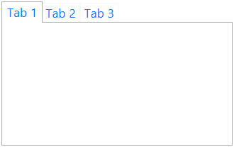
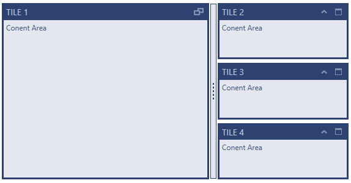

////
|metadata|
{
    "name": "thememanager-creating-new-custom-theme",
    "tags": ["Getting Started","How Do I","Theming"],
    "controlName": ["IG Theme Manager"],
    "guid": "48c1558e-96e0-4728-8500-671455122cee",
    "buildFlags": [],
    "createdOn": "2014-09-03T11:40:51.9088024Z"
}
|metadata|
////

= Creating a New Custom Theme (ThemeManager)

== Topic Overview

=== Purpose

This topic describes how to create and apply a new custom theme to a control using  _Infragistics ThemeManager_™.

=== Required background

The following topics are prerequisites to understanding this topic:

[options="header", cols="a,a"]
|====
|Topic|Purpose

| link:thememanager-applying-theme-to-control.html[Applying a Theme on a FrameworkElement Level]
|This topic describes how to apply a theme to a FrameworkElement using _Infragistics ThemeManager_.

| link:xamtilemanager-adding-xamtilemanager-to-your-application.html[Adding xamTileManager to Your Application]
|This topic describes how to add a _xamTileManager_ control to a page.

|====

=== In this topic

This topic contains the following sections:

* <<_Ref398126228,Creating and Applying a Custom Theme to a Common WPF Control – Example>>
* <<_Ref398126237,Creating and Applying a Custom Theme to an Infragistics WPF Control – Example>>
* <<_Ref398126247,Related Content>>

** <<_Ref398126251,Topics>>
** <<_Ref398126254,Samples>>

[[_Ref398126228]]
== Creating and Applying a Custom Theme to a Common WPF Control – Example

=== Introduction

The following procedure walks you through the creating and applying a custom theme to the `TabItem` control using _ThemeManager_.

=== Preview

The following screenshot is a preview of the final result.

[[_Ref397962631]]

=== Requirements

Following are the general requirements for creating and applying a custom theme to the `TabItem` control.

* Assembly references:

** InfragisticsWPF4.v{ProductVersion}

* Namespaces:

** A reference to the Infragistics® namespace: (xmlns:ig="http://schemas.infragistics.com/xaml")

=== Prerequisites

To complete the procedure, you need the following:

* A Microsoft® Visual Studio® WPF project with a page
* The required assembly references and namespaces added to the project (See the <<_Ref397962631,Requirements>> section above.)
* Include the custom theme Resource Dictionary link:resources-customtabitemtheme.html[CustomTabItemTheme.xaml] to your project

=== Overview

Following is a conceptual overview of the process:

[start=1]
. <<_Ref398052991, Create a custom theme for TabItem in Resource Dictionary >>
[start=2]
. <<_Ref398053010, Create a custom theme class that derives from the ThemeBase class >>
[start=3]
. <<_Ref398053018, Implement the ThemeBase ConfigureControlMappings method >>
[start=4]
. <<_Ref398053025, Register your control to be used by ThemeManager >>
[start=5]
. <<_Ref398053031, Apply your custom theme to the control >>

=== Steps

The following steps demonstrate how to create and apply a custom theme to a `TabItem` control.

. Create a custom theme for TabItem in Resource Dictionary
+
Refer the link:resources-customtabitemtheme.html[CustomTabItemTheme.xaml] for more information.

. Create a custom theme class that derives from the ThemeBase class
+
Create a class named `CustomTabItemTheme` that derives from the link:{ApiPlatform}v{ProductVersion}~infragistics.themes.themebase_members.html[ThemeBase] class:
+
*In C#:*
+
[source,csharp]
----
public class CustomTabItemTheme : ThemeBase
{
    // Class implementation here
}
----
+
*In Visual Basic:*
+
[source,vb]
----
Public Class CustomTabItemTheme Inherits ThemeBase
    ' Class implementation here
End Class
----

. Implement the ThemeBase ConfigureControlMappings method in your custom theme class
+
Implement the link:{ApiPlatform}v{ProductVersion}~infragistics.themes.themebase~configurecontrolmappings.html[ConfigureControlMappings] method in your custom theme class to specify where the theme’s Resource Dictionary for that particular control identified by its fully qualified type name is located:
+
*In C#:*
+
[source,csharp]
----
protected override void ConfigureControlMappings()
{
   // Get the full name of the assembly where the theme's resource dictionaries are placed
   string assemblyFullName = typeof (CustomTabItemTheme).Assembly.FullName;
   Mappings.Add("System.Windows.Controls.TabItem",
       BuildLocationString(assemblyFullName, @"\CustomTabItemTheme.xaml"));
}
----
+
*In Visual Basic:*
+
[source,vb]
----
Protected Overrides Sub ConfigureControlMappings()
    ' Get the full name of the assembly where the theme's resource dictionaries are placed
    Dim assemblyFullName As String = GetType(CustomTabItemTheme).Assembly.FullName 
    Mappings.Add("System.Windows.Controls.TabItem", _
        BuildLocationString(assemblyFullName, "\CustomTabItemTheme.xaml"))
End Sub
----

. Register your control to be used by ThemeManager
+
Register your control to ThemeManager after `InitializeComponent` method:
+
*In C#:*
+
[source,csharp]
----
ThemeManager.RegisterControl(typeof(TabItem));
----
+
*In Visual Basic:*
+
[source,vb]
----
ThemeManager.RegisterControl(GetType(TabItem))
----
+
.Note
[NOTE]
====
There is no need to register the Infragistics controls. This is required only for the common Microsoft controls and for the custom WPF controls in case the custom control is not registered to _ThemeManager_ beforehand in its static constructor.
====
+
If you have created your custom control, you can register it to _ThemeManager_ in the custom control static constructor in the following way:
+
*In C#:*
+
[source,csharp]
----
/// 

/// Static constructor for <YourCustomControl> class.
/// 

static <YourCustomControl>()
{
    Infragistics.Themes.ThemeManager.RegisterControl(typeof(<YourCustomControl>));    
}
----

. Apply your custom theme to the control
+
You can apply your custom theme using the following code:
+
*In XAML:*
+
[source,xaml]
----
<Grid>
    <ig:ThemeManager.Theme>
        <theming:CustomTabItemTheme />
    </ig:ThemeManager.Theme>
    <TabControl>
        <TabItem Header="Tab 1" />
        <TabItem Header="Tab 2" />
        <TabItem Header="Tab 3" />
    </TabControl>
</Grid>
----

[[_Ref382317785]]
=== Full code

Following is the full code for this procedure.

*Window XAML code*

*In XAML:*
[source,xaml]
----
<Grid>
    <ig:ThemeManager.Theme>
        <theming:CustomTabItemTheme />
    </ig:ThemeManager.Theme>
    <TabControl>
        <TabItem Header="Tab 1" />
        <TabItem Header="Tab 2" />
        <TabItem Header="Tab 3" />
    </TabControl>
</Grid>
----

*Window Code-behind*

*In C#:*
[source,csharp]
----
public partial class MainWindow : Window
{
    public MainWindow()
    {
        InitializeComponent();
        ThemeManager.RegisterControl(typeof(TabItem));
    }
}
----

*In Visual Basic:*
[source,vb]
----
Public Partial Class MainWindow Inherits Window
    Public Sub New()
        InitializeComponent()
        ThemeManager.RegisterControl(GetType(TabItem))
    End Sub
End Class
----

*CustomTabItemTheme.cs*

*In C#:*
[source,csharp]
----
public class CustomTabItemTheme : ThemeBase
{
    protected override void ConfigureControlMappings()
    {
        // Get the full name of the assembly where the theme's resource dictionaries are placed
        string assemblyFullName = typeof (CustomTabItemTheme).Assembly.FullName;        
        Mappings.Add("System.Windows.Controls.TabItem",
            BuildLocationString(assemblyFullName, @"\CustomTabItemTheme.xaml"));
    }
}
----

*In Visual Basic:*
[source,vb]
----
Public Class CustomTabItemTheme Inherits ThemeBase
    Protected Overrides Sub ConfigureControlMappings()
        ' Get the full name of the assembly where the theme's resource dictionaries are placed
        Dim assemblyFullName As String = GetType(CustomTabItemTheme).Assembly.FullName
        Mappings.Add("System.Windows.Controls.TabItem", _
            BuildLocationString(assemblyFullName, "\CustomTabItemTheme.xaml"))
    End Sub
End Class
----

[[_Ref398126237]]
== Creating and Applying a Custom Theme to an Infragistics WPF Control – Example

=== Introduction

The following procedure walks you through the creating and applying a custom theme to the link:{ApiPlatform}controls.layouts.xamtilemanager{ApiVersion}~infragistics.controls.layouts.xamtilemanager_members.html[XamTileManager] control using ThemeManager.

=== Preview

The following screenshot is a preview of the final result.

[[_Ref2]]
=== Requirements

Following are the general requirements for creating and applying a custom theme to the  _xamTileManager_ control.

* Assembly references:

** InfragisticsWPF4.Controls.Layouts.XamTileManager.v{ProductVersion}
** InfragisticsWPF4.v{ProductVersion}

* Namespaces:

** A reference to the Infragistics® namespace: (xmlns:ig="http://schemas.infragistics.com/xaml")

=== Prerequisites

To complete the procedure, you need the following:

* A Microsoft® Visual Studio® WPF project with a page
* The required assembly references and namespaces added to the project (See the <<_Ref2,Requirements>> section above.)
* Include the following theme resources in your project:

** link:resources-customtheme-xamtilemanager.html[CustomTheme.xamTileManager.xaml]

=== Overview

Following is a conceptual overview of the process:

[start=1]
. <<_Ref398127156, Create a custom theme for xamTileManager in Resource Dictionary >>

[start=2]
. <<_Ref398127182, Create a custom theme class that derives from the ThemeBase class >>

[start=3]
. <<_Ref398127191, Implement the ThemeBase ConfigureControlMappings method in your custom theme class >>

[start=4]
. <<_Ref398127199, Apply your custom theme to the control >>

=== Steps

The following steps demonstrate how to create and apply a custom theme to the  _xamTileManager_ control.

. Create a custom theme for xamTileManager in Resource Dictionary
+
Refer the link:resources-customtheme-xamtilemanager.html[CustomTheme.xamTileManager.xaml] for more information.

. Create a custom theme class that derives from the ThemeBase class
+
Create a class named `CustomTheme` that derives from the link:{ApiPlatform}v{ProductVersion}~infragistics.themes.themebase_members.html[ThemeBase] class:
+
*In C#:*
+
[source,csharp]
----
public class CustomTheme : ThemeBase
{
    // Class implementation here
}
----
+
*In Visual Basic:*
+
[source,vb]
----
Public Class CustomTheme Inherits ThemeBase
    ' Class implementation here
End Class
----

. Implement the ThemeBase ConfigureControlMappings method in your custom theme class
+
Implement the link:{ApiPlatform}v{ProductVersion}~infragistics.themes.themebase~configurecontrolmappings.html[ConfigureControlMappings] method in your custom theme class to specify where the theme’s Resource Dictionary for the _xamTileManager_ control identified by its mapping key is located:
+
*In C#:*
+
[source,csharp]
----
protected override void ConfigureControlMappings()
{
    string assemblyFullName = typeof(CustomTheme).Assembly.FullName;
    Mappings.Add(ControlMappingKeys.XamTileManager, 
        BuildLocationString(assemblyFullName, @"\CustomTheme.xamTileManager.xaml"));
}
----
+
*In Visual Basic:*
+
[source,vb]
----
Protected Overrides Sub ConfigureControlMappings()
    Dim assemblyFullName As String = GetType(CustomTheme).Assembly.FullName
    Mappings.Add(ControlMappingKeys.XamTileManager, _
        BuildLocationString(assemblyFullName, "\CustomTheme.xamTileManager.xaml"))
End Sub
----

. Apply your custom theme to the control
+
You can apply your custom theme using the following code:
+
*In XAML:*
+
[source,xaml]
----
<Grid>   
    <ig:ThemeManager.Theme>
        <theming:CustomTheme />
    </ig:ThemeManager.Theme>
    <ig:XamTileManager>
        <ig:XamTile Header="TILE 1"
                    Content="Content Area"
                    IsMaximized="True" />
…
    </ig:XamTileManager>
</Grid>
----

=== Full code

Following is the full code for this procedure.

*XAML code*

*In XAML:*

[source,xaml]
----
<Grid>   
    <ig:ThemeManager.Theme>
        <theming:CustomTheme />
    </ig:ThemeManager.Theme>
    <ig:XamTileManager>
        <ig:XamTile Header="TILE 1"
                    Content="Content Area"
                    IsMaximized="True" />
        <ig:XamTile Header="TILE 2"
                    Content="Content Area" />
        <ig:XamTile Header="TILE 3"
                    Content="Content Area" />
        <ig:XamTile Header="TILE 4"
                    Content="Content Area" />
    </ig:XamTileManager>
</Grid>
----

*CustomTheme.cs*

*In C#:*
[source,csharp]
----
public class CustomTheme : ThemeBase
{
    protected override void ConfigureControlMappings()
    {
        // Get the full name of the assembly where the theme's resource dictionaries are placed
        string assemblyFullName = typeof(CustomTheme).Assembly.FullName;
        Mappings.Add(ControlMappingKeys.XamTileManager,
            BuildLocationString(assemblyFullName, @"\CustomTheme.xamTileManager.xaml"));
    }
}
----

*In Visual Basic:*
[source,vb]
----
Public Class CustomTheme Inherits ThemeBase
    Protected Overrides Sub ConfigureControlMappings()
        ' Get the full name of the assembly where the theme's resource dictionaries are placed
        Dim assemblyFullName As String = GetType(CustomTheme).Assembly.FullName
        Mappings.Add(ControlMappingKeys.XamTileManager, _
            BuildLocationString(assemblyFullName, "\CustomTheme.xamTileManager.xaml"))
    End Sub
End Class
----

[[_Ref398126247]]
== Related Content

[[_Ref398126251]]
=== Topics

The following topics provide additional information related to this topic.

[options="header", cols="a,a"]
|====
|Topic|Purpose

| link:thememanager-applying-theme-to-control.html[Applying a Theme on a FrameworkElement Level]
|This topic describes how to apply a theme to a FrameworkElement using _Infragistics ThemeManager_.

| link:thememanager-applying-theme-to-application.html[Applying a Theme on an Application Level]
|This topic describes how to apply a theme to an application using _Infragistics ThemeManager_.

| link:thememanager-applying-theme-to-supported-ms-wpf-controls.html[Applying a Theme to the Supported Microsoft WPF Controls]
|This topic describes how to enable/disable the theming of the supported Microsoft WPF controls using _Infragistics ThemeManager_.

| link:thememanager-extending-existing-control-theme.html[Extending an Existing Control Theme]
|This topic describes how to extend an existing control theme using _Infragistics Theme Manager_.

|====

[[_Ref398126254]]
=== Samples

The following sample provides additional information related to this topic.

[options="header", cols="a,a"]
|====
|Sample|Purpose

| link:{SamplesURL}/infragistics-theme-manager/apply-custom-theme[Creating a new theme]
|This sample demonstrates how to create and apply a new custom theme for the _xamTileManager_ control using _ThemeManager_.

|====