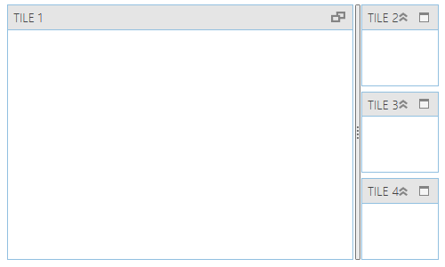

////
|metadata|
{
    "name": "thememanager-extending-existing-control-theme",
    "tags": ["Getting Started","How Do I","Theming"],
    "controlName": ["IG Theme Manager"],
    "guid": "41ab1a03-a11a-459a-af4b-140365553e81",
    "buildFlags": [],
    "createdOn": "2014-09-03T11:42:26.503289Z"
}
|metadata|
////

= Extending an Existing Control Theme (ThemeManager)

== Topic Overview

=== Purpose

This topic describes how to extend an existing control theme using _Infragistics ThemeManager_™.

=== Required background

The following topics are prerequisites to understanding this topic:

[options="header", cols="a,a"]
|====
|Topic|Purpose

| link:thememanager-applying-theme-to-control.html[Applying a Theme on a FrameworkElement Level]
|This topic describes how to apply a theme to a FrameworkElement using _Infragistics ThemeManager_.

| link:xamtilemanager-adding-xamtilemanager-to-your-application.html[Adding xamTileManager to Your Application]
|This topic describes how to add a _xamTileManager_ control to a page.

|====

=== In this topic

This topic contains the following sections:

* <<_Ref398126228,Extending an Existing Theme – Example>>
* <<_Ref398134090,Related Content>>

** <<_Ref398134094,Topics>>
** <<_Ref398134098,Samples>>

[[_Ref398126228]]
== Extending an Existing Theme – Example

=== Introduction

The following procedure walks you through the extending of the _Office2013 theme_ of  _xamTileManager_ using _ThemeManager_.

=== Preview

The following screenshot is a preview of the final result.

[[_Ref397962631]]

=== Requirements

Following are the general requirements for extending the _Office2013 theme_ of  _xamTileManager_.

* Assembly references:

** {ApiPlatform}Controls.Layouts.XamTileManager.{DllVersion}
** {ApiPlatform}Themes.Office2013.{DllVersion}
** {ApiPlatform}{DllVersion}

* Namespaces:

** A reference to the Infragistics® namespace: (xmlns:ig="http://schemas.infragistics.com/xaml")

=== Prerequisites

To complete the procedure, you need the following:

* A Microsoft® Visual Studio® WPF project with a page
* The required assembly references and namespaces added to the project (See the <<_Ref397962631,Requirements>> section above.)
* Include the following theme resources in your project:

** link:resources-extendedtheme-xamtilemanager.html[ExtendedTheme.xamTileManager.xaml]

=== Overview

Following is a conceptual overview of the process:

[start=1]
. <<_Ref398052991, Create a theme for xamTileManager in Resource Dictionary >>

[start=2]
. <<_Ref398053010, Create an extended theme class that derives from the Office2013Theme class >>

[start=3]
. <<_Ref398138081, Override the ConfigureControlMappings method in your extended theme class >>

[start=4]
. <<_Ref398053031, Apply your extended theme to the control >>

=== Steps

The following steps demonstrate how to extend and apply the modified _Office2013 theme_ to the _xamTileManager_ control.

. Create a theme for xamTileManager in Resource Dictionary
+
Refer the link:resources-extendedtheme-xamtilemanager.html[ExtendedTheme.xamTileManager.xaml] for more information.

. Create an extended theme class that derives from the Office2013Theme class
+
Create a class named ExtendedOffice2013Theme that derives from the link:{ApiPlatform}themes.office2013{ApiVersion}~infragistics.themes.office2013theme_members.html[Office2013Theme] class:
+
*In C#:*
+
[source,csharp]
----
public class ExtendedOffice2013Theme : Office2013Theme
{
    // Class implementation here 
}
----
+
*In Visual Basic:*
+
[source,vb]
----
Public Class ExtendedOffice2013Theme Inherits Office2013Theme
    ' Class implementation here 
End Class
----

. Override the ConfigureControlMappings method in your extended theme class
+
Override the link:{RootAssembly}{ApiVersion}~infragistics.themes.themebase~configurecontrolmappings.html[ConfigureControlMappings] method in your extended theme class:
+
*In C#:*
+
[source,csharp]
----
protected override void ConfigureControlMappings()
{
    // Pre-set the mappings for all controls via a call
    // to the base implementation of the ConfigureControlMappings method
    base.ConfigureControlMappings();
    string assemblyFullName = typeof(ExtendedOffice2013Theme).Assembly.FullName;
    // Override the mapping of the XamTileManager control
    Mappings[ControlMappingKeys.XamTileManager] =
        ThemeBase.BuildLocationString(assemblyFullName, @"/ExtendedTheme.xamTileManager.xaml");
}
----
+
*In Visual Basic:*
+
[source,vb]
----
Protected Overrides Sub ConfigureControlMappings()
    ' Pre-set the mappings for all controls via a call
    ' to the base implementation of the ConfigureControlMappings method
    MyBase.ConfigureControlMappings()
    Dim assemblyFullName As String = GetType(ExtendedOffice2013Theme).Assembly.FullName
    ' Override the mapping of the XamTileManager control
    Mappings(ControlMappingKeys.XamTileManager) = _
        ThemeBase.BuildLocationString(assemblyFullName, "/ExtendedTheme.xamTileManager.xaml")
End Sub
----

. Apply your extended theme to the control
+
You can apply your extended theme to the control as demonstrated in the code snippet below:
+
*In XAML:*
+
[source,xaml]
----
<Grid>
    <ig:ThemeManager.Theme> 
        <extendedTheme:ExtendedOffice2013Theme />
    </ig:ThemeManager.Theme>
    <ig:XamTileManager>
        <ig:XamTile Header="TILE 1" 
                    IsMaximized="True" />
        <ig:XamTile Header="TILE 2" />
        <ig:XamTile Header="TILE 3" />
        <ig:XamTile Header="TILE 4" />
    </ig:XamTileManager>
</Grid>
----

[[_Ref382317785]]
=== Full code

Following is the full code for this procedure.

*Window XAML code*

*In XAML:*
[source,xaml]
----
<Grid>
    <ig:ThemeManager.Theme>
        <extendedTheme:ExtendedOffice2013Theme />
    </ig:ThemeManager.Theme>
    <ig:XamTileManager>
        <ig:XamTile Header="TILE 1" 
                    IsMaximized="True" />
        <ig:XamTile Header="TILE 2" />
        <ig:XamTile Header="TILE 3" />
        <ig:XamTile Header="TILE 4" />
    </ig:XamTileManager>
</Grid>
----

*ExtendedOffice2013Theme.cs*

*In C#:*
[source,csharp]
----
public class ExtendedOffice2013Theme : Office2013Theme
{
    protected override void ConfigureControlMappings()
    {
        // Pre-set the mappings for all controls via a call
        // to the base implementation of the ConfigureControlMappings method
        base.ConfigureControlMappings();
        string assemblyFullName = typeof(ExtendedOffice2013Theme).Assembly.FullName;
        // Override the mapping of the XamTileManager control
        Mappings[ControlMappingKeys.XamTileManager] =
            ThemeBase.BuildLocationString(assemblyFullName, @"/ExtendedTheme.xamTileManager.xaml");
    }
}
----

*In Visual Basic:*
[source,vb]
----
Public Class ExtendedOffice2013Theme Inherits Office2013Theme
    Protected Overrides Sub ConfigureControlMappings()
        ' Pre-set the mappings for all controls via a call
        ' to the base implementation of the ConfigureControlMappings method
        MyBase.ConfigureControlMappings()
        Dim assemblyFullName As String = GetType(ExtendedOffice2013Theme).Assembly.FullName
        ' Override the mapping of the XamTileManager control
        Mappings(ControlMappingKeys.XamTileManager) = _
            ThemeBase.BuildLocationString(assemblyFullName, "/ExtendedTheme.xamTileManager.xaml")
    End Sub
End Class
----

[[_Ref398134090]]
== Related Content

[[_Ref398134094]]
=== Topics

The following topics provide additional information related to this topic.

[options="header", cols="a,a"]
|====
|Topic|Purpose

| link:thememanager-applying-theme-to-control.html[Applying a Theme on a FrameworkElement Level]
|This topic describes how to apply a theme to a FrameworkElement using _Infragistics ThemeManager_.

| link:thememanager-applying-theme-to-application.html[Applying a Theme on an Application Level]
|This topic describes how to apply a theme to an application using _Infragistics ThemeManager_.

| link:thememanager-applying-theme-to-supported-ms-wpf-controls.html[Applying a Theme to the Supported Microsoft WPF Controls]
|This topic describes how to enable/disable the theming of the supported Microsoft WPF controls using _Infragistics ThemeManager_.

| link:thememanager-creating-new-custom-theme.html[Creating a New Custom Theme]
|This topic describes how to create and apply a new custom theme to a control using _Infragistics ThemeManager_.

|====

[[_Ref398134098]]
=== Samples

The following sample provides additional information related to this topic.

[options="header", cols="a,a"]
|====
|Sample|Purpose

| link:{SamplesURL}/infragistics-theme-manager/apply-modified-theme[Extending an existing theme]
|This sample demonstrates how to extend the _xamTileManager_ control existing Office 2013 theme using _ThemeManager_.

|====