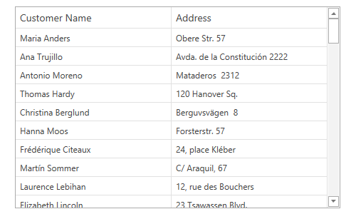
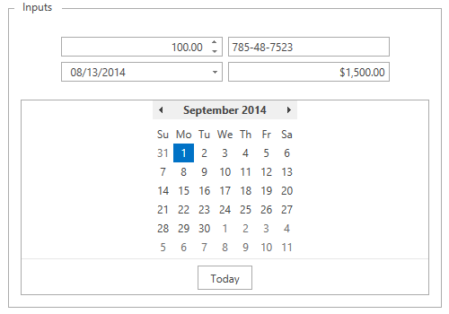
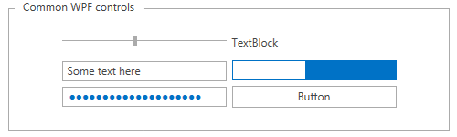
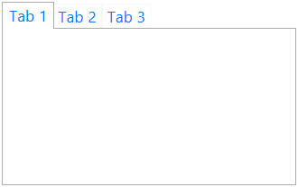
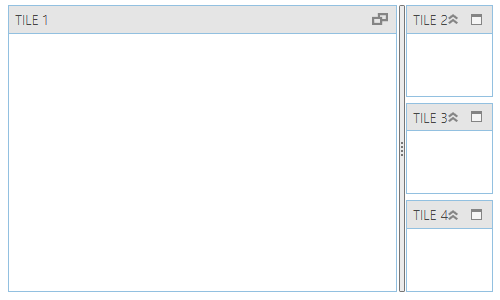

////
|metadata|
{
    "name": "thememanager-overview",
    "tags": ["Getting Started","Theming"],
    "controlName": ["IG Theme Manager"],
    "guid": "430039bd-6a7d-4716-8b54-44ae0ac0a6bc",
    "buildFlags": [],
    "createdOn": "2014-09-03T11:15:58.9008936Z"
}
|metadata|
////

= Features Overview (ThemeManager)

== Topic Overview

=== Purpose

This topic provides a detailed overview of  _Infragistics ThemeManager_™ and its main features.

=== In this topic

This topic contains the following sections:

* <<_Ref397164233,Introduction>>
* <<_Ref397330117,Available Themes and Required Assemblies>>
* <<_Ref397330130,Main Features>>
* <<_Ref397330162,Related Content>>

** <<_Ref397330166,Topics>>
** <<_Ref397330170,Samples>>

[[_Ref397164233]]
== Introduction

=== ThemeManager summary

The main purpose of the  _Infragistics ThemeManager_   is to provide an easier way for applying a specified theme to an application or a control with a single line of code.

[[_Ref397330117]]
== Available Themes and Required Assemblies

=== Introduction

If you want to apply a theme to an application, a page or a control, you may choose from the provided five theme packages. The theme packages contain resource dictionaries for all available Infragistics WPF controls as well as themes for the supported Microsoft WPF controls.

=== Requirements summary chart

The following table summarizes the available theme packages and required assemblies:

[options="header", cols="a,a"]
|====
|Theme|Required assembly

|`IgTheme`
|{ApiPlatform}Themes.IG.{ApiVersion}

|`MetroDarkTheme`
|{ApiPlatform}Themes.MetroDark.{ApiVersion}

|`MetroTheme`
|{ApiPlatform}Themes.Metro.{ApiVersion}

|`Office2010BlueTheme`
|{ApiPlatform}Themes.Office2010Blue.{ApiVersion}

|`Office2013Theme`
|{ApiPlatform}Themes.Office2013.{ApiVersion}

|`RoyalDark`
|{ApiPlatform}Themes.RoyalDark.{ApiVersion}

|====

[[_Ref397330130]]
== Main Features

[[_Ref397352743]]

=== Applying a theme on a FrameworkElement level

Apply a theme on a Window, Page or Grid level; or anywhere in the Visual Tree, and the controls included in that particular level will be styled accordingly with a single line of code using  _ThemeManager_  .

You can also limit the scope of a theme by applying it just to a particular control.

*In XAML:*

[source,xaml]
----
<ig:XamGrid ItemsSource="{Binding Path=Customers}" >
    <ig:ThemeManager.Theme>
        <ig:Office2013Theme />
    </ig:ThemeManager.Theme>
</ig:XamGrid>
----

==== Related Topics:

* link:thememanager-applying-theme-to-control.html[Applying a Theme on a FrameworkElement Level]

[[_Ref397352750]]

=== Applying a theme to an application level

Apply a specified theme to a WPF application with a single line of code instead of including and referencing all necessary resource dictionaries.

*In C#:*

[source,csharp]
----
ThemeManager.ApplicationTheme = new Office2013Theme();
----

==== Related Topics:

* link:thememanager-applying-theme-to-application.html[Applying a Theme to an Application Level]

=== Applying a theme to the supported Microsoft WPF controls

Apply a theme to an application and all available controls including the supported Microsoft WPF controls will be styled accordingly.

*In XAML:*

[source,xaml]
----
<ig:ThemeManager.Theme>
    <ig:Office2013Theme StyleMicrosoftControls="True" />
</ig:ThemeManager.Theme>
----

==== Related Topics:

* link:thememanager-applying-theme-to-supported-ms-wpf-controls.html[Applying a Theme to the Supported Microsoft WPF Controls]

=== Creating a New Custom Theme

Create and apply custom themes to Infragistics and common Microsoft WPF controls using ThemeManager.

==== Related Topics:

* link:thememanager-creating-new-custom-theme.html[Creating a New Custom Theme]

=== Extending an Existing Control Theme

Extend an existing built-in theme and apply it using ThemeManager.

==== Related Topics:

* link:thememanager-extending-existing-control-theme.html[Extending an Existing Control Theme]

[[_Ref397330162]]
== Related Content

[[_Ref397330166]]

=== Topics

The following topics provide additional information related to this topic.

[options="header", cols="a,a"]
|====
|Topic|Purpose

| link:thememanager-working-with-thememanager.html[Working with ThemeManager]
|The topics in this group explain how to configure different features of _Infragistics ThemeManager_ .

| link:thememanager-known-issues-and-limitations.html[Known Issues and Limitations]
|This topic explains the _Infragistics ThemeManager_ known issues and limitations.

| link:thememanager-api-reference.html[API Reference]
|This topic provides reference information about the key classes related to _Infragistics ThemeManager_ .

|====

[[_Ref397330170]]

=== Samples

The following samples provide additional information related to this topic.

[options="header", cols="a,a"]
|====
|Sample|Purpose

| link:{SamplesURL}/infragistics-theme-manager/using-theme-manager[Applying a theme]
|This sample demonstrates how to apply a theme on a Grid container level using _Theme Manager_ .

| link:{SamplesURL}/infragistics-theme-manager/apply-custom-theme[Creating a new theme]
|This sample demonstrates how to create and apply a custom theme for the _xamTileManager_ control using _Theme Manager_ .

| link:{SamplesURL}/infragistics-theme-manager/apply-modified-theme[Extending an existing theme]
|This sample demonstrates how to extend the _xamTileManager_ control existing Office 2013 theme using _Theme Manager_ .

|====