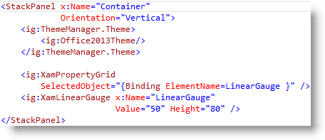
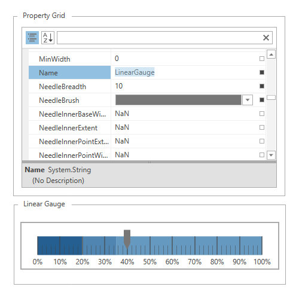

////

|metadata|
{
    "name": "thememanager",
    "tags": ["Getting Started","Theming"],
    "controlName": ["IG Theme Manager"],
    "guid": "18e36297-0521-4f9f-a06c-76327e0eadcd",  
    "buildFlags": [],
    "createdOn": "2014-09-03T11:09:49.0703315Z"
}
|metadata|
////

= Infragistics Theme Manager

== In This Group of Topics

=== Introduction

This section contains topics covering  _Infragistics ThemeManager_™ for WPF.

=== Topics

[options="header", cols="a,a"]
|====
|Topic|Purpose

| link:thememanager-overview.html[Features Overview]
|This topic provides a detailed overview of _Infragistics ThemeManager_ and its main features.

| link:thememanager-working-with-thememanager.html[Working with ThemeManager]
|The topics in this group explain how to configure different features of _Infragistics ThemeManager_ .

| link:thememanager-known-issues-and-limitations.html[Known Issues and Limitations]
|This topic explains _Infragistics ThemeManager_ known issues and limitations.

| link:thememanager-api-reference.html[API Reference]
|This topic provides reference information about the key classes related to _Infragistics ThemeManager_ .

|====