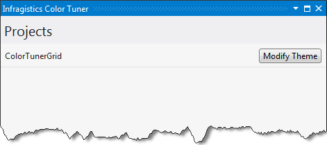
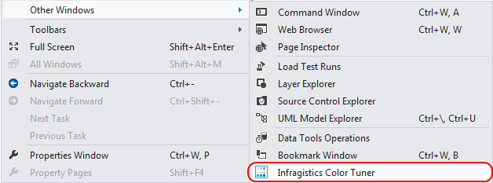
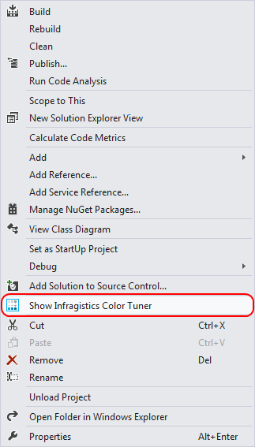
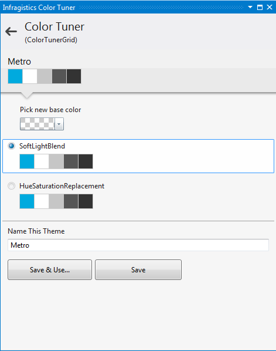

////

|metadata|
{
    "name": "using-infragistics-color-tuner",
    "controlName": ["Infragistics Color Tuner"],
    "tags": ["Design Environment","Getting Started","How Do I","Styling","Templating","Theming"],
    "guid": "f90eac72-6e7a-40f9-810a-a7d16b138d6a",  
    "buildFlags": [],
    "createdOn": "2016-05-25T18:22:00.2844055Z"
}
|metadata|
////

= Using Infragistics Color Tuner

== Topic Overview

=== Purpose

This topic introduces you to Infragistics Color Tuner™, an extension to Microsoft Visual Studio® 2010. The topic gives information on how to apply and color tune XAML themes of the  pick:[sl="Silverlight"]  pick:[wpf="WPF"]  controls using convenient UI.

=== Required background

The following table lists the materials required as a prerequisite to understanding this topic.

[options="header", cols="a,a"]
|====
|Type|Content

|Concepts
|You need to be familiar with the following concepts: 

* XAML Resource Dictionaries 

* Styling XAML applications 

|Topics
| link:reswash-using.html[Using Resource Washer]

|====

=== In this topic

This topic contains the following sections:

* <<_Introduction, Introduction >>
* <<_Minimum_Requirements, Minimum Requirements >>
* <<_Accessing_the_XAML_Color_Tuner, Accessing the Infragistics Color Tuner >>
* <<_Related_Content, Related Content >>

[[_Introduction]]
== Introduction

=== Introduction to the Infragistics Color Tuner

The Infragistics Color Tuner Microsoft Visual Studio extension is intended to provide you with convenient graphical user interface for color tuning of Infragistics themes.

Infragistics Color Tuner works using Resource Washer™ component. Basically, what Infragistics Color Tuner is doing is shown in the code sample below and it does the following:

* It adds Resource Washers to App.xaml application resources. If `Application.Resources` is not defined, it will be added automatically.
* Resource Washers will be added inside a `ResourceDictionary`.

----
<Application.Resources>
<ResourceDictionary>
<ResourceDictionary.MergedDictionaries>
<!--Resource Washers will be inserted here-->
</ResourceDictionary.MergedDictionaries>
</ResourceDictionary>
</Application.Resources>
----

[[_Minimum_Requirements]]
== Minimum Requirements

=== Installation

Infragistics Color Tuner needs to be installed with the {ProductName} product.

=== Requirements summary chart

The following table summarizes the requirements for Infragistics Color Tuner. The Infragistics Color Tuner will list a project if the following rules are fulfilled.

[options="header", cols="a,a"]
|====
|Requirement|Description

|At least one Infragistics ( pick:[wpf="WPF"] pick:[sl="Silverlight"] ) assembly present.
|Project on which you are working has to use Infragistics assemblies.

|App.xaml file present.
|Project on which you are working has to have App.xaml file (i.e. xaml file with Build Action set on ApplicationDefinition).

|====

.Note
[NOTE]
====
When there is a project with Infragistics controls, for which the requirements stated in the table above are fulfilled, the Infragistics Color Tuner will show it. If there is no such project an error message will be displayed.
====

[[_Accessing_the_XAML_Color_Tuner]]
== Accessing the XAML Color Tuner

=== Feature Overview

You open the tool using the Microsoft Visual Studio Standard Toolbar and selecting View$$->$$Other Windows $$->$$ Infragistics Color Tuner

You can also open the tool from the context menu on any project containing  pick:[sl="Silverlight"]   pick:[wpf="WPF"]  assemblies.

=== Show XAML Color Tuner window

Infragistics Color Tuner is installed with Infragistics controls package. It is placed in your Visual Studio toolbar, which you can show by clicking the *View* menu followed by *Other Windows* and selecting from the drop-down.

Click on the Infragistics Color Tuner.

You can click on the Show Infragistics Color tuner from the context menu of the project.

== Main Features

=== Features Overview

The following table summarizes the main features of the Infragistics Color Tuner extension. Additional details are available after the summary table.

[options="header", cols="a,a"]
|====
|Feature|Description

|Select theme to apply on application level
|Using Themes window of Infragistics Color Tuner, you can select which theme to apply from themes shown

|Select controls on which to apply the selected theme
|Using Apply Theme? Window you can specify on which control you want to apply selected theme

|Create your own theme
|Using Themes window you can select the theme which you want to color tune from the installed themes.

|Specify base color for color tuned theme
|Using Color Tuner window you can choose base color for color tuned theme from a drop-down

|Specify color tune mode
|Using Color Tuner window you can choose which color tune mode to use from a drop-down

|Name your color tuned theme
|Using Color Tuner window you can specify the name of your color tuned theme

|Remove custom color tuned theme.
|Using Color Tuner window you can remove color tuned theme using the Remove button.

|====

=== Create your own theme

You can create your own themes by color tuning the default Infragistics themes. To do so, choose one of the default themes shown in the Themes window, in Installed themes panel, and click on Color Tune… button.

Navigate to the Color Tuner window and customize base color, color tune mode and name of the newly created theme. To save and use your theme, click Save & Use button or click Save and use the theme at later stage.

[[_Related_Content]]
== Related Content

=== Topics

The following topics provide additional information related to this topic.

[options="header", cols="a,a"]
|====
|Topic|Purpose

| link:reswash-using.html[Using Resource Washer]
|This topic introduces you to the ResourceWasher component where you can learn to change the overall color schemes of your application.

| link:creating-and-applying-color-tuning-configurations.html[Creating And Applying Color Tuning Configurations]
|This topic is a walkthrough for creating and applying custom color tuned themes using XAML Color Tuner.

|====