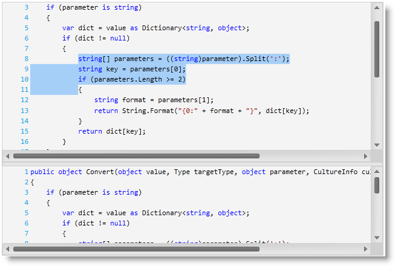

////

|metadata|
{
    "name": "whats-new-in-2012-volume-2",
    "controlName": [],
    "tags": ["How Do I"],
    "guid": "8d832bb3-8e9f-4d19-84d9-3def0d40325a",  
    "buildFlags": [],
    "createdOn": "2012-09-20T13:09:48.4794517Z"
}
|metadata|
////

= What's New in 2012 Volume 2

== What’s New in 2012 Volume 2

=== Features Overview

The following table summarizes the new features of the {ProductName} 2012 Volume 2. Additional details are available following the summary table.

[options="header", cols="a,a,a"]
|====
|Control|Feature|Description

| _<<Ref335896300, XamCalculationManager >>_ 
|<<_Ref335896301,Using xamCalculationManager with xamDataGrid>>
|This topic explains how you can use the xamCalculationManager control in combination with the xamDataGrid control to perform calculations using field values as sources and targets for the computations.

| _<<Ref335896308, XamDataChart >>_ 
|<<_Ref335896330,Working With Multi-Dimensional Data (OLAP Data)>>
|Displays multi-dimentional data (OnLine Analytical Processing (OLAP) data) in the _xamDataChart_ control.

|
|<<_Ref335896346,Multi Touch Support>>
|Provides support for multi-touch interactions with the _xamDataChart_ control.

| _<<Ref335896418, XamDataGrid >>_ 
|<<_Ref335896433,External Processing of Data>>
|The topics in this group of topics explain the external processing of data using CollectionView vs. internal processing.

| _<<Ref335896466, xamGantt >>_ 
|<<_Ref335896480,Cross platform control>>
|The _xamGantt_ control is a cross platform control that provides Microsoft Project style Gantt functionality.

| _<<Ref335896496, XamGeographicMap >>_ 
|<<_Ref335896507,Overview Plus Detail Pane>>
|Provides an interactive navigation control with overview of content in the _xamGeographicMap_ control.

|
|<<_Ref335896523,New Types of Geographic Series>>
|Provides new types of geographic series for rendering scattered or complex data in geographic context.

|
|<<_Ref335896539,Data Triangulation and Performance Improvements in Map Rendering>>
|Provides triangulation of scattered data in order to improve performance in rendering data in the _xamGeographicMap_ control.

| _<<Ref335896550, XamGrid >>_ 
|<<_Ref335896559,Data Annotations>>
|Allows you to use data annotations for applying attributes to data classes in _xamGrid_ .

| _<<Ref335896576, XamPivotGrid >>_ 
|<<_Ref335896586,Excel-Style Filtering>>
|Enables users to add value and label filters in _xamPivotGrid_ similar to those in MS Excel PivotTables.

|
|<<_Ref335896597,Measures respecting folder paths defined on the SSAS server>>
|Measures in the metadata tree of the data selector will have the same folder structure as it is defined on the SSAS server.

|
|<<_Ref335896611,Super-Compact Layout>>
|A new layout for the _xamPivotGrid_ that displays hierarchies in a tree-like structure.

| _<<_Ref335896622,xamSyntaxEditor>>_ 
|<<_Ref335896634,Cross platform control>>
|The _xamSyntaxEditor_ is a cross platform control providing a code editing experience similar to Microsoft’s Visual Studio Integrated Development Environment (IDE) code window.

|<<_Ref335896649,{PlatformName} (All Controls)>>
|<<_Ref335896659,Version-Free Assemblies>>
|Introduces version-free assemblies, starting with this release of (2012 Volume 2). These are assemblies whose version numbers (v.12.2) have been stripped off. Thus allowing you to create your application once and always point to the latest Infragistics assemblies without any additional coding. These assemblies are available as a zipped file along with the _{ProductName}_ product.

|<<_Ref335896671,Metro UI icons>>
|<<_Ref335896680,Metro UI icon support for Visual Studio 12 and beyond>>
|Starting with the release of Microsoft’s Visual Studio 12 Integrated Development Environment (IDE) all our XAML controls will support Metro-style UI icons in design time dialog.

|<<_Ref335896692,Infragistics Syntax Parsing Engine>>
|<<_Ref335896701,Cross platform library>>
|The syntax parsing engine is a fully functional text parser engine that can be used standalone or with editor controls like the new _xamSyntaxEditor_ . The syntax parsing engine can take an EBNF based language and parse it into its language specific tokens, keywords, and constructs.

|====

[[_Ref335896300]]
== _XamCalculationManager_

[[_Ref335896301]]

=== Using xamCalculationManager with xamDataGrid

This topic covers the integration of the xamCalculationManager with the xamDataGrid controls, however, you can apply the same steps for other DataPresenter controls. Other controls eligible to participate in calculations conducted by the xamCalculationManager component derive from the DataPresenterBase class.

==== Related Topics:

* link:xamcalculationmanager-using-xamcalculationmanager-with-xamdatagrid.html[Using xamCalculationManager with xamDataGrid]

[[_Ref335896308]]
== _XamDataChart_

[[_Ref335896330]]

=== Working With Multi-Dimensional Data (OLAP Data)

The OlapXAxis of the  _xamDataChart_   is specifically designed for visualizing OLAP data. It also enables you to drill-down into the data and choose an axis (columns or rows) whose values the series will be plotted.

==== Related Topics:

* link:datachart-working-with-multi-dimensional-data-(olap-data)-(xamdatachart).html[Working With Multi-Dimensional Data (OLAP Data)]

[[_Ref335896346]]

=== Multi Touch Support

Touch gestures are interactions with a touch support screen that enables the end user to navigate and interact with content in the  _xamDataChart_   control. In the {ProductName} 2012 Volume 2 release the chart supports stretch, pinch, tap and drag gestures.

==== Related Topics:

* link:datachart-navigating-chart-using-touch-gestures.html[Interacting with Chart using Touch Gestures]

[[_Ref335896418]]
== _XamDataGrid_

[[_Ref335896433]]

=== External Processing of Data

External processing provides you with the capability to perform the operations such as: Sorting, Filtering, Grouping and Summary calculations externally using CollectionView object. Normally, the control’s DataPresenter performs the operations internally. However, with external process the CollectionView object performs the requested operation outside of the control, and then propagates the results to the DataPresenter of the control, which in turn presents the results in the control’s view.

==== Related Topics:

* link:xamdatagrid-external-processing-of-data.html[External Processing of Data (xamDataGrid)]

[[_Ref335896466]]
== _xamGantt_

[[_Ref335896480]]

=== Cross platform control

The  _xamGantt_   control visualizes project’s tasks, relationships and dependencies between them. The main purpose of this cross platform control is to provide a user interface similar to the Microsoft Project 2010 for creating project plans, controlling the product management and displaying the project progress over time.

image::images/Whats_New_in_2012_Volume_2_03.png[]

image::images/Whats_New_in_2012_Volume_2_04.png[]

==== Related Topics:

* link:xamgantt-xamgantt-overview.html[xamGantt Overview]

[[_Ref335896550]]
== _XamGrid_

[[_Ref335896559]]

=== Data Annotations

Data annotations available in  _xamGrid_   allow you to apply attributes to your data classes. These annotations are useful for specifying validation rules, determining how data renders, and allowing you to establish relationships between classes.

This screenshot illustrates data annotations configured with attributes for the following fields:

* Category (Grouped Category)

* Name (Short Name)

* UnitPrice (Formatted with currency)

==== Related Topics:

* link:xamgrid-data-annotations.html[Data Annotations]

[[_Ref335896496]]
== _XamGeographicMap_

[[_Ref335896507]]

=== Overview Plus Detail Pane

Now, the  _xamGeographicMap_   control provides an overview of map content using the xamOverviewPlusDetailPane control. This control shows a thumbnail of the world and provides navigation functionalities for the map control.

image::images/Whats_New_in_2012_Volume_2_06.png[]

==== Related Topics:

* link:xamgeographicmap-navigating-map-content-using-overview-plus-detail-pane.html[Navigating Map Content Using Overview Plus Detail Pane]

[[_Ref335896523]]

=== New Types of Geographic Series

The xamGeographicMap control now provides the following new types of geographic series:

[options="header", cols="a,a"]
|====
|Type of Geographic Series|Description

| link:{ApiPlatform}controls.maps.xamgeographicmap{ApiVersion}~infragistics.controls.maps.geographicscatterareaseries_members.html[GeographicScatterAreaSeries]
|This series represents a geographic series that draws a colored surface, in a geographic context, based on a triangulation of longitudinal and latitudinal data with numeric values assigned to each point.

| link:{ApiPlatform}controls.maps.xamgeographicmap{ApiVersion}~infragistics.controls.maps.geographiccontourlineseries_members.html[GeographicContourLineSeries]
|This series represents a geographic series that draws colored contour lines, in a geographic context, based on a triangulation of longitudinal and latitudinal data with numeric values assigned to each point.

| link:{ApiPlatform}controls.maps.xamgeographicmap{ApiVersion}~infragistics.controls.maps.geographicshapecontrolseries_members.html[GeographicShapeControlSeries]
|This series represents a geographic series that draws shapes of geospatial data using the link:{ApiPlatform}controls.maps.xamgeographicmap{ApiVersion}~infragistics.controls.charts.shapecontrol_members.html[ShapeControl] template in a geographic context. This costs some performance in rendering the geospatial series, but adds certain features unique to the link:http://msdn.microsoft.com/en-us/library/system.windows.forms.control.aspx[Control] elements, such as the link:http://msdn.microsoft.com/en-us/library/system.windows.visualstatemanager(v=vs.95).aspx[VisualStateManager].

|====

==== Related Topics:

* link:xamgeographicmap-using-geographic-scatter-area-series.html[Using Geographic Scatter Area Series]
* link:xamgeographicmap-using-geographic-contour-line-series.html[Using Geographic Contour Line Series]
* link:xamgeographicmap-using-geographic-shape-control-series.html[Using Geographic Shape Control Series]

[[_Ref335896539]]

=== Data Triangulation and Performance Improvements in Map Rendering

The xamGeographicMap control now provides the TriangulationSource class for creating, loading, and saving triangulation of geographic data to ITF files and thus improving runtime performance of map rendering.

==== Related Topics:

* link:xamgeographicmap-triangulating-geographic-data.html[Triangulating Geographic Data]

[[_Ref335896576]]
== _XamPivotGrid_

[[_Ref335896586]]

=== Excel-Style Filtering

Excel-Style filtering enables users to add value and label filters in  _xamPivotGrid_   similar to those in MS Excel PivotTables. It also provides search functionality for the members in row and column hierarchies.

==== Related Topics:

* link:xampivotgrid-excel-style-filtering.html[Excel-Style Filtering]

[[_Ref335896597]]

=== Measures respecting folder paths defined on the SSAS server

Prior to the 12.2 release, the folder structure of the measures in the  _xamPivotDataSelector_  ’s metadata tree did not match the one defined on the SSAS server. Now when using  _XmlaDataSource_   the folder structure of the server is respected.

[[_Ref335896611]]

=== Super-Compact Layout

The Super-Compact layout of the pivot grid is an alternative layout of the  _xamPivotGrid_   control that is designed for saving horizontal space. Instead of showing each child level of the row hierarchy in header cells placed on the right of their parent header cell (as with the Standard layout), the child-level header cells are placed either beneath or above it. In order to differentiate between levels of the hierarchy, each of them is outset to the right by a specified distance.

==== Related Topics:

* link:xampivotgrid-super-compact-layout.html[Super-Compact Layout]

[[_Ref335896622]]
== _xamSyntaxEditor_

[[_Ref335896634]]

=== Cross platform control

The  _xamSyntaxEditor_   is a powerful text editing control that is used to provide a code editing experience similar to Microsoft’s Visual Studio code editor. It is built on top of our new syntax parsing engine which allows you to apply a set of language specific grammatical rules to highlight both language constructs as well as error information if the text does not conform to the syntax rules of the language.

==== Related Topics:

* link:xamsyntaxeditor-overview.html[xamSyntaxEditor Overview]

[[_Ref335896649]]
== {PlatformName} (All Controls)

[[_Ref335896659]]

=== Version-Free Assemblies

Version-Free assemblies are libraries that do not have the version number or framework version identifiers in their assembly names. For example,  _{ApiPlatform}v12.2.dll_   will read as  _InfragisticsWPF.dll_  . The version-free assemblies will always match the latest Common Language Runtime (CLR) version __.__

==== Related Topics:

* link:version-free-assemblies.html[Version-Free Assemblies]

[[_Ref335896671]]
== Metro UI icons

[[_Ref335896680]]

=== Metro UI icon support for Visual Studio 12 and beyond

Starting with the release of Microsoft’s Visual Studio 12 Integrated Development Environment (IDE), all of the Infragistics XAML controls will support Metro-style UI icons in design time dialog.

[[_Ref335896692]]
== Infragistics Syntax Parsing Engine

[[_Ref335896701]]

=== Cross platform library

The syntax parsing engine is a fully functional text parser engine that can be used standalone or with editor controls like the new  _xamSyntaxEditor_  . The syntax parsing engine can take an EBNF based language and parse it into its language specific tokens, keywords, and constructs.

==== Related Topics:

* link:ig-spe-overview.html[Syntax Parsing Engine Overview]