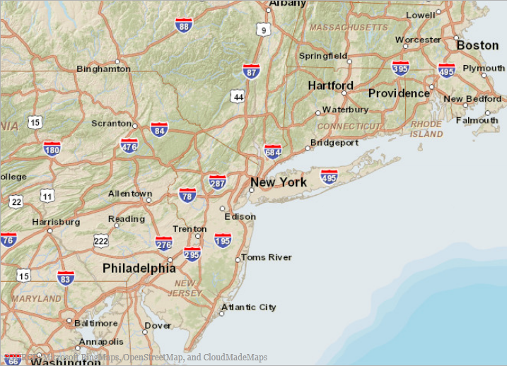

////
|metadata|
{
    "name": "whats-new-in-2013-volume-1",
    "controlName": [],
    "tags": [],
    "guid": "eabd4644-a8e6-4ade-8c97-53bd4d0bcf5b",
    "buildFlags": [],
    "createdOn": "2013-02-12T07:40:29.8433378Z"
}
|metadata|
////

= What's New in 2013 Volume 1

== New Features Summary

==== New features summary

The following table summarizes the new features of the {ProductName} 2013 Volume 1. Additional details are available following the summary table.

[options="header", cols="a,a,a"]
|====
|Control|Feature|Description

|<<InfragisticsSyntaxParsingEngine,Infragistics Syntax Parsing Engine>>
|<<NewParsingEngine,New Parsing Engine>>
|The Infragistics Syntax Parsing Engine is a set of classes capable of reading custom programming language grammars defined in EBNF, and then proceed to analyze and process files in accordance with your custom defined grammar.

| _<<xamDataChart, xamDataChart >>_ 
|<<HighDensityScatterSeries,High Density Scatter Series>>
|The link:{ApiPlatform}controls.charts.xamdatachart.v{ProductVersion}~infragistics.controls.charts.highdensityscatterseries_members.html[HighDensityScatterSeries] series in the _xamDataChart_ control can be used to bind and show scatter data, ranging from hundreds to millions of data points, with an exceptionally quick loading time. The series displays the scatter data as tiny dots, as opposed to full size markers, due to the fact that there are so many data points. The area with the most data displays with the higher color density, like a cluster of data points.
|
|<<HoverInteractions,Chart Annotation Layers>>
|Chart Annotation Layers are implemented through hover interaction layers. These layers are actually series that are added to the series collection, and are dependent on the cursor position. Adding hover interaction layers to the _xamDataChart_ control disables the default behavior of the crosshairs, tooltips or both(depending on which type of layer added).

| _<<Ref351394689, xamDoughnutChart >>_ 
|<<_Ref351394696,Cross platform control>>
|A cross platform control representing a doughnut chart.

| _<<xamDataGrid, xamDataGrid >>_ 
|<<NewSortingBehavior,New Sorting Behavior>>
|The control offers new sorting capabilities via the UI or using code.
|
|<<NewGroupingBehavior,New Grouping Behavior>>
|The new grouping behavior allows users to group data into more readable and navigable arrangements.

| _<<xamGantt, xamGantt >>_ 
|<<_Ref346271621,Save Project to XML>>
|This control allows you to save the current project plan to an MS Project XML file.

| _<<xamGeographicMap, xamGeographicMap >>_ 
|<<DisplayingGeographicImageryfromArcGISOnlineServers,Displaying Geographic Imagery from ArcGIS Online Servers>>
|ArcGIS Online is an Esri product that allows you to create and share maps either publicly or privately. You can also access other maps created by Esri and other ArcGIS users. 

You can see a list of some available public maps at the following location, link:http://www.arcgis.com/home/group.html?owner=esri&title=ESRI%20Maps%20and%20Data[Esri Maps and Data Group].
|
|<<GeographicProportionalSymbolSeries,Geographic Proportional Symbol Series>>
|The link:{ApiPlatform}controls.maps.xamgeographicmap.v{ProductVersion}~infragistics.controls.maps.geographicproportionalsymbolseries_members.html[GeographicProportionalSymbolSeries] is a Scatter Series with data-driven symbol sizes. It implements link:{ApiPlatform}controls.maps.xamgeographicmap.v{ProductVersion}~infragistics.controls.maps.geographicsymbolseries_members.html[GeographicSymbolSeries] and has all the basic characteristics of the _xamDataChart_ control’s link:{ApiPlatform}controls.charts.xamdatachart.v{ProductVersion}~infragistics.controls.charts.bubbleseries_members.html[BubbleSeries].
|
|<<SimplifiedSupportforBingMapsImagery,Simplified Support for Bing Maps Imagery>>
|This simplified Bing Maps’ interface allows you to access Bing Maps with minimal set up. Previously, you had to configure a REST services to access Bing Maps and get the required URIs for the titles. With this release, this functionality is now built-in to the _xamGeographicMap_ control.
|
|<<UsingGeographicTileSeries,Using Geographic Tile Series>><<UsingGeographicTileSeries,>>
|The link:{ApiPlatform}controls.maps.xamgeographicmap.v{ProductVersion}~infragistics.controls.maps.geographictileseries_members.html[GeographicTileSeries] is a visual map element belonging to the _xamGeographicMap_ control that superimposes additional tile imagery over the base tile imagery defined in the _xamGeographicMap_ control’s link:{ApiPlatform}controls.maps.xamgeographicmap.v{ProductVersion}~infragistics.controls.maps.xamgeographicmap~backgroundcontent.html[BackgroundContent] property. 

The link:{ApiPlatform}controls.maps.xamgeographicmap.v{ProductVersion}~infragistics.controls.maps.geographictileseries_members.html[GeographicTileSeries] is similar to the link:{ApiPlatform}controls.maps.xamgeographicmap.v{ProductVersion}~infragistics.controls.maps.geographicpolylineseries_members.html[GeographicPolylineSeries] except that the polylines functions to clip the tile visuals rather than draw polylines.

| _<<Ref351395743, xamPivotGrid >>_ 
|<<_Ref351395827,Saving and Loading Grid Customizations>>
|This feature allows saving and restoring a particular state (hierarchies used for columns, rows, filters; expanded members’ states, etc.) of the _xamPivotGrid_ .

| _<<xamRibbon, xamRibbon >>_ 
|<<ApplicationMenu2010,Application Menu 2010>>
|The Application Menu 2010 features a File Tab before all other tabs and a backstage, which will cover the xamRibbon groups and extends to the size of the window containing the xamRibbon.

| _<<Ref346271560, xamSyntaxEditor >>_ 
|<<_Ref346271568,Clipboard Events>>
|This control exposes new events for supporting clipboard operations.
|
|<<_Ref346271581,Current Line Highlight>>
|This feature allows you to highlight the line containing the caret.
|
|<<_Ref346271588,Custom Adornments>>
|Adornments are visual elements displayed in the control’s text editing area providing users with visual cues.
|
|<<_Ref346271595,Ruler Margin>>
|The ruler margin visually indicates the location of the caret in the current line with a red dot.
|
|<<_Ref346271603,Whitespace Highlight>>
|This feature allows you to identify all the spaces and tabs occurring within the document.
|
|<<_Ref346271604,Transact-SQL>>
|Transact-SQL language support.

| _<<Ref351395987, xamTreemap >>_ 
|<<_Ref351395991,Tooltips>>
|This control introduces new built-in support for tooltips.

|====

[[InfragisticsSyntaxParsingEngine]]
== Infragistics Syntax Parsing Engine

[[NewParsingEngine]]
==== New Parsing Engine

The Infragistics Syntax Parsing Engine is a set of classes capable of taking a definition for the grammatical structure of a type of document and producing analyzers to read and process those documents.

Main features:

* Creating analyzers
* Performing analysis

Other features:

* Analyzing grammar
* Identifying Errors and Ambiguities

Generating C# and Visual Basic language class files

==== Related Topic:

link:ig-spe-overview.html[Syntax Parsing Engine Overview]

[[xamDataChart]]
== _xamDataChart_

[[HighDensityScatterSeries]]

=== High Density Scatter Series

The  _xamDataChart_   control’s link:{ApiPlatform}controls.charts.xamdatachart.v{ProductVersion}~infragistics.controls.charts.highdensityscatterseries_members.html[HighDensityScatterSeries] can bind and show scatter data ranging from hundreds to millions of data points with minimal loading time. The series displays the scatter data as tiny dots as opposed to full size markers due to the fact that there are so many data points. The area with the most data is displayed with the higher color density, like a cluster of data points.

==== Related Topic:

link:datachart-scatter-high-density-scatter-series.html[High Density Scatter Series]

[[HoverInteractions]]

=== Chart Annotation Layers

Chart Annotation Layers are implemented through hover interaction layers which are series that are added to the series collection, and are dependent on the cursor’s position. Adding the hover interaction layers to the  _xamDataChart_  control disables the default behavior of crosshairs, tooltips or both depending on the type of the added layer.

==== Related Topic:

link:datachart-chartannotationlayers.html[Chart Annotation Layers]

[[_Ref351394689]]
== _xamDoughnutChart_

[[_Ref351394696]]
==== Cross platform control

The  _xamDoughnutChart_   control is similar to the  _xamPieChart_   –proportionally illustrating the occurrences of a variable or multiple variables in concentric rings and provides built-in support for visualizing hierarchical data.

==== Related Topic:

* link:xamdoughnutchart-overview.html[xamDoughnutChart Overview]

[[xamDataGrid]]
== _xamDataGrid_

[[NewSortingBehavior]]

=== New Sorting Behavior

The control offers new sorting capabilities via the UI or using code.

==== Related Topics:

link:xamdatagrid-sorting-overview.html[Sorting Overview (xamDataGrid)]

link:xamdatagrid-sorting-and-grouping-process-overview.html[Sorting and Grouping Process Overview (xamDataGrid)]

[[NewGroupingBehavior]]

=== New Grouping Behavior

The new grouping behavior allows users to group data into more readable and navigable arrangements.

==== Related Topics:

link:xamdatagrid-grouping-overview.html[Grouping Overview (xamDataGrid)]

link:xamdatagrid-user-interaction-sorting-records.html[User Interaction When Sorting Records (xamDataGrid)]

[[xamGantt]]
== _xamGantt_

[[_Ref346271621]]
==== Save Project to XML

The control provides the ability to save the current project plan to a MS Project XML file.

==== Related Topic:

link:xamgantt-saving-project-plan-to-ms-project-xml-file.html[Saving a Project to XML]

[[xamGeographicMap]]
== _xamGeographicMap_

[[DisplayingGeographicImageryfromArcGISOnlineServers]]

=== Displaying Geographic Imagery from ArcGIS Online Servers

ArcGIS Online is an Esri product that allows you to create and share maps either publicly or privately. You can also access other maps created by Esri and other ArcGIS users.

You can see a partial list of available public maps at the link:http://www.arcgis.com/home/group.html?owner=esri&title=ESRI%20Maps%20and%20Data[Esri Maps and Data Group].

==== Related Topic:

link:xamgeographicmap-displaying-geographic-imagery-from-arcgis-online-servers.html[Displaying Geographic Imagery from ArcGIS Online Servers]

[[GeographicProportionalSymbolSeries]]

=== Geographic Proportional Symbol Series

The link:{ApiPlatform}controls.maps.xamgeographicmap.v{ProductVersion}~infragistics.controls.maps.geographicproportionalsymbolseries_members.html[GeographicProportionalSymbolSeries] is a Scatter Series, the size of whose symbols are data-driven. It implements link:{ApiPlatform}controls.maps.xamgeographicmap.v{ProductVersion}~infragistics.controls.maps.geographicsymbolseries_members.html[GeographicSymbolSeries] and has all the basic characteristics of the  _xamDataChart_   control’s link:{ApiPlatform}controls.charts.xamdatachart.v{ProductVersion}~infragistics.controls.charts.bubbleseries_members.html[BubbleSeries].

The following screenshot preview of the link:{ApiPlatform}controls.maps.xamgeographicmap.v{ProductVersion}~infragistics.controls.maps.geographicproportionalsymbolseries_members.html[GeographicProportionalSymbolSeries] series in the  _xamGeographicMap_   control displaying the locations of the most populated cites in the world. The link:{ApiPlatform}controls.charts.xamdatachart.v{ProductVersion}~infragistics.controls.charts.sizescale_members.html[SizeScale] of the symbols uses proportional radius scale in order to indicate the significance of these cities based on their population.

==== Related Topic:

link:xamgeographicmap-using-geographic-proportional-symbol-series.html[Using Geographic Proportional Symbol Series]

[[SimplifiedSupportforBingMapsImagery]]

=== Simplified Support for Bing Maps Imagery

The simplified Bing Maps interface allows you to access Bing Maps with minimal setup. Previously, you had to configure a REST services to access Bing Maps and get the required URIs for the titles. With this release, this functionality is now built-in to the  _xamGeographicMap_   control.

The following screenshot previews how the  _xamGeographicMap_   control renders using Bing Maps Service’s Road map style of geographic imagery.

==== Related Topic:

link:xamgeographicmap-displaying-geographic-imagery-from-bing-maps.html[Displaying Geographic Imagery from Bing Maps]

[[UsingGeographicTileSeries]]

=== Using Geographic Tile Series

The link:{ApiPlatform}controls.maps.xamgeographicmap.v{ProductVersion}~infragistics.controls.maps.geographictileseries_members.html[GeographicTileSeries] is a visual map element belonging to the  _xamGeographicMap_  control that superimposes additional tile imagery over the base tile imagery defined in the  _xamGeographicMap_  control’s link:{ApiPlatform}controls.maps.xamgeographicmap.v{ProductVersion}~infragistics.controls.maps.xamgeographicmap~backgroundcontent.html[BackgroundContent] property.

The link:{ApiPlatform}controls.maps.xamgeographicmap.v{ProductVersion}~infragistics.controls.maps.geographictileseries_members.html[GeographicTileSeries] is similar to the link:{ApiPlatform}controls.maps.xamgeographicmap.v{ProductVersion}~infragistics.controls.maps.geographicpolylineseries_members.html[GeographicPolylineSeries] except that the polylines function to clip the tile visuals rather than draw polylines.

==== Related Topic:

link:xamgeographicmap-using-geographic-tile-series.html[Using Geographic Tile Series]

[[_Ref351395743]]
== _xamPivotGrid_

[[_Ref351395827]]
==== Saving and Loading Grid Customizations

The current state of the  _xamPivotGrid_  is defined primarily by the data source control used ( _FlatDataSource_™ and  _XmlaDataSource_™). This feature allows you to save, and subsequently load, the current state of the data source.

==== Related Topics:

* link:xampivotgrid-saving-and-loading-grid-customizations.html[Saving and Loading Grid (Data Source) Customizations (xamPivotGrid)]

[[xamRibbon]]
== _xamRibbon_

[[ApplicationMenu2010]]
==== Application Menu 2010

When enabled, the Application Menu 2010 feature renders a File Tab before all other tabs in the xamRibbon control. Pressing this tab will open a backstage, which will cover the xamRibbon groups and extends to the size of the window containing the xamRibbon. The screenshot below shows the location of the Application Menu 2010 File Tab within the xamRibbon control and an opened backstage

==== Related Topic:

link:xamribbon-applicationmenu2010.html[Application Menu 2010 (xamRibbon)]

[[_Ref346271560]]
== _xamSyntaxEditor_

[[_Ref346271568]]

=== Clipboard Events

The control exposes new events for supporting clipboard operations.

==== Related Topic:

link:xamsyntaxeditor-clipboard-support.html[Clipboard Support]

[[_Ref346271581]]

=== Current Line Highlight

The current line highlighting feature highlights the line containing the caret.

==== Related Topic:

link:xamsyntaxeditor-currentlinehl.html[Current Line Highlight]

[[_Ref346271588]]

=== Custom Adornments

Adornments are visual elements displayed in the control’s text editing area that display visual user cues.

==== Related Topic:

link:xamsyntaxeditor-custom-adornments.html[Custom Adornments]

[[_Ref346271595]]

=== Ruler Margin

The ruler margin visually indicates the location of the caret in the current line with a customizable colored dot.

==== Related Topic:

link:xamsyntaxeditor-ruler-margin.html[Ruler Margin]

[[_Ref346271603]]

=== Whitespace Highlight

The whitespace highlighting feature allows you to indicate all of the places in the document occupied by spaces and tabs.

==== Related Topic:

link:xamsyntaxeditor-whitespacehighlighting.html[Whitespace Highlighting]

[[_Ref346271604]]

=== Transact-SQL

The Transact-SQL language is now supported by the xamSyntaxEditor.

==== Related Topic:

link:xamsyntaxeditor-supported-languages.html[Supported Languages]

[[_Ref351395987]]
== _xamTreemap_

[[_Ref351395991]]
==== Tooltips

This control exposes new properties making it easier to use and style tooltips.

==== Related Samples:

* link:http://www.infragistics.com/products/wpf/sample/treemap/tooltips[Tooltips]