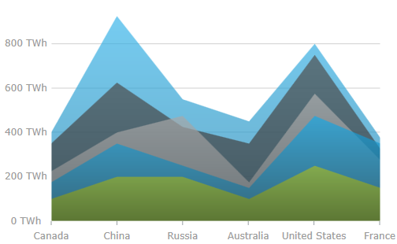
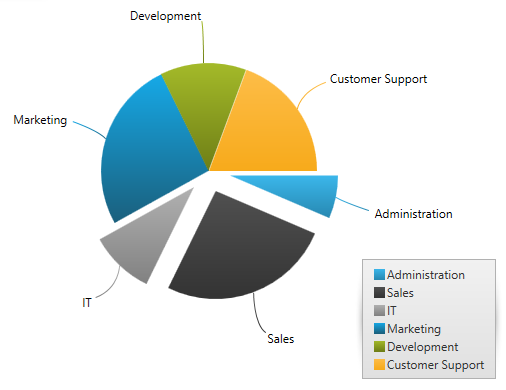
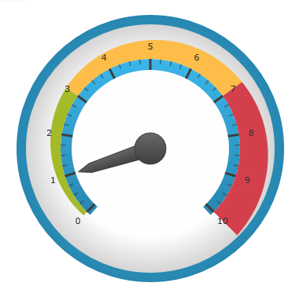
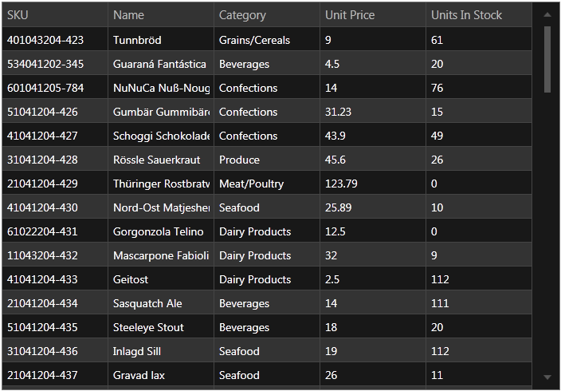
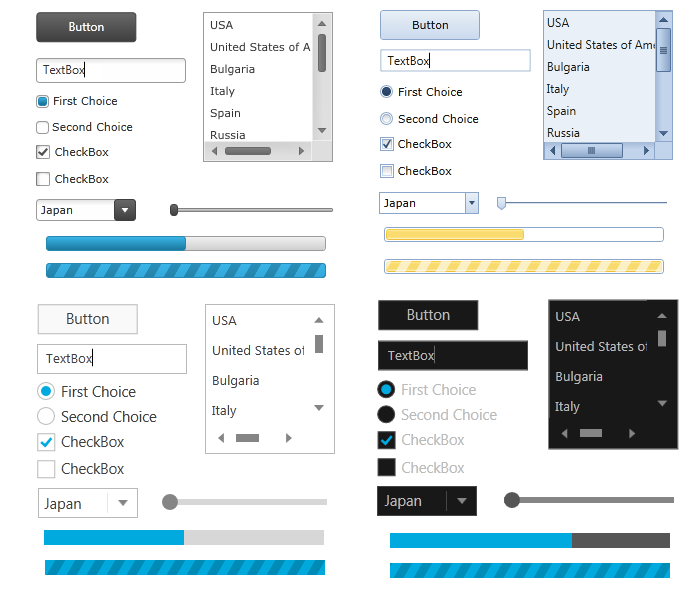

////
|metadata|
{
    "name": "whats-new-in-2013-volume-2",
    "controlName": [],
    "tags": ["Getting Started","How Do I"],
    "guid": "140732a7-095c-423c-ab7b-2d4760427fb6","buildFlags": [],
    "createdOn": "2013-10-15T06:54:20.3581857Z"
}
|metadata|
////

= What's New in 2013 Volume 2

== New Features Summary

=== New features summary chart

The following table summarizes the new features of the Infragistics WPF 2013 Volume 2. Additional details are available following the summary table.

[options="header", cols="a,a,a"]
|====
|Control|Feature|Description

| _<<Ref367197745, xam BulletGraph >>_ 
|<<_Ref367197749,New Control>>
|The _xamBulletGraph_ is a control allowing for visualizing data in the form of a bullet graph.

.8| _<<Ref367202841, xamDataChart >>_ 
|<<_Ref367202844,Title and Subtitle>>
|You can now add titles, subtitles or both to the top section of the chart control.

|
|<<_Ref367202849,Axis Title and Subtitle>>
|You can now add titles, subtitle or both to the x and y-axes of the control.

|
|<<_Ref367202852,Series Highlighting>>
|You can now highlight an entire series or some individual items within the series.

|
|<<_Ref367202860,Transition In Animations>>
|The series can now appear with animation effect when the chart is initially loaded.

|
|<<_Ref367197826,Axis Tick Marks>>
|You can now display tick marks for the labels of vertical and horizontal axes.

|
|<<_Ref367197831,Default Tooltips>>
|Default tooltips are now available meaning that a tooltip is displayed for the series without any additional configuration being necessary.

|
|<<_Ref367197836,Drop Shadow>>
|Drop-shadow effect can be now applied to the series’ visual.

|
|<<_Ref367197841,New Style>>
|This is a new style for the _xamDataChart_ featuring multiple visual changes improving the charts appearance.

| _<<Ref367202881, xamDoughnutChart, xamPieChart >>_ 
|<<_Ref356571861,Labeling Callout Lines with Curves>>
|This feature displays curves for the callout lines of the _xamDoughnutChart_ __and__ _xamPieChart_ .

| _<<Ref367202886, xamGeographicMap >>_ 
|<<_Ref367202921,High Density Scatter Series>>
|Use the _xamGeographicMap_ control’s link:{ApiPlatform}controls.maps.xamgeographicmap{ApiVersion}~infragistics.controls.maps.geographichighdensityscatterseries.html[GeographicHighDensityScatterSeries] series to bind and show scatter data ranging from hundreds to millions of data points requiring exceedingly little loading time.

| _<<Ref367197863, xamLinearGauge >>_ 
|<<_Ref367197859,New Control>>
|The _xamLinearGauge_ control visualizes data in the form of a linear gauge. It provides a simple and concise view of a performance value compared against a scale and one or more comparative ranges.

| _<<Ref367202940, xam RadialGauge >>_ 
|<<_Ref367202945,New Control>>
|The _xamRadialGauge_ is a cross platform control data visualization tool capable of displaying a gauge containing a number of visual elements.

| _<<Ref367202950, xam RichTextEditor >>_ 
|<<_Ref367202953,New control>>
|The _xamRichTextEditor_ is a cross platform control providing the user with a rich text content displaying and editing experience, which includes but is not limited to text, lists, images and tables.

| _<<Ref367202956, xam SyntaxEditor >>_ 
|<<_Ref367202961,Classification Types Definition in XAML>>
|The _xamSyntaxEditor_ control now supports definition of classification types in XAML.

| _<<Ref367710344, Metro Dark Theme >>_ 
|<<_Ref367710345,Metro Dark Theme>>
|A new touch-friendly dark theme for all controls.

| _<<Ref367710352, MS Controls Implicit Themes >>_ 
|<<_Ref367710353,MS Controls Implicit Themes>>
|Versions of all Infragistics themes for all Microsoft controls.

|====

[[_Ref367197745]]
== _xamBulletGraph_

[[_Ref367197749]]

=== New Control

The  _xamBulletGraph_   control is an {ProductName} control that allows for visualizing data in the form of a bullet graph. Linear by design, it provides a simple and concise view of a primary measure compared against a scale and optionally, some other measure.

==== Related Topic:

link:bulletgraph.html[xamBulletGraph]

[[_Ref367202841]]
== _xamDataChart_

[[_Ref367202844]]

=== Title and Subtitle

You can now add titles, subtitles or both to the top section of the chart control.

When adding a title or subtitle to the chart control, the content of the chart is automatically resized to allow for the title and subtitle information.

image::images/xamDataChart_Chart_Title_01.png[]

==== Related Topic:

link:datachart-chart-title-and-subtitle.html[Chart Title and Subtitle]

[[_Ref367202849]]

=== Axis Title and Subtitle

You can now add information to the x-axis and y-axis.

==== Related Topic:

link:datachart-axis-title.html[Axis Title]

[[_Ref367202852]]

=== Series Highlighting

You can now highlight an entire series or some individual items within the series.

The highlighting capabilities are series-specific. With single-shape series, such as Line series the entire line is highlighted, while with series consisting of multiple shapes, such as Column series, each individual shape (column) can be highlighted. In all supported series, individual markers can be highlighted.

The series highlighting feature is support for the following series types:

* Category Series
* RangeCategory Series
* Financial Series
* Financial Indicators

==== Related Topic:

link:datachart-series-highlighting.html[Series Highlighting]

[[_Ref367202860]]

=== Transition In Animations

This feature allows the series to animate during the initialization of the xamDataChart control.

==== Related Topic:

link:datachart-transition-in-animations.html[Transition In Animations]

[[_Ref367197826]]

=== Axis Tick Marks

You can now display axis tick marks outside the chart plot area. This allows displaying tick marks for each of the labels and may serve for simplifying the chart look by replacing the axes gridlines with tick marks.

==== Related Topic:

link:datachart-axis-tick-marks.html[Axis Tick Marks]

[[_Ref367197831]]

=== Default Tooltips

Default tooltips are now available meaning that a more informative tooltip is displayed for the series without any additional configuration being necessary. The default tooltip templates are different for the different series types in order to present information optimally.

==== Related Topic:

link:datachart-chart-tooltips.html[Chart Tooltips]

[[_Ref367197836]]

=== Drop Shadow

This feature exposes a simplified API for setting a drop shadow effect on a series.

==== Related Topic:

link:datachart-styling-the-chart-series.html[Styling the Chart Series]

[[_Ref367197841]]

=== New Style

A new  _xamDataChart_   style featuring multiple visual changes and new property settings improving the overall look and feel of the chart is now available.

The following screenshots compare the chart default style to the new style.

===== Default Style

===== New Style

==== Related Topic:

Applying the New Style (In the 14.1 release, this became the default style, for more information see the link:whats-new-in-2014-volume-1.html[What's New in 2014 Volume 1] topic)

[[_Ref367202881]]
== _xamDoughnutChart_  _,_   _xamPieChart_

[[_Ref356571861]]

=== Labeling Callout Lines with Curves

This feature adds two types of curves to the straight lines used for the callout lines in the  _xamDoughnutChart_   and  _xamPieChart_  . You may choose whether to use a straight line or one of the curves, change the line style and control the spacing between the label and the end of the line.

==== Related Sample:

link:{SamplesURL}/pie-chart/pie-chart-labels[Pie Chart Labels]

[[_Ref367202886]]
== _xamGeographicMap_

[[_Ref367202921]]

=== High Density Scatter Series

The new geographic High-Density Scatter series allows you to bind and show scatter data ranging from hundreds to millions of data points requiring exceedingly little loading time.

Because of the sheer number of data points, the series displays the scatter data as tiny dots (as opposed to full-size markers) and the areas the most data-intensive areas – higher color density representing clusters of data points.

image::images/Whats_New_in_2013_Volume_2_WPF_6.png[]

==== Related Topic:

link:xamgeographicmap-using-geographic-high-density-scatter-series.html[High Density Scatter Series]

[[_Ref367197863]]
== _xamLinearGauge_

[[_Ref367197859]]

=== New Control

The  _xamLinearGauge_   control allows visualizing data in the form of a linear gauge. It provides a simple and concise view of a primary value compared against a scale and one or more comparative ranges.

==== Related Topic:

link:lineargauge.html[xamLinearGauge]

[[_Ref367202940]]
== _xamRadialGauge_

[[_Ref367202945]]

The  _xamRadialGauge_™ control is a data visualization tool capable of displaying a gauge containing a number of visual elements, such as a scale with tick marks and labels, a needle, and a number of ranges. Create a scale by supplying link:{ApiPlatform}controls.gauges{ApiVersion}~infragistics.controls.gauges.xamradialgauge~minimumvalue.html[MinimumValue] and link:{ApiPlatform}controls.gauges{ApiVersion}~infragistics.controls.gauges.xamradialgauge~maximumvalue.html[MaximumValue] values and point the needle to a value by setting the link:{ApiPlatform}controls.gauges{ApiVersion}~infragistics.controls.gauges.xamradialgauge~value.html[Value] property. The gauge also supports ranges providing visual cues for the scale, for more information see the link:radialgauge-configuring-ranges.html[Configuring Ranges] topic.

==== Related Topic:

link:radialgauge.html[xamRadialGauge]

[[_Ref367202950]]
== _xamRichTextEditor_

[[_Ref367202953]]

=== New control

The  _xamRichTextEditor_   is a cross platform control providing the user with a rich text content displaying and editing experience, which includes but is not limited to text, lists, images and tables.

The following screen shot shows the  _xamRichTextEditor_  , in split mode editing rich content :

==== Related Topic:

link:xamrichtexteditor.html[xamRichTextEditor]

[[_Ref367202956]]
== _xamSyntaxEditor_

[[_Ref367202961]]

=== Classification Types Definition in XAML

The  _xamSyntaxEditor_   control now supports XAML definitions of classification types.

==== Related Topic:

link:xamsyntaxeditor-changing-default-classification-types-appearance.html[Changing Default Classification Types Appearance]

[[_Ref367710344]]
== _Metro Dark Theme_

[[_Ref367710345]]

=== Metro Dark Theme

A new touch-friendly dark theme for all controls.

==== Related Topic:

link:designers-guide-using-themes.html[Using Themes]

[[_Ref367710352]]
== _MS Controls Implicit Themes_

[[_Ref367710353]]

=== MS Controls Implicit Themes

In addition to the themes provided for all Infragistics WPF controls, Infragistics provides implicit themes for all Microsoft controls. You can use these themes for convenience keeping your application’s styling consistency when using both Infragistics and Microsoft controls in one application.

==== Related Topic:

link:ms-controls-implicit-themes.html[MS Controls Implicit Themes]