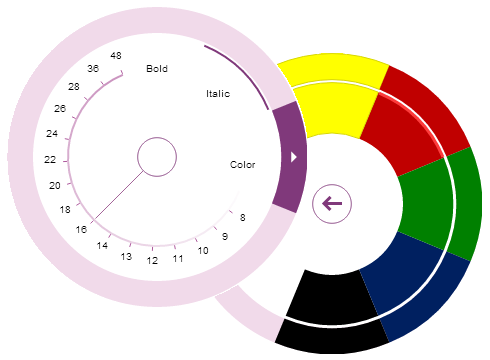

////
|metadata|
{
    "name": "whats-new-in-2014-volume-1",
    "controlName": [],
    "tags": ["Getting Started"],
    "guid": "ee77dd74-771b-470e-ae31-19e8749c40b3","buildFlags": [],
    "createdOn": "2014-03-12T08:49:24.9357442Z"
}
|metadata|
////

= What's New in 2014 Volume 1

== Topic Overview

=== Purpose

This topic gives a brief overview of the new controls and features introduced in the Infragistics WPF 2014 Volume 1 Release.

== What’s New Summary

=== What’s new summary chart

The following table summarizes the new features of the Infragistics® WPF 2014 Volume 1. Additional details follow the summary table.

====  _<<Ref383000576, Excel Engine >>_ 

[options="header", cols="a,a"]
|====
|Feature|Description

|<<_Ref382985468,Password support>>
|This feature provides you the ability to work with password encrypted/protected workbooks.

|====

====  _<<Ref382989956, Office 2013 Theme >>_ 

[options="header", cols="a,a"]
|====
|Feature|Description

|<<_Ref382989968,New theme>>
|The new “Office 2013” theme inspired by the new MS Office 2013 presents a nice and clean look and feel.

|====

====  _<<Ref383000599, xamComboEditor,   xamMultiColumnComboEditor >>_ 

[options="header", cols="a,a"]
|====
|Feature|Description

|<<_Ref382846221,Configurable selected value and selected values collection>>
|This feature provides flexible way for setting/getting the selected value(s) in the control.

|<<_Ref382846679,Configurable selected data items collection>>
|This feature provides flexible way for setting/getting the selected items in the control.

|<<_Ref382846687,Configurable selected data items collection via a data model property’s value>>
|This feature provides flexible way for setting/getting the selected items through a data model property value in the control.

|<<_Ref382846798,Configurable Drop-Down button visibility>>
|This feature provides options for configuring the Drop-Down button visibility in the control.

|<<_Ref382846892,Configurable Drop-Down min/max width>>
|This feature provides customization of the maximum/minimum width of the control’s Drop-Down.

|<<_Ref382896266,Custom item filtering>>
|This feature provides functionality for implementing more complex data items filters.

|<<_Ref382896361,Exposing selected/unselected items in SelectionChangedEventArgs>>
|This feature provides additional information about the selected/unselected items preserved in the SelectionChanged event’s argument.

|====

====  _<<Ref383000610, xamComboEditor >>_ 

[options="header", cols="a,a"]
|====
|Feature|Description

|<<_Ref382895799,Drop-Down resize handle>>
|A resize handle is added to the control for users to resize the control’s Drop-Down.

|====

====  _<<Ref382895884, xamDataChart >>_ 

[options="header", cols="a,a"]
|====
|Feature|Description

|<<_Ref383095602,New default style>>
|This is a new default style for the _xamDataChart_ control featuring multiple visual changes improving the charts appearance.

|====

====  _<<Ref383000731, xamDataGrid >>_ 

[options="header", cols="a,a"]
|====
|Feature|Description

|<<_Ref382984899,Record numbering>>
|This feature provides a new property to select one of several different numbering types in the _xamDataGrid’s_ record selector column.

|<<_Ref382984913,Selected data items property>>
|This feature provides a new `SelectedDataItems` property to operate with the currently selected items of the _xamDataGrid._

|====

====  _<<Ref383000626, xamDataTree >>_ 

[options="header", cols="a,a"]
|====
|Feature|Description

|<<_Ref382895891,Configurable active data item>>
|This feature provides a new property to set/get the currently active data item in the control.

|====

====  _<<Ref383000636, xamDiagram (CTP) >>_ 

[options="header", cols="a,a"]
|====
|Feature|Description

|<<_Ref382908052,New Control>>
|A new diagramming control.

|====

====  _<<Ref383000645, xamInputs >>_

[options="header", cols="a,a"]
|====
|Feature|Description

|<<_Ref382908048,Enabling/Disabling undo/redo>>
|This feature provides a new property to turn on/off the undo/redo operations in the xamInputs controls.

|====

====  _<<Ref383000650, xamPivotGrid >>_

[options="header", cols="a,a"]
|====
|Feature|Description

|<<_Ref382908057,KPIs visualization support>>
|The _xamPivotGrid_ and the _xamPivotDataSelector_ controls support graphical visualization of Key Performance Indicators (KPIs).

|====

====  _<<Ref382982190, xamRadialMenu >>_ 

[options="header", cols="a,a"]
|====
|Feature|Description

|<<_Ref382982211,New control>>
|The _xamRadialMenu_ control is essentially a context menu presenting its items in a circular arrangement around a center button.

|====

====  _<<Ref382987387, xamRibbon >>_

[options="header", cols="a,a"]
|====
|Feature|Description

|<<_Ref382987462,Backstage 2013>>
|The feature introduces a new look of _xamRibbon’s_ backstage when the new “Office 2013” theme is used.

|<<_Ref382987474,Tab item area toolbar>>
|This feature allows you to create a toolbar located next to the _xamRibbon’s_ tabs.

|====

====  _<<Ref382986857, xamRichTextEditor >>_

[options="header", cols="a,a"]
|====
|Feature|Description

|<<_Ref382986881,HTML import/export>>
|The feature allows you to import or export HTML data from and to the _xamRichTextEditor_ control.

|<<_Ref382986886,IME support>>
|This feature allows you to input Asian languages directly in the _xamRichTextEditor_ control’s editing area.

|====

====  _<<Ref382986870, xamSyntaxEditor >>_

[options="header", cols="a,a"]
|====
|Feature|Description

|<<_Ref382986894,IME support>>
|This feature allows you to input Asian languages directly in the _xamSyntaxEditor_ control’s editing area.

|====

[[_Ref382985454]]
[[_Ref382833905]]
[[_Ref382836652]]

[[_Ref383000576]]
== _Excel Engine_

[[_Ref382985468]]

=== Password support

This feature provides you the ability to work with password encrypted/protected workbooks.

==== Related topics:

link:igexcelengine-password-support.html[Password Support]

[[_Ref382989956]]
== _Office 2013 Theme_

[[_Ref382989968]]

=== New theme

The new “Office 2013” theme inspired by the new MS Office 2013 presents a nice and clean look and feel. Not only does this new Office 2013 theme apply to all Infragistics controls, but also on the common Microsoft controls.

==== Related topics:

* link:designers-guide-using-themes.html[Themes]
* link:ms-controls-implicit-themes.html[MS Controls Implicit Themes]

[[_Ref383000599]]
== _xamComboEditor_  _,_   _xamMultiColumnComboEditor_

[[_Ref382846221]]

=== Configurable selected value and selected values collection

This feature provides the developer with the following new properties to set/get the selected value or selected values collection in the controls:

* `SelectedValue`
* `SelectedValues`
* `SelectedValuePath`

==== Related topics:

* link:xamcomboeditor-performing-selection-programmatically.html[Performing Selection Programmatically (xamComboEditor)]
* link:xammulticee-performing-selection-programmatically.html[Performing Selection Programmatically (xamMultiColumnComboEditor)]

[[_Ref382846679]]

=== Configurable selected data items collection

This feature provides the developer with the enhanced `SelectedItems` property to set/get the selected data items collection in the controls.

==== Related topics:

* link:xamcomboeditor-performing-selection-programmatically.html[Performing Selection Programmatically (xamComboEditor)]
* link:xammulticee-performing-selection-programmatically.html[Performing Selection Programmatically (xamMultiColumnComboEditor)]

[[_Ref382846687]]

=== Configurable selected data items collection via a data model property’s value

This feature provides the developer with a new `IsSelectedMemberPath` property to configure the data model property name which boolean value defines the selected/unselected state of a data item in the controls.

==== Related topics:

* link:xamcomboeditor-performing-selection-programmatically.html[Performing Selection Programmatically (xamComboEditor)]
* link:xammulticee-performing-selection-programmatically.html[Performing Selection Programmatically (xamMultiColumnComboEditor)]

[[_Ref382846798]]

=== Configurable Drop-Down button visibility

This feature provides the developer with a new `DropDownButtonDisplayMode` property to configure when the control’s Drop-Down button is displayed. The options are – always visible (default), on mouse over, when focused and never visible.

==== Related topics:

* link:xamcomboeditor-adding-xamcomboeditor-to-your-page.html[Adding xamComboEditor to Your Page]
* link:xammulticce-adding.html[Adding xamMultiColumnComboEditor to Your Page]

[[_Ref382846892]]

=== Configurable Drop-Down min/max width

This feature provides the developer with the following new properties to configure the control’s Drop-Down maximum and minimum width:

* `MinDropDownWidth`
* `MaxDropDownWidth`

==== Related topics:

* link:xamcomboeditor-dropdown-resizing.html[Configuring the Drop-Down Size (xamComboEditor)]
* link:xammulticee-configuring-the-drop-down.html[Configuring the Drop-Down (xamMultiColumnComboEditor)]

[[_Ref382896266]]

=== Custom item filtering

This feature provides the developer with functionality for customizing the item filtering. Now, it is possible to create more complex filters, to specify multiple data fields to be filtered or add multiple filter conditions per data field.

==== Related topics:

* link:xamcomboeditor-custom-filtering.html[Configuring Item Filtering (xamComboEditor)]
* link:xammulticee-configuring-item-filtering.html[Configuring Item Filtering (xamMultiColumnComboEditor)]

[[_Ref382896361]]

=== Exposing selected/unselected items in SelectionChangedEventArgs

This feature provides the developer with additional information about the selected/unselected items preserved in the `SelectionChanged` event’s argument AddedItems and RemovedItems collections.

==== Related topics:

* link:xamcomboeditor-performing-selection-programmatically.html[Performing Selection Programmatically (xamComboEditor)]
* link:xammulticee-performing-selection-programmatically.html[Performing Selection Programmatically (xamMultiColumnComboEditor)]

[[_Ref382895789]]

[[_Ref383000610]]
== _xamComboEditor_

[[_Ref382895799]]

=== Drop-Down resize handle

A resize handle is added in the  _xamComboEditor_   Drop-Down so the users can easily resize the Drop-Down at runtime.

==== Related topics:

* link:xamcomboeditor-dropdown-resizing.html[Configuring the Drop-Down Size (xamComboEditor)]

[[_Ref382984879]]
[[_Ref382895884]]
== _xamDataChart_

[[_Ref383095602]]

=== New default style

A new xamDataChart style featuring multiple visual changes and new property settings improving the overall look and feel of the chart is now available.

The following screenshots compare the chart new default style to the previous style.

*New Default Style:*

*Previous Default Style:*

[[_Ref383000731]]
== _xamDataGrid_

[[_Ref382984899]]

=== Record numbering

The Record Numbering feature allows you to display one of several different numbering types in the  _xamDataGrid’s_   record selector column.

==== Related topics:

link:xamdatagrid-record-numbering.html[Record Numbering]

[[_Ref382984913]]

=== Selected data items property

This feature introduce a new `SelectedDataItems` property allowing you to operate with the currently selected items of the  _xamDataGrid_   while using the Model-View-ViewModel (MVVM) architecture.

==== Related topics:

link:xamdatagrid-selected-data-items.html[Selected Data Items]

[[_Ref383000626]]
== _xamDataTree_

[[_Ref382895891]]

=== Configurable active data item

This feature provides the developer with a new `ActiveDataItem` property to identify and manipulate the currently active  _xamDataTree_   data item while using the Model-View-ViewModel (MVVM) architecture.

==== Related topics:

* link:xamdatatree-active-data-item.html[Configuring Active Data Item]

[[_Ref382895914]]
[[_Ref382908033]]

[[_Ref383000636]]
== _xamDiagram (CTP)_

[[_Ref382908052]]

=== New Control

The WPF  _xamDiagram_   allows you to create your very own diagramming solution, with all of the features that you would expect in a diagramming tool such as Visio. The  _xamDiagram_   ships with all the features you will need to start writing anything from simple flow charts and activity diagrams, to complex LinqToSQL relationship diagrams.

==== Related topics:

* link:xamdiagram-overview.html[xamDiagram Overview]

[[_Ref382908037]]

[[_Ref383000645]]
== _xamInputs_

[[_Ref382908048]]

=== Enabling/Disabling undo/redo

This feature provides the developer with a new `IsUndoEnabled` property for turning on/off undo/redo operations in the input controls.

[[_Ref382908040]]

[[_Ref383000650]]
== _xamPivotGrid_

[[_Ref382908057]]

=== KPIs visualization support

KPIs data can be visualized graphically through the combined use of the  _xamPivotDataSelector_   and the  _xamPivotGrid_   control. The  _xamPivotDataSelector_   control displays a separate folder, containing the KPI members calculated on the server. The  _xamPivotGrid_   displays a graphical representation of a KPI or its actual value. Custom KPIs cell templates are supported as well.

==== Related topics:

* link:xampivotgrid-kpis-visualization-overview.html[KPIs Visualization Overview (xamPivotGrid, xamPivotDataSelector)]

[[_Ref382982190]]
== _xamRadialMenu_

[[_Ref382982211]]

=== New control

The  _xamRadialMenu_   control is essentially a context menu presenting its items in a circular arrangement around a center button. The circular arrangement of the items speeds up items selection, because each item is equally positioned in relation to the center. The  _xamRadialMenu_   supports different item types for choosing numerical values, color values or performs actions. Sub-Items are also supported.

==== Related topics:

link:xamradialmenu.html[xamRadialMenu]

[[_Ref382987387]]
== _xamRibbon_

[[_Ref382987462]]

=== Backstage 2013

The feature introduce a new look of  _xamRibbon’s_   backstage when the new “Office 2013” theme is used.

==== Related topics:

link:xamribbon-applicationmenu2010-overview.html[Application Menu 2010 Overview]

[[_Ref382987474]]

=== Tab item area toolbar

This feature allows you to create a toolbar located next to the  _xamRibbon’s_   tabs.

==== Related topics:

link:xamribbon-tab-item-area-toolbar.html[Tab Item Area Toolbar]

[[_Ref382986857]]
== _xamRichTextEditor_

[[_Ref382986881]]

=== HTML import/export

The feature allows you to import or export HTML data from and to the  _xamRichTextEditor_   control by invoking HTML serializer’s methods or by binding an HTML document adapter.

==== Related topics:

link:xamrichtexteditor-import-export-html.html[Import/Export HTML]

[[_Ref382986886]]

=== IME support

This feature allows you to input Asian languages directly in the  _xamRichTextEditor_   control’s editing area using input method compositions and candidate lists.

==== Related topics:

link:xamrichtexteditor-ime-support.html[IME Support]

[[_Ref382986870]]
== _xamSyntaxEditor_

[[_Ref382986894]]

This feature allows you to input Asian languages directly in the  _xamSyntaxEditor_   control’s editing area using input method compositions and candidate lists.

==== Related topics:

link:xamsyntaxeditor-ime-support.html[IME Support]