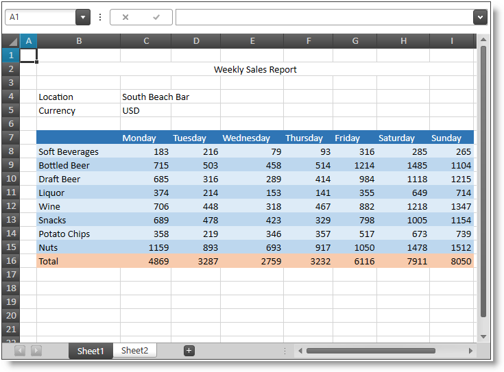

////

|metadata|
{
    "name": "whats-new-in-2014-volume-2",
    "controlName": [],
    "tags": ["Getting Started"],
    "guid": "3986ab37-5ca6-4d4a-9dd4-acedde68f6ca",  
    "buildFlags": [],
    "createdOn": "2014-09-11T10:10:12.9875132Z"
}
|metadata|
////

= What's New in 2014 Volume 2

== Topic Overview

=== Purpose

This topic gives a brief overview of the new controls and features introduced in the Infragistics WPF 2014 Volume 2 Release.

== What’s New Summary

=== What’s new summary chart

The following table summarizes the new features of the Infragistics® WPF 2014 Volume 2. Additional details follow the summary table.

====  _<<Ref398190917, Infragistics Excel Engine >>_ 

[options="header", cols="a,a"]
|====
|Feature|Description

|<<_Ref398192011,Binding Facilitations>>
|MVVM binding facilitations added.

|<<_Ref398192020,Cells, Columns and Rows Manipulation>>
|Cells, columns and rows manipulation operations added.

|<<_Ref398192028,Undo/Redo Support>>
|Undo and redo support (when used with the _xamSpreadsheet_ control) added.

|====

====  _<<Ref398198437, Infragistics Theme Manager >>_ 

[options="header", cols="a,a"]
|====
|Feature|Description

|<<_Ref398198876,New Control>>
|_Infragistics Theme Manager_ provides a quick and easy way for applying a theme to all Infragistics controls as well as to the Microsoft WPF common controls.

|====

====  _<<Ref398199259, xamColorPicker >>_ 

[options="header", cols="a,a"]
|====
|Feature|Description

|<<_Ref398205955,Previewing the Selected Color>>
|The new SelectedColorPreview property gets/sets the color that is currently being hovered.

|====

====  _<<Ref398213088, xamDataPresenter >>_ 

[options="header", cols="a,a"]
|====
|Feature|Description

|<<_Ref398216063,Binding Field and FieldLayout Objects to DataContext>>
|MVVM binding facilitations added.

|<<_Ref398216071,Binding Field, FieldSettings, FieldLayout and FieldLayoutSettings to MVVM Properties>>
|The new FieldBinding markup extension facilitates the binding of Field, FieldSettings, FieldLayout and FieldLayoutSettings to MVVM properties.

|<<_Ref398216082,Binding Cell Settings to Data Item Properties>>
|The new CellBindings collection property facilitates the binding of a cell settings to properties exposed off the associated data item.

|<<_Ref398216090,Specific Editor Fields>>
|The new editor fields offer an easy and straightforward way to specify a particular editor to handle the specific data type.

|<<_Ref398216097,Template Field>>
|The Template Field provides functionality for specifying custom data templates for both display and edit modes in the _xamDataPresenter_ controls.

|<<_Ref398216105,Unbound Field>>
|Now every Field in the _xamDataPresenter_ controls can be configured to be an unbound field.

|<<_Ref398216112,New properties IsTabStop, IsEnabled, IsEnabledInAddRecord and IsReadOnly>>
|New properties for configuring the editing of Field and Cell objects are added.

|====

====  _<<Ref398206270, xamDataTree >>_ 

[options="header", cols="a,a"]
|====
|Feature|Description

|<<_Ref398207086,Selected Data Items>>
|The new SelectedDataItems property gets/sets the selected data items.

|<<_Ref398207093,Modifying the Item Selection via a Data Model Boolean Property’s Value>>
|The new IsSelectedMemberPath property configures the path to the data model boolean property that determines if a data item is selected or not.

|====

====  _<<Ref396728561, xamDiagram >>_ 

[options="header", cols="a,a"]
|====
|Feature|Description

|<<_Ref382908052,New Control>>
|A new diagramming control.

|====

====  _<<Ref398131332, xamPropertyGrid >>_ 

[options="header", cols="a,a"]
|====
|Feature|Description

|<<_Ref398131389,New Control>>
|The control provides user friendly properties editing experience.

|====

====  _<<Ref398131340, xamSpreadsheet >>_ 

[options="header", cols="a,a"]
|====
|Feature|Description

|<<_Ref398131381,New Control>>
|The control allows visualizing and editing of spreadsheet data.

|====

====  _<<Ref398131341, xamPivotGrid >>_ 

[options="header", cols="a,a"]
|====
|Feature|Description

|<<_Ref398131382,Printing>>
|Built-in functionality for printing OLAP data

|====

[[_Ref398190917]]
== _Infragistics Excel Engine_

[[_Ref398192011]]

=== Binding Facilitations

The  _Infragistics Excel Engine’s_   `Workbook` and `Worksheet` classes are now implementing the `INotifyPropertyChanged` interface to facilitate binding to their properties.

==== Related topics:

* link:{ApiPlatform}documents.excel.v{ProductVersion}~infragistics.documents.excel.workbook.html[Workbook]
* link:{ApiPlatform}documents.excel.v{ProductVersion}~infragistics.documents.excel.worksheet.html[Worksheet]

[[_Ref398192020]]

=== Cells, Columns and Rows Manipulation

The  _Infragistics Excel Engine_   now supports methods for adding and removing cells, columns and rows.

==== Related topics:

link:igexcelengine-inserting-and-deleting-cells.html[Inserting and Deleting Cells, Columns and Rows (Infragistics Excel Engine)]

[[_Ref398192028]]

=== Undo/Redo Support

The  _Infragistics Excel Engine_   now supports undo and redo operations when used with the  _xamSpreadsheet_   control.

==== Related topics:

link:spreadsheet-features.html[Features Overview (xamSpreadsheet)]

[[_Ref398198437]]
== _Infragistics Theme Manager_

[[_Ref398198876]]

=== New Control

The main purpose of the  _Infragistics Theme Manager_   is to provide an easier way for applying a specified theme to an application or a control with a single line of code.

==== Related topics:

link:thememanager-overview.html[Features Overview (ThemeManager)]

[[_Ref398199259]]
== _xamColorPicker_

[[_Ref398205955]]

=== Previewing the Selected Color

The new `SelectedColorPreview` property gets/sets the color that is currently being hovered.

==== Related topics:

link:xamcolorpicker-selected-color.html[Configuring Selected Color]

[[_Ref398213088]]
== _xamDataPresenter_

[[_Ref398216063]]

=== Binding Field and FieldLayout Objects to DataContext

The Field/FieldLayout `DataContext` property facilitates the MVVM binding.

==== Related topics:

link:xamdatapresenter-binding-field-fieldlayout-to-mvvm.html[Binding Field, FieldSettings, FieldLayout and FieldLayoutSettings to MVVM Properties]

[[_Ref398216071]]

=== Binding Field, FieldSettings, FieldLayout and FieldLayoutSettings to MVVM Properties

The new `FieldBinding` markup extension facilitates the binding of Field, FieldSettings, FieldLayout and FieldLayoutSettings to MVVM properties.

==== Related topics:

link:xamdatapresenter-binding-field-fieldlayout-to-mvvm.html[Binding Field, FieldSettings, FieldLayout and FieldLayoutSettings to MVVM Properties]

[[_Ref398216082]]

=== Binding Cell Settings to Data Item Properties

The new `CellBindings` collection property facilitates the binding of a cell settings to properties exposed off the associated data item.

==== Related topics:

link:xamdatapresenter-binding-cell-settings-data-item-properties.html[Binding Cell Settings to Data Item Properties]

[[_Ref398216090]]

=== Specific Editor Fields

The new specific editor fields offer an easy and straightforward way to specify a particular editor to handle the specific data type.

The following editor fields are provided:

* CheckBox Field
* ComboBox Field
* Currency Field
* DateTime Field
* Masked Text Field
* Numeric Field
* Text Field

==== Related topics:

link:xamdatapresenter-configuring-specific-editor-fields.html[Configuring Specific Editor Fields]

[[_Ref398216097]]

=== Template Field

Template field provides functionality for specifying custom data templates for both display and edit modes in the  _xamDataPresenter_   controls.

==== Related topics:

link:xamdatapresenter-configuring-template-field.html[Configuring Template Field]

[[_Ref398216105]]

=== Unbound Field

Now every `Field` can be configured to be unbound just by setting the `BindingType` property to `Unbound`.

==== Related topics:

link:xamdatapresenter-add-unbound-fields-to-a-datapresenter-control.html[Configuring Unbound Field]

[[_Ref398216112]]

=== New properties IsTabStop, IsEnabled, IsEnabledInAddRecord and IsReadOnly

The following new properties are added for the `Field` object: `IsReadOnly`, `IsEnabledInAddRecord` and `IsEnabled` and `IsTabStop` property for `Cell` or `Field`.

==== Related topics:

* link:xamdatapresenter-configuring-readonly-fields-disabling-cells.html[Configuring Read-only Fields and Disabling Field’s Cells]
* link:xamdatapresenter-configuring-custom-tab-navigation.html[Configuring Custom Tab Navigation]

[[_Ref398206270]]
== _xamDataTree_

[[_Ref398207086]]

=== Selected Data Items

The new `SelectedDataItems` property sets/gets the collection of selected data items.

==== Related topics:

link:xamdatatree-performing-selection-programmatically.html[Performing Selection Programmatically]

[[_Ref398207093]]

=== Modifying the Item Selection via a Data Model Boolean Property’s Value

Configure the selected/unselected data items using an underlying data model’s boolean property value to determine the items’ current state in the  _xamDataTree_   control. This data model property’s name is set through the new `IsSelectedMemberPath` property.

==== Related topics:

link:xamdatatree-performing-selection-programmatically.html[Performing Selection Programmatically]

[[_Ref396728561]]
== _xamDiagram_

[[_Ref382908052]]

=== New Control

The  _xamDiagram_   control (released as a CTP with the WPF 2014 Volume 1 release) allows you to create your very own diagramming solution, with all of the features that expected from an advanced diagramming tool. The  _xamDiagram_   ships with all the features you will need to start writing anything from simple flow charts and activity diagrams, to complex LinqToSQL relationship diagrams as well as with support for data binding and MVVM.

==== Related topics:

link:xamdiagram-overview.html[xamDiagram Overview]

[[_Ref398131332]]
== _xamPropertyGrid_

[[_Ref398131389]]

The  _xamPropertyGrid_   control provides the user with a friendly properties editing experience of a single object or multiple objects. The following screenshot shows the  _xamPropertyGrid_   while showing/editing a lot of object’s properties grouped by categories:

image::images/xamPropertyGrid_09.png[]

==== Related topics:

link:xampropertygrid.html[xamPropertyGrid]

[[_Ref398131340]]
== _xamSpreadsheet_

[[_Ref398131381]]

The  _xamSpreadsheet_   control allows visualizing and editing of spreadsheet data, represented by the data model supported by the  _Infragistics Excel Engine_  .

The following screenshot shows the  _xamSpreadsheet_   control displaying some spreadsheet data:

==== Related topics:

link:spreadsheet.html[xamSpreadsheet]

[[_Ref398131341]]
== _xamPivotGrid_

[[_Ref398131382]]

=== Printing

Using the WPF Reporting framework, the xamPivotGrid can be printed or exported to an XPS document.

==== Related topics:

link:xampivotgrid-printing.html[Printing xamPivotGrid]