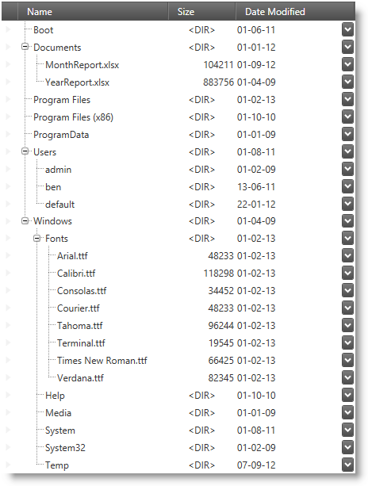

////

|metadata|
{
    "name": "whats-new-in-2015-volume-1",
    "controlName": [],
    "tags": ["Getting Started"],
    "guid": "bb18c4aa-2a00-42ea-bd8e-10e2873ff849",  
    "buildFlags": [],
    "createdOn": "2015-02-19T14:32:38.2767368Z"
}
|metadata|
////

= What's New in 2015 Volume 1

== Topic Overview

=== Purpose

This topic gives a brief overview of the new controls and features introduced in the Infragistics WPF 2015 Volume 1 Release.

== _Infragistics Excel Library_

[[_Ref398192011]]

=== Hyperlinks support

The data model of the library now supports creating of and operating with hyperlinks.

==== Related topic:

link:igexcelengine-addinghyperlinktoworksheet.html[Adding a Hyperlink to a Worksheet (Infragistics Excel Engine)]

=== Workbook protection

The data model of the library now allows you to protect workbooks. Workbook protection disallow adding, renaming, reordering and deleting of worksheets.

==== Related topic:

link:igexcelengine-workbook-protection.html[Workbook Protection (Infragistics Excel Engine)]

[[_Ref398192028]]

=== Worksheet protection

The data model of the library now allows you to protect worksheets.

==== Related topic:

link:igexcelengine-worksheet-protection.html[Worksheet Protection (Infragistics Excel Engine)]

== _xamComboEditor_

=== Binding to collections of primitive types

The  _xamComboEditor_   control supports binding to collections of primitive types such as `bool`, `char`, `double` etc. types. The control supports also binding to `enum` and collections of `string` and `DateTime` data.

==== Related Topic:

link:xamcomboeditor-support-for-primitives.html[Binding to Collections of Primitive Types (xamComboEditor)]

=== Configuring the minimum drop-down height

A new property `MinDropDownHeight` is added to provide functionality for configuring the minimum drop-down height of the  _xamComboEditor_   control.

==== Related Topic:

link:xamcomboeditor-dropdown-resizing.html[Configuring the Drop-Down (xamComboEditor)]

== _xamMultiColumnComboEditor_

A new property `MinDropDownHeight` is added to provide functionality for configuring the minimum drop-down height of the  _xamMultiColumnComboEditor_   control.

==== Related Topic:

link:xammulticee-configuring-the-drop-down.html[Configuring the Drop-Down (xamMultiColumnComboEditor)]

== _xamDataGrid_

=== Configuring field and record resizing

The control now supports configuring the areas where fields and/or records can be resized.

==== Related topics:

link:{ApiPlatform}datapresenter.v{ProductVersion}~infragistics.windows.datapresenter.fieldlayoutsettings~fieldresizingarea.html[FieldResizingArea]

link:{ApiPlatform}datapresenter.v{ProductVersion}~infragistics.windows.datapresenter.fieldlayoutsettings~recordresizingarea.html[RecordResizingArea]

== _xamDataPresenter_

=== Binding to selected data item

The control now allows you MVVM-friendly binding to the last selected item using a property.

==== Related topic:

link:xamdatagrid-selected-data-items.html[Working with Selected Data Items (xamDataGrid)]

== _xamGantt_

=== Sections resizing

The control now supports resizing of the grid and chart sections.

==== Related topic:

link:xamgantt-configuring-sections.html[Configuring Sections (xamGantt)]

== _xamSpreadsheet_

=== Hyperlinks support

The control now displayes hyperlinks and allows the user to interact with them:

==== Related topics:

link:spreadsheet-uiu-hyperlinks.html[Hyperlinks Interactions (xamSpreadsheet)]

link:spreadsheet-work-hyperlinks.html[Working with Hyperlinks (xamSpreadsheet)]

link:spreadsheet-uiu-context-menu.html[Context Menu Interactions (xamSpreadsheet)]

=== Obtain hovered cell

The control now allows you to obtain a worksheet's cell by providing a point.

==== Related sample:

link:{SamplesURL}/spreadsheet/obtain-hovered-cell[Obtain Hovered Cell]

=== Multiple worksheets selection

The control now allows you to select multiple worksheets and perform group operations over them.

==== Related topics:

link:spreadsheet-conf-worksheets.html[Configuring Worksheets (xamSpreadsheet)]

link:spreadsheet-work-selection-formatting.html[Setting or Obtaining Active Selection's Formatting (xamSpreadsheet)]

=== Workbook and worksheet protection

The control now supports disabling of certain user functionality when workbook and/or worksheet protections are engaged.

==== Related topics:

link:spreadsheet-uiu-tab-bar-area.html[Tab Bar Area Interactions (xamSpreadsheet)]

link:spreadsheet-conf-tab-bar-area.html[Configuring Tab Bar Area (xamSpreadsheet)]

=== Underline support

The control now renders underline and double-underline text.

==== Related topic:

link:spreadsheet-features.html[Features Overview (xamSpreadsheet)]

== _xamTreeGrid_

=== New control

The  _xamTreeGrid_   control is the latest addition to the Data Presenter family of controls. It arranges data in a tree grid layout. Essentially the control is a  _xamDataPresenter_   that implements a single view (a tree view) which cannot by dynamically switched.

==== Related topic:

link:xamtreegrid.html[xamTreeGrid]