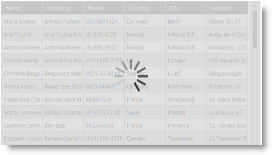
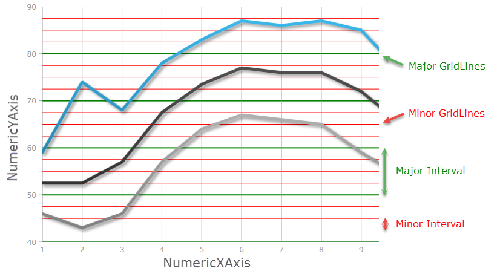
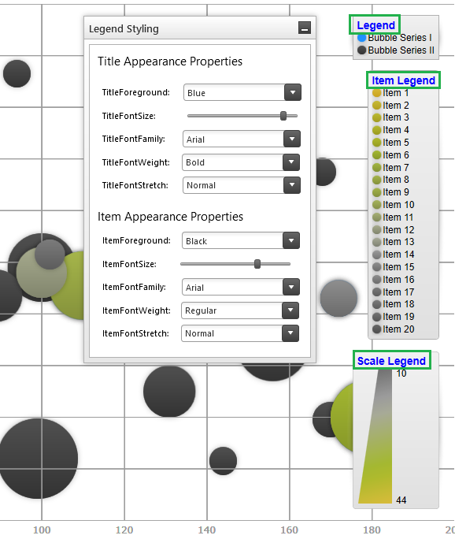
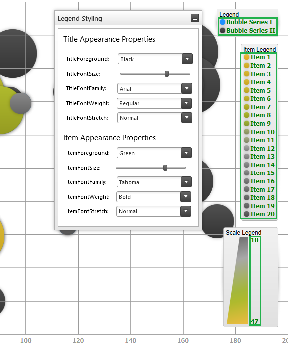
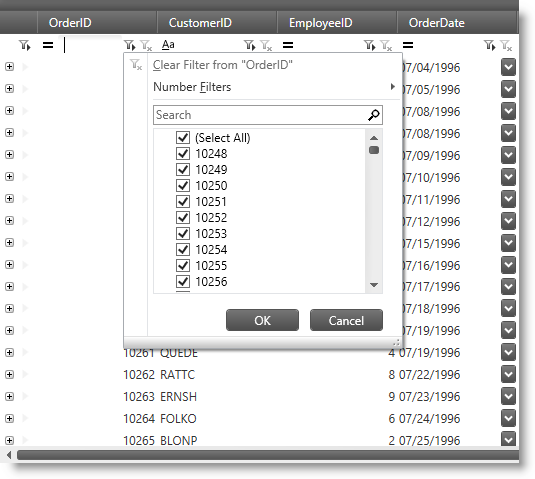

////

|metadata|
{
    "name": "whats-new-in-2015-volume-2",
    "controlName": [],
    "tags": ["Getting Started"],
    "guid": "fa57d2d5-32d9-40ef-9453-57883b983747",  
    "buildFlags": [],
    "createdOn": "2015-05-18T12:48:29.4239636Z"
}
|metadata|
////

= What's New in 2015 Volume 2

== Topic Overview

=== Purpose

This topic gives a brief overview of the new controls and features introduced in the Infragistics WPF 2015 Volume 2 Release.

== _Infragistics Excel Library_

[[_Ref398192011]]

=== Operating with worksheet table rows and columns

The data model of the library now supports inserting and deleting of worksheet table's rows and columns.

==== Related topic:

link:igexcelengine-addingtabletoworksheet.html[Adding a Table to a Worksheet (Infragistics Excel Engine)]

== _Infragistics Syntax Parsing Engine_

[[_Ref398192011]]

=== Syntax tree created event

The parsing engine now supports an event which is raised after the syntax tree is created and before it is returned to the text document.

==== Related topic:

link:ig-spe-custom-diagnostics-and-annotations.html[Custom Diagnostics and Annotations (Syntax Parsing Engine)]

== _xamBusyIndicator_

=== New control

The  _xamBusyIndicator_   is a ContentControl that provides visual notification that a long-running activity has started as well as displays the actual progress.

==== Related topic:

link:xambusyindicator.html[xamBusyIndicator]

== _xamComboEditor_

=== Handling enum data type

The  _xamComboEditor_   now supports customization of the process of populating the dropdown when bound to an enum data type.

==== Related topic:

link:xamcomboeditor-handling-enums.html[Handling Enum Data Type (xamComboEditor)]

== _xamDataChart_

=== Major and Minor Axis Intervals

The  _xamDataChart now supports both Major and Minor intervals which are displayed perpendicular to its axes_  .

The following screenshot displays a major interval on the NumericYAxis, using major interval value of 10, with a green stroke; and a minor interval on the NumericYAxis, using minor interval value of 2.5, with a red stroke.

==== Related topic:

link:datachart-configuring-major-and-minor-intervals.html[Configuring Major and Minor Intervals]

=== Legend Title and Items Font

The  _xamDataChart's Legend, ItemsLegend and ScaleLegend now supports configuration of its font appearances._

The following screenshot displays a custom Legend Title using the Arial font, in Bold of size 14 with a Blue foreground for all three supported Legend types, (from top to bottom - Legend, ItemLegend and ScaleLegend).

This screenshot displays a custom Legend Items Font using the Tahoma font style, in Bold of size 12 with a Green foreground for all three supported Legend types, (from top to bottom - Legend, ItemLegend and ScaleLegend).

==== Related topic:

link:datachart-legends.html#Properties[Chart Legends]

== _xamDataGrid_

=== Clear filter button

The  _xamDataGrid's_   clear filter button is now rendered disabled (semitransparent) when there is no active filter set.

==== Related topic:

link:xamdatapresenter-about-record-filtering.html[About Record Filtering]

=== Excel style filtering dialog

The  _xamDataGrid_   control now supports an Excel style filtering UI in the `FilterRecord` by setting the `FilterOperandUIType` property to `FilterOperandUIType.ExcelStyle`.

==== Related topic:

link:{ApiPlatform}datapresenter{ApiVersion}~infragistics.windows.datapresenter.fieldsettings~filteroperanduitype.html[FilterOperandUIType]

==== Related sample:

link:{SamplesURL}/data-grid/filter-record-ui-options[Filter Record UI Options]

== _xamDataPresenter_

=== Apply templates conditionally

The data presenter controls now support the ability to set conditionally display and edit templates for cells.

==== Related topic:

link:xamdatapresenter-apply-cell-value-templates-conditionally.html[Apply Cell Value Templates Conditionally (xamDataPresenter)]

[[_Ref398192011]]

=== Enhanced data validation support

The data presenter controls now support data items implementing the `INotifyDataErrorInfo` interface.

==== Related topic:

link:xamdatapresenter-validating-data.html[Data Validation Overview]

[[_Ref398192028]]

=== Data source changed event

The data presenter controls now raise an event when the link:{ApiPlatform}datapresenter{ApiVersion}~infragistics.windows.datapresenter.datapresenterbase~datasource.html[DataSource] property has changed.

==== Related topic:

link:{ApiPlatform}datapresenter{ApiVersion}~infragistics.windows.datapresenter.datapresenterbase~datasourcechanged_ev.html[DataSourceChanged Event]

[[_Ref398192011]]

=== Manual refresh of the UI

The data presenter controls now support manual refresh of the control's user interface.

==== Related topic:

link:xamdatapresenter-manual-refresh-controls-ui.html[Manual Refresh of the Control's UI (xamDataPresenter)]

== _xamPropertyGrid_

=== Custom editors for expandable types

The  _xamPropertyGrid_   control now supports custom editors for expandable properties which also remove the collection's nested elements list.

==== Related topics:

link:xampropertygrid-conf-editors.html[Configuring Editors Definitions (xamPropertyGrid)]

link:xampropertygrid-work-expandable-properties.html[Expandable Properties Support (xamPropertyGrid)]

=== Customizing expandable properties

The  _xamPropertyGrid_   control now supports ways to customize the rendering of the expandable properties.

==== Related topic:

link:xampropertygrid-work-expandable-properties.html[Expandable Properties Support (xamPropertyGrid)]

=== Mergable property attribute support

The  _xamPropertyGrid_   control now supports an attribute for excluding combined properties when bound to multiple objects.

==== Related topic:

link:xampropertygrid-list-of-attributes.html[List of Supported Attributes (xamPropertyGrid)]

=== Properties list sorting

The  _xamPropertyGrid_   control now supports declarative and programmatic ways for sorting (reordering) the properties list and its categories.

==== Related topic:

link:xampropertygrid-conf-properties-sorting.html[Properties List Sorting (xamPropertyGrid)]

== _xamRichTextEditor_

=== Obtain text insert location from point

The  _xamRichTextEditor_   control now supports a method for obtaining the nearest valid text insertion location from the supplied point. The point should be relative to the  _xamRichTextEditor_   control.

==== Related topic:

link:{ApiPlatform}controls.editors.xamrichtexteditor{ApiVersion}~infragistics.controls.editors.xamrichtexteditor~getpositionfrompoint.html[GetPositionFromPoint]

== _xamSpreadsheet_

=== Data validation

The  _xamSpreadsheet_   control now supports data validation based on rules set on the worksheet's cells.

==== Related topic:

link:spreadsheet-uiu-data-validation.html[Data Validation Interactions (xamSpreadsheet)]