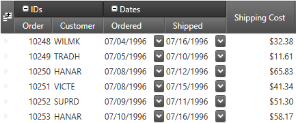
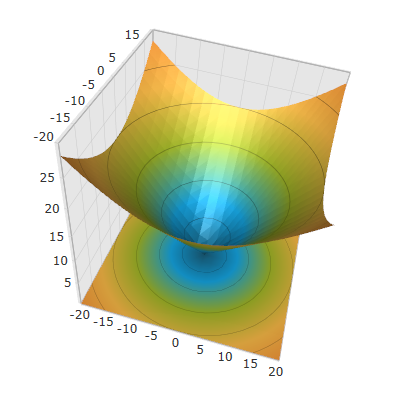
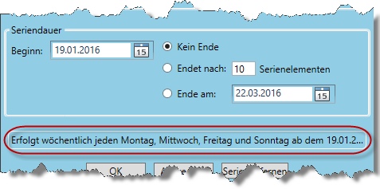
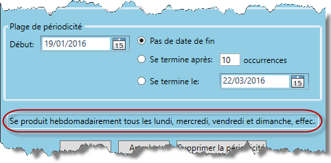

////

|metadata|
{
    "name": "whats-new-in-2016-volume-1",
    "controlName": [],
    "tags": ["Getting Started"],
    "guid": "c10c2400-b859-46da-8ca7-454a824d5c89",  
    "buildFlags": [],
    "createdOn": "2015-11-09T12:44:32.7125469Z"
}
|metadata|
////

= What's New in 2016 Volume 1

== Topic Overview

=== Purpose

This topic gives a brief overview of the new controls and features introduced in the Infragistics WPF 2016 Volume 1 Release.

== _xamDataPresenter_

=== Asynchronous Paging Data Source

This feature allows you to create data sources that support retrieving data from high-latency remote data stores using an asynchronous and paged access strategy.

==== Related topics:

link:xamdatagrid-asynchronouspagingdatasource.html[Asynchronous Paging Data Source (xamDataGrid)]

link:xamdatapresenter-asynchronouspagingdatasource.html[Asynchronous Paging Data Source (xamDataPresenter)]

=== Entering editing mode when the user starts typing

You can allow the user to enter editing mode automatically when a cell is activated and the user enters text or presses the space or backspace keys.

==== Related topic:

link:xamdatapresenter-conf-editing.html[Configuring Editing Behavior (xamDataPresenter)]

=== Field Grouping

The field grouping feature allows you to group several fields under a common field group.

The following screenshot shows the "Order" and the "Customer" fields rendered under a common field group "IDs" and also the "Ordered" and the "Shipped" fields rendered under a common field group "Dates":

==== Related topics:

link:xamdatagrid-field-grouping.html[Field Grouping (xamDataGrid)]

link:xamdatapresenter-field-grouping.html[Field Grouping (xamDataPresenter)]

== _xamScatterSurface3D_

=== New control

The  _xamScatterSurface3D_   control allows fast, visually appealing and customizable three-dimensional surface visualization. The control offers a full set of API options to achieve any 3D surface plotting requirement and very intuitive default values to minimize the coding required.

==== Related topics:

link:surfacechart-overview.html[Overview]

link:surfacechart-getting-started-with-surfacechart.html[Getting Started with Surface Chart]

link:surfacechart-configuring-surfacechart.html[Configuring 3D Surface Chart]

== _xamSchedule_

=== Recurrence dialog's description label visibility

The description label in the  _xamSchedule's_   activity recurrence dialog is now visible by default for German and French languages.

==== Related topic:

link:xamschedule-using-activitydialogs.html[Activity Dialogs]

== _xamTabControl_

=== Tabs dragging and reordering

The  _xamTabControl_   now supports dragging and reordering of tabs.

==== Related topic:

link:xamtabcontrol-tabs-dragging-and-reordering.html[Tabs Dragging and Reordering (xamTabControl)]

== _xamRadialGauge and xamLinearGauge_

=== Needle dragging (CTP)

You can now move the needle on the xamRadialGauge and xamLinearGauge controls by enabling the isDraggingEnabled property.