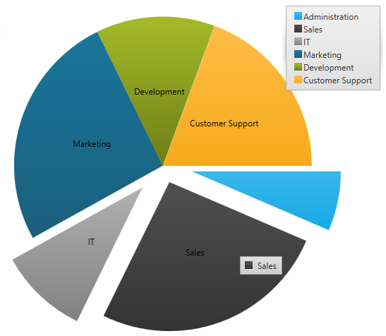
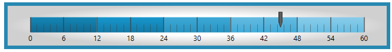
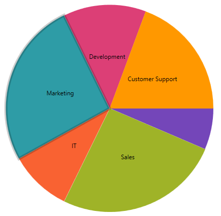
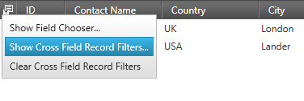

////
|metadata|
{
    "name": "whats-new-in-2016-volume-2",
    "controlName": [""],
    "tags": [],
    "guid": "c8fc4210-e08d-4f52-a9bd-ef7e8eb4b1d8","buildFlags": [],
    "createdOn": "2016-06-02T11:34:48.574014Z"
}
|metadata|
////

= What's New in 2016 Volume 2

== Purpose

This topic gives a brief overview of the new controls and features introduced in the Infragistics WPF 2016 Volume 2 Release.

== xamCategoryChart

A new control, the Category Chart, is added in the Infragistics WPF 2016 volume 2 release. This chart can be easily configured to display category data using a simple API. All you need to do is bind your data (a collection or a collection of collections).

*In XAML:*

----
<ig:XamCategoryChart ItemsSource="{Binding DataCollection}" />
----

By using a smart Data Adapter, the data is analyzed and the appropriate visualization is rendered. For example, if the ChartType is set to "Auto", the control can determine that if it is provided a small data set then a column chart should be plotted, while a larger data set will draw a line chart.

*In XAML:*

----

<ig:XamCategoryChart ItemsSource="{Binding DataCollection}" ChartType="Auto" />

----

However, you can also explicitly specify the chart type by setting the ChartType to Line, Area, Column, Point, Spline, SplineArea, StepArea, StepLine, or Waterfall.

Another example of the intuitive behavior of the Category Chart control is that you do not need to explicitly set the labels. The Category Chart will use the first appropriate string property that it finds and will use that for the labels.

Built to be easily configurable, it uses the Data Chart control as its engine, which means that it benefits from the high performing and powerful Data Chart features.

*Related topics:* +
link:categorychart-overview.html[About xamCategoryChart]

link:categorychart-walkthrough.html[Getting Started]

== xamDataChart

=== *_Performance Enhancements_* 

In the Infragistics 2016 volume 2 release, we significantly improved the performance of the Data Chart control.  

*_New property ConsolidatedColumnVerticalPosition added_* 

A new property link:{ApiPlatform}controls.charts.xamdatachart{ApiVersion}~infragistics.controls.charts.columnseries~consolidatedcolumnverticalposition.html[ConsolidatedColumnVerticalPosition]  is introduced in this release in order to determine the positioning logic to use for columns which have been consolidated into a single visual element.

It accepts the following values:

*Minimum* - Consolidated Items should be positioned using their minimum value. 

*Maximum* - Consolidated Items should be positioned using their maximum value.

*Median* - Consolidated Items should be positioned using their median value. 

*RelativeMinimum* - Consolidated Items should be positioned using the value nearest to the reference value of the corresponding axis. 

*RelativeMaximum* - Consolidated Items should be positioned using the value farthest from the reference value of the corresponding axis.

*Related topics:* +
link:datachart-category-column-series.html[Column Series]

=== *_Design Changes_* 

In the Infragistics 2016 volume 2 release, we redesigned the defaults of the xamDataChart, xamPieChart, xamDoughnutChart, xamFunnelChart, xamRadialGauge, xamLinearGauge, xamBulletGraph and xamSparkline controls.

The following screenshots are some examples:

==== *Column Chart*

*New* 

image:images/chart_design_column_new.png[columnchartnew]

*Previous*

==== *Legend*

*New*

*Previous*

image:images/chart_design_legend_previous.png[legendprevious]

==== *Stacked Area*

*New*

image:images/chart_design_gallery_new.png[gallerynew]

*Previous*

image:images/chart_design_gallery_previous.png[galleryprevious]

==== *Financial Charts*

*New*

*Previous*

image:images/chart_design_financial_previous.png[financialprevious]

==== *Pie Chart*

*New*

*Previous*

==== *Funnel Chart*

*New*

*Previous*

image:images/chart_design_funnel_previous.png[funnelprevious]

==== *Doughnut Chart*

*New*

image:images/chart_design_doughnut_new.png[doughnutnew]

*Previous*

image:images/chart_design_doughnut_previous.png[doughnutprevious]

==== *Radial Gauge*

*New*

image:images/chart_design_radial_gauge_new.png[radialnew]

*Previous*

image:images/chart_design_radial_gauge_previous.png[radialprevious]

==== *Linear Gauge*

*New*

image:images/chart_design_linear_gauge_new.png[linearnew]

*Previous*

==== *Bullet Graph*

*New*

image:images/chart_design_bullet_graph_new.png[bulletnew]

*Previous*

==== *Sparkline*

*New*

image:images/chart_design_sparkline_new.png[sparklinenew]

*Previous*

image:images/chart_design_sparkline_previous.png[sparklineprevious]

==== *_New Chart Series (CTP)_*
Two new chart series, scatter area series and scatter contour series, are added to the chart in this release. These 2 series are a 2D version of the 3D surface chart control. 

*Scatter Areas Series*

Scatter area series is a visual chart element that draws a colored surface, in a Cartesian context, based on a triangulation of X and Y coordinates with a numeric value assigned to each pixel of the surface. You can use this series to plot scientific data such as strength of magnetic field, 3d shapes projected/flattened onto 2d plane, or correlation between 3 numeric columns in your data

image:images/scatter_area_series.png[sparklineprevious]

*Scatter Contour Series*

The scatter contour series can be used to plot the same data as scatter area series but data will be visualized using contour lines instead of interpolated surface area

== xamGeographicMap 

==== *_Legend is displayed for Geographic Map (CTP)_* 

This CTP feature enables the Geographic Map control to display a legend.  

== xamShapeChart (CTP)

The Shape Chart is a CTP control that is added in the Infragistics 2016 volume 2 release. This control displays cartesian and geographic shapes on a chart surface. It can be used display items such as floor plans, diagrams, and maps.  

== xamPieChart

==== *_Slice Selection_* 

You can now select a pie slice on the xamPieChart control. This feature is enabled by default. You can set the link:{PieChartLink}.{PieChartBase}{ApiProp}SelectionMode.html[SelectionMode] property in order to support single or multiple slice selection and then check the link:{PieChartLink}.{PieChartBase}{ApiProp}SelectedItem.html[SelectedItem]  or link:{PieChartLink}.{PieChartBase}{ApiProp}SelectedItems.html[SelectedItems] properties in order to see what data items are associated with those selected slices.

We also added new selection events, some of which are cancelable, so you can stop selection of particular slices from occurring. These events are:

* link:{PieChartLink}.{PieChartBase}{ApiProp}SelectedItemChanging_ev.html[SelectedItemChanging]
* link:{PieChartLink}.{PieChartBase}{ApiProp}SelectedItemChanged_ev.html[SelectedItemChanged]
* link:{PieChartLink}.{PieChartBase}{ApiProp}SelectedItemsChanging_ev.html[SelectedItemsChanging]
* link:{PieChartLink}.{PieChartBase}{ApiProp}SelectedItemsChanged_ev.html[SelectedItemsChanged]

You can see which pie slice is selected as it has a different style. The following screenshot shows the Marketing slice selected.

*Related topics:* +
link:piechart.html[xamPieChart]

link:piechart-selection-and-explosion.html[Selection and Explosion]

==== *_New Event for the Pie Chart_*

The xamPieChart control now has a link:{ApiPlatform}controls.charts.xamdatachart{ApiVersion}~infragistics.controls.charts.piechartbase~labelclick_ev.html[LabelClick event] that fires when the labels of the pie slices are clicked.

*Related topic:*

link:piechart-using-piechart.html[Configuring xamPieChart]

==== *_Label Coloring_*

You can now specify the color of the labels depending on whether they are rendered inside or outside of a pie slice. These properties are link:{ApiPlatform}controls.charts.xamdatachart{ApiVersion}~infragistics.controls.charts.piechartbase~labelinnercolor.html[LabelInnerColor] property and link:{ApiPlatform}controls.charts.xamdatachart{ApiVersion}~infragistics.controls.charts.piechartbase~labeloutercolor.html[LabelOuterColor] property

image:images/piechart_inner_outer_label_color.png[piechartlabelcolor]

*Related topic:*

link:{ApiPlatform}controls.charts.xamdatachart{ApiVersion}~infragistics.controls.charts.piechartbase~labelinnercolor.html[LabelInnerColor] property

link:{ApiPlatform}controls.charts.xamdatachart{ApiVersion}~infragistics.controls.charts.piechartbase~labeloutercolor.html[LabelOuterColor] property

== Infragistics Excel Engine

*_Obtain All References for a Given Rule_* 

The link:{ApiPlatform}documents.excel{ApiVersion}~infragistics.documents.excel.datavalidationrulecollection.html[DataValidationRuleCollection] now exposes a link:{ApiPlatform}documents.excel{ApiVersion}~infragistics.documents.excel.datavalidationrulecollection~getallreferences.html[GetAllReferences] method which returns a collection of references that have data validation rules equivalent to the given rule. 

*_New Method for Comparing Data Validation Rules_*

The link:{ApiPlatform}documents.excel{ApiVersion}~infragistics.documents.excel.datavalidationrule.html[DataValidationRule] now has an link:{ApiPlatform}documents.excel{ApiVersion}~infragistics.documents.excel.datavalidationrule~isequivalentto.html[IsEquivalentTo] method which compares this rule with the given one and returns true if the rules are structurally equivalent.

== Royal Dark Theme

*_New Theme_* 

The Royal Dark theme is a consistent and simplified new theme enriched with more visual states, featuring more depth and improved UX. 

{nbsp} +
*Featured Colors:* +

{nbsp} +
*xamDataGrid* +

{nbsp} +
*xamSpreadsheet* +

{nbsp} +
*xamRibbon* +

{nbsp} +
*Related topics:* +
link:designers-guide-using-themes.html[Themes] +
link:ms-controls-implicit-themes.html[MS Controls Implicit Themes]

== xamCalendar, xamMonthCalendar, xamDateTimeEditor, xamDateTimeInput

*_Ability to Configure the Scrolling Direction_*

The xamCalendar, xamMonthCalendar, xamDateTimeEditor and xamDateTimeInput controls are exposing a new property ScrollDirection which allows you to configure the scroll direction of the calendar item group(s) when pressing the navigational arrows. Previously only horizontal scrolling was implemented. +
Horizontal scrolling: +
 +
Vertical scrolling: +
 +
*Related topics:* +
link:xamcalendar-using.html[Using xamCalendar] +
link:xammonthcalendar-switch-to-a-different-calendar-view.html[Switch to a Different Calendar View (xamMonthCalendar)]

== xamDataPresenter

*_Cross-Field Record Filtering_* 

The data presenter controls now support the definition of filtering rules with logical connections between them. +
 +
image:images/xamDataPresenter_CrossFieldRecordFiltering_01.png[] +
*Related topics:* +
link:xamdatagrid-crossfieldrecordfiltering.html[Cross-Field Record Filtering (xamDataGrid)] +
link:xamdatapresenter-crossfieldrecordfiltering.html[Cross-Field Record Filtering (xamDataPresenter)]

*_Field Chooser Look_* 

The default look of the field chooser for data presenter controls with a single field layout now includes a check box on the top for selecting all fields. +
 +
*Related topic:* +
link:xamdatapresenter-about-the-field-chooser.html[About the Field Chooser] 

== xamPropertyGrid

*_Data Template Selector Support for Editor Definition_* 

The xamPropertyGrid control now supports assigning of data template selector on an editor definition. +
*Related topic:* +
link:xampropertygrid-conf-templateselector.html[Configuring Data Template Selector for Editor Definitions (xamPropertyGrid)]

== _xamRichTextEditor_

*_New Event for the Document Adapters_* 

All document adapters extending from link:{ApiPlatform}documents.richtextdocument{ApiVersion}~infragistics.documents.richtext.serialization.richtextdocumentadapterbase.html[RichTextDocumentAdapterBase] are having a new link:{ApiPlatform}documents.richtextdocument{ApiVersion}~infragistics.documents.richtext.serialization.richtextdocumentadapterbase~documentloaderror_ev.html[DocumentLoadError] event which is raised when an exception is thrown while attempting to load a document. +
*Related topic:* +
link:xamrichtexteditor-binding-to-data.html[Binding xamRichTextEditor to Data]