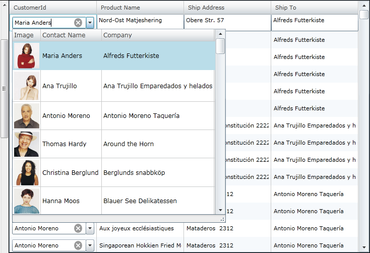

////
|metadata|
{
    "name": "whatsnew-whats-new-in-2012-volume-1",
    "controlName": [],
    "tags": [],
    "guid": "545d1012-e6ad-487a-9ca8-8b9fd0835d0c",
    "buildFlags": [],
    "createdOn": "2012-01-31T20:59:59.8014894Z"
}
|metadata|
////

= What's New in 2012 Volume 1

== Topic Overview

=== Purpose

The {ProductName} 2012 Volume 1 release includes a number of powerful new features and controls to allow you to take even more advantage of our {PlatformName} controls.

== Controls and Features

=== Features Overview

The following table summarizes the new features of the {ProductName} 2012 Volume 1. Additional details are available after the following the summary table.

[options="header", cols="a,a,a"]
|====
|Control|Feature|Description

|<<MetroTheme,Metro Theme>>
|<<MetroTheme,Metro Theme>>
|A new touch-friendly theme for the controls.

|<<TouchGesture,Touch Gesture Support>>
|<<TouchGesture,Touch Gesture Support>>
|A touch-friendly support of the controls.

|<<xamGeographicMap,xamGeographicMap>>
|<<_xamGeographicMap,xamGeographicMap>>
|A new map control with support for plotting data in a geographic context.

.6|<<xamGrid,xamGrid>>
|<<xamSparklineColumn,xamSparkline column>>
|The Sparkline column type allows the display of a Sparkline chart in a grid cell by inserting the xamSparkline™ control.
|
|<<xamMultiColumnComboColumn,xamMultiColumnCombo column>>
|The MultiColumnCombo column is column type that displays multiple columns in a drop down list.
|
|<<_DateTimeColumn,DateTimeColumn column>>
|The DateTimeColumn displays dates using the xamDateTimeInput control.
|
|<<_CopyPasteHelperMethods,Copy and Paste Helper Methods>>
|The copy and paste helper methods facilitate the data copying and pasting in the xamGrid™ control.
|
|<<_ImplicitDataTemplates,Support for implicit data templates>>
|The xamGrid supports applying implicit data templates on specific data type in a TemplateColumn.
|
|<<_CustomFilterDialog,Custom Filter Dialog>>
|The dialog interface can be used by the end user to create complex filters on data in a column.

|<<xamDataChart,xamDataChart>>
|<<_DisplayingPointSeries,Displaying Point Series>>
|Designed to render one or more series objects of type PointSeries in xamDataChart to display the data points that look like small markers.
|
|<<_OverviewPlusDetailPane,Overview Plus Detail Pane>>
|A new feature that provides an overview of chart content and it allows navigation of content in the _xam_ _DataChart_ control.

|<<xamPieChart,xamPieChart>>
|<<_Visualizing_Olap_Data,Visualizing OLAP data>>
|Allows rendering OLAP data with PieChart.

|<<xamPivotGrid,xamPivotGrid>>

|<<AdvancedFiltering,Advanced Filtering>>
|Filtering capabilities that allow the xamPivotGrid to filter values using filters such as top and bottom.
|
|<<_Calculated_Measures,Calculated Measures>>
|Allows defining calculated measures and displaying it on a separate column.
|
|<<_CustomCellTemplates,Customizing cell and header templates>>
|Allows you to define custom data templates for header and data cells of the pivot grid that are selectively applied according to predefined criteria.
|
|<<_DynamicMetaDataTree,Dynamic Metadata Tree>>
|Allows you to specify which items are included in the meta data tree of the data selector.
|
|<<_EnhancedPerformancePivotGrid,Enhanced performance of the xamPivodGrid>>
|As of this release, the xamTree™ control is no longer internally used in the xamPivotGrid and it is replaced by the xamDataTree™.
|
|<<_FieldChooser,Field Chooser>>
|Allows users to quickly select columns, rows, filters and measures.
|
|<<_LockingComponents,Locking Components>>
|In xamPivotGrid, the rows, columns, filters or measure areas of the xamPivotGrid or xamPivotDataSelector can be locked and unlocked from editing.
|
|<<_Row_Header_Highlighting,Row header highlighting>>
|Allows highlighting the row state by selecting the header cell of the row.

|<<xamSparkline,xamSparkline>>
|<<_Sparkline_Visual_Elements,Sparkline visual elements>>
|The xamSparkline control has several visual elements and corresponding features through which these elements can be configured and customized.

|<<colorTuner,XAML Color Tuner>>
|<<_Create_your_own_theme,Create your own theme>>
|Using Color Tuner you can color tune a control theme.
|
|<<_Sharing_color_tuning_configurations,Sharing color tuning configurations>>
|You can share your custom color tuning configurations.

.6|<<excel,Excel Engine>>
|<<_Excel_format_support,Excel Format Support>>
|Excel library now supports accessing built-in styles, parent styles, format options, numerous Microsoft Excel behaviors regarding styles, and possibility for determining resolved cell formats.
|
|<<_Excel_2007_Color_Model,Excel 2007 Color Model>>
|This release introduces an updated color object model. Using Excel 2007 Color model you can specify a color, work with Workbook palette and use new Fill property for filing a cells.
|
|<<_Suport_Named_Tables_in_an_Excel_Spreadsheet,Support Named Tables in an Excel Spreadsheet>>
|The Excel Engine library now supports the ability to access and create named Tables with data from the worksheet. The tables can be sorted, filtered, and aggregated.
|
|<<_Filtering_Tables,Filtering Tables>>
|Excel Engine supports table filtering.
|
|<<_Sorting_Tables,Sorting Tables>>
|Excel Engine supports table sorting.
|
|<<_Get_Cell_Text,Get Cell Text>>
|Here an explanation on how to determine the text that would be displayed in a Microsoft Excel cell is provided.

|<<_undoredo,Infragistics Undo/Redo Framework™>>
|<<_undoredo1,Infragistics Undo/Redo Framework™>>
|Provides support for undo\redo functionality. The framework is cross-platform and can be used either in WPF or Silverlight applications.

|<<_xamBarcode,xamBarcode>>
|<<_Hiding_Barcode_Text,Hiding human-readable barcode text>>
|The xamBarcode control allows hiding and showing the human-readable barcode text.

|====

== Metro Theme

[[MetroTheme]]

=== Metro Theme

This release introduces a new theme – Metro, that can be applied to all controls. This theme is using white, gray and black colors, with cyan as a highlight/accent color. Since this is a theme made especially for touch environment, the controls have larger touch areas for easier use.

[options="header", cols="a"]
|====
|Controls using IG theme and Metro theme

|image::images/Metro_Theme_1.png[] 

Figure 1: xamGrid using IG theme 

 

Figure 2: xamGrid using Metro theme

|image::images/Metro_Theme_3.png[] 

Figure 3: xamDialogWindow using IG theme
|image::images/Metro_Theme_4.png[] 

Figure 4: xamDialogWindow using Metro theme

|image::images/Metro_Theme_5.png[] 

Figure 5: xamTileManager using IG theme
|image::images/Metro_Theme_6.png[] 

Figure 6: xamTileManager using Metro theme

|image::images/Metro_Theme_7.png[] 

Figure 7: xamInputs using IG theme
|image::images/Metro_Theme_8.png[] 

Figure 8: xamInputs using Metro theme

|image::images/Metro_Theme_9.png[] 

Figure 9: xamOrgChart using IG theme
|image::images/Metro_Theme_10.png[] 

Figure 10: xamOrgChart using Metro theme

|image::images/Metro_Theme_11.png[] 

Figure 11: xamMap using IG theme
|image::images/Metro_Theme_12.png[] 

Figure 12: xamMap using Metro theme

|

|====

==== Related Topics:

* link:designers-guide-using-themes.html[Using Themes]

== Touch Gesture Support

[[TouchGesture]]

=== Touch Gesture Support

Starting from the 12.1 release the {ProductName} controls supports touch gestures. The following topic explains the touch gesture support, the usage of the controls in touch environment and the limitations you can face while using the controls.

==== Related Topics:

* link:developers-guide-touch-support.html[Touch Gestures Support]

[[xamGeographicMap]]
== xamGeographicMap

[[_xamGeographicMap]]

=== xamGeographicMap

The  _xamGeographicMap_   control allows you to display data that contains geographic locations from view models or geospatial data loaded from shape files on geographic imagery maps.

[cols="a,a"]
|====
|image::images/Whats_New_xamGeographicMap_1.png[] 

Figure 1: xamGeographicMap with geographic imagery from Open Street Maps.
|image::images/Whats_New_xamGeographicMap_2.png[] 

Figure 2: xamGeographicMap with geographic imagery from Map Quest©.

|image::images/Whats_New_xamGeographicMap_3.png[] 

Figure 3: xamGeographicMap with geographic imagery from Bing™ Maps.
|image::images/Whats_New_xamGeographicMap_4.png[] 

Figure 4: xamGeographicMap with geographic imagery from CloudMade© Maps.

|====

image::images/Whats_New_xamGeographicMap_5.png[]

Figure 5: xamGeographicMap with multiple geographic series.

*Related Topics:*

* link:xamgeographicmap.html[xamGeographicMap]

[[xamGrid]]
== xamGrid

[[xamSparklineColumn]]

=== xamSparkline column

The Sparkline column type allows the display of a Sparkline chart in a grid cell by inserting the xamSparkline™ control.

==== Related Topics:

* link:xamgrid-sparkline-column.html[xamSparkline Column]

[[xamMultiColumnComboColumn]]

=== xamMultiColumnCombo column

The MultiColumnCombo column is column type that displays multiple columns in a drop-down list. It allows users to edit the cell value of the xamGrid control by selecting a value from a pre-populated drop-down list of items.

==== Related Topics:

* link:xamgrid-multicolumncombo-column.html[xamMultiColumnCombo Column]

[[_DateTimeColumn]]

=== DateTimeColumn Column

The DateTimeColumn displays dates in the link:xamgrid.html[xamGrid] control using the link:xamdatetimeinput.html[xamDateTimeInput]™ control. You can determine the format of the date by setting the link:{ApiPlatform}controls.grids.datetimecolumn.v{ProductVersion}~infragistics.controls.grids.datetimecolumn~selecteddatemask.html[SelectedDateMask] property to a specific mask.

==== Related Topics:

* link:xamgrid-datetimecolumn.html[DateTimeColumn]

[[_CopyPasteHelperMethods]]

=== Copy and Paste Helper Methods

The copy and paste helper methods provide functionality for:

* Pasting data in a xamGrid control
* Verifying a valid rectangular cell selection that can be pasted in an Microsoft Office Excel document or in the xamGrid control
* Handling errors that may occur while pasting data in the xamGrid control

==== Related Topics:

* link:xamgrid-copypastehelpermethods.html[Copy and Paste Helper Methods]

[[_ImplicitDataTemplates]]

=== Support for implicit data templates

The implicit data templates are applied on a specific data type. Instead of an x:Key property, a DataType property is set to the data template. This feature is introduced in Silverlight 5, it is also available in Windows Presentation Foundation.

==== Related Topics:

* link:xamgrid-implicitdatatemplates.html[Applying Different User Interface Depending on the Cell Data Type]

[[_CustomFilterDialog]]

=== Custom Filter Dialog

The xamGrid custom filter dialog provides a convenient end-user interface for creating and editing complex filtering logic for a column.

==== Related Topics:

* link:xamgrid-using-the-custom-filter-dialog.html[Using the Custom Filter Dialog]

[[xamDataChart]]
== xamDataChart

[[_DisplayingPointSeries]]

=== Displaying Point Series

The  _xamDataChart_   has introduced another type of series called link:{ApiPlatform}controls.charts.xamdatachart.v{ProductVersion}~infragistics.controls.charts.pointseries_members.html[PointSeries]. It intends to display the data points as markers or points using small shaped icons identifying them.

The following is the preview of multiple PointSeries in view with  _xamDataChart_  .

==== Related Topics:

* link:datachart-category-point-series.html[Displaying Point Series]

[[_OverviewPlusDetailPane]]

=== Overview Plus Detail Pane

The  _xamDataChart_   has introduced an overview of chart content is represented by the xamOverviewPlusDetailPane control. This control provides preview of all types of supported series as well as navigation functionalities.

The following is the preview of the FinancialPriceSeries in the Overview pane in the  _xamDataChart_  .

==== Related Topics:

* link:datachart-navigating-chart-using-overview-plus-detail-pane.html[Navigating Chart Using Overview Plus Detail Pane]

[[xamPieChart]]
== xamPieChart

[[_Visualizing_Olap_Data]]

=== Visualizing OLAP Data

The recent enhancement that is introduced in  _xamPieChart_   is the new axis type called OlapAxis, which helps visualizing the OLAP data with PieChart.

==== Related Topics:

* link:piechart-visualizing-olap-data-piechart.html[Visualizing OLAP Data]

[[xamPivotGrid]]
== xamPivotGrid

=== Advanced Filtering

The advanced filtering feature allows filtering the xamPivotGrid values and includes filters for top and bottom value filtering for sum, count, or percent.

==== Related Topics:

* link:xampivotgrid-understanding-xampivotgrid.html[XamPivotGrid Overview]
* link:xampivotgrid-getting-started-with-xampivotgrid.html[Getting Started with xamPivotGrid]

[[_Calculated_Measures]]

=== Calculated measures

This feature offers a way to create measures with some expression of calculation, and represent it with a separate column, known as a Calculated Member, which represent the result of the defined measures in calculation.

==== Related Topics:

* link:xampivotgrid-calculated-measures.html[Calculated Measures]

[[_CustomCellTemplates]]

=== Customizing cell and header templates

The xamPivotGrid™ control provides the ability to specify custom DataTemplates for data and header cells. You can specify different templates for different cells based on what hierarchy, level, etc. the cell is in.

==== Related Topics:

* link:xampivotgrid-customizing-cells-with-templates.html[Customizing Cells with Templates]

[[_DynamicMetaDataTree]]

=== Dynamic Metadata Tree

When you assign a data source to the xamPivotDataSelector™ it will automatically add all items (Measures, Dimensions, Hierarchies, etc.) in the data source to the metadata tree. The Dynamic Metadata Tree feature enables you to specify exactly which items are included and whether they should be expanded by default.

==== Related Topics:

* link:xampivotgrid-dataselector-including-excluding-items-from-the-metadatatree.html[Including Excluding Items from the xamPivotDataSelector's MetaDataTree]

[[_EnhancedPerformancePivotGrid]]

=== Enhanced performance of the xamPivotGrid

As of this release instead of xamTree, the xamDataTree control is used in filter drop-downs and in the data selector’s metadata tree. Because the xamDataTree uses virtualization for displaying its items, this greatly enhances performance and the user experience of the xamPivotGrid. An additional benefit is that it becomes simpler to restyle the data selector.

.Note:
[NOTE]
====
You will need to replace the reference to the xamTree assembly in your project with a reference to xamDataTree.
====