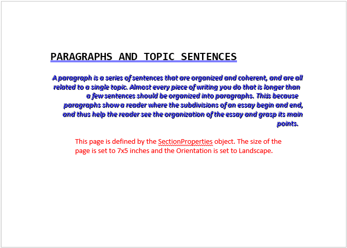

////

|metadata|
{
    "name": "word-apply-formatting-to-word-document",
    "controlName": ["IG Word Library"],
    "tags": ["Formatting"],
    "guid": "b1d5d87d-c890-4252-ac57-fbe03e1bba0f",  
    "buildFlags": [],
    "createdOn": "2016-05-25T18:21:54.3570724Z"
}
|metadata|
////

= Applying Formatting to Word Document

This topic demonstrates formatting of Word document using the Infragistics® Word library. The code below uses the forward-only link:{ApiPlatform}documents.io{ApiVersion}~infragistics.documents.word.worddocumentwriter.html[WordDocumentWriter] object. The various formatting functionalities discussed in this topic are Font, Paragraph formatting and Page attributes such as size, orientation etc.

.Note:
[NOTE]
====
A reference to the link:{ApiPlatform}documents.io{ApiVersion}.html[{ApiPlatform}Documents.IO{ApiVersion}.dll] assembly is required.
====

== Designating Fonts

The link:{ApiPlatform}documents.io{ApiVersion}~infragistics.documents.word.font.html[Font] class provides a way to customize the visual attributes of a character or range of characters.

*In C#:*

----
using Infragistics.Documents.Word;
// Create a font, which can be reused in content creation
Infragistics.Documents.Word.Font font = docWriter.CreateFont();
font.Name = "Consolas";
font.Bold = true;
font.Size = .23f;
font.Underline = Underline.Double;
font.UnderlineColor = Colors.Blue;
font.Effects.Capitalization = Capitalization.CapsOn;
----

*In Visual Basic:*

----
Imports Infragistics.Documents.Word
' Create a font, which we can reuse in content creation
Dim font As Infragistics.Documents.Word.Font = docWriter.CreateFont()
font.Name = "Consolas"
font.Bold = True
font.Size = 0.23F
font.Underline = Underline.[Double]
font.UnderlineColor = Colors.Blue
font.Effects.Capitalization = Capitalization.CapsOn
----

== Paragraph Properties

The link:{ApiPlatform}documents.io{ApiVersion}~infragistics.documents.word.paragraphproperties.html[ParagraphProperties] class provides a way to control formatting for a paragraph.

*In C#:*

----
using Infragistics.Documents.Word;
// Paragraph Properties
// Create a new instance of the WordDocumentWriter class using the
// static 'Create' method.
WordDocumentWriter docWriter = WordDocumentWriter.Create(@"C:\TestWordDoc.docx");
ParagraphProperties paraformat = docWriter.CreateParagraphProperties();
// Set right alignment for this paragraph
paraformat.Alignment = ParagraphAlignment.Right;
// Set 0.5 inch left indent
paraformat.LeftIndent = 0.5f;
----

*In Visual Basic:*

----
Imports Infragistics.Documents.Word
' Paragraph Properties
' Create a new instance of the WordDocumentWriter class using the
' static 'Create' method.
Dim docWriter As WordDocumentWriter = WordDocumentWriter.Create("C:\TestWordDoc.docx")
Dim paraformat As ParagraphProperties = docWriter.CreateParagraphProperties()
' Set right alignment for this paragraph
paraformat.Alignment = ParagraphAlignment.Right
' Set 0.5 inch left indent
paraformat.LeftIndent = 0.5F
----

== Section Properties

The link:{ApiPlatform}documents.io{ApiVersion}~infragistics.documents.word.sectionproperties.html[SectionProperties] class provides a way to control page attributes such as size, margin and orientation. The DefineSection method passing in the SectionProperties instance must be called after the EndParagraph method.

*In C#:*

----
using Infragistics.Documents.Word;
// Create a new instance of the WordDocumentWriter class using the
// static 'Create' method.
WordDocumentWriter docWriter = WordDocumentWriter.Create(@"C:\TestWordDoc.docx");
// Use inches as the unit of measure
docWriter.Unit = UnitOfMeasurement.Inch;
SectionProperties secProperties = docWriter.CreateSectionProperties();
secProperties.PageSize = new Size(7, 5);
secProperties.PageOrientation = PageOrientation.Landscape;
// Applies the section properties(PageSize and Orientation) for the above added paragraphs
docWriter.DefineSection(secProperties);
----

*In Visual Basic:*

----
Imports Infragistics.Documents.Word
' Create a new instance of the WordDocumentWriter class using the
' static 'Create' method.
WordDocumentWriter docWriter = WordDocumentWriter.Create("C:\TestWordDoc.docx");
' Use inches as the unit of measure
docWriter.Unit = UnitOfMeasurement.Inch
Dim secProperties As SectionProperties = docWriter.CreateSectionProperties()
secProperties.PageSize = New Size(7, 5)
secProperties.PageOrientation = PageOrientation.Landscape
' Applies the section properties(PageSize and Orientation) for the above added paragraphs
docWriter.DefineSection(secProperties)
----

Following is the complete code with all the above mentioned formatting.

*In C#:*

----
using Infragistics.Documents.Word;
// Create a new instance of the WordDocumentWriter class using the
// static 'Create' method.
// This instance must be closed once content is written into Word.
WordDocumentWriter docWriter = WordDocumentWriter.Create(@"C:\TestWordDoc.docx");
// Use inches as the unit of measure
docWriter.Unit = UnitOfMeasurement.Inch;
// Create a font, which we can use in content creation
Infragistics.Documents.Word.Font font = docWriter.CreateFont();
// Start the document...note that each call to StartDocument must
// be balanced with a corresponding call to EndDocument.
docWriter.StartDocument();
// Start a paragraph
docWriter.StartParagraph();
// Add a text run for the title, bolded and a little bigger
font.Name = "Consolas";
font.Bold = true;
font.Size = .23f;
font.Underline = Underline.Double;
font.UnderlineColor = Colors.Blue;
font.Effects.Capitalization = Capitalization.CapsOn;
docWriter.AddTextRun("Paragraphs and Topic Sentences", font);
// End the paragraph
docWriter.EndParagraph();
// Paragraph Properties
ParagraphProperties paraformat = docWriter.CreateParagraphProperties();
paraformat.Alignment = ParagraphAlignment.Right;
// Start another Paragraph
// and apply the ParagraphProperties Object
docWriter.StartParagraph(paraformat);
docWriter.AddNewLine();
// Reset font, and apply different font settings for this paragraph.
font.Reset();
font.Italic = true;
font.ForeColor = Colors.Blue;
font.Effects.TextEffect = FontTextEffect.EngravingOn;
docWriter.AddTextRun("A paragraph is a series of sentences that are organized and coherent, and are all related to a single topic. Almost every piece of writing you do that is longer than a few sentences should be organized into paragraphs. This is because paragraphs show a reader where the subdivisions of an essay begin and end, and thus help the reader see the organization of the essay and grasp its main points.", font);
// End the paragraph
docWriter.EndParagraph();
// Add an Empty paragraph
docWriter.AddEmptyParagraph();
// Start the last paragraph with left indent of 0.5 inch
paraformat.Reset();
paraformat.LeftIndent = 0.5f;
docWriter.StartParagraph(paraformat);
font.Reset();
font.ForeColor = Colors.Red;
docWriter.AddTextRun("This page is defined by the SectionProperties object. The size of the page is set to 7x5 inches and the Orientation is set to Landscape.", font);
docWriter.EndParagraph();
// Set page attributes
SectionProperties secProperties = docWriter.CreateSectionProperties();
secProperties.PageSize = new Size(7, 5);
secProperties.PageOrientation = PageOrientation.Landscape;
// Applies the section properties(PageSize and Orientation) for the above added paragraphs
docWriter.DefineSection(secProperties);
// End the Document
docWriter.EndDocument();
// Close the writer
docWriter.Close();
----

*In Visual Basic:*

----
Imports Infragistics.Documents.Word
' Create a new instance of the WordDocumentWriter class using the
' static 'Create' method.
' This instance must be closed once content is written into Word.
Dim docWriter As WordDocumentWriter = WordDocumentWriter.Create("C:\TestWordDoc.docx")
' Use inches as the unit of measure
docWriter.Unit = UnitOfMeasurement.Inch
' Create a font, which we can reuse in content creation
Dim font As Infragistics.Documents.Word.Font = docWriter.CreateFont()
' Start the document...note that each call to StartDocument must
' be balanced with a corresponding call to EndDocument.
docWriter.StartDocument()
' Start a paragraph
docWriter.StartParagraph()
' Add a text run for the title, bolded and a little bigger
font.Name = "Consolas"
font.Bold = True
font.Size = 0.23F
font.Underline = Underline.[Double]
font.UnderlineColor = Colors.Blue
font.Effects.Capitalization = Capitalization.CapsOn
docWriter.AddTextRun("Paragraphs and Topic Sentences", font)
' End the paragraph
docWriter.EndParagraph()
' Paragraph Properties
Dim paraformat As ParagraphProperties = docWriter.CreateParagraphProperties()
paraformat.Alignment = ParagraphAlignment.Right
' Start another Paragraph
' and apply the ParagraphProperties Object
docWriter.StartParagraph(paraformat)
docWriter.AddNewLine()
' Reset font, and apply different font settings for this paragraph.
font.Reset()
font.Italic = True
font.ForeColor = Colors.Blue
font.Effects.TextEffect = FontTextEffect.EngravingOn
docWriter.AddTextRun("A paragraph is a series of sentences that are organized and coherent, and are all related to a single topic. Almost every piece of writing you do that is longer than a few sentences should be organized into paragraphs. This is because paragraphs show a reader where the subdivisions of an essay begin and end, and thus help the reader see the organization of the essay and grasp its main points.", font)
' End the paragraph
docWriter.EndParagraph()
' Set page attributes
Dim secProperties As SectionProperties = docWriter.CreateSectionProperties()
secProperties.PageSize = New Size(7, 5)
secProperties.PageOrientation = PageOrientation.Landscape
' Applies the section properties(Page Size and Orientation) for the above added paragraphs
docWriter.DefineSection(secProperties)
' Add an Empty paragraph
docWriter.AddEmptyParagraph()
' Start the last paragraph with left indent of 0.5 inch
paraformat.Reset()
paraformat.LeftIndent = 0.5F
docWriter.StartParagraph(paraformat)
font.Reset()
font.ForeColor = Colors.Red
docWriter.AddTextRun("The above page is defined by the Section Properties object. The size of the page is set to 7x5 inches and the Orientation is set to Landscape.", font)
docWriter.EndParagraph()
' End the Document
docWriter.EndDocument()
' Close the writer
docWriter.Close()
----

The following code snippet shows how MS Word will render the result from the complete code above:

== Related Topics

* link:word-create-a-word-document.html[Creating a Word Document]
* link:word-add-table-to-word-document.html[Adding Table to Word Document]
* link:word-add-images-to-word-document.html[Adding Images to Word Document]
* link:word-headers-footers-and-page-numbers.html[Headers Footers and Page Numbers]
* link:word-about-ig-word-library.html[About Infragistics Word Library]