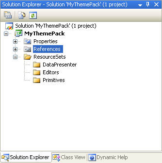

////
|metadata|
{
    "name": "wpf-creating-and-setting-up-a-themepack-project",
    "controlName": [],
    "tags": ["Styling","Theming"],
    "guid": "{3552235F-7845-4580-92EB-CD9E7ED9AF5A}",
    "buildFlags": ["wpf"],
    "createdOn": "2012-01-30T20:33:32.0560395Z"
}
|metadata|
////

= Creating and Setting Up a ThemePack Project

Because ThemePacks are compiled assemblies, you will need to create a Visual Studio® project in order to build the ThemePack. You will also need to add a few folders to help organize the necessary files.

[start=1]
. In Microsoft® Visual Studio 2008, on the main menu, click File, then New, then click Project... The New Project dialog box appears.

[start=2]
. In the New Project dialog box, expand Visual C# or Visual Basic in the Project types tree and select NET Framework 3.0 or higher.

[start=3]
. Select Custom Control Library (WPF) from the available templates.

[start=4]
. Name the template "MyThemePack," and select OK. Visual Studio generates a project.

[start=5]
. In the Solution Explorer, right click UserControl1.xaml and select Exclude from Project from the pop-up menu.

[start=6]
. In the Solution Explorer, add the following references:

** InfragisticsWPF4.DataPresenter.v{ProductVersion}.dll
** InfragisticsWPF4.Editors.v{ProductVersion}.dll
** InfragisticsWPF4.v{ProductVersion}.dll

[start=7]
. In the Solution Explorer, right click the project, click Add from the pop-up menu, then click New Folder. Name the folder "ResourceSets."

[start=8]
. Right click the ResourceSets folder and click Add from the pop-up menu, then click New Folder. Name the folder "DataPresenter."

[start=9]
. Repeat the previous step twice, adding two more folders to the ResourceSets folder. Name these two folders "Editors" and "Primitives."

[start=10]
. Your solution should look similar to the image below.
+

+
The next step is to add and configure a class for each style group. link:wpf-creating-a-style-groups-class.html[Creating a Style Group's Class] will guide you through this procedure.