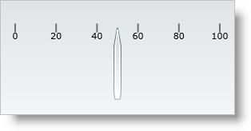
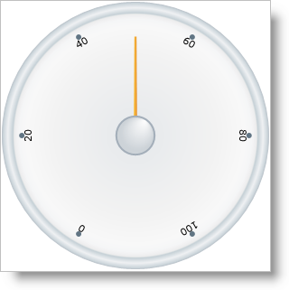
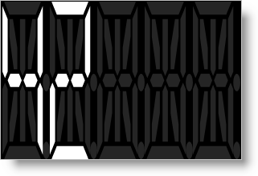
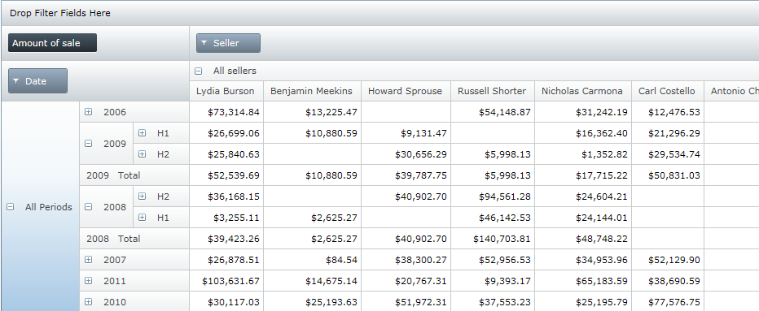

////
|metadata|
{
    "name": "wpf-dv-whats-new-in-2010-volume-2",
    "controlName": [],
    "tags": [],
    "guid": "f5ff0176-fd9a-45e0-a33c-85eec2455f60",
    "buildFlags": [],
    "createdOn": "2012-01-31T20:23:42.5544945Z"
}
|metadata|
////

= What's New in 2010 Volume 2

The {ProductName} 2010 Volume 2 release includes a number of powerful new features and controls to allow you to take even more advantage of our {PlatformName} controls.

Below is a list of the features and controls that we added for the 2010 Volume 2 release. Click the links to see a list of the features being offered.

* <<StartupSolution,Startup Solution>>
* <<xamBarcodeControl,xamBarcode Control>>
* <<xamBulletGraph,xamBulletGraph Control>>
* <<xamDataChart,xamDataChart Control>>
* <<xamGauge,xamGauge Control>>
* <<xamMap,xamMap Control>>
* <<xamPivotGrid,xamPivotGrid Control>>
* <<xamTimeline,xamTimeline Control>>
* <<xamTreemap,xamTreemap Control>>

[[StartupSolution]]

== *Startup Solution*

Starting with the 2010 volume 2 release, the {ProductName} product will include a Startup Solution for Visual Studio 2010. The solution contains several unfinished examples, which will quickly give you a hands-on learning experience regarding the basic for our main controls and their most common scenarios.

We recommend looking at the Visual Studio’s “Task List” window and try to uncomment some of the commented code together with reading the guidance provided within the code comments. This will allow you to see and experiment with different aspects of the controls’ features and behaviors.

The examples show the essential functionality of the controls and don’t cover more advanced scenarios. Many more finished samples are available at: link:http://samples.infragistics.com[http://samples.infragistics.com]. More detailed and advanced guidance and code examples are also available through the online documentation.

[[xamBarcodeControl]]

== *xamBarcode Control*

From shipping containers, to medical records, to a can of beans at the grocery store, barcodes have become the universal mechanism for affixing identifying data to physical assets. Industries have created standards around barcode technology such as creating barcodes that provide capabilities unique to their industries. The vision for the barcode control is to provide you with a set of controls that are capable of rendering on screen barcode images that conform to the various widely adopted barcodes standards; these controls abstract much of the process and detail of barcode creation from developers, allowing them to easily embed data in barcode format into their applications.

image::images/xamBarcode_XamEanUpcBarcode_04.png[]

image::images/xamBarcode_XamPdf417Barcode_05.png[]

The xamBarcode™ series of controls provides support for the following barcode symbologies (note that each barcode is a separate control):

* link:xambarcode-xamcode39barcode.html[Code 39]
* link:xambarcode-configuring-code128.html[Code 128]
* link:xambarcode-xameanupcbarcode.html[Ean/Upc]

** Ean 13
** Ean 8
** Upc A
** Upc E

* link:xambarcode-xaminterleaved2of5barcode.html[Interleaved 2 Of 5]
* link:xambarcode-xamgs1databarbarcode.html[GS1 DataBar]

** Omnidirectional
** Truncated
** Stacked
** Stacked Omnidirectional
** Limited
** Expanded

* link:xambarcode-xamintelligentmailbarcode.html[Intelligent Mail Barcode]
* link:xambarcode-xamroyalmailbarcode.html[Royal Mail Barcode]
* link:xambarcode-xampdf417barcode.html[Pdf 417]
* link:xambarcode-xammaxicodebarcode.html[Maxi Code]

[[xamBulletGraph]]

ifdef::wpf[]

== *xamBulletGraph Control*

The xamBulletGraph™ is a new, exciting control and is a variation of a standard bar graph and is designed to replace meters and gauges that are used on dashboards. This control is linear in design and it provides a simple and concise view of a primary measure compared against one or more other measures.

The xamBulletGraph control consists of five primary components:

* Text label
* Quantitative Scale
* Featured Measure
* Comparative Measures
* Qualitative Ranges

image::images/XamBulletGraph_About_XamBulletGraph_01.png[Whats New - xamBulletGraph]

== Related Topic

link:bulletgraph-adding.html[Adding xamBulletGraph]
endif::wpf[]

[[xamDataChart]]

== *xamDataChart Control*

The xamDataChart™ control is a next-generation, high-performance component that can handle live feeds of tens of thousands of data points over milliseconds. It is also designed to facilitate the overlay of multiple series in a single chart plot area so that users can easily add statistical and technical indicators to their analyses. The link:{ApiPlatform}controls.charts.xamdatachart.v{ProductVersion}~infragistics.controls.charts.xamdatachart.html[xamDataChart] control provides financial features similar to those found on Google® and Yahoo!® finance websites. It also provides a set of charts and a framework for creating charting applications, or adding charting capability to existing data or information-driven applications. Please refer to the link:datachart-using-datachart.html[Feature Overview] section for more details on features provided by the xamDataChart control.

image::images/xamDataChart_Whats_New_xamDataChart_01.png[]

== Related Topics

* link:datachart-series-types.html[Series Types]
* link:datachart-financial-indicators-overview.html[Financial Indicators]
* link:datachart-multiple-axes.html[Multiple Axes]
* link:datachart-multiple-legends.html[Multiple Legends]
* link:datachart-multiple-series.html[Multiple Series]
* link:datachart-chart-navigation.html[Chart Navigation]
* link:datachart-chart-synchronization.html[Chart Synchronization]

[[xamGauge]]

ifdef::wpf[]

== *xamGauge Control*

The xamGauge™ family of controls consists of three types of gauges that you can use to display your data.

== xamLinearGauge™

The following is a list of key features for xamLinearGauge:

* *Multiple gauge elements* - You can add multiple gauge elements such as scales and needles to the gauge.
* *Horizontal or vertical scale orientation* - You can change the orientation of the scale along with all the elements within the scale by setting a single property.
* *Two different types of markers* - You can use a needle and/or a bar marker to indicate a value.
* *Needle dragging* - You can drag the needle at run time to set the needle's value.

== xamRadialGauge™

The following is a list of key features for xamRadialGauge:

* *Multiple gauge elements* - You can add multiple gauge elements such as scales and needles to the gauge.
* *Needle movement dampening* - In addition to moving the needle, the radial gauge also allows you to dampen the needle's movement.

== xamSegmentedDisplay™

The following is a list of key features for xamSegmentedDisplay:

* *Display numbers and letters* - You can display numbers and letters using a fourteen segmented digit.

== Related Topics

link:xamgauge.html[xamGauge]

link:xamgauge-adding-a-digital-gauge-to-your-page.html[Getting Started with xamSegmentedDisplay]

Getting Started with xamLinearGauge

Getting Started with xamRadialGauge

link:xamgauge-using-xamgauge.html[Using xamGauge]
endif::wpf[]

[[xamMap]]

ifdef::wpf[]

== *xamMap Control*

The xamMap™ control displays geographic data in a simple and elegant fashion. Now you can present your end-users with business data using rich and interactive maps.

You can display maps from the popular ESRI Shapefile format, which includes any polygon-based shapefiles (lots, states, countries), polyline-based shapefiles (roads, rivers, transmission lines), and point-based shapefiles (cities, points of interest).

With styles and templates, the possibilities for customizing xamMap are endless.

The following is a list of key features of xamMap:

* *Map Layers* – Multiple maps can be used allowing for a complex layering of map elements; e.g., states, cities, and roads.
* *Interactive Map Elements* – The representation of the shapes in a map can respond to user actions enhancing the user experience.
* *Comprehensive Color Model* – The presentation of maps is enhanced with rich but simple ways to color the map elements.
* *Data Binding* – In addition to data from Shapefiles, xamMap can associate other data sources with the map elements using the data binding and data mapping features.
* *Helper Panes and Child Controls* – A collection of additional controls in xamMap such as: navigational, color swatch, thumbnail, and scale panes further enhance the user experience.

== Related Topics

link:xamwebmap-understanding-xamwebmap.html[Understanding xamMap]

link:xamwebmap-getting-started-with-xamwebmap.html[Getting Started with xamMap]

link:xamwebmap-map-elements-color-map-elements.html[Color Map Elements]

link:xamwebmap-using-multiple-layers.html[Multiple Layers]

link:xamwebmap-map-panes.html[Panes]
endif::wpf[]

[[xamPivotGrid]]

== *xamPivotGrid Control*

The xamPivotGrid™ control is a data visualization tool for complex business analysis applications. Using OLAP (Online Analytical Processing), the xamPivotGrid control can work with a number of different data sources to present the results of multi-dimensional queries efficiently.

* link:xampivotgrid-understanding-xampivotgrid.html[Understanding xamPivotGrid]
* link:xampivotgrid-getting-started-with-xampivotgrid.html[Getting Started with xamPivotGrid]
* link:xampivotgrid-using-xampivotgrid.html[Using xamPivotGrid]

[[xamTimeline]]

ifdef::wpf[]

== *xamTimeline Control*

The xamTimeline™ control is intended for displaying sequential series of events. The control allows for data binding as well as manual data manipulation so you can quickly display information that your end-users will easily be able to visualize and understand.

There are two different types of timelines available:

* *Numeric* - Displays Time values of type Double.
* *DateTime* - Displays Time values of type DateTime.

This empowers you to display information such as: historical events, steps in the narrative of some business process, project milestones, key frames in a video, or a representation of any kind of time-series data. Along with styles and templates, each timeline you create can have a compelling and unique look.

The following are some of the features available for xamTimeline:

*Data Display* - Display chronological and sequential data in ways that allow your end user to dynamically select timelines and compare them.

*Interactivity* – Each timeline is interactive, allowing your end-users to select and find the information that they need.

*Timeline Comparison* – You may have multiple sequences of events on one single control, allowing you to compare events in multiple timelines.

*Full Customization* – Every element of xamTimeline can be styled, allowing you to create every timeline with a unique look and feel.

image::images/SL_DV_XamTimeline_About_XamTimeline_01.png[]

== Related Topics

link:xamtimeline-understanding-xamwebtimeline.html[Understanding xamTimeline]

link:xamtimeline-display-date-time-series.html[Display Date Time Series]

link:xamtimeline-display-numeric-time-series.html[Display Numeric Time Series]
endif::wpf[]

[[xamTreemap]]

== *xamTreemap Control*

Treemaps display hierarchical (tree-structured) data as a set of nested nodes. Each branch of the tree is given a treemap node, which is then tiled with smaller nodes representing sub-branches. Each node's rectangle has an area proportional to a specified dimension on the data. Often the nodes are colored to show a separate dimension of the data.

When the color and size dimensions are correlated in some way with the tree structure, one can often easily see patterns that would be difficult to spot in other ways. A second advantage of treemaps is that, by construction, they make efficient use of space. As a result, they can legibly display thousands of items on the screen simultaneously.

Treemaps are not designed to convey numerical quantities; the intent is to show relative rankings. Treemaps can be more effective than pie charts and other forms of area charts that often do a poor job of classifying data points and communicating the relative differences of their values.

The xamTreemap™ is a data bound control that displays the relative weight of data. It uses a variety of algorithms to help it determine how the layout of its data items should occur:

* Slice and Dice
* Squarified
* Strip

The xamTreemap control allows customers to choose the algorithm that is best for their requirements, defaulting to use the Squarified method. The control includes the ability to allow customers to colorize nodes using two mechanisms, first a group-based meachism that colors items with like values, second a scale-based mechanism similar to a map choropleth, which gradiates node colors based on their value.

The control is capable of binding to and rendering tens of thousands of data point nodes.

image::images/xamTreemap_About_xamTreemap_01.png[]