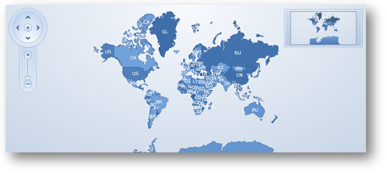
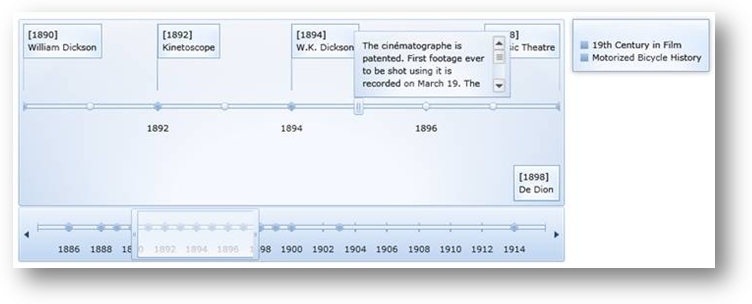
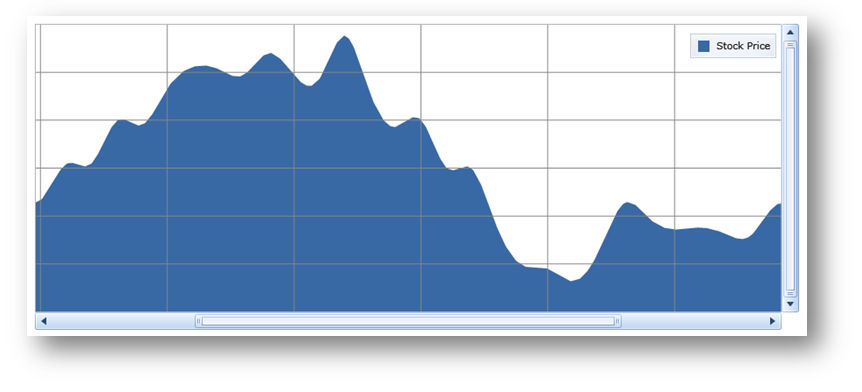
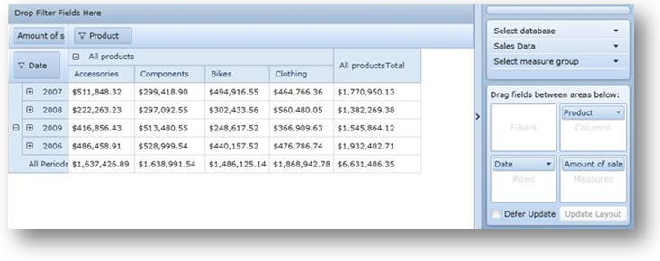
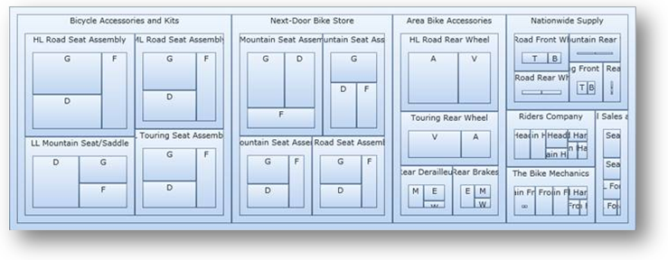
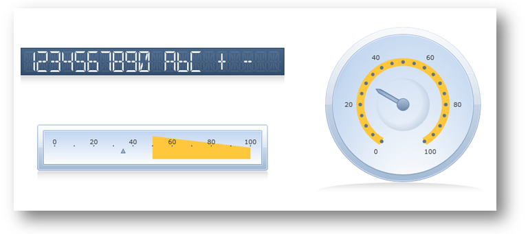
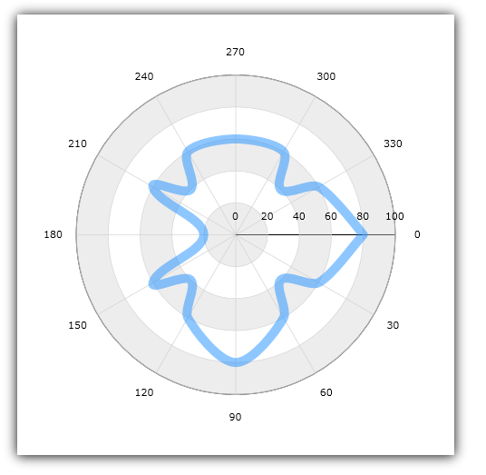

////

|metadata|
{
    "name": "wpf-dv-whats-new-in-2010-volume-3",
    "controlName": [],
    "tags": [],
    "guid": "f237ed2f-c569-4c91-8a8a-94be08ea3340",  
    "buildFlags": [],
    "createdOn": "2012-01-31T20:23:42.5574945Z"
}
|metadata|
////

= What's New in 2010 Volume 3

The {ProductName} 2010 Volume 3 release includes a number of powerful new features and controls to allow you to take even more advantage of our {PlatformName} controls.

Below is a list of the features and controls that we added or updated for the 2010 Volume 3 release. Click through the links to explore the set of new features.

* <<DragDrop,Infragistics Drag and Drop Framework>>
* <<ExcelEngineSL,Infragistics Excel Engine>>
* <<Office2010,xamMap - Performance and Map Window Animations>>
* <<MapGeoImage,xamMap - Geo Image and Spatial Data Integration>>
* <<PivotGridXMLA,xamPivotGrid - XMLA Authentication and XMLA for SAP>>
* <<ValueMappers,xamTreeMap - Custom Value Mappers and New Properties>>

[[DragDrop]]
== *Infragistics Drag and Drop Framework*

The Infragistics WPF Data Visualization 2010 Volume 3 release contains a new Drag and Drop Framework. This framework provides the necessary pieces to make it as simple as possible to add drag and drop functionality to your application. This allows for real-time moving of elements and more user-friendly interactions.

Utilizing the Drag and Drop Framework requires that you set a source and a target element. The source element can be dragged and dropped onto the target element. In some cases, it is as simple as that to implement drag and drop in your application.

=== Related Topics

link:drag-and-drop-framework-about-ig-drag-and-drop-framework.html[About Infragistics Drag and Drop Framework]

link:drag-and-drop-framework-getting-started-with-ig-drag-and-drop-framework.html[Getting Started with Infragistics Drag and Drop Framework]

link:drag-and-drop-framework-using-ig-drag-and-drop-framework.html[Using Infragistics Drag and Drop Framework]

[[ExcelEngineSL]]

== *Infragistics Excel Engine*

The Infragistics Excel Engine™ allows you to work with spreadsheet data using familiar Microsoft® Excel® spreadsheet objects like link:{ApiPlatform}documents.excel.v{ProductVersion}~infragistics.documents.excel.workbook.html[Workbooks], link:{ApiPlatform}documents.excel.v{ProductVersion}~infragistics.documents.excel.worksheet.html[Worksheets], link:{ApiPlatform}documents.excel.v{ProductVersion}~infragistics.documents.excel.worksheetcell.html[Cells], link:{ApiPlatform}documents.excel.v{ProductVersion}~infragistics.documents.excel.formula.html[Formulas] and many more. The Infragistics Excel Library makes it easy for you to represent the data of your application in an Excel spreadsheet as well as transfer data from Excel into your application.

=== Supported Versions of Microsoft Excel

The following is a list of the supported versions of Excel.

* Microsoft Excel 97
* Microsoft Excel 2000
* Microsoft Excel 2002
* Microsoft Excel 2003
* Microsoft Excel 2007

=== Features

The following is a list of key features of the Infragistics Excel Engine:

* *No Excel Dependency* - The Infragistics Excel Engine is a class library that runs completely independently of Microsoft Excel, so you do not require it to be installed.
* *Workbook Object Model* - This represents all the Excel objects available to you, such as Workbooks, Worksheets, Cells, Formulas and many more.

=== Related Topics

link:igexcelengine-about-infragistics-excel-engine.html[About Infragistics Excel Engine]

link:igexcelengine-creating-a-workbook.html[Creating a Workbook (Infragistics Excel Engine)]

link:igexcelengine-using-the-infragistics-excel-engine.html[Using the Infragistics Excel Engine]

[[Office2010]]

== *Office 2010 Blue Theme*

Starting with the 2010 Volume 3 release, Infragistics will provide custom themes for all {ProductName} controls. The first theme to be introduced is the Office 2010 Blue Theme, which is based on the look and feel of Microsoft Office® 2010. For example, the Office 2010 Blue style for the xamDataChart™ control is based on the chart style for Microsoft Excel® 2010.

To get started with the Office 2010 Blue Theme, see the link:themes.html[Using Themes] topic.

=== xamMap

=== xamTimeline

=== xamDataChart

=== xamPivotGrid

=== xamTreemap

=== xamGauge

=== Related Topics

link:designersguide-styling-ig-controls.html[Styling Infragistics Controls]
link:designers-guide-what-is-a-theme.html[What is a Theme?]
link:designers-guide-working-with-themes.html[Working with Themes]

[[QRCode]]

== *xamBarcode - QR Code Support*

The xamBarcode™ control has a new barcode type: xamQRCodeBarcode™.

The QR (Quick Response) barcode is one of the most popular two-dimensional symbologies, quickly readable by QR scanners, mobile phones, and smartphones.

For example, you can scan this QR barcode with your camera phone to visit the website for the xamBarcode series of controls:

link:http://www.infragistics.com/products/wpf/barcode/[Website Link]

=== Related Topics

link:xambarcode-configuring-qr-code.html[QR Code]

link:xambarcode-barcode-symbologies.html[Barcode Symbologies]

[[PolarSeries]]

== *xamDataChart - Polar Series*

The xamDataChart™ control has been upgraded to provide support for link:datachart-polar-line-series.html[Polar Line Series] and link:datachart-polar-spline-series.html[Polar Spline Series]. These series are like link:datachart-scatter-series-overview.html[Scatter Series], but they employ polar (rθ-) rather than Cartesian (xy-) coordinates.

=== Related Topics

* link:datachart-polar-line-series.html[Polar Line Series]
* link:datachart-polar-spline-series.html[Polar Spline Series]

[[MapPerformance]]

== *xamMap - Performance and Map Window Animations*

The xamMap™ control’s pan & zoom performance has been improved, especially for maps composed of several layers. It also supports customization of the window animation that occurs while panning & zooming.

For more information, please refer to the link:xammap-map-window-animation.html[Using Map Window Animation] topic.

[[MapGeoImage]]

== *xamMap - Geo Image and Spatial Data Integration*

The xamMap™ control has now been modified to support the following features:

== Geo-Imagery Integration

The xamMap provides the ability to display geographical imagery from an external source into the map. In addition you can use xamMap control to merge geo-imagery with data stored in Shapefiles. For more information on this, please refer to link:xamwebmap-geo-imagery-integration.html[Geo-Imagery Integration] section.

image::images/XamMap_Display_Geo_Imagery_Map_01.png[]

== Geo-Spatial Database Integration

The xamMap also provides the ability to load geospatial data converted from Shapefiles and stored in a SQL database.

image::images/XamMap_Display_Geospatial_Data_from_SQL_Database_Server_01.png[]

[[PivotGridXMLA]]

== *xamPivotGrid - XMLA Authentication and XMLA for SAP*

Explore the new support features that have been added to the xamPivotGrid™ control for the 2010 Volume 3 release:

* *XMLA Authentication* - xamPivotGrid has been modified to provide support for XMLA Authentication. Now you can use the XmlaDataSource.Credentials property to connect to a server that requires a username and password.
* *XMLA for SAP* - The xamPivotGrid control can now connect to an SAP server through XMLA. Simply use XmlaSapDataSource the same way you would use an XmlaDataSource.

See the xamPivotGrid control's link:xampivotgrid-getting-started-with-xampivotgrid.html[Getting Started with xamPivotGrid] topic for more information on these features.

[[ValueMappers]]

== *xamTreeMap - Custom Value Mappers and New Properties*

== Custom Value Mappers

The xamTreemap™ control has been modified to allow the creation of custom link:xamtreemap-value-mappers.html[Value Mappers]. You can choose to derive from two base mapper classes, which allow you to use custom logic for the ranking of nodes.

== RootNode Property

The link:{ApiPlatform}controls.charts.xamtreemap.v{ProductVersion}~infragistics.controls.charts.xamtreemap~rootnode.html[RootNode] property returns the root node of xamTreemap control’s visualized nodes. This allows you to traverse the arranged nodes.

== New Events

xamTreemap now supports additional events:

* link:{ApiPlatform}controls.charts.xamtreemap.v{ProductVersion}~infragistics.controls.charts.xamtreemap_events.html[MouseMove]
* link:{ApiPlatform}controls.charts.xamtreemap.v{ProductVersion}~infragistics.controls.charts.xamtreemap_events.html[MouseWheel]
* link:{ApiPlatform}controls.charts.xamtreemap.v{ProductVersion}~infragistics.controls.charts.xamtreemap_events.html[MouseDoubleClick]

== Related Topics

link:xamtreemap-about-value-mapping.html[About xamTreemap Value Mapping]

link:xamtreemap-value-mappers.html[Value Mappers]

link:xamtreemap-custom-value-mappers.html[xamTreemap Custom Value Mappers]