////

|metadata|
{
    "name": "wpf-dv-whats-new-in-2011-volume-1",
    "controlName": [],
    "tags": [],
    "guid": "ac7e978e-3670-4238-b173-464f470cd17a",  
    "buildFlags": [],
    "createdOn": "2012-01-31T20:23:42.5594945Z"
}
|metadata|
////

= What's New in 2011 Volume 1

The {ProductName} 2011 Volume 1 release includes a number of powerful new features and controls to allow you to take even more advantage of our {PlatformName} controls.

Below is a list of the features and controls that we added or updated for the 2011 Volume 1 release. Click through the links to explore the set of new features.

* <<barcode_reader,Infragistics Barcode Reader>>
* <<networknode,xamNetworkNode>>™
* <<org_chart,xamOrgChart>>™
* <<piechart,xamPieChart>>™
* <<custom_resource_strings,Custom Resource Strings>>
* <<ui_automation_support,UI Automation Support>>
* <<xamMapPerformance,xamMap™ – Performance Improvements>>
* <<xamDataChartPerformance,xamDataChart™ – Performance Improvements>>
* <<xamDataChartNewSeries,xamDataChart™ – New Types of Series>>
* <<xamDataChartValueOverlay,xamDataChart™ – Value Overlay>>
* <<igtheme,New IG Theme>>

[[barcode_reader]]
== link:xambarcode-about-xambarcode.html[Infragistics Barcode Reader]

Infragistics Barcode Reader is a library for decoding barcodes from an image.

[[supported_symbologies]]
== Supported Symbologies

The Infragistics Barcode Reader supports the following barcode symbologies:

* link:http://en.wikipedia.org/wiki/Code_39[Code 39]
* link:http://en.wikipedia.org/wiki/Code_128[Code 128]
* link:http://en.wikipedia.org/wiki/European_Article_Number[EAN]/ link:http://en.wikipedia.org/wiki/Universal_Product_Code[UPC]:

** EAN-13
** EAN-8
** UPC-A
** UPC-E

* link:http://en.wikipedia.org/wiki/Interleaved_2_of_5[Interleaved 2 of 5]
* link:http://en.wikipedia.org/wiki/Qr_code[QR Code]

[[networknode]]

== link:xamnetworknode.html[xamNetworkNode]™

This release features a the Network Node control, which allows you to visualize a graph with nodes and connections. The control supports data binding, selection, templating, styling, custom positioning, and other features. For more information, see link:xamnetworknode.html[xamNetwork Node].

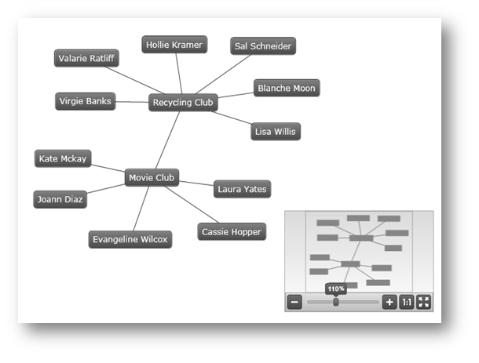

[[org_chart]]
== link:xamorgchart.html[xamOrgChart]™

The xamOrgChart™ is a data-bound control for rendering organization charts. (Figure 1)

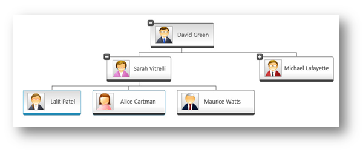

Figure 1: Sample organization chart created with the xamOrgChart control

It supports expanding and collapsing of nodes, panning and zooming, keyboard navigation, custom styles and templates, and various selection types including selection of multiple nodes.

[[piechart]]
== link:piechart.html[xamPieChart]™

This release features a new, specialized control in the Data Chart assembly called xamPieChart™. This control allows you to render a circular chart broken down into slices that represent distinct data categories. (See Figure 1 below.) The Pie Chart control supports slice selection and explosion, as well as an “Others” slice for categories below a value threshold. For more information, refer to link:piechart-getting-started-with-piechart.html[Getting Started with xamPieChart.]

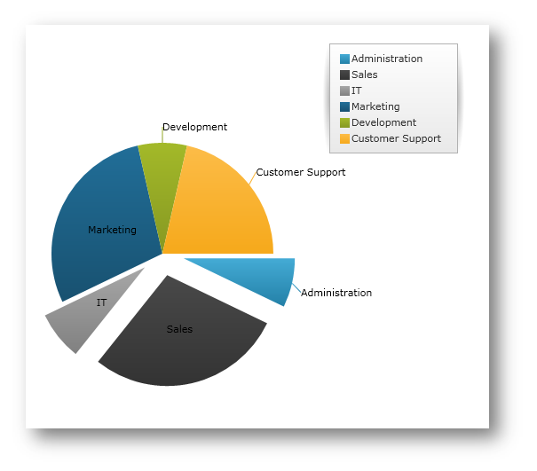

[[custom_resource_strings]]
== link:developers-guide-customizing-resource-strings.html[Custom Resource Strings]

Starting with this release, you are provided with the ability to customize the string values of all controls in the {ProductName} Data Visualization product. This allows you to easily localize your application for specific cultures, locales, or languages.

In the following picture, the xamPivotGrid control has its resource strings customized:

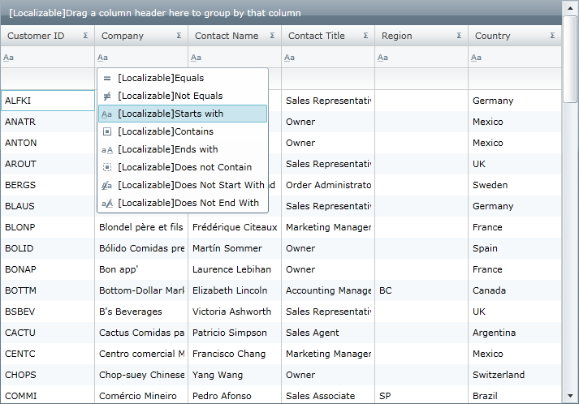

Figure 2: The xamPivotGrid control with customized Filter, Data, Row, Column and XamPivotDataSelector headers

[[ui_automation_support]]
== link:developers-guide-ui-automation-support.html[UI Automation Support]

The {ProductName} suite of controls fully supports Microsoft® UI Automation. The UI Automation framework allows for assistive technology products, such as screen readers, to access the UI elements of applications and provide this information to end users with disabilities.

Another key use of UI Automation is automated testing; the framework allows test scripts to access and interact with the UI elements.

[[xamMapPerformance]]
== xamMap™ – Performance Improvements

In the 2011 Volume 1 release, the link:{ApiPlatform}controls.maps.xammap{ApiVersion}~infragistics.controls.maps.xammap.html[xamMap]™ control is now updated making panning and zooming operations on the map control much faster. Also, performance is improved when captions are not used on the map. For more information, refer to the link:xammap-map-window-animation.html[Using Map Window Animation] topic.

In addition, response times are greatly improved for maps that use thousands of link:{ApiPlatform}controls.maps.xammap{ApiVersion}~infragistics.controls.maps.symbolelement.html[SymbolElement]. For more information on how to use map elements, refer to the link:xamwebmap-map-elements.html[Display Map Elements] topic.

image::images/Whats_New_2011_1_xamMap_01.png[]

[[xamDataChartPerformance]]
== xamDataChart™ – Performance Improvements

In the 2011 Volume 1 release, the link:{ApiPlatform}controls.charts.xamdatachart{ApiVersion}~infragistics.controls.charts.xamdatachart.html[xamDataChart]™ control defers work until the user is done interacting with it. If you updated numerous items in a data-bound collection separately, the previous xamDataChart would perform extraneous work, rather than waiting until you were finished with the updates. Now it will wait until your interaction has concluded. Also, if you update multiple appearance properties on the xamDataChart or its axes, the new version of the chart will wait until all property updates are completed before reconciling the differences with its visuals.

In addition, work to update the Scatter and Polar charts has been made more streamlined to improve performance. There is also a greater attempt made to keep the same markers on the screen as the last refresh, reducing visual noise and improving rendering speed. For more information, please refer to the link:datachart-chart-performance.html[Chart Performance] topic.

[[xamDataChartNewSeries]]
== xamDataChart™ – New Types of Series

The xamDataChart control has been updated to provide support for the following new types of series:

* link:datachart-bubble-series.html[Bubble Series]
* link:datachart-polar-area-series.html[Polar Area Series]
* link:datachart-polar-scatter-series.html[Polar Scatter Series]
* link:datachart-polar-spline-area-series.html[Polar Spline Area Series]
* link:datachart-radial-area-series.html[Radial Area Series]
* link:datachart-radial-line-series.html[Radial Line Series]
* link:datachart-radial-column-series.html[Radial Column Series]
* link:datachart-radial-pie-series.html[Radial Pie Series]

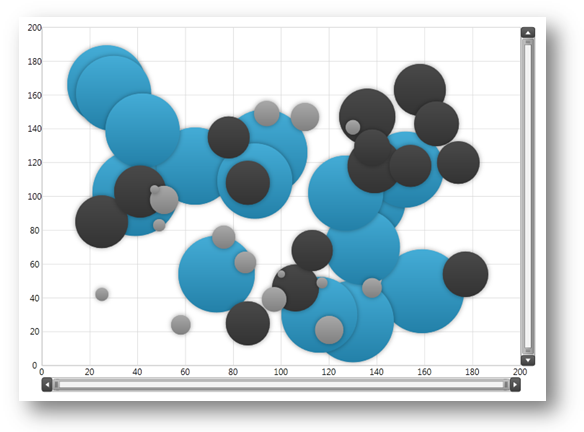

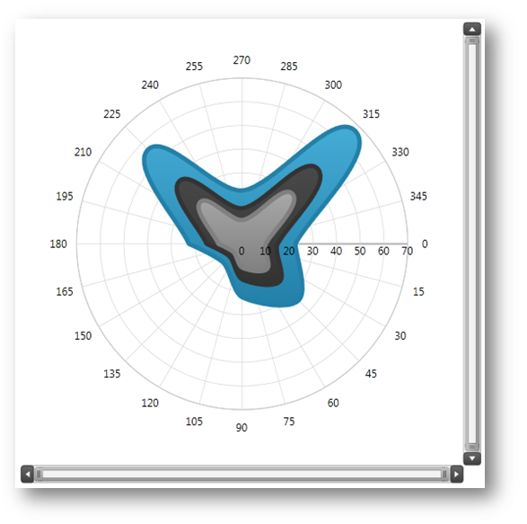

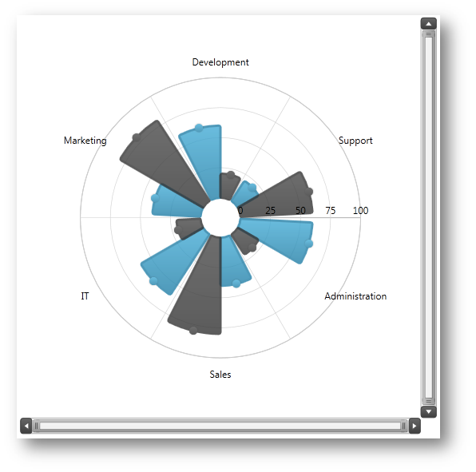

[[xamDataChartValueOverlay]]
== xamDataChart™ – Value Overlay

The xamDataChart control provides support for displaying multiple Value Overlays and calculating mathematical values using the Infragistics Math Calculators, which are part of the {ApiPlatform}Math.Calculators{ApiVersion}.dll assembly. For more information on this, please refer to the link:datachart-series-value-overlay.html[Value Overlay] topic.

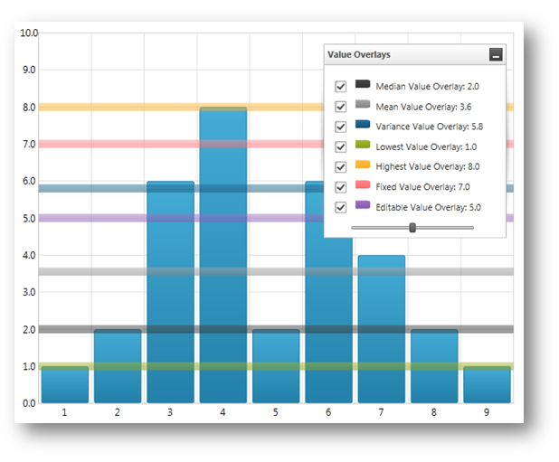

[[igtheme]]
== New IG Theme

This release introduces a new theme (IG Theme) that can be applied to all {ProductName} controls. This theme is dominantly monochromatic, with the use of blacks, whites, and some grays, plus blue as a highlight/accent color. Every control has a corresponding theme resource file, which is shipped as an external file that you can interact with through XAML and code-behind. For more information on how to use the IG theme, please refer to the link:designers-guide-using-themes.html[Using Themes] topic.

The following pictures demonstrate some of the {ProductName} controls with the IG theme applied:

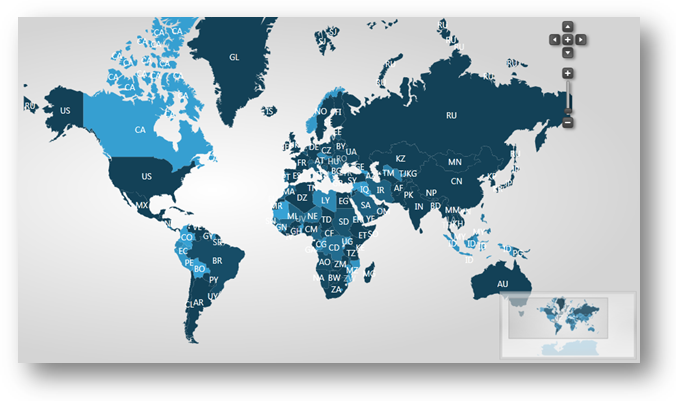

Figure 1: xamMap control with applied IG Theme.

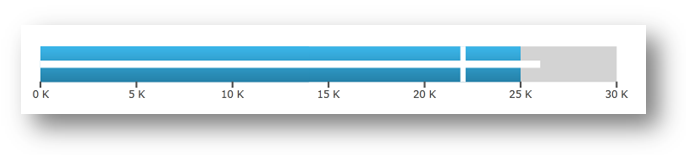

Figure 2: xamBulletGraph control with applied IG Theme.

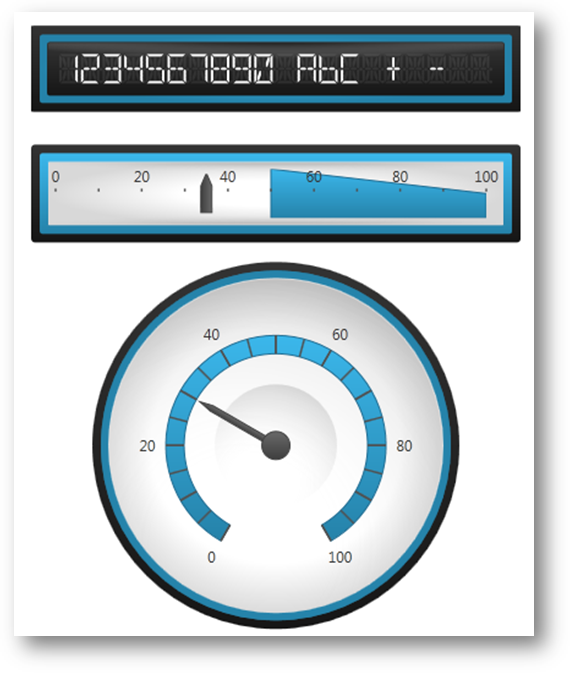

Figure 3: xamGauge controls with applied IG Theme.

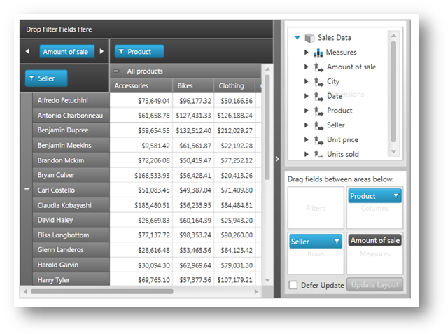

Figure 4: xamPivotGrid control with applied IG Theme.

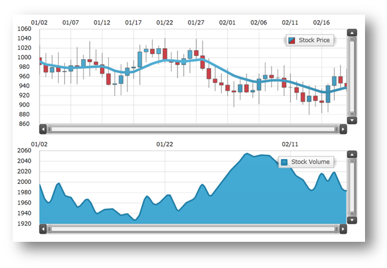

Figure 5: xamDataChart control with applied IG Theme.

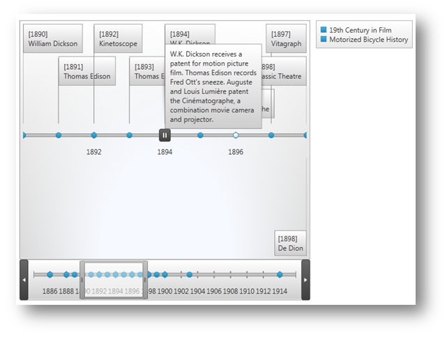

Figure 6: xamTimeline control with applied IG Theme.

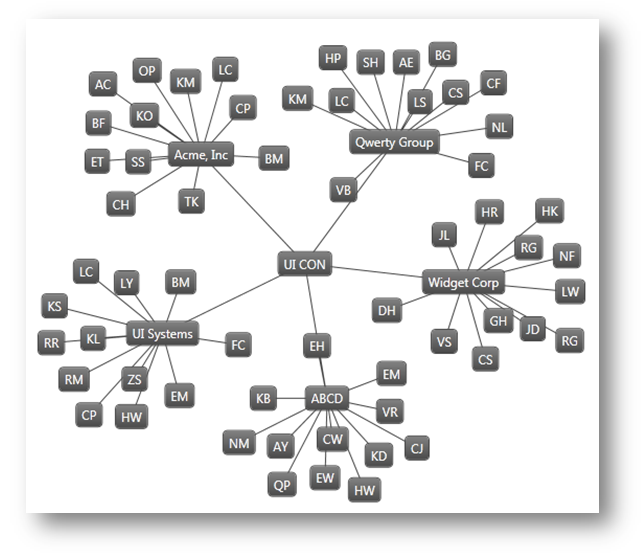

Figure 7: xamNetworkNode control with applied IG Theme.

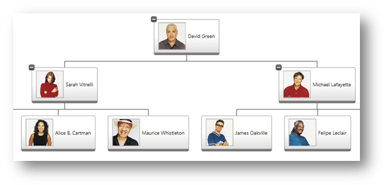

Figure 8: xamOrgChart control with applied IG Theme.