////

|metadata|
{
    "name": "wpf-dv-whats-new-in-2011-volume-2",
    "controlName": [],
    "tags": ["Getting Started"],
    "guid": "4a41fb0f-3d8f-4689-be54-937e8089a457",  
    "buildFlags": [],
    "createdOn": "2012-01-31T20:23:42.5614945Z"
}
|metadata|
////

= What's New in 2011 Volume 2

The {ProductName} 2011 Volume 2 release includes a number of powerful new features and controls to allow you to take even more advantage of our {PlatformName} controls.

Below is a list of the features and controls that we added or updated for the 2011 Volume 2 release. Click through the links to explore the set of new features.

This document contains the following sections:

* <<InfragisticsMathLibrary,Infragistics Math Library™>>
* <<InfragisticsMathCalculators,Infragistics Math Calculators™>>
* <<xamFunnelChart,xamFunnelChart™ – New Control>>
* <<xamDataChart,xamDataChart™ – New Features>>

** <<xamDataChartNewSeries,xamDataChart – New Types of Series>>
** <<xamDataChartAxisScalers,xamDataChart – Axis Scalers>>
** <<xamDataChartAxisTickmarkValues,xamDataChart – Axis Tickmark Values>>
** <<xamDataChartSeriesInheritance,xamDataChart – Series Inheritance>>
** <<xamDataChartSeriesErrorBars,xamDataChart – Series Error Bars>>
** <<xamDataChartCorrelationFormula,xamDataChart – Correlation Formula>>
** <<xamDataChartWeightedMovingAverageTrendLine,xamDataChart – Weighted Moving Average Trend Line>>
** <<xamDataChartLegendItemDisplayOrder,xamDataChart – Legend Item Display Order>>
** <<xamDataChartOverviewPane,xamDataChart – Chart Overview Pane (CTP)>>
** <<xamDataChartOLAPAxis,xamDataChart – OLAP Axis (CTP)>>

* <<xamGeographicMap,xamGeographicMap™ – New Control (CTP)>>
* <<xamNetworkNode,xamNetworkNode™ – New Features>>

** <<xamNetworkNodeNavigationFeatures,xamNetworkNode – Navigation Features>>
** <<xamNetworkNodeRelationshipBetweenNodes,xamNetworkNode – Relationship Between Nodes>>
** <<xamNetworkNodeRemovingNodes,xamNetworkNode – Removing Nodes from Network>>
** <<xamNetworkNodeRemovingNodes,xamNetworkNode – Displaying Visual States on Network Nodes>>

* <<xamPivotGrid,xamPivotGrid™ - New Features>>

** <<xamPivotGridPerformanceImprovement,xamPivotGrid – Performance Improvement>>
** <<xamPivotGridProgressIndicator,xamPivotGrid – Progress Indicator>>
** <<xamPivotGridDataSlicer,xamPivotGrid – Data Slicer>>
** <<xamPivotGridIntegration,xamPivotGrid – Integration with xamDataChart (CTP)>>

* <<xamSparkline,xamSparkline™ – New Control (CTP)>>
* <<xamTimeline,xamTimeline™ – Auto Adjust Labels Based on Zooming>>
* <<ResWash,Resource Washer>>

== Infragistics Math Library™

The link:{ApiPlatform}math{ApiVersion}~infragistics.math_namespace.html[Infragistics Math Library]™ is a library of mathematical and statistical structures and functions that you can use with all Infragistics controls. Refer to the link:ig-math-infragistics.html[Infragistics Math Library] topic for more information on this library.

The Infragistics Math Library extends the operations in the link:http://msdn.microsoft.com/en-us/library/system.math.aspx[System.Math] class to several new mathematical objects:

* link:{ApiPlatform}math{ApiVersion}~infragistics.math.complex.html[Complex Numbers]
* link:{ApiPlatform}math{ApiVersion}~infragistics.math.constant.html[Mathematical constants]
* link:{ApiPlatform}math{ApiVersion}~infragistics.math.vector.html[Vectors]

** link:{ApiPlatform}math{ApiVersion}~infragistics.math.complexvector.html[Complex vectors]
** link:{ApiPlatform}math{ApiVersion}~infragistics.math.booleanvector.html[Boolean vectors]

* link:{ApiPlatform}math{ApiVersion}~infragistics.math.matrix.html[Matrices]

** link:{ApiPlatform}math{ApiVersion}~infragistics.math.complexmatrix.html[Complex matrices]
** link:{ApiPlatform}math{ApiVersion}~infragistics.math.booleanmatrix.html[Boolean matrices]

== Infragistics Math Calculators™

The link:{ApiPlatform}math.calculators{ApiVersion}~infragistics.math.calculators_namespace.html[Infragistics Math Calculators] is a library of mathematical and statistical calculators that you can use with all Infragistics controls to compute various calculations.

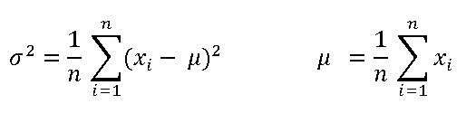

Figure 1 – Formula for Variance and Mean Calculations.

The Infragistics Math Calculators are required to calculate value overlay and error bars in the xamDataChart control. Refer to the link:ig-math-calculators.html[Infragistics Math Calculators] topic for more information on this library. They can be categorized in the following types of calculators:

[options="header", cols="a,a"]
|====
|Calculator Type|Description

|Value Calculators
|Represent a group of Infragistics Math Calculators that calculates a single value. Refer to the link:datachart-series-value-overlay.html[Value Overlay] and link:datachart-series-data-correlation.html[Series Data Correlation] topics for examples on how to integrate value calculators with the xamDataChart control. 

* link:ig-calculators-correlation-calculator.html[Infragistics Correlation Calculator] 

* link:ig-calculators-mean-calculator.html[Infragistics Mean Calculator] 

* link:ig-calculators-median-calculator.html[Infragistics Median Calculator] 

* link:ig-calculators-standard-deviation-calculator.html[Infragistics Standard Deviation Calculator] 

* link:ig-calculators-standard-error-calculator.html[Infragistics Standard Error Calculator] 

* link:ig-calculators-variance-calculator.html[Infragistics Variance Calculator] 

|Error Bar Calculators
|Represent a group of Infragistics Math Calculators that calculates length of error bars for Series objects in xamDataChart control. Refer to the link:datachart-series-error-bars.html[Series Error Bars] topic for examples on how to integrate error bars calculators with the xamDataChart control. 

* link:ig-calculators-data-calculator.html[Infragistics Data Calculator] 

* link:ig-calculators-fixed-value-calculator.html[Infragistics Fixed Value Calculator] 

* link:ig-calculators-percentage-calculator.html[Infragistics Percentage Calculator] 

* link:ig-calculators-standard-deviation-calculator.html[Infragistics Standard Deviation Calculator] 

* link:ig-calculators-standard-error-calculator.html[Infragistics Standard Error Calculator] 

|====

== xamFunnelChart™ – New Control

The funnel chart displays data in a funnel shape. It displays sections in a top-down composition each representing the data as slices from largest value to the smallest value. Refer to the link:funnelchart.html[xamFunnelChart] topic for more information on this control.

Preview of the xamFunnelChart.

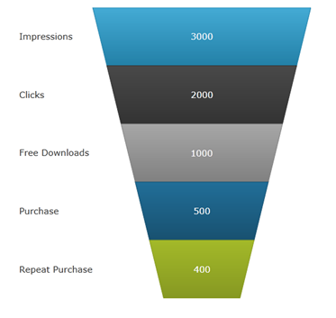

== xamDataChart™ – New Features

This section provides information about new features of the link:datachart-datachart.html[xamDataChart] control.

== xamDataChart – New Types of Series

The xamDataChart control is updated to provide support a number of new series types. Refer to the link:datachart-category-series-overview.html[Category Series] topic for more information on these series.

* Bar Series
* Stacked 100-Area Series
* Stacked 100-Bar Series
* Stacked 100-Column Series
* Stacked 100-Line Series
* Stacked 100-Spline Series
* Stacked 100-Spline Area Series
* Stacked Bar Series
* Stacked Area Series
* Stacked Column Series
* Stacked Line Series
* Stacked Spline Series
* Stacked Spline Area Series
* Point Series (Community Technology Preview)

Preview of some of the new types of series in the xamDataChart control.

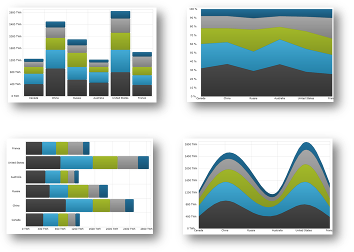

== xamDataChart – Axis Scalers

The axis scalers feature of the xamDataChart control allows you to implement custom axis scalers for scaling values plotted along numeric axes. Refer to the link:datachart-using-axis-scales.html[Using Axis Scales] and link:datachart-creating-custom-axis-scalers.html[Creating Custom Axis Scalers] topics for more information on this chart feature.

Preview of the xamDataChart with y-axis scaled using custom axis scaler.

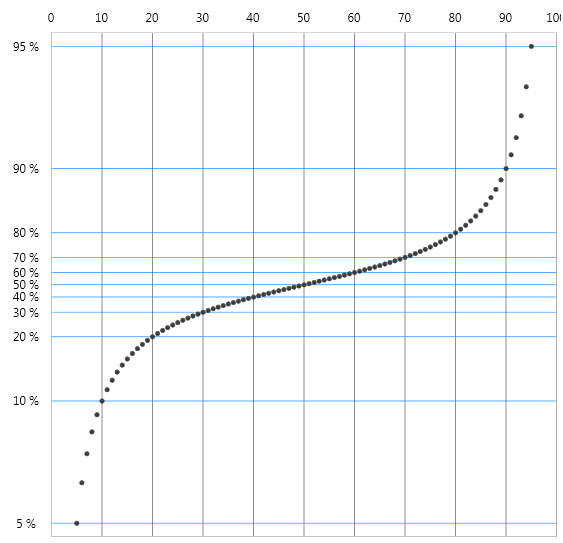

== xamDataChart – Axis Tickmark Values

The axis tickmark values feature of the xamDataChart control allows you to implement custom axis tickmark values on numeric axes. Refer to the link:datachart-creating-custom-axis-tickmark-values.html[Creating Custom Axis Tickmark Values] topic for more information on this chart feature.

Preview of the xamDataChart with custom tickmark values on y-axis.

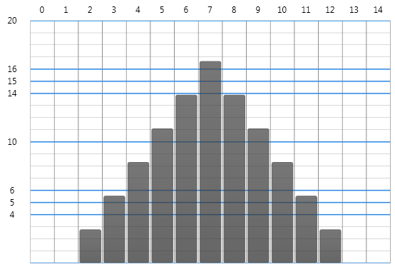

== xamDataChart – Series Inheritance

The series inheritance feature of the xamDataChart control allows you to implement custom types of series from a base link:{ApiPlatform}controls.charts.xamdatachart{ApiVersion}~infragistics.controls.charts.series.html[Series] object or by extending existing types of series. Refer to the link:datachart-creating-custom-series.html[Creating Custom Series] topic for more information on this chart feature.

Preview of the xamDataChart with custom series showing filled contours connecting data points with the same values.

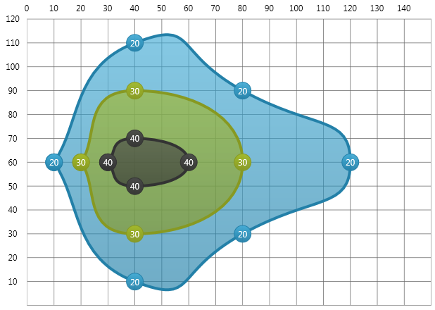

== xamDataChart – Series Error Bars

The error bars feature of the xamDataChart control allows plotting various error bars on data points plotted. All error bars are calculated using the link:ig-math-calculators.html[Infragistics Math Calculators] assembly and they can be used on all types of link:datachart-scatter-series-overview.html[Scatter Series] and most link:datachart-category-series-overview.html[Category Series]. Refer to the link:datachart-series-error-bars.html[Series Error Bars] topic for more information on this chart feature.

Preview of the xamDataChart with error bars set on data points of Scatter Series.

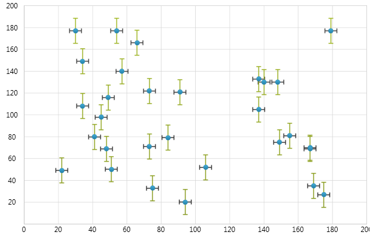

== xamDataChart – Correlation Formula

The data correlation formula allows calculation of the correlation between two variables in a set of data displayed in the xamDataChart using the link:ig-calculators-correlation-calculator.html[Infragistics Correlation Calculator], which is part of the link:ig-math-calculators.html[Infragistics Math Calculators] assembly. Refer to the link:datachart-series-data-correlation.html[Series Data Correlation] topic for more information on this chart feature.

Preview of the xamDataChart with data correlation displayed as a legend item.

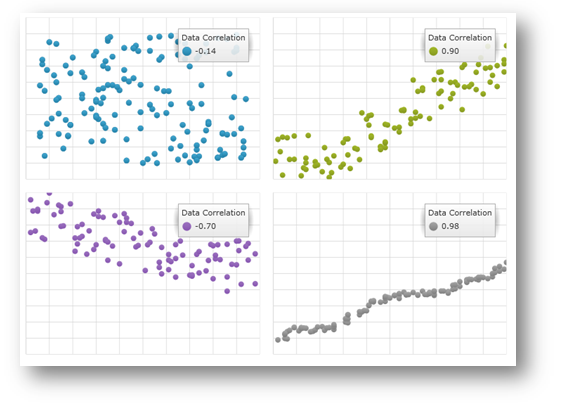

== xamDataChart – Weighted Moving Average Trend Line

The xamDataChart control allows plotting Weighted Moving Average as new type of trend line. Refer to the link:datachart-trend-lines.html[Trend Lines] topic for more information on this chart feature.

Preview of the xamDataChart with a trend line showing Weighted Moving Average on Financial Price Series.

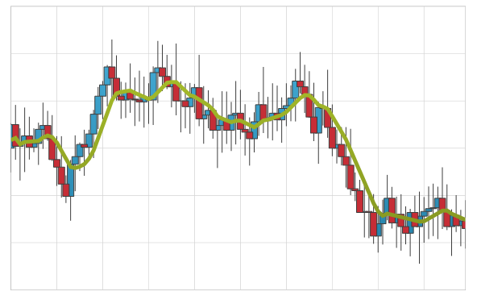

== xamDataChart – Legend Item Display Order

The xamDataChart control supports reversing display order of legend items using the ReversLegendOrder property of stacked series.

Preview of the xamDataChart with reversed display order of legend items in chart legend.

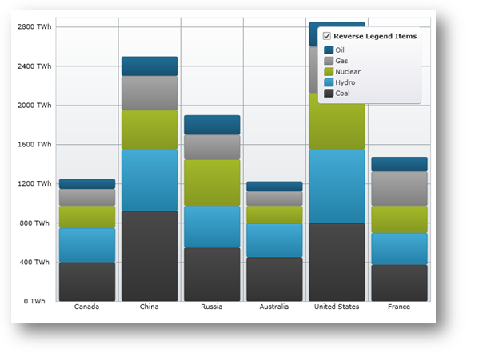

== xamDataChart – Chart Overview Pane (CTP)

The xamDataChart control supports integration with the xamOverviewPlusDetailPane control which provides panning and zooming functionality and an overview of the contents of the chart when data is plotted using link:{ApiPlatform}controls.charts.xamdatachart{ApiVersion}~infragistics.controls.charts.areaseries.html[AreaSeries] or link:{ApiPlatform}controls.charts.xamdatachart{ApiVersion}~infragistics.controls.charts.lineseries.html[LineSeries]. Refer to the link:xamoverviewplusdetailpane.html[xamOverviewPlusDetailPane] topic for more information on this navigation control.

Preview of the xamDataChart with the xamOverviewPlusDetailPane control.

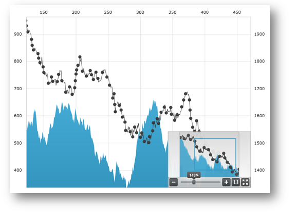

== xamDataChart – OLAP Axis (CTP)

The xamDataChart control supports plotting data from OLAP (Online Analytical Processing) Flat Data source using link:{ApiPlatform}controls.charts.olap{ApiVersion}~infragistics.controls.charts.olapxaxis.html[OlapXAxis] and OlapColumnSeries objects provided by the {ApiPlatform}Controls.Charts.OlapAxis.{DllVersion}dll assembly.

Preview of the xamDataChart with OLAP data plotted using OlapXAxis.

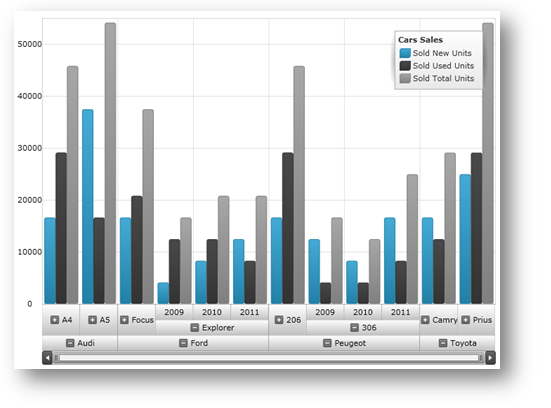

== xamGeographicMap – New Control (CTP)

The xamGeographicMap is a new control released as Community Technology Preview. The Geographic Map combines features of link:xammap.html[xamMap] control including plotting of different geo-imagery sources, Shapefiles, and geographic locations with performance of data plotting and navigation of the link:datachart-datachart.html[xamDataChart] control.

Preview of the xamGeographicMap control with different data sources.

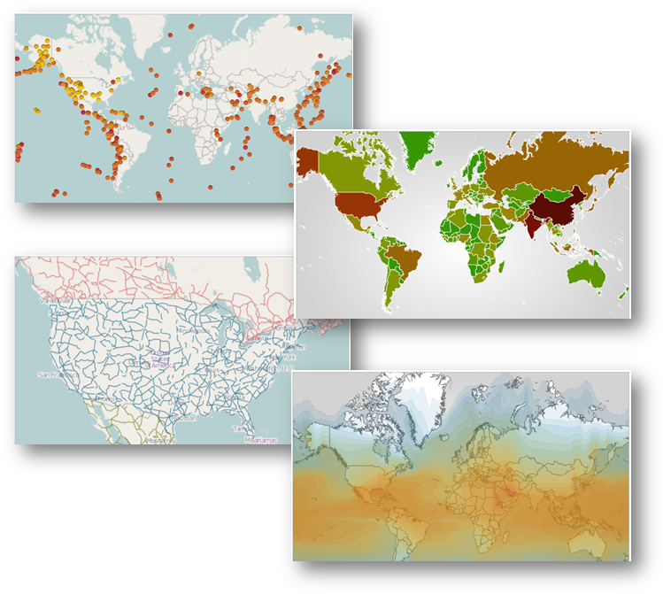

== xamNetworkNode™ – New Features

This section provides information about new features of the xamNetworkNode control.

== xamNetworkNode – Navigation Features

The xamNetworkNode control is now able to navigate using the mouse and keyboard for moving the xamNetworkNode within the view portal.

Table 1 - New Navigation Functionalities

[options="header", cols="a,a"]
|====
|Feature|Description

|Hold down the Ctrl key and press the plus [+] sign on the keyboard
|The view port will zoom in on the xamNetworkNode.

|Hold down the Ctrl key and press the plus [-] sign on the keyboard
|The view port will zoom out on the xamNetworkNode

|Use the Mouse wheel to scroll
|The view port will zoom in and out on the xamNetworkNode

|Use the Arrow keys on the keyboard
|The view port will move the xamNetworkNode to corresponding direction in the view.

|Point the Mouse to the background of the xamNetworkNode (not on any specific node) then press the Left Mouse button and move the mouse
|The view port will pan the xamNetworkNode in view

|====

== xamNetworkNode – Relationship Between Nodes

The xamNetworkNode control now is able to establish various relationship types for the connected nodes with icons indicating the source and target of the connected nodes within the control.

The image below demonstrates the setting for LineStartCap/LineEndCap. Source node with the LineStartCap related to the target node with the LineEndCap:

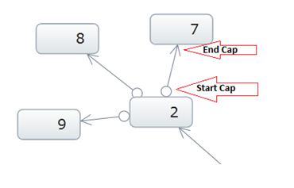

== xamNetworkNode – Removing Nodes from Network

Remove nodes from a network from the network layout, and or from the data source.

[options="header", cols="a,a"]
|====
|Feature|Description

|Removing Node from NetworkNodeLayout
|Removing a node from the network layout is done by setting the visibility property of NetworkNodeNode to Collapsed.

|Removing Node from data source
|Removing the nodes from the data source requires that you remove them from the underlying collection. The control is notified of any changes made in the nodes’ collection, and gets updated reflective of the changes from the data model. For the change notification, your data must implement <a href="">INotifyPropertyChanged</a> interface.

|====

Removing the node ‘4’ from the view:

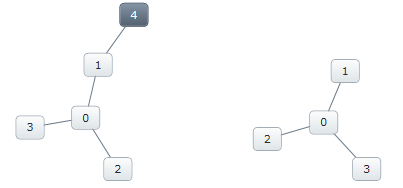

Figure: Removing nodes - before (left) and after (right)

If the node that is being removed is connected to another node, the connecting node will display without the connecting line.

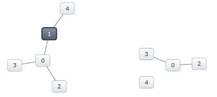

Figure: Removing a connected node - before (left) and after (right)

== xamNetworkNode – Show / Hide Nodes

The xamNetworkNode control now features a number of ways to show and hide nodes:

Show/Hide using the Expansion indicator

Show/Hide without Expansion indicator, using code behind

Enter key on the keyboard (when expansion indicators are visible)

In addition to the default modes, any node can hide itself by setting the node’s Visibility property to “Collapsed”.

The following image displays the xamNetworkNode control with expansion indicators enabled on the parent node. The parent nodes have connections to the child nodes that can be shown and hidden. The plus sign indicates that the child nodes are hidden

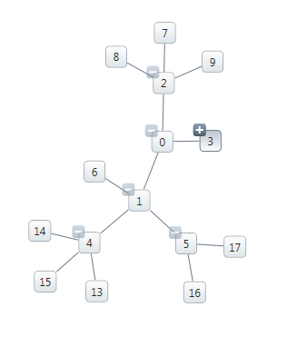

Figure: Displaying expansion indicators.

== xamNetworkNode – Displaying Visual States on Network Nodes

The xamNetworkNode control visual states are organized in groups, each consisting of several visual state properties where the control can be set to one of the states from any of the selected groups.

The following images illustrate the different visual states the xamNetworkNode control currently supports:

[options="header", cols="a,a"]
|====
|Visual State|Preview

|Normal
|image::images/Whats_New_In_2011_Volume_2_xamNetworkNode_05.png[] 

|Disabled
|image::images/Whats_New_In_2011_Volume_2_xamNetworkNode_06.png[] 

|Focused
|image::images/Whats_New_In_2011_Volume_2_xamNetworkNode_07.png[] 

|Selected
|image::images/Whats_New_In_2011_Volume_2_xamNetworkNode_08.png[] 

|IsEditing 

.Note 

[NOTE] 

==== 

The IsEditing state his is only a visual state; the nodes are not editable. 

====
|image::images/Whats_New_In_2011_Volume_2_xamNetworkNode_09.png[] 

|====

== xamNetworkNode – Zooming in on Selected Nodes

Experience the zooming functionality. The xamNetworkNode control now includes an enhanced feature which allows you to zoom in on a one or more selected nodes. The control also supports zooming in on any user-searched nodes.

This image illustrates zooming in on a single node.

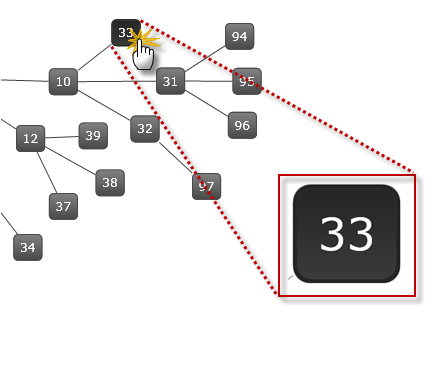

Figure: Displaying zooming in on a node.

== xamPivotGrid™ - New Features

This section provides information about new features of the xamPivotGrid control.

== xamPivotGrid - Performance Improvement

In the xamPivotGrid™ control features a number of significant performance improvements. In the 2011 Volume 1 (previous) release, the control had performed with longer response time with 50,000 records. Now with the current release it can render 1,500,000 records in approximately 2 seconds.

In XMLA data source the data is organized in cubes and each dimension contains defined hierarchies. The current enhancement includes improving the hierarchy rendering which boosts the performance of the flat data source as well.

Please refer to the “Handling large data” sample in the Performance section of the samples browser, which demonstrates the improved performance capabilities.

== xamPivotGrid – Progress Indicator

The xamPivotGrid control’s DataSource now supports an IsBusy property which is used to determine if the data processing is still in progress (busy) or completed. This is identical to an existing property called “Processing” of xamPivotGrid control’s DataSource object. If the data processing is in progress the value is “true”. This allows the user to implement a progress indicator; if desired; to display on the page during the time of processing or loading the data.

Preview of the progress indicator while the xamPivotGrid is busy loading data.

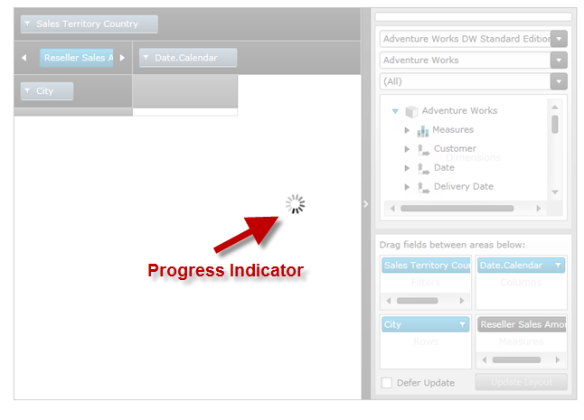

== xamPivotGrid – Data Slicer

The xamPivotDataSlicer™ control features an easier way of filtering the data in addition to the existing pivot grid filtering. With this enhanced filtering capability you can now filter the hierarchies selected in columns, rows and filter areas in conjunction with the measures of the pivot grid simply by using the items listed in the data slicer. One or more items can be select by pressing down the Ctrl key on the keyboard and Left mouse button click.

In the following image you can see the selected items on the data slicer filtering the information shown in the data hierarchy.

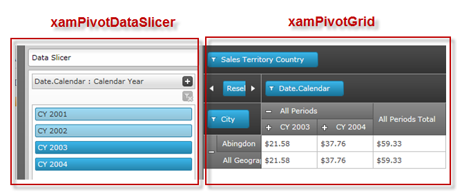

== xamPivotGrid – Integration with xamDataChart (CTP)

The {ApiPlatform}Controls.Charts.OlapAxis.{DllVersion} assembly exposes a new axis type called OlapAxis which is used by the xamDataChart control to plot data. The OlapAxis is the key element of the integration process in a sense that it is bound to the same data source as the pivot grid using the DataSource property. The supported data source types are XMLADataSource and FlatDataSource of the pivot grid. For more details and code examples refer to the link:xampivotgrid-integration-with-chart.html[Integration with Data Chart] topic.

Preview of xamPivotGrid integration with xamDataChart.

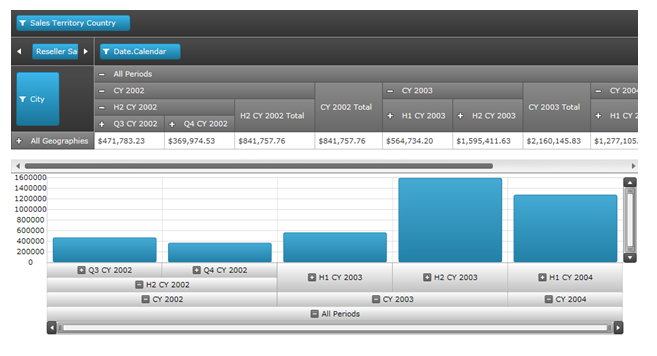

== xamSparkline™- New Control (CTP)

The xamSparkline is a full functional chart that can fit in one grid cell. Currently this is a Community Technology Preview control, and it supports four chart types: Line, Area, Column, and WinLoss. The chart renders with one dimensional data of type Numeric or DateTime. It has a capability to display the markers such as high/Low, first/last, negative and markers for all data points.

Here are the different chart types showing the High and Low markers:

[options="header", cols="a,a"]
|====
|Chart Type|Preview

|Line
|image::images/Whats_New_In_2011_Volume_2_xamSparkline_01.png[] 

|Area
|image::images/Whats_New_In_2011_Volume_2_xamSparkline_02.png[] 

|Column
|image::images/Whats_New_In_2011_Volume_2_xamSparkline_03.png[] 

|Column with Range Area
|image::images/Whats_New_In_2011_Volume_2_xamSparkline_04.png[] 

This image illustrates the normal range area (highlighted horizontally) that can be adjusted based on the user defined values between minimum and maximum.

|WinLoss 

Displays positive and negative values as well as markers (high / low)
|image::images/Whats_New_In_2011_Volume_2_xamSparkline_05.png[] 

|====

== xamTimeline™ - Auto Adjust Labels Based on Zooming

The timeline labels now have the capability to automatically adjust the tick marks based on zooming in on the selected time segment of the data. For example:

* When Timeline displays Year unit type, the tick marks will display the Months after zooming.
* When Timeline displays Month unit type, the tick marks will display the Days after zooming.
* When Timeline displays Day unit type, the tick marks will display the Hours after zooming.

Before zooming: the control displays the days of the month:

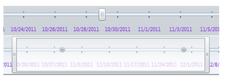

After zooming: The control Auto-Adjusts the labels and displays the hours:

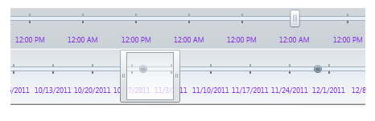

Refer to the link:xamtimeline-auto-adjust-labels.html[Auto Adjust Labels] topic for more information on this feature.

== Resource Washer

With Resource Washing, you can set the color (the WashColor) on groups of resources (WashGroups) in an existing ResourceDictionary to update the color of the controls in your application.

*Related topics:*

* link:reswash-about.html[About Resource Washer]