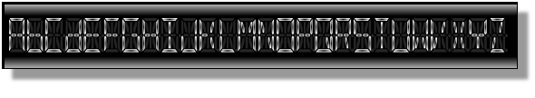
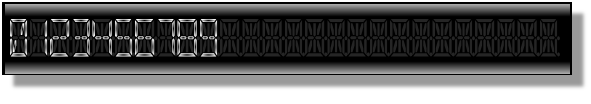
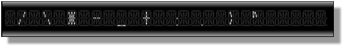

////

|metadata|
{
    "name": "wpf-known-issues-and-limitations",
    "controlName": [],
    "tags": ["Getting Started","How Do I","Known Issues"],
    "guid": "{4483411E-3ED9-4188-A732-253B6A81AA4D}",  
    "buildFlags": [],
    "createdOn": "2012-01-30T19:39:51.6816895Z"
}
|metadata|
////

= Known Issues and Limitations

This topic provides information on the currently known issues and limitations related to the {ProductName} product. We will be working to address the known issues in future releases of the product.

== Known Issues

This section contains a list of the issues in the current release of the product that will be addressed in future hot fixes and/or full releases.

=== Samples

If you install the samples, and then compile the source code, when you attempt to uninstall the samples, the files that were complied will still remain. This is due to the fact that the installer only keeps track of what it creates. So since you compiled the samples, the installer will not delete those files. You will have to manually delete those files and folders yourself.

=== Side-by-side Microsoft™ Visual Studio™ documentation

The documentation for {ProductName} 2010.1 cannot be installed at the same time with other documentation versions. For example, it is not possible to have the product documentation for {ProductName} 2010.1 installed along with the product documentation for {ProductName} 2010.2 on the same computer. The documentation for {ProductName} 2010.1 should be uninstalled before installing newer versions. There is no such limitations regarding the documentation versions 2010.2 and higher.

=== Exporting to Microsoft® Excel® and Expanded Records

The ExportOptions object's ExcludeExpandState property only affects root-level records.

=== Theme Assemblies Are Not Loaded When Copy Local Is True

When you add a theme assembly to your project in Microsoft® Expression® Blend, its Copy Local property is automatically set to True. In this case, the CLR will not load the theme assembly at run time. The side effect of this behavior is that the external theme will not be applied to the controls in your application even if you set the control's Theme property to the name of the external theme. For example, if you add the {ApiPlatform}Themes.Fall.{DllVersion}dll theme assembly to your project in Expression Blend and set the xamDataGrid™ control's Theme property to "Fall", the fall theme will not be applied to the xamDataGrid control at run time. You must either reference a type in the fall theme assembly or set the theme assembly's Copy Local property to False. For cases where you need to set the theme assemblies' Copy Local property to True, you can use the following example code to load the assembly.

*In XAML:*

----
<!--The XAML will load the theme assembly and apply the theme to all DataPresenters in your Window even if you do not set their Theme properties.-->
<Window.Resources>
    <ResourceDictionary>
        <ResourceDictionary.MergedDictionaries>
            <igThemeFall:DataPresenter 
                xmlns:igThemeFall="http://infragistics.com/Themes/Fall" />
        </ResourceDictionary.MergedDictionaries>
    </ResourceDictionary>
</Window.Resources>
----

*In Visual Basic:*

----
'TODO: Put this code in the application's Application.xaml.vb file.
Protected Overrides Sub OnStartup(ByVal e As StartupEventArgs)
    MyBase.OnStartup(e);
    'You do not have to access any of the class' members.
    'The CLR will load the assembly when you instantiate a class from the theme assembly.
    Dim temp As New Infragistics.Windows.Themes.Fall.Primitives()
End Sub
----

*In C#:*

----
//TODO: Put this code in the application's App.xaml.cs file.
protected override void OnStartup(StartupEventArgs e)
{
    base.OnStartup(e);
    //You do not have to access any of the class' members.
    //The CLR will load the assembly when you instantiate a class from the theme assembly.
    Infragistics.Windows.Themes.Fall.Primitives temp = new Infragistics.Windows.Themes.Fall.Primitives();
}
----

=== Commands and xamDockManager's Floating Panes

When a command is attached to a ButtonBase derived control in a focus scope other than the xamDockManager™ control (e.g., a ButtonTool in the xamRibbon control), the command will not 'find' target elements that are in xamDockManager's floating panes. This issue will be addressed in a future version or hotfix release of xamDockManager. This issue does not apply to target elements in docked panes.

=== Using xamCarouselPanel and xamCarouselListBox Inside of a Tab Control

When either xamCarouselPanel™ or xamCarouselListbox™ is used inside of a Tab control, the xamCarouselPanel or xamCarouselListBox control must be wrapped with an AdornerDecorator to ensure that the link:{RootAssembly}{ApiVersion}~infragistics.windows.controls.carouselpanelnavigator.html[CarouselPanelNavigator] remains visible as the active tab changes. Without the AdornerDecorator, the CarouselPanelNavigator may disappear when switching to and from the tab containing the xamCarouselPanel or xamCarouselListBox control.

*In XAML:*

----
<TabControl>
    <TabItem x:Name="tabSample" Header="Sample">
        <Grid>
            <AdornerDecorator>
                <igDP:XamCarouselPanel />            
            </AdornerDecorator>
        </Grid>
    </TabItem>
</TabControl>
----

== xamSegmentedDisplay™

The xamSegmentedDisplay control uses 7 or 14 individual segments in order to render each character that gets displayed. This depends on what you set the value of the control’s link:{ApiPlatform}controls.charts.xamgauge{ApiVersion}~infragistics.controls.charts.xamsegmenteddisplay~segmentmode.html[SegmentMode] property. Each mode has its own supported set of characters that will render in the control.

When the link:{ApiPlatform}controls.charts.xamgauge{ApiVersion}~infragistics.controls.charts.xamsegmenteddisplay.html[xamSegmentedDisplay] control’s SegmentMode property is set to FourteenSegment then the control will use 14 individual segments to display each character. The following list shows these supported characters in Fourteen Segment mode:

* Letters

By default all lower-case letters are represented as upper-case letters. However, the following letters are always represented in lower-case due to the limited number and arrangment of segments:

** B in lower-case
** D in lower-case
** A-Z in upper-case except B and D

* Numbers

** 0-9 from zero to nine

* Other

** / slash
** \ backslash
** $$* $$ asterisk
** - minus
** _ underscore
** + plus
** : colon
** . dot
** > greater-than
** ^ caret
** Space

* Unsupported

** ! exclamation mark
** “ quotation mark
** , comma
** # number sign
** $ dollar sign
** % percent sign
** & ampersand sign
** ‘ apostrophe
** ( left round bracket
** ) right round bracket
** ; semicolon
** < less-than
** = equal
** ? question mark
** | vertical bar
** [ left square bracket
** ] right square bracket
** ` Grave accent
** { left curly bracket
** } right curly bracket
** ~ tilde
** @ at

When the xamSegmentedDisplay™ control’s SegmentMode property is set to SevenSegment then the control will use 7 individual segments to display each character. The following list shows these supported characters in Seven Segment mode:

* Numbers

** 0-9

* Other

** - minus
** . dot
** : colon
** space

* Unsupported

** A-Z uppercase letters
** a-z lowercase letters
** + plus
** $$* $$ asterisk
** / slash
** \ backslash
** _ underscore
** ! exclamation mark
** “ quotation mark
** , comma
** # number sign
** $ dollar sign
** % percent sign
** & ampersand sign
** ‘ apostrophe
** ( left round bracket
** ) right round bracket
** ; semicolon
** < less-than
** > greater-than
** = equal
** ? question mark
** | vertical bar
** ^ caret
** [ left square bracket
** ] right square bracket
** ` Grave accent
** { left curly bracket
** } right curly bracket
** ~ tilde
** @ at

*Using the new and old Radial Gauge assemblies.*

If the following assemblies are referenced in the an application:

* InfragisticsWPF.Controls.Gauges.dll
* InfragisticsWPF.Controls.Charts.XamGauge.dll

You must use the following code snippet to create xamRadialGauge and xamSegementedDisplay controls to avoid ambiguity between the old and new xamRadialGauge controls.

*In XAML:*

----
xmlns:igGauge="clr-namespace:Infragistics.Controls.Gauges;assembly=InfragisticsWPF.Controls.Gauges"  
xmlns:igCharts="clr-namespace:Infragistics.Controls.Charts;assembly=InfragisticsWPF.Controls.Charts.XamGauge"
    ...
    <igCharts:XamSegmentedDisplay  />
    <igGauge:XamRadialGauge  />
    ...
----

== xamDataChart™

== LabelSettings

The default value of link:{ApiPlatform}controls.charts.xamdatachart{ApiVersion}~infragistics.controls.charts.axis~labelsettings.html[LabelSettings] property of an link:{ApiPlatform}controls.charts.xamdatachart{ApiVersion}~infragistics.controls.charts.axis.html[Axis] is null and this property must be instantiated with the link:{ApiPlatform}controls.charts.xamdatachart{ApiVersion}~infragistics.controls.charts.axislabelsettings.html[AxisLabelSettings] constructor before accessing properties of axis labels. The inherited properties of the AxisLabels, for example Font Settings, Foregroud etc., will not work multiple times at runtime. The workaround is to create a new instance of AxisLabelSettings everytime you want to update the AxisLabel property.

*In Visual Basic:*

----
Me.numericYAxis.LabelSettings = New AxisLabelSettings()Me.numericYAxis.LabelSettings.Extent = 40
----

*In C#:*

[source]
----
this.numericYAxis.LabelSettings = new AxisLabelSettings();
----

[source]
----
this.numericYAxis.LabelSettings.Extent = 40;
----

== TitleSettings

By default, in order to change any frozen property on axis.TitleSettings, you must first create a new instance of TitleSettings and assign it to the TitleSettings property of an axis.

== Infragistics Control Persistence Framework

==== Common Known Issues

Not all the properties of a control should be saved through the Infragistics Control Persistence Framework. A good example is the *ItemsSource* of many list-like controls. When persisting a control’s current property values, one would not expect the control’s *ItemsSource* to be persisted. For this exact reason, the following Infragistics WPF controls implement an interface that causes the listed properties to be ignored by the Control Persistence Framework:

This is the list of controls and the properties that will be ignored by default:

==== Ignored Controls Properties

[options="header", cols="a,a"]
|====
|Control|Properties

|Common
|
* AttachedProperties 

* ControlTemplates 

* DataTemplates 

* ItemPanelTemplates 

* Paths 

* Styles 

| link:{ApiPlatform}controls.editors.xamcomboeditor{ApiVersion}~infragistics.controls.editors.xamcomboeditor_members.html[XamComboEditor]
|
* link:{ApiPlatform}controls.editors.xamcomboeditor{ApiVersion}~infragistics.controls.editors.comboeditoritem_members.html[ComboEditorItem] 

* link:{ApiPlatform}controls.editors.xamcomboeditor{ApiVersion}~infragistics.controls.editors.comboeditorbase`2~isdropdownopen.html[IsDropDownOpen] 

* Items 

* ItemsSource 

| link:{ApiPlatform}controls.grids.xamgrid{ApiVersion}~infragistics.controls.grids.xamgrid_members.html[XamGrid]
|
* link:{ApiPlatform}controls.grids.xamgrid{ApiVersion}~infragistics.controls.grids.xamgrid~activecell.html[ActiveCell] 

* link:{ApiPlatform}controls.grids.xamgrid{ApiVersion}~infragistics.controls.grids.xamgrid~rows.html[Rows] 

* link:{ApiPlatform}controls.grids.xamgrid{ApiVersion}~infragistics.controls.grids.selectionsettings~selectedcells.html[SelectedCells] 

* link:{ApiPlatform}controls.grids.xamgrid{ApiVersion}~infragistics.controls.grids.selectionsettings~selectedrows.html[SelectedRows] 

| link:{ApiPlatform}controls.menus.xammenu{ApiVersion}~infragistics.controls.menus.xammenu_members.html[XamMenu]
|
* Items 

* ItemsSource 

| link:{ApiPlatform}controls.menus.xamtagcloud{ApiVersion}~infragistics.controls.menus.xamtagcloud_members.html[XamTagCloud]
|
* Items 

* ItemsSource 

| link:{ApiPlatform}controls.interactions.xamdialogwindow{ApiVersion}~infragistics.controls.interactions.xamdialogwindow_members.html[XamDialogWindow]
|
* link:{ApiPlatform}controls.interactions.xamdialogwindow{ApiVersion}~infragistics.controls.interactions.xamdialogwindow~minimizedpanel.html[MinimizedPanel] 

| link:{ApiPlatform}controls.interactions.xamspellchecker{ApiVersion}~infragistics.controls.interactions.xamspellchecker_members.html[XamSpellChecker]
|
* link:{ApiPlatform}controls.interactions.xamspellchecker{ApiVersion}~infragistics.controls.interactions.xamspellchecker~spellchecktargets.html[SpellCheckTargets] 

|====

==== Input Controls Known Issue

[options="header", cols="a,a"]
|====
|Issue|Description

|An enumeration with the value name of Default, cannot be persisted
|This known issue affects the link:{ApiPlatform}controls.editors.xammaskedinput{ApiVersion}~infragistics.controls.editors.xammaskedinput_members.html[XamMaskedInput], link:{ApiPlatform}controls.editors.xammaskedinput{ApiVersion}~infragistics.controls.editors.xamnumericinput_members.html[XamNumericInput], and link:{ApiPlatform}controls.editors.xammaskedinput{ApiVersion}~infragistics.controls.editors.xamcurrencyinput_members.html[XamCurrencyInput] controls because of the *InvalidValueBehavior* property.

|====

==== xamGrid Control Known Issue

[options="header", cols="a,a"]
|====
|Issue|Description

|Filtered data is not persisted
|When the xamGrid control's filtering feature is enabled, you should set the property link:{ApiPlatform}controls.grids.xamgrid{ApiVersion}~infragistics.controls.grids.filteringsettings~filteringscope.html[FilteringScope] to link:{ApiPlatform}controls.grids.xamgrid{ApiVersion}~infragistics.controls.grids.filteringscope.html[ColumnLayout] in order to persist the filtered data.

|====

== xamBarcode™

When working with link:{ApiPlatform}controls.barcodes{ApiVersion}~infragistics.controls.barcodes.xamqrcodebarcode.html[xamQRCodeBarcode]™ control, be sure to include the following assembly to your project:

* {ApiPlatform}Encoding.{DllVersion}dll

The encodings were extracted in a separate assembly to reduce the size of the {ApiPlatform}Controls.Barcodes.{DllVersion} assembly. The xamQRCodeBarcode control is the only barcode symbology from the xamBarcode™ series of controls which uses encodings that are not supported by the Silverlight framework.

In order to increase the performance of the Barcode Reader, evaluate doing the following tweaks:

* Minimize the number of symbols to read. You can do this by reducing the value set in the MaxNumberOfSymbolsToRead property
* Increase the minimum size in pixels that a symbol could be. This can be done tweaking the MinSymbolSize property.
* Reduce the size of the image that is passed to the Decode or DecodeAsync methods.
* Limit the number of Symbology Types sent to the Decode or DecodeAsync methods.

Note that Infragistics Barcode Reader™ requires reference to the {ApiPlatform}Encodings.{DllVersion} assembly to decode QR Code symbols.

== xamSparkline™

Limitations

* The xamSparkline control, unlike xamDataChart, does not support rendering single data point. At least two data points of numeric values are required.

== xamGrid™

Filtering through the xamGrid Filter Menu is disabled for UnboundColumn.

== Royal Dark Theme

The Royal Dark theme is not supported by the xamSchedule control.
