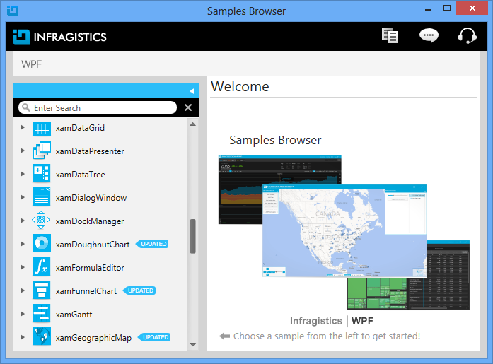

////

|metadata|
{
    "name": "wpf-netadvantage-for-wpf-samples",
    "controlName": [],
    "tags": ["Getting Started"],
    "guid": "{50FD2B15-9778-4E57-90D4-875FE345494F}",  
    "buildFlags": [],
    "createdOn": "2012-01-30T19:39:51.5806693Z"
}
|metadata|
////

= Infragistics WPF Samples

[[Infragistics-WPF-Features-Browser]]
== Samples Browser

The Samples Browser is geared towards the idea of learning by example, by demonstrating the usage of the extensive feature set of the {ProductName} controls. By providing the corresponding source code directly within the browser, you can see what's involved in making the features work.

