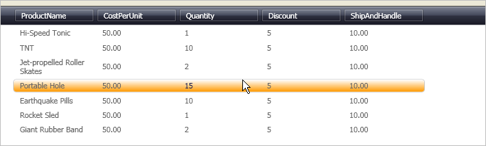

////

|metadata|
{
    "name": "wpf-referencing-your-themepack",
    "controlName": [],
    "tags": ["Styling","Theming"],
    "guid": "{C0CB9806-BBA6-42D2-961D-EF78BA457890}",  
    "buildFlags": ["wpf"],
    "createdOn": "2012-01-30T20:33:32.0650404Z"
}
|metadata|
////

= Referencing Your ThemePack

This is the sixth and final topic in a multi-part walkthrough that continues from link:wpf-modifying-the-assemblyinfo-file.html[Modifying the AssemblyInfo File]. In this topic we will show how to reference the newly created ThemePack to style the xamDataGrid™.

[start=1]
. In the Solution Explorer, right click the solution and click Add, then click New Project… Name the project "ThemePackTestProject."
[start=2]
. Add a New Folder to the project called "Data" and place the Orders.xml file inside it.
[start=3]
. Right click on the References node and select Add Reference… Navigate to the {ProductName} install folder and select the following three assemblies from the Bin

** {ApiPlatform}DataPresenter.{DllVersion}dll
** {ApiPlatform}Editors.{DllVersion}dll
** {ApiPlatform}{DllVersion}dll

[start=4]
. Add a reference to the assembly that the MyThemePack project generated.
[start=5]
. In the Window1.xaml file, place the following namespace declaration inside the opening Window tag.

*In XAML:*

----
...
xmlns:igDP="http://infragistics.com/DataPresenter"
xmlns:igThemeOrangePeel="http://infragistics.com/Themes/OrangePeel"
...
----

[start=6]
. Create a Window Resources section defining a MergedDictionary object. This will expose all the styles from the ThemePack.

*In XAML:*

----
<Window.Resources>
        <ResourceDictionary>
                <ResourceDictionary.MergedDictionaries>
                        <igThemeOrangePeel:DataPresenter/>
                </ResourceDictionary.MergedDictionaries>
        </ResourceDictionary>
</Window.Resources>
----

[start=7]
. Create a resources section for the Grid panel defining an XmlDataProvider. The XmlDataProvider references the Orders XML file.

*In XAML:*

----
<Grid.Resources>
        <XmlDataProvider Source="../Data/Orders.xml" 
          x:Key="OrderData" XPath="/Orders" />
</Grid.Resources>
----

[start=8]
. Create an instance of XamDataGrid, name it, and set its DataSource to the XmlDataProvider created in the previous step.

*In XAML:*

----
<igDP:XamDataGrid x:Name="XamDataGrid1" 
  DataSource="{Binding Source={StaticResource OrderData}, XPath=Order}"/>
----

[start=9]
. Before running the project, right click ThemePackTestProject and click Set as StartUp Project.
[start=10]
. Run the project. When the mouse hovers over Records, they should be highlighted with a gold gradient.

