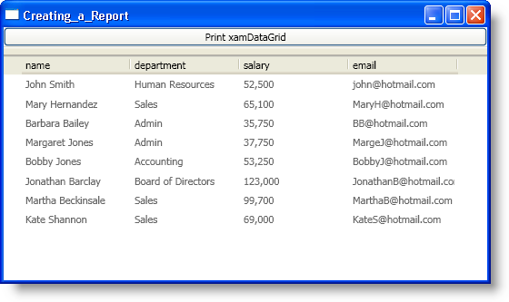
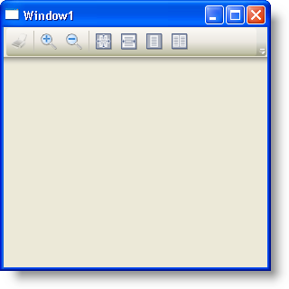

////

|metadata|
{
    "name": "wpf-reporting-getting-started-with-wpf-reporting",
    "controlName": ["IG WPF Reporting"],
    "tags": ["Reporting"],
    "guid": "{B77C11F4-8B34-4BC2-9E1A-AB46F31C40DE}",  
    "buildFlags": [],
    "createdOn": "2012-01-30T19:39:51.9047341Z"
}
|metadata|
////

= Adding WPF Reporting to Your Page

== Before You Begin

Before you can preview, print, or export a report, you must instantiate a link:{ApiPlatform}reporting{ApiVersion}~infragistics.windows.reporting.report.html[Report] object and add link:{ApiPlatform}reporting{ApiVersion}~infragistics.windows.reporting.embeddedvisualreportsection.html[EmbeddedVisualReportSection] objects to its link:{ApiPlatform}reporting{ApiVersion}~infragistics.windows.reporting.report~sections.html[Sections collection]. After adding sections to the Report object, you can link:wpf-reporting-show-a-print-preview.html[display a print preview] of the report using the xamReportPreview™ control, export the report in XML paper specification (XPS), or print the report to a printer.

== What You Will Accomplish

You will create a report using xamDataGrid™ as the main content.

You will add xamReportPreview to your window.

== Follow these Steps to create the report

[start=1]
. Create a Microsoft® Windows® Presentation Foundation Window project.
[start=2]
. In the Solution Explorer, add the following references to your project:

You only need a reference to the first two assemblies in the list to implement reporting functionality in your application. The xamDataGrid control is going to be used to demonstrate reporting functionality in the rest of this topic.

** {ApiPlatform}{ApiVersion}dll
** {ApiPlatform}Reporting{ApiVersion}.dll
** {ApiPlatform}DataPresenter{ApiVersion}.dll
** {ApiPlatform}Editors{ApiVersion}.dll

[start=3]
. Add a namespace declaration for xamDataGrid inside the opening Window tag.

*In XAML:*

----
xmlns:igDP="http://infragistics.com/DataPresenter"
----

[start=4]
. Add a DockPanel container to the Window.

*In XAML:*

----
<DockPanel>
    <!--TODO: Add a Button here-->
    <!--TODO: Add xamDataGrid here-->
</DockPanel>
----

[start=5]
. Add a Button control to the DockPanel container.

.. Set the attached DockPanel.Dock property to Top.
.. Set the Content property to "Print xamDataGrid".
.. Attach an event handler to the Button control's Click event.

*In XAML:*

----
<Button 
    DockPanel.Dock="Top" 
    Content="Print xamDataGrid" 
    Click="Button_Click" />
----

[start=6]
. Add xamDataGrid to the DockPanel container.

.. Set the Name property so you can reference it in the code-behind.
.. Set the BindToSampleData to True.

*In XAML:*

----
<igDP:XamDataGrid Name="xamDataGrid1" BindToSampleData="True" />
----

[start=7]
. Open the code-behind and place using/Imports directives in your code-behind so you don't have to type out a member's fully qualified name.

*In Visual Basic:*

----
Imports Infragistics.Windows.Reporting
----

*In C#:*

----
using Infragistics.Windows.Reporting;
----

[start=8]
. Add an event handler for the Button control's Click event if a method stub has not been created for you, instantiate a Report and an EmbeddedVisualReportSection object and pass a reference to the xamDataGrid control to its constructor. Finally add the EmbeddedVisualReportSection object to the Report object's Sections collection and invoke the Report object's link:{ApiPlatform}reporting{ApiVersion}~infragistics.windows.reporting.report~print.html[Print] or link:{ApiPlatform}reporting{ApiVersion}~infragistics.windows.reporting.report~export.html[Export] method.

*In Visual Basic:*

----
Private Sub Button_Click(sender As Object, e As RoutedEventArgs) 
    Dim report1 As New Report()
    Dim section1 As New EmbeddedVisualReportSection(Me.xamDataGrid1)
    report1.Sections.Add(section1)
    report1.Print()
    'The following line of code will export
    'the contents of xamDataGrid to an XPS document.
    'report1.Export(OutputFormat.XPS, "c:\\xamDataGrid1.xps")
End Sub
----

*In C#:*

----
private void Button_Click(object sender, RoutedEventArgs e)
{
    Report report1 = new Report();
    EmbeddedVisualReportSection section1 = new EmbeddedVisualReportSection(this.xamDataGrid1);
    report1.Sections.Add(section1);
    report1.Print();
    //The following line of code will export
    //the contents of xamDataGrid to an XPS document.
    //report1.Export(OutputFormat.XPS, "c:\\xamDataGrid1.xps");
}
----

[start=9]
. Run the project.

You should see a Window that looks similar to the screen shot below. You can click the button labeled "Print xamDataGrid" to print the contents of the xamDataGrid control.

== Follow these Steps to add xamReportPreview to your window

[start=1]
. Create a Microsoft® Windows® Presentation Foundation Window project.
[start=2]
. In the Solution Explorer, add the following references:

.. {ApiPlatform}{ApiVersion}dll
.. {ApiPlatform}Reporting{ApiVersion}.dll

[start=3]
. Add the Infragistics name space declarations

*In XAML:*

----
xmlns:igReporting="http://infragistics.com/Reporting"
----

*In Visual Basic:*

----
Imports Infragistics.Windows.Reporting
----

*In C#:*

----
using Infragistics.Windows.Reporting;
----

[start=4]
. Name the default Grid layout container so you can reference it in the code-behind.

*In XAML:*

----
<Grid Name="layoutRoot">
</Grid>
----

[start=5]
. Attach an event handler to the Window's Loaded event if you are going to use the code-behind.

*In XAML:*

----
<Window ... Loaded="Window_Loaded">
----

[start=6]
. Create an instance of xamReportPreview control and add it in the main Grid.

*In XAML:*

----
<igReporting:XamReportPreview Name="xamReportPreview1" />
----

*In Visual Basic:*

----
Private Sub Window_Loaded(ByVal sender As Object, ByVal e As RoutedEventArgs) 
    Dim xamReportPreview1 = New XamReportPreview()
    Me.layoutRoot.Children.Add(xamReportPreview1)
End Sub
----

*In C#:*

----
private void Window_Loaded(object sender, RoutedEventArgs e)
{
    XamReportPreview xamReportPreview1 = new XamReportPreview();
    this.layoutRoot.Children.Add(xamReportPreview1);
}
----

[start=7]
. Run your project.

When you run the project, you should see a Window that looks similar to the screen shot below. The xamReportPreview control will not display any content since it has not generated a preview of a report. You have to call xamReportPreview's link:{ApiPlatform}reporting{ApiVersion}~infragistics.windows.reporting.xamreportpreview~generatepreview.html[GeneratePreview] method and pass in a reference to a link:{ApiPlatform}reporting{ApiVersion}~infragistics.windows.reporting.report.html[Report] object.

== Related Topics

link:wpf-reporting-understanding-wpf-reporting.html[About WPF Reporting]

link:wpf-reporting-using-wpf-reporting.html[Using WPF Reporting]