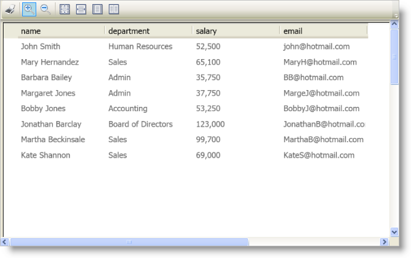

////

|metadata|
{
    "name": "wpf-reporting-understanding-wpf-reporting",
    "controlName": ["IG WPF Reporting"],
    "tags": ["Reporting"],
    "guid": "{4FF36DF3-0ED5-439E-9611-C128D9AF705C}",  
    "buildFlags": [],
    "createdOn": "2012-01-30T19:39:51.9187369Z"
}
|metadata|
////

= About WPF Reporting

The WPF Reporting engine allows you to create reports that you can print or export in XML Paper Specification (XPS) format. The WPF Reporting engine also includes the xamReportPreview™ control that allows end users to preview a report before printing or exporting it.

== Report

The link:{ApiPlatform}reporting{ApiVersion}~infragistics.windows.reporting.report.html[Report] object exposes properties and methods that help you create, print, and export a report. The Report object itself does not host content; instead, it acts as a blank document that contains sections that are responsible for hosting content.

== Report Sections

Each link:{ApiPlatform}reporting{ApiVersion}~infragistics.windows.reporting.embeddedvisualreportsection.html[EmbeddedVisualReportSection] object defines a section of your report that corresponds to a visual element in your application. You can add as many sections to a Report object's link:{ApiPlatform}reporting{ApiVersion}~infragistics.windows.reporting.report~sections.html[Sections collection] as you need.

== Print Preview

The WPF Reporting engine also includes the xamReportPreview control that you can use to display a preview of a report to your end users.

== About Printing and Exporting

Just like Microsoft® Windows® Presentation Foundation's built-in printing support, the WPF Reporting engine prints and exports visual elements as they are rendered on your screen. In addition, the WPF Reporting engine will center the visual element horizontally and vertically on the page even if you did not center them in your application. The exception to these rules is the xamDataGrid™ control.

The xamDataGrid control has built-in paging logic that the WPF Reporting engine uses for printing and exporting. In essence, the WPF Reporting engine will split the contents of the xamDataGrid control into separate pages. Even though the WPF Reporting engine automatically paginates the xamDataGrid control, the WPF Reporting engine will not automatically expand and print/export child records in a hierarchy. For example, if you have a hierarchy defined, the WPF Reporting engine will print all records in the first field layout; however, it will only print child records that are expanded. Fortunately, you can use the link:{ApiPlatform}datapresenter{ApiVersion}~infragistics.windows.datapresenter.tabularreportview.html[TabularReportView] object in conjunction with a DataPresenter control's link:{ApiPlatform}datapresenter{ApiVersion}~infragistics.windows.datapresenter.datapresenterbase~reportview.html[ReportView] property to modify many DataPresenter-specific printing behaviors.

== Related Topics

link:wpf-reporting-getting-started-with-wpf-reporting.html[Adding WPF Reporting to Your Page]

link:wpf-reporting-using-wpf-reporting.html[Using WPF Reporting]