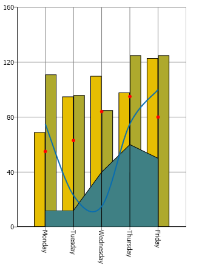
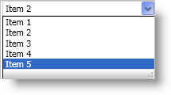
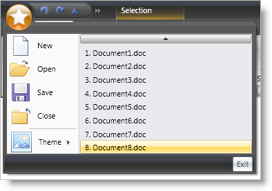
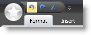
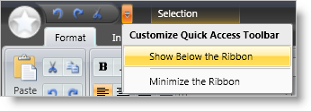
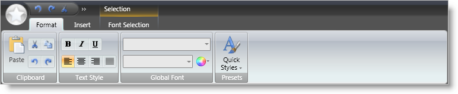

////

|metadata|
{
    "name": "wpf-whats-new-in-2007-volume-2",
    "controlName": [],
    "tags": ["Getting Started","How Do I"],
    "guid": "{58FD7798-F02A-4E81-AE22-080D3C65F145}",  
    "buildFlags": [],
    "createdOn": "2012-01-30T19:39:51.6886909Z"
}
|metadata|
////

= What's New in 2007 Volume 2

The {ProductName} 2007 Volume 2 release includes a number of powerful new controls and features to allow you to take even more advantage of our WPF controls.

Below is a list of the controls that we added for the 2007 Volume 2 release. Click the links to see a list of the features being offered.

* <<xamChart,xamChart>>
* <<xamComboEditor,xamComboEditor>>
* <<xamRibbon,xamRibbon>>

[[xamChart]]

== xamChart

The xamChart™ control is a new visual control that presents data using graphics. The xamChart control displays values using columns, pie wedges, cylinders and more.

== Chart Types

The xamChart control supports 25 different chart types, which will allow you to select the perfect look to accent the data in your application.

[cols="a,a"]
|====

|image::images/Whats_New_xamChart_01.png[example of xamchart's 2D area chart] 

|image::images/Whats_New_xamChart_02.png[example of xamchart's 2D area chart] 

|image::images/Whats_New_xamChart_03.png[example of xamchart's 2D spline chart] 

|image::images/Whats_New_xamChart_04.png[example of xamchart's 2D column chart] 

|====

== 3D Rendering

3D rendering can be turned on to display stunning visualizations of data.

[cols="a,a"]
|====

|image::images/Whats_New_xamChart_05.png[example of xamchart's 3D bubble chart] 

|image::images/Whats_New_xamChart_06.png[example of xamchart's 3D bar chart] 

|image::images/Whats_New_xamChart_07.png[example of xamchart's 3D doughnut chart] 

|image::images/Whats_New_xamChart_08.png[example of xamchart's 3D stacked cylinder column chart] 

|====

== Composite Charts

The xamChart control was built with composite chart creation in mind. Creating composite charts has never been so easy. Simply add a couple Series to xamChart and bind them to data. Make each Series render a different chart type to create complex composite charts.

[[xamComboEditor]]

== xamComboEditor

The xamComboEditor™ control is an editor control that provides a drop-down list from which your end user can select a single item.

In the previous release, xamDataGrid™ did not include a drop-down editor that could be used for editing data. With the release of xamComboEditor, you can edit the value of a link:{ApiPlatform}datapresenter.v{ProductVersion}~infragistics.windows.datapresenter.cell.html[Cell] using a drop-down list populated with items. Using a drop-down list inside of xamDataGrid can help decrease the amount of typographic errors during data entry.

[[xamRibbon]]

== xamRibbon

The xamRibbon™ control is a menu control that replicates the Microsoft® Office® 2007 Ribbon functionality in a Microsoft® Windows® Presentation Foundation application. Instead of using the plain, default, drop-down menu of decades past, you can use xamRibbon to give your application a stylish look and feel. Not only can you improve your application's look and feel, you can also improve usability by using xamRibbon's many features.

== Application Menu

The application menu is the main menu of the application. The application menu is divided into three separate areas:

* The left area displays buttons intended for file operations.
* The right area displays buttons similarly to the left area. Another use for the right area might be a most recently used list.
* The bottom area displays buttons such as application options or an exit button.

== Quick Access Toolbar

The Quick Access Toolbar (QAT) is a small, user-configurable toolbar that is always visible either above (default) or below the Ribbon. The QAT's versatility is shown when adding any Ribbon tool to it; in fact, you can add an entire RibbonGroup to the QAT with ease.

== Tabs and Tab Groups

If you have ever used a Tab in an application, xamRibbon's object model will quickly become familiar to you. The xamRibbon control includes a collection of tabs, each with a collection of groups, each group with a collection of tools. This structure allows you to organize tools into functionally-related application tasks that your end users can easily discover.

