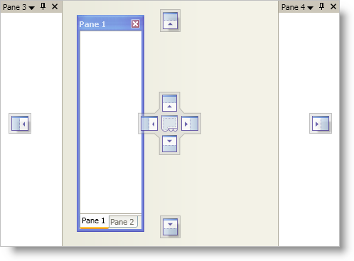
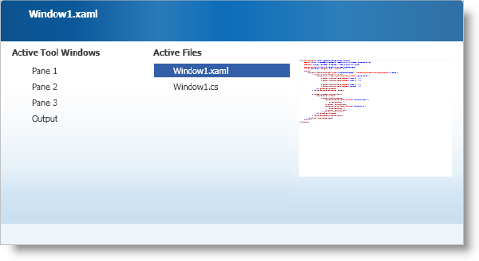
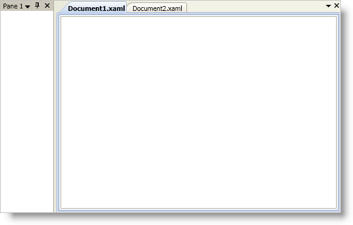
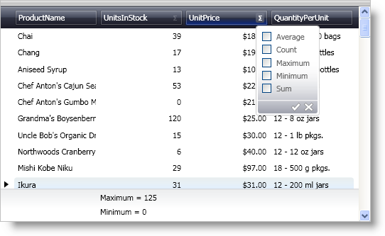

////

|metadata|
{
    "name": "wpf-whats-new-in-2008-volume-1",
    "controlName": [],
    "tags": ["Getting Started","How Do I"],
    "guid": "{CD006A1B-5DD0-407A-8616-B6D3B95387BC}",  
    "buildFlags": [],
    "createdOn": "2012-01-30T19:39:51.6906913Z"
}
|metadata|
////

= What's New in 2008 Volume 1

The {ProductName} 2008 Volume 1 release includes row summaries for xamDataGrid and a new layout control to allow you to take even more advantage of our WPF controls.

Below is a list of the features that we added for the 2008 Volume 1 release. Click the links to read about the features being offered.

* <<xamDockManager,xamDockManager Control>>
* Data Presenter Family 2008.1

** <<xamDataRow,Row Summaries Functionality>>
** <<xamDataNewProperties,New Properties>>

[[xamDockManager]]

== xamDockManager Control

The xamDockManager™ control is a layout control that allows you to create application layouts that your end users can modify at run time similar to Microsoft® Visual Studio®.

A few of xamDockManager's features include:

* *Docking Indicators* - The docking indicators allow your end users to easily dock panes using visual indicators at run time.

* *Pane Navigator* - The pane navigator gives your end users a convenient way to switch between open panes. It also takes the guess work out of switching between panes by displaying a preview of the new pane.

* *Tabbed Documents* - In addition to docking functionality, you can display tabs in the main client area of xamDockManager, just like code view or design view in Visual Studio. You can also leverage this feature to create a tabbed MDI application.

[[xamDataRow]]

== Row Summaries Functionality

Starting in the 2008 Volume 1 release, row summary functionality is available in xamDataGrid™ and the link:{ApiPlatform}datapresenter.v{ProductVersion}~infragistics.windows.datapresenter.gridview.html[GridView] in xamDataPresenter™.

When you enable the row summary feature, your end users will see a sigma icon in the field headers that they can click to open a summary selection dialog box. The summary selection dialog box has an intuitive and easy-to-use interface that experienced and novice end users can use with ease.

[[xamDataNewProperties]]

== New Properties

== Performance Optimization for Labels

The link:{ApiPlatform}datapresenter.v{ProductVersion}~infragistics.windows.datapresenter.fieldsettings.html[FieldSettings] object exposes a new link:{ApiPlatform}datapresenter.v{ProductVersion}~infragistics.windows.datapresenter.fieldsettings~allowlabelvirtualization.html[AllowLabelVirtualization] property to help optimize performance of xamDataGrid™, xamDataCarousel™, and xamDataPresenter™.

== Label Text Behavior

The FieldSettings object exposes new properties to help you modify the behavior of text in a link:{ApiPlatform}datapresenter.v{ProductVersion}~infragistics.windows.datapresenter.field.html[Field] object's label. You no longer have to create styles or templates to align, trim, or wrap the text in a link:{ApiPlatform}datapresenter.v{ProductVersion}~infragistics.windows.datapresenter.labelpresenter.html[LabelPresenter] object.

* link:{ApiPlatform}datapresenter.v{ProductVersion}~infragistics.windows.datapresenter.fieldsettings~labeltextalignment.html[LabelTextAlignment]
* link:{ApiPlatform}datapresenter.v{ProductVersion}~infragistics.windows.datapresenter.fieldsettings~labeltexttrimming.html[LabelTextTrimming]
* link:{ApiPlatform}datapresenter.v{ProductVersion}~infragistics.windows.datapresenter.fieldsettings~labeltextwrapping.html[LabelTextWrapping]

== Expansion Indicators

The link:{ApiPlatform}datapresenter.v{ProductVersion}~infragistics.windows.datapresenter.fieldlayoutsettings.html[FieldLayoutSettings] object exposes a new link:{ApiPlatform}datapresenter.v{ProductVersion}~infragistics.windows.datapresenter.fieldlayoutsettings~expansionindicatordisplaymode.html[ExpansionIndicatorDisplayMode] property. You can set this property to hide expansion indicators for records that do not have any child records.

== Converters and Fields

The Field object exposes the link:{ApiPlatform}datapresenter.v{ProductVersion}~infragistics.windows.datapresenter.field~converter.html[Converter], link:{ApiPlatform}datapresenter.v{ProductVersion}~infragistics.windows.datapresenter.field~converterculture.html[ConverterCulture], and link:{ApiPlatform}datapresenter.v{ProductVersion}~infragistics.windows.datapresenter.field~converterparameter.html[ConverterParameter] properties to aid in data binding scenarios.