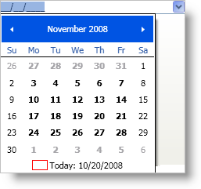
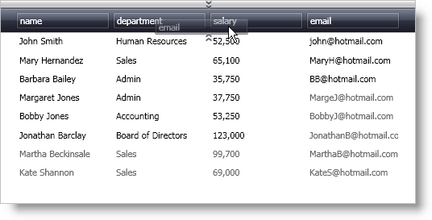
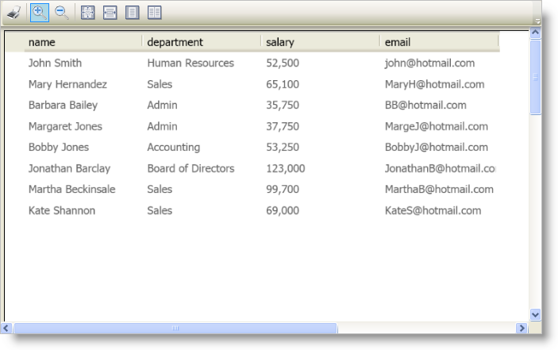
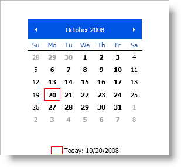
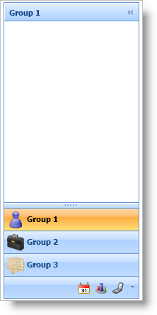
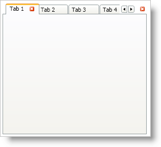

////

|metadata|
{
    "name": "wpf-whats-new-in-2008-volume-2",
    "controlName": [],
    "tags": ["Getting Started","How Do I"],
    "guid": "{7411F468-4B5E-4671-9BE7-37082022635C}",  
    "buildFlags": [],
    "createdOn": "2012-01-30T19:39:51.6936919Z"
}
|metadata|
////

= What's New in 2008 Volume 2

The {ProductName} 2008 Volume 2 release includes a number of powerful new controls and features to allow you to take even more advantage of our WPF controls.

Below is a list of the controls that we added for the 2008 Volume 2 release. Click the links to see a list of the features being offered.

* <<DropDownCalendar,Drop Down Calendar for xamDateTimeEditor>>
* <<MovableFields,Movable Fields for xamDataPresenter>>
* <<WPFReporting,WPF Reporting Engine>>
* <<xamMonthCalendar,xamMonthCalendar Control>>
* <<xamOutlookBar,xamOutlookBar Control>>
* <<xamTabControl,xamTabControl>>

[[DropDownCalendar]]

== Drop Down Calendar for xamDateTimeEditor

The xamDateTimeEditor™ control will use the xamMonthCalendar™ control as a drop-down calendar allowing your end users to select a date from the drop-down calendar instead of typing it in to xamDateTimeEditor. This feature is enabled automatically without you having to write any code.

[[MovableFields]]

== Movable Fields for xamDataPresenter

The xamDataPresenter™ control (using a grid view) and the xamDataGrid™ control allow your end users to move fields at run time so they can customize it for better readability. In addition, you can save and load customizations so your end users don't have to reorganize the data when they restart your application.

[[WPFReporting]]

== WPF Reporting Engine

The WPF Reporting engine gives you the ability to print the xamDataGrid™ control with a couple lines of code. You can even show your end users a print preview using the xamReportPreview™ control. Along with its easy-to-use object model, the xamReporting engine gives you the flexibility to add your own elements to a page using styles and templates.

[[xamMonthCalendar]]

== xamMonthCalendar Control

The xamMonthCalendar™ control replicates the calendar functionality found in Microsoft® Windows® Vista™. Your end users can navigate to different dates by zooming all the way out to a millenia view and then zooming in through different views until they reach a specific month.

[[xamOutlookBar]]

== xamOutlookBar Control

The xamOutlookBar™ control gives you the ability to create easy-to-navigate applications that end users of Microsoft® Outlook can use without having to learn a new navigation interface. Even the end users who are not familiar with Outlook will appreciate the ease at which they can navigate your application. When your end users need to maximize their screen real estate, they can simply collapse the xamOutlookBar control until they need it again.

[[xamTabControl]]

== xamTabControl

Many applications use tabs to allow end users to open multiple tasks simultaneously or to separate tasks into logical units of work. Many end users are already familiar with tabbed interfaces since they encounter it daily when using their Web browsers. You can implement similar functionality by using xamTabControl™ to your application.

In addition to the functionality found in the Microsoft® Windows® Presentation Foundation TabControl, you get the ability to close tabs, scroll tab headers, and display close buttons for tabs; all within reach of a single property setting.

