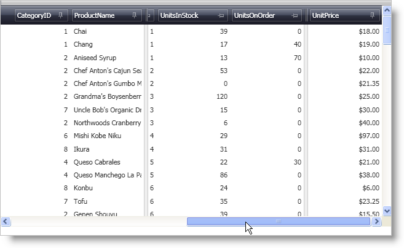
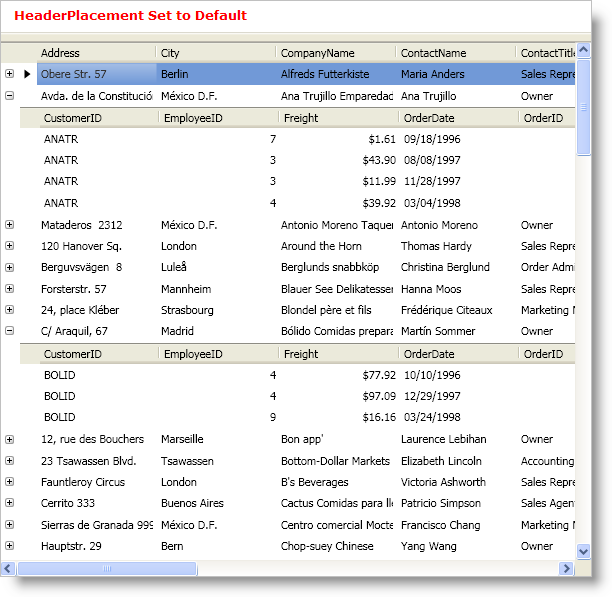
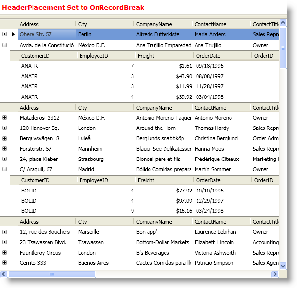
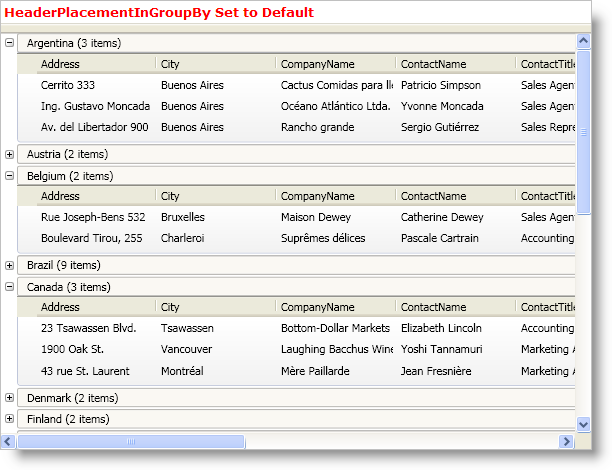
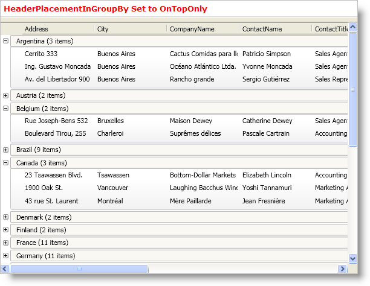
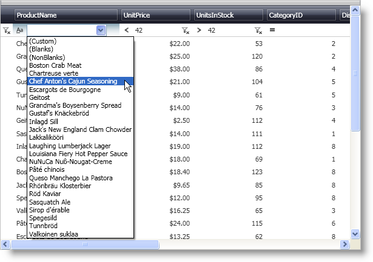

////

|metadata|
{
    "name": "wpf-whats-new-in-2009-volume-1",
    "controlName": [],
    "tags": ["Getting Started","How Do I"],
    "guid": "{285F0A73-BED7-454C-BCB7-916A80DE5D41}",  
    "buildFlags": [],
    "createdOn": "2012-01-30T19:39:51.6956923Z"
}
|metadata|
////

= What's New in 2009 Volume 1

The {ProductName} 2009 Vol. 1 release includes a number of powerful new features to allow you to take even more advantage of our WPF controls.

Below is a list of the features that we added for the 2009 Volume 1 release. Click the links to see a list of the features being offered.

* <<Fixed,Fixed Fields>>
* <<Header,Header Placement>>
* <<Record,Record Filtering>>
* <<Data,Data Presenter Enhancements>>

[[Fixed]]

== Fixed Fields

The xamDataPresenter™ and xamDataGrid™ controls allow your end users to fix fields to an edge of the control based on the record orientation and flow direction of the control. With this feature enabled, your end users can click the pin icon displayed in a field's header or they can drag a splitter over the fields they want to fix.

== Related Topics

link:xamdatagrid-about-fixed-non-scrolling-fields.html[About Fixed (Non-Scrolling) Fields]

link:xamdatagrid-enable-fixed-fields.html[Enable Fixed Fields]

link:xamdatagrid-fix-fields.html[Fix Fields]

[[Header]]

== Header Placement

You can repeat field headers in xamDataPresenter™ and xamDataGrid™ by setting the new link:{ApiPlatform}datapresenter.v{ProductVersion}~infragistics.windows.datapresenter.fieldlayoutsettings~headerplacement.html[HeaderPlacement] property and/or link:{ApiPlatform}datapresenter.v{ProductVersion}~infragistics.windows.datapresenter.fieldlayoutsettings~headerplacementingroupby.html[HeaderPlacementInGroupBy] property exposed by the link:{ApiPlatform}datapresenter.v{ProductVersion}~infragistics.windows.datapresenter.fieldlayoutsettings.html[FieldLayoutSettings] object.

.Note
[NOTE]
====
The view must support separate headers (i.e. grid view) and the LabelLocation property must be set to SeparateHeader in order for the header placement properties to affect the data presenter.
====

[[Record]]

== Record Filtering

The xamDataPresenter™ and xamDataGrid™ controls allow your end users to filter out records in order to view a smaller subset of the original data. You can expose record filtering functionality to your end users in two different ways -- a filter record or a filter icon in the field headers. If you use the filter record, your end users will be able to choose an operand and an operator from a drop-down list.

.Note
[NOTE]
====
The filter record and filter icons are only available when you use a grid view (i.e., xamDataGrid or xamDataPresenter); however, you can add filter conditions to xamDataCarousel™ in XAML or in procedural code.
====

== Related Topics

link:xamdatapresenter-about-record-filtering.html[About Record Filtering]

link:xamdatapresenter-enable-record-filtering.html[Enable Record Filtering]

link:xamdatapresenter-add-filter-conditions.html[Add Filter Conditions]

link:xamdatapresenter-modify-the-list-of-operators.html[Modify the List of Operators]

link:xamdatapresenter-modify-the-look-of-filtered-records.html[Modify the Look of Filtered Records]

[[Data]]

== Data Presenter Enhancements

== Full Support for List Modifications (i.e., adding/removing records) in Filtered and/or Sorted Collection Views

.Note
[NOTE]
====
If you are using the CollectionView base class, the ListCollectionView class (pre-3.5 SP1), or the BindingListCollectionView class (pre-3.5 SP1) as a data source, list modifications (i.e., adds and removes) are treated as reset notifications since these classes do not implement the new IEditableCollectionView interface introduced by the .NET Framework 3.5 SP1 update. This may result in a performance hit. It is recommended that you use the .NET Framework 3.5 SP1 version of the ListCollectionView class or BindingListCollectionView class for maximum performance.
====

== Group-By Record State is Preserved After a Reset

The link:{ApiPlatform}datapresenter.v{ProductVersion}~infragistics.windows.datapresenter.groupbyrecord.html[GroupByRecord] object's expanded state is now preserved when you filter or sort a CollectionView object. In addition, if a Reset notification is received from a CollectionView object we will preserve the existing records and their expanded state.

.Note
[NOTE]
====
In order to preserve the expanded state of the records, you will need to remove any workarounds that set the DataSource property to null and then resets it.
====

== InitializeRecordEventArgs Object Exposes the IsPreparingForSort Property

The link:{ApiPlatform}datapresenter.v{ProductVersion}~infragistics.windows.datapresenter.events.initializerecordeventargs~ispreparingforsort.html[IsPrepartingForSort] property has been added to the link:{ApiPlatform}datapresenter.v{ProductVersion}~infragistics.windows.datapresenter.events.initializerecordeventargs.html[InitializeRecordEventArgs] object. If you handle the InitializeRecord event, you can determine if the event was fired due to sorting.

== Added Two Values to the LabelClickAction Enumeration

Two values have been added to the link:{ApiPlatform}datapresenter.v{ProductVersion}~infragistics.windows.datapresenter.labelclickaction.html[LabelClickAction] enumeration to enable tri-state sorting (i.e., Ascending, Descending, and NoSort):

* SortByOneFieldOnlyTriState
* SortByMultipleFieldsTriState

.Note
[NOTE]
====
If you set a FieldSettings object's LabelClickAction property to one of the new tri-state enumeration values the 'NoSort' state will be bypassed if your end users hold down the CTRL key or the field is a group-by field.
====

== Added the IsSynchronizedWithCurrentItem Property to DataPresenterBase

Setting the link:{ApiPlatform}datapresenter.v{ProductVersion}~infragistics.windows.datapresenter.datapresenterbase~issynchronizedwithcurrentitem.html[IsSynchonizedWithCurrentItem] property to True will synchronize the root-level data records.

== Added the ActualPosition Property to the Field Object

The link:{ApiPlatform}datapresenter.v{ProductVersion}~infragistics.windows.datapresenter.fielditem~actualposition.html[ActualPosition] property is a read-only property that returns a link:{ApiPlatform}datapresenter.v{ProductVersion}~infragistics.windows.datapresenter.fieldposition.html[FieldPosition] struct that exposes the actual Row, RowSpan, Column, and ColumnSpan of the field in the field layout. This value can be different from the link:{ApiPlatform}datapresenter.v{ProductVersion}~infragistics.windows.datapresenter.field.html[Field] object's Row, RowSpan, Column, and ColumnSpan property values when your end users rearrange the fields or the data presenter automatically arranges the fields.

.Note
[NOTE]
====
If the data presenter hasn't automatically arranged the fields yet, this property will return a default value based on the Field object's Column, Row, ColumnSpan and RowSpan properties.
====