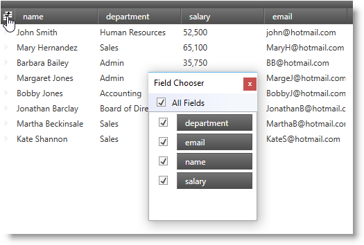
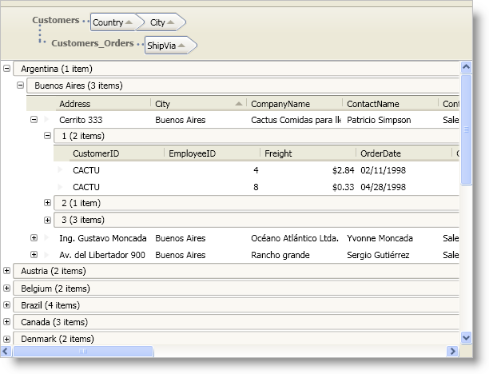

////

|metadata|
{
    "name": "wpf-whats-new-in-2009-volume-2",
    "controlName": [],
    "tags": ["Getting Started","How Do I"],
    "guid": "{8F0E4A6B-3F11-44F9-BE43-1E8D795F95F2}",  
    "buildFlags": [],
    "createdOn": "2012-01-30T19:39:51.6976927Z"
}
|metadata|
////

= What's New in 2009 Volume 2

The {ProductName} 2009 Vol. 2 release includes a number of powerful new features to allow you to take even more advantage of our WPF controls.

Below is a list of the features that we added for the 2009 Volume 2 release. Click the links to see a list of the features being offered.

* <<DataPresenter,DataPresenter Family 2009.2>>

** <<Clipboard,Clipboard Operations>>
** <<DataValueChanged,DataValueChanged Event>>
** <<ExcelExporter,Excel Exporter>>
** <<FieldChooser,Field Chooser>>
** <<FieldSizing,Field Sizing>>
** <<FixedRecords,Fixed Records>>
** <<Grouping,Grouping Across Field Layouts>>
** <<IDataErrorInfo,IDataErrorInfo Support>>
** <<Performance,Performance Enhancements for Nested Records>>
** <<UndoOperations,Undo Operations>>

* <<ExcelEngine,The Infragistics Excel Engine>>

[[DataPresenter]]

== DataPresenter Family 2009.2

[[Clipboard]]

== Clipboard Operations

The DataPresenter controls allow your end users to perform cut, copy, paste, and clear cell content operations when they select cells, data records, or fields. Your end users can copy data from a DataPresenter control and paste it into a Microsoft® Excel® spreadsheet or vice-versa. They can also copy data between DataPresenter controls or within a single instance of a DataPresenter control. In fact, if your end users paste data into an add-new record, the DataPresenter control will automatically create new records for them.

== Related Topics
link:xamdatapresenter-clipboard-operations.html[Clipboard Operations]

[[DataValueChanged]]

== DataValueChanged Event

You can track the changes made to the cell values in a field by setting a link:{ApiPlatform}datapresenter{ApiVersion}~infragistics.windows.datapresenter.fieldsettings.html[FieldSettings] object's link:{ApiPlatform}datapresenter{ApiVersion}~infragistics.windows.datapresenter.fieldsettings~datavaluechangednotificationsactive.html[DataValueChangedNotificationsActive] property to True. When you enable this feature on a field, the DataPresenter controls will raise the link:{ApiPlatform}datapresenter{ApiVersion}~infragistics.windows.datapresenter.datapresenterbase~datavaluechanged_ev.html[DataValueChanged] event and the link:{ApiPlatform}datapresenter{ApiVersion}~infragistics.windows.datapresenter.datapresenterbase~initializecellvaluepresenter_ev.html[InitializeCellValuePresenter] events for the cells in that field.

== The DataValueChanged Event

A DataPresenter control will raise the DataValueChanged event under the following circumstances:

[start=1]
. You are tracking data-value changes on a Field object by setting its FieldSettings object's DataValueChangedNotificationsActive property to True.
[start=2]
. A cell's value changes in the field that is tracking data value changes.
[start=3]
. The DataPresenter control has allocated a link:{ApiPlatform}datapresenter{ApiVersion}~infragistics.windows.datapresenter.datarecord.html[DataRecord] object for the cell whose value has changed. If you want a DataPresenter control to raise the DataValueChanged event even if it has not allocated a DataRecord object, you must set its link:{ApiPlatform}datapresenter{ApiVersion}~infragistics.windows.datapresenter.datapresenterbase~recordloadmode.html[RecordLoadMode] property to PreloadRecords and set the FieldSettings object's link:{ApiPlatform}datapresenter{ApiVersion}~infragistics.windows.datapresenter.fieldsettings~datavaluechangedscope.html[DataValueChangedScope] property to AllAllocatedRecords.

The DataPresenter controls pass in a link:{ApiPlatform}datapresenter{ApiVersion}~infragistics.windows.datapresenter.events.datavaluechangedeventargs.html[DataValueChangedEventArgs] object to the DataValueChanged event handler. You can use the properties exposed by the DataValueChangedEventArgs object to highlight a cell when its value changes. The DataValueChangedEventArgs object exposes the following properties:

* link:{ApiPlatform}datapresenter{ApiVersion}~infragistics.windows.datapresenter.events.datavaluechangedeventargs~cellvaluepresenter.html[CellValuePresenter] - This property gives you a reference to the CellValuePresenter object that is used to display the cell's value. This property may return NULL if the cell is not in view and the DataRecord object for the cell has not been allocated.
* link:{ApiPlatform}datapresenter{ApiVersion}~infragistics.windows.datapresenter.events.datavaluechangedeventargs~valuehistory.html[ValueHistory] - This property is a list of data-value changes where the most recent change is stored in the 0th index. By default, the number of data value changes is set to 1. However, you can modify the number of changes kept in a cell's data-value history by setting a FieldSettings object's link:{ApiPlatform}datapresenter{ApiVersion}~infragistics.windows.datapresenter.fieldsettings~datavaluechangedhistorylimit.html[DataValueChangedHistoryLimit] property. If you set the DataValueChangedHistoryLimit property to 0, the ValueHistory property will be NULL.
* link:{ApiPlatform}datapresenter{ApiVersion}~infragistics.windows.datapresenter.events.datavaluechangedeventargs~field.html[Field] - The Field object that the cell belongs to.
* link:{ApiPlatform}datapresenter{ApiVersion}~infragistics.windows.datapresenter.events.datavaluechangedeventargs~record.html[Record] – The DataRecord object that the cell belongs to.

== The InitializeCellValuePresenter Event

When you enable data-value change tracking for a field, a DataPresenter control will fire the InitializeCellValuePresenter event when it attaches a CellValuePresenter object to a cell in that field. You can use the InitializeCellValuePresenterEventArgs object's IsNew property to determine if the CellValuePresenter is a new or recycle instance a CellValuePresenter object.

== Performance Implications

You should only track data value changes on fields that require tracking. Enabling this feature on all fields in a DataPresenter control and keeping too many changes in the cell's data-value history may adversely affect your application's performance.

== Related Topics

link:xamdatapresenter-enable-data-value-change-tracking.html[Enable Data-Value Change Tracking]

link:xamdatapresenter-reset-a-cells-value-history.html[Reset a Cell's Value History]

[[ExcelExporter]]

== Excel Exporter

The DataPresenter controls can export data in Microsoft® Excel® format using the link:{ApiPlatform}datapresenter.excelexporter{ApiVersion}~infragistics.windows.datapresenter.excelexporter.datapresenterexcelexporter.html[DataPresenterExcelExporter] class. The DataPresenterExcelExporter class encapsulates all the work of creating a workbook, iterating DataPresenter rows/cells, and setting worksheet cell values.

== Related Topics
link:xamdatapresenter-exporting-to-excel.html[Exporting to Excel]

[[FieldChooser]]

== Field Chooser

The link:{ApiPlatform}datapresenter{ApiVersion}~infragistics.windows.datapresenter.fieldchooser.html[FieldChooser] control allows your end users to change the visibility of fields in the xamDataPresenter™, xamDataGrid™, or xamDataCarousel™ controls at run time. The FieldChooser control displays a list of field headers along with check boxes. Your end users can toggle a check box next to a field header or they can drag field headers in/out of the FieldChooser control to toggle the field's visibility. In addition, if you are binding your DataPresenter control to a hierarchical data source, the FieldChooser control will allow your end users to select a field layout from a drop-down list.

The DataPresenter controls offer three different options to display the field chooser.

* Display a FieldChooser control external to the DataPresenter control.
* Display a field chooser button in the header prefix area that your end users can click to display the field chooser.
* Invoke/execute the ShowFieldChooser method/command.

== Related Topics
link:xamdatapresenter-field-chooser.html[Field Chooser]

[[FieldSizing]]

== Field Sizing

A DataPresenter control gives your end users the ability to automatically resize a field by double clicking a field's resizing indicator. This behavior replicates the column-sizing functionality found in Microsoft® Excel®. Furthermore, just like Excel, your end users can synchronize field sizing by selecting multiple fields and dragging or double clicking a resizing indicator. However, if you enable field selection by setting a link:{ApiPlatform}datapresenter{ApiVersion}~infragistics.windows.datapresenter.fieldsettings.html[FieldSettings] object's link:{ApiPlatform}datapresenter{ApiVersion}~infragistics.windows.datapresenter.fieldsettings~labelclickaction.html[LabelClickAction] property to SelectField, your end users will not be able to click a field's header to sort the field.

In addition to your end users auto sizing a field, the DataPresenter controls can automatically resize all fields within a field layout to fit within the bounds of the control. To complement this feature, the DataPresenter controls also allow you to set a field's width as a percentage using the same star-sizing syntax found in the Grid panel.

== Related Topics
link:xamdatapresenter-field-sizing.html[Field Sizing]

[[FixedRecords]]

== Fixed Records

The fixed record feature allows your end users to fix root-level records to the top or bottom of the xamDataPresenter™ or the xamDataGrid™ control's record list. The fixed records will not scroll out of view when your end users scroll new records into view.

image::images/xamDataPresenter_About_Fixed_Non_Scrolling_Records_01.png[]

The xamDataCarousel™ control does not support fixed records. However, if you programmatically fix a record in a xamDataCarousel control, the record will move to the beginning of the record list and xamDataCarousel will scroll it into view. Unfixing the record will move it back into its original position in the record list and xamDataCarousel will scroll to the beginning of the record list.

If your DataPresenter control contains nested records, i.e., hierarchical data or grouped records, fixed records will exhibit different behaviors.

.Note
[NOTE]
====
Only root-level records can be fixed if you enable nested panels.
====

[start=1]
. If your end users fix multiple records to the top and they expand one of the fixed records, subsequent fixed records (closest to the scrollable area) will become scrollable. If your end users collapse the expanded record, the subsequent fixed records will be fixed again.
[start=2]
. If your end users fix multiple records to the bottom and they expand one of the fixed records, the expanded record and preceding fixed record (closest to the scrollable area) will become scrollable. If your end users collapse the expanded record, the subsequent fixed records will be fixed again.
[start=3]
. Since the DataPresenter controls append fixed records to the bottom of the fixed-records list (records fixed to the top) or the top of the fixed-records list (records fixed to the bottom), any records that your end users fix after expanding a fixed record will be scrollable (see previous rules).
[start=4]
. Your end users can only fix a child record or a data record within a group-by record to the top of its respective record island.
[start=5]
. Fixed child records are only fixed relative to its siblings. For example, if your end users fix a child record that has five siblings, the fixed child record will remain in view as long as your end users do not scroll the last sibling record out of view. Once your end users scroll the last sibling record out of view, the fixed child record will become scrollable. This also means that if your end users fix all child records in a record island, all of them will be scrollable.

== Related Topics
link:xamdatapresenter-fixing-records.html[Fixing Records]

[[Grouping]]

== Grouping Across Field Layouts

Your end users can group records from multiple field layouts by dragging field headers into the group-by area.

== Related Topics

link:xamdatapresenter-sorting.html[Sorting]

[[IDataErrorInfo]]

link:xamdatapresenter-grouping.html[Grouping]

== IDataErrorInfo Support

If your data items implement the IDataErrorInfo interface found in the .NET Framework, the DataPresenter family of controls can display an error message when your end users enter invalid data in a cell. However, you must enable support for the IDataErrorInfo interface by setting a link:{ApiPlatform}datapresenter{ApiVersion}~infragistics.windows.datapresenter.fieldlayoutsettings.html[FieldLayoutSettings] object's link:{ApiPlatform}datapresenter{ApiVersion}~infragistics.windows.datapresenter.fieldlayoutsettings~supportdataerrorinfo.html[SupportDataErrorInfo] property to a SupportDataErrorInfo enumeration value. In addition to enabling support for data errors, the SupportDataErrorInfo property determines whether the DataPresenter control displays the data error in a cell, record selector, or both. Ultimately, the SupportDataErrorInfo property determines the IDataErrorInfo interface's properties that the DataPresenter control uses as a source of the data error messages. If you enable cell-level data errors, the control will use the IDataErrorInfo interface's string indexer and if you enable record-level data errors, the control will use the IDataErrorInfo interface's Error property.

If you enable support for the IDataErrorInfo interface on a FieldLayoutSettings object, any fields in the affected field layout will automatically report data errors. You can selectively disable this feature on a field by setting the link:{ApiPlatform}datapresenter{ApiVersion}~infragistics.windows.datapresenter.fieldsettings~supportdataerrorinfo.html[SupportDataErrorInfo] property exposed by a link:{ApiPlatform}datapresenter{ApiVersion}~infragistics.windows.datapresenter.field.html[Field] object's link:{ApiPlatform}datapresenter{ApiVersion}~infragistics.windows.datapresenter.field~settings.html[FieldSettings] property to False.

You can also modify how the DataPresenter control reports a data error by setting a FieldLayoutSettings object's link:{ApiPlatform}datapresenter{ApiVersion}~infragistics.windows.datapresenter.fieldlayoutsettings~dataerrordisplaymode.html[DataErrorDisplayMode] property to a DataErrorDisplayMode enumeration value. Setting the DataErrorDisplayMode property determines whether a data error is presented as an error icon, a highlight, or both.

image::images/xamDataPresenter_About_Data_Validation_01.png[]

== xamEditor Value Constraints

If you enable support for the IDataErrorInfo interface and you set the ValueEditor.ValueConstraint property of an embedded xamEditor control, any value constraint errors will also cause the error icon and/or highlight to appear. Value constraints will force your end users to correct an error before they can move focus to a new cell. If you set a FieldSettings object's link:{ApiPlatform}datapresenter{ApiVersion}~infragistics.windows.datapresenter.fieldsettings~invalidvaluebehavior.html[InvalidValueBehavior] property to RevertValue, the cell's value will automatically revert to its original value allowing your end users to move focus to a new cell. However, because the value will always pass the value constraints, the DataPresenter control will never display an error icon and/or highlight. On the other hand, if you do not use value constraints, the DataPresenter control will display your data item's error message in the appropriate cell and your end users can move focus to a new cell.

== Related Topics
link:xamdatapresenter-validating-data.html[Validating Data]

[[Performance]]

== Performance Enhancements for Nested Records

The GridView object's default panel has been enhanced to improve performance for nested records (hierarchical data and group-by records). Instead of using multiple nested panels to arrange its records, the GridView object uses a single root-level panel and indents records appropriately.

== Related Topics

link:wpf-2009-volume-2.html[Breaking Changes in 2009 Volume 2]

link:xamdatapresenter-hierarchical-records-and-performance.html[Hierarchical Records and Performance]

[[UndoOperations]]

== Undo Operations

You can enable undo/redo operations by setting a DataPresenter control's IsUndoEnabled property to True. This will allow your end users to undo or redo changes they perform through a DataPresenter control's user interface. The undo/redo functionality is not limited to editing or clipboard features; in fact, your end users can undo changes such as sorting, grouping, expanding, etc. For example, if your end users sort a field by clicking on a field header, they can undo it. However, if you sort a field using procedural code, your end users will not be able to undo it.

== Related Topics
link:xamdatapresenter-undo-operations.html[Undo Operations]

[[ExcelEngine]]

== The Infragistics Excel Engine

Using the Infragistics Excel Engine allows you to work with spreadsheet data using familiar Microsoft® Excel® spreadsheet objects like link:{ApiPlatform}documents.excel{ApiVersion}~infragistics.documents.excel.workbook.html[Workbooks], link:{ApiPlatform}documents.excel{ApiVersion}~infragistics.documents.excel.worksheet.html[Worksheets], link:{ApiPlatform}documents.excel{ApiVersion}~infragistics.documents.excel.worksheetcell.html[Cells], link:{ApiPlatform}documents.excel{ApiVersion}~infragistics.documents.excel.formula.html[Formulas] and many more. The Infragistics Excel Library makes it easy for you to represent the data of your application in an Excel spreadsheet as well as transfer data from Excel into your application.

== Supported Versions of Microsoft Excel

The following is a list of the supported versions of Excel.

* Microsoft Excel 97
* Microsoft Excel 2000
* Microsoft Excel 2002
* Microsoft Excel 2003
* Microsoft Excel 2007

== Features

The following is a list of key features of the Infragistics Excel Engine:

* *No Excel Dependency* - The Infragistics Excel Engine is a class library that runs completely independently of Microsoft Excel, so you do not require it to be installed.
* *Workbook Object Model* - This represents all the Excel objects available to you, such as Workbooks, Worksheets, Cells, Formulas and many more.

== Related Topics

link:igexcelengine-creating-a-workbook.html[Creating a Workbook]

link:igexcelengine-using-the-infragistics-excel-engine.html[Using the Infragistics Excel Engine]